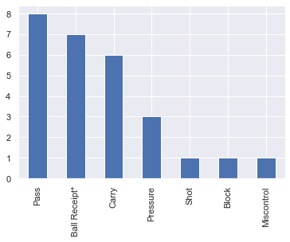
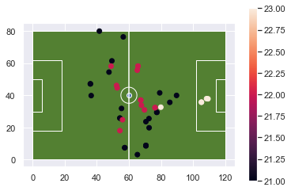
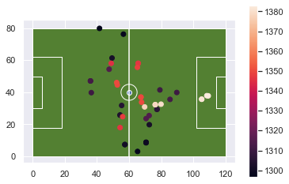

# Creating Time Objects

One of the things mentioned in the previous document was the challenge of visualizing data as the fields switched. We could visualize these separately or we can flip the x and y coordinates again and overlay everything on the same half of the field.

Either way, we need to know when the event occured in order to tell which half it occured in.

When the json data was loaded into a pandas dataframe it saw the timestamp as a string. We can convert this to a datetime object by merging the matches data and the timestamp data.

There are three types of time to consider. The date including Month, Day, and Year. The time the match started, kick_off, including hour minutes seconds and miliseconds. Then there is the time of events which is minutes away from a starting point. Essentially a time delta.

The timestamp is further complicated by that it does not capture the total time. It resets to zero at the half, or during the second period.

There is another field that tells the minutes and the seconds, but this is tied to the game time (e.g. not the time on the clock).

So combining the two values is not entirely accurate. It won't account for the time used during the halftime break.

The other problem of course is that the clock for the first period may excede 45 minutes. So you could have first period events that technically overlap.

But we can use all the information throughout. I just like to have a real datetime value on hand.

New libraries being added are the datetime, timedelta objects, and a parser.


```python
#processing json
import json

#base libraries for analysis
from ssalib import SpatialSoccer

#handling time
from dateutil.parser import parse
from datetime import datetime
from datetime import timedelta
#dataframes and plotting
import geopandas as gpd
from shapely.geometry.point import Point
from shapely.geometry import LineString
from shapely.geometry import Polygon
import matplotlib.pyplot as plt
import numpy as np
import seaborn as sns
import pandas as pd

sns.set()
%matplotlib inline

```

Tracking the paths to the data files. I will proceed from a match json file then on to the events json. The events json will be pulled from the match_id property in the dictionary.


```python
pth_to_matches = "open-data-master/data/matches/37/42.json"
pth_to_events = "open-data-master/data/events"

```

This match file had 79 different matches. Just the first match will be evaluated.


```python
with open(pth_to_matches, "rb") as read_file:
    matches = json.load(read_file)
len(matches)
```


    79


```python
matches[0]
```


    {'match_id': 2275038,
     'match_date': '2020-02-12',
     'kick_off': '20:30:00.000',
     'competition': {'competition_id': 37,
      'country_name': 'England',
      'competition_name': "FA Women's Super League"},
     'season': {'season_id': 42, 'season_name': '2019/2020'},
     'home_team': {'home_team_id': 974,
      'home_team_name': 'Reading WFC',
      'home_team_gender': 'female',
      'home_team_group': None,
      'country': {'id': 68, 'name': 'England'},
      'managers': [{'id': 144,
        'name': 'Kelly Chambers',
        'nickname': None,
        'dob': None,
        'country': {'id': 68, 'name': 'England'}}]},
     'away_team': {'away_team_id': 972,
      'away_team_name': 'West Ham United LFC',
      'away_team_gender': 'female',
      'away_team_group': None,
      'country': {'id': 68, 'name': 'England'},
      'managers': [{'id': 139,
        'name': 'Matt Beard',
        'nickname': None,
        'dob': '1978-01-09',
        'country': {'id': 68, 'name': 'England'}}]},
     'home_score': 2,
     'away_score': 0,
     'match_status': 'available',
     'last_updated': '2020-02-13T21:25:53.724546',
     'metadata': {'data_version': '1.1.0',
      'shot_fidelity_version': '2',
      'xy_fidelity_version': '2'},
     'match_week': 16,
     'competition_stage': {'id': 1, 'name': 'Regular Season'},
     'stadium': {'id': 577,
      'name': 'Adams Park',
      'country': {'id': 68, 'name': 'England'}},
     'referee': {'id': 937, 'name': 'A. Bryne'}}


All the different properties that will be saved. I'm merging two strings the date providing month day year, and the start time\ kick off. I assume this is local time, but it doesn't really matter. It's all about getting a reference point.


```python
match_id = matches[0]['match_id']
match_event_pth = pth_to_events + '/' + str(match_id) + '.json'
match_day = matches[0]['match_date']
match_start_time = matches[0]['kick_off']
match_datetime_str = "{0} {1}".format(match_day,match_start_time)
match_datetime_dt = parse(match_datetime_str)
match_datetime_dt
```


    datetime.datetime(2020, 2, 12, 20, 30)


On to the event json file.


```python
with open(match_event_pth, "rb") as read_file:
    events = json.load(read_file)
len(events)
```


    2831


Here we can see what a time stamp about five minutes in the game looks like. This is the 200th event.


```python
events[200]['timestamp']

```


    '00:05:43.777'


This can be grabbed using datetime.strptime and telling the format to follow. If you print out the t variable then you will see it automatically picks day month and year for the value. We lose that by creating a timedelta object from the time values. This will then be added to the match_datetime_dt or the original kick_off time.


```python
t = datetime.strptime(events[200]['timestamp'],"%H:%M:%S.%f")
delta = timedelta(hours=t.hour, minutes=t.minute, seconds=t.second, microseconds=t.microsecond)
delta
```


    datetime.timedelta(seconds=343, microseconds=777000)


```python
result = match_datetime_dt + delta
result
```


    datetime.datetime(2020, 2, 12, 20, 35, 43, 777000)


This needs to be down across all the values, and pandas can handle that for us. So we'll load each event into a dataframe. This really just gives is the id, time and location of the event. Everything else is still stored as dictionaries.


```python
df = pd.DataFrame(events)
df.head()
```


<div>
<style scoped>
    .dataframe tbody tr th:only-of-type {
        vertical-align: middle;
    }

    .dataframe tbody tr th {
        vertical-align: top;
    }

    .dataframe thead th {
        text-align: right;
    }
</style>
<table border="1" class="dataframe">
  <thead>
    <tr style="text-align: right;">
      <th></th>
      <th>id</th>
      <th>index</th>
      <th>period</th>
      <th>timestamp</th>
      <th>minute</th>
      <th>second</th>
      <th>type</th>
      <th>possession</th>
      <th>possession_team</th>
      <th>play_pattern</th>
      <th>...</th>
      <th>foul_committed</th>
      <th>foul_won</th>
      <th>bad_behaviour</th>
      <th>ball_recovery</th>
      <th>substitution</th>
      <th>injury_stoppage</th>
      <th>50_50</th>
      <th>block</th>
      <th>miscontrol</th>
      <th>off_camera</th>
    </tr>
  </thead>
  <tbody>
    <tr>
      <th>0</th>
      <td>82a5a5f7-1c9b-4a02-901c-365632336087</td>
      <td>1</td>
      <td>1</td>
      <td>00:00:00.000</td>
      <td>0</td>
      <td>0</td>
      <td>{'id': 35, 'name': 'Starting XI'}</td>
      <td>1</td>
      <td>{'id': 974, 'name': 'Reading WFC'}</td>
      <td>{'id': 1, 'name': 'Regular Play'}</td>
      <td>...</td>
      <td>NaN</td>
      <td>NaN</td>
      <td>NaN</td>
      <td>NaN</td>
      <td>NaN</td>
      <td>NaN</td>
      <td>NaN</td>
      <td>NaN</td>
      <td>NaN</td>
      <td>NaN</td>
    </tr>
    <tr>
      <th>1</th>
      <td>730b4c77-1bd4-424b-a48a-c3035fa520b1</td>
      <td>2</td>
      <td>1</td>
      <td>00:00:00.000</td>
      <td>0</td>
      <td>0</td>
      <td>{'id': 35, 'name': 'Starting XI'}</td>
      <td>1</td>
      <td>{'id': 974, 'name': 'Reading WFC'}</td>
      <td>{'id': 1, 'name': 'Regular Play'}</td>
      <td>...</td>
      <td>NaN</td>
      <td>NaN</td>
      <td>NaN</td>
      <td>NaN</td>
      <td>NaN</td>
      <td>NaN</td>
      <td>NaN</td>
      <td>NaN</td>
      <td>NaN</td>
      <td>NaN</td>
    </tr>
    <tr>
      <th>2</th>
      <td>c83b7ba6-01cd-4bfd-8be0-85134ee07957</td>
      <td>3</td>
      <td>1</td>
      <td>00:00:00.000</td>
      <td>0</td>
      <td>0</td>
      <td>{'id': 18, 'name': 'Half Start'}</td>
      <td>1</td>
      <td>{'id': 974, 'name': 'Reading WFC'}</td>
      <td>{'id': 1, 'name': 'Regular Play'}</td>
      <td>...</td>
      <td>NaN</td>
      <td>NaN</td>
      <td>NaN</td>
      <td>NaN</td>
      <td>NaN</td>
      <td>NaN</td>
      <td>NaN</td>
      <td>NaN</td>
      <td>NaN</td>
      <td>NaN</td>
    </tr>
    <tr>
      <th>3</th>
      <td>914bb7c5-6a9c-460b-b939-5706a242ef96</td>
      <td>4</td>
      <td>1</td>
      <td>00:00:00.000</td>
      <td>0</td>
      <td>0</td>
      <td>{'id': 18, 'name': 'Half Start'}</td>
      <td>1</td>
      <td>{'id': 974, 'name': 'Reading WFC'}</td>
      <td>{'id': 1, 'name': 'Regular Play'}</td>
      <td>...</td>
      <td>NaN</td>
      <td>NaN</td>
      <td>NaN</td>
      <td>NaN</td>
      <td>NaN</td>
      <td>NaN</td>
      <td>NaN</td>
      <td>NaN</td>
      <td>NaN</td>
      <td>NaN</td>
    </tr>
    <tr>
      <th>4</th>
      <td>6e2b3a1f-90ad-4b88-b68a-7a50fd0eae84</td>
      <td>5</td>
      <td>1</td>
      <td>00:00:00.046</td>
      <td>0</td>
      <td>0</td>
      <td>{'id': 30, 'name': 'Pass'}</td>
      <td>2</td>
      <td>{'id': 974, 'name': 'Reading WFC'}</td>
      <td>{'id': 9, 'name': 'From Kick Off'}</td>
      <td>...</td>
      <td>NaN</td>
      <td>NaN</td>
      <td>NaN</td>
      <td>NaN</td>
      <td>NaN</td>
      <td>NaN</td>
      <td>NaN</td>
      <td>NaN</td>
      <td>NaN</td>
      <td>NaN</td>
    </tr>
  </tbody>
</table>
<p>5 rows × 40 columns</p>
</div>


This little function will do the conversion across all the values in a list. Just encapsulates what I'm trying to do rather than repeating many times. The resulting list is added to the dataframe as an event_time column.


```python
def convert_timestamp(timestamps,base_datetime):
    output_list = []
    for ts in timestamps:
        try:
            t = datetime.strptime(ts,"%H:%M:%S.%f")
            delta = timedelta(hours=t.hour, minutes=t.minute, seconds=t.second, microseconds=t.microsecond)
            output_list.append(base_datetime + delta)
        except:
            output_list.append(None)
    return output_list

convert_timestamp(df['timestamp'].values[:10],match_datetime_dt)
    
```


    [datetime.datetime(2020, 2, 12, 20, 30),
     datetime.datetime(2020, 2, 12, 20, 30),
     datetime.datetime(2020, 2, 12, 20, 30),
     datetime.datetime(2020, 2, 12, 20, 30),
     datetime.datetime(2020, 2, 12, 20, 30, 0, 46000),
     datetime.datetime(2020, 2, 12, 20, 30, 0, 817000),
     datetime.datetime(2020, 2, 12, 20, 30, 0, 817000),
     datetime.datetime(2020, 2, 12, 20, 30, 0, 897000),
     datetime.datetime(2020, 2, 12, 20, 30, 3, 466000),
     datetime.datetime(2020, 2, 12, 20, 30, 3, 729000)]


```python
df['event_time'] = convert_timestamp(df['timestamp'].values,match_datetime_dt)
df.head()
```


<div>
<style scoped>
    .dataframe tbody tr th:only-of-type {
        vertical-align: middle;
    }

    .dataframe tbody tr th {
        vertical-align: top;
    }

    .dataframe thead th {
        text-align: right;
    }
</style>
<table border="1" class="dataframe">
  <thead>
    <tr style="text-align: right;">
      <th></th>
      <th>id</th>
      <th>index</th>
      <th>period</th>
      <th>timestamp</th>
      <th>minute</th>
      <th>second</th>
      <th>type</th>
      <th>possession</th>
      <th>possession_team</th>
      <th>play_pattern</th>
      <th>...</th>
      <th>foul_won</th>
      <th>bad_behaviour</th>
      <th>ball_recovery</th>
      <th>substitution</th>
      <th>injury_stoppage</th>
      <th>50_50</th>
      <th>block</th>
      <th>miscontrol</th>
      <th>off_camera</th>
      <th>event_time</th>
    </tr>
  </thead>
  <tbody>
    <tr>
      <th>0</th>
      <td>82a5a5f7-1c9b-4a02-901c-365632336087</td>
      <td>1</td>
      <td>1</td>
      <td>00:00:00.000</td>
      <td>0</td>
      <td>0</td>
      <td>{'id': 35, 'name': 'Starting XI'}</td>
      <td>1</td>
      <td>{'id': 974, 'name': 'Reading WFC'}</td>
      <td>{'id': 1, 'name': 'Regular Play'}</td>
      <td>...</td>
      <td>NaN</td>
      <td>NaN</td>
      <td>NaN</td>
      <td>NaN</td>
      <td>NaN</td>
      <td>NaN</td>
      <td>NaN</td>
      <td>NaN</td>
      <td>NaN</td>
      <td>2020-02-12 20:30:00.000</td>
    </tr>
    <tr>
      <th>1</th>
      <td>730b4c77-1bd4-424b-a48a-c3035fa520b1</td>
      <td>2</td>
      <td>1</td>
      <td>00:00:00.000</td>
      <td>0</td>
      <td>0</td>
      <td>{'id': 35, 'name': 'Starting XI'}</td>
      <td>1</td>
      <td>{'id': 974, 'name': 'Reading WFC'}</td>
      <td>{'id': 1, 'name': 'Regular Play'}</td>
      <td>...</td>
      <td>NaN</td>
      <td>NaN</td>
      <td>NaN</td>
      <td>NaN</td>
      <td>NaN</td>
      <td>NaN</td>
      <td>NaN</td>
      <td>NaN</td>
      <td>NaN</td>
      <td>2020-02-12 20:30:00.000</td>
    </tr>
    <tr>
      <th>2</th>
      <td>c83b7ba6-01cd-4bfd-8be0-85134ee07957</td>
      <td>3</td>
      <td>1</td>
      <td>00:00:00.000</td>
      <td>0</td>
      <td>0</td>
      <td>{'id': 18, 'name': 'Half Start'}</td>
      <td>1</td>
      <td>{'id': 974, 'name': 'Reading WFC'}</td>
      <td>{'id': 1, 'name': 'Regular Play'}</td>
      <td>...</td>
      <td>NaN</td>
      <td>NaN</td>
      <td>NaN</td>
      <td>NaN</td>
      <td>NaN</td>
      <td>NaN</td>
      <td>NaN</td>
      <td>NaN</td>
      <td>NaN</td>
      <td>2020-02-12 20:30:00.000</td>
    </tr>
    <tr>
      <th>3</th>
      <td>914bb7c5-6a9c-460b-b939-5706a242ef96</td>
      <td>4</td>
      <td>1</td>
      <td>00:00:00.000</td>
      <td>0</td>
      <td>0</td>
      <td>{'id': 18, 'name': 'Half Start'}</td>
      <td>1</td>
      <td>{'id': 974, 'name': 'Reading WFC'}</td>
      <td>{'id': 1, 'name': 'Regular Play'}</td>
      <td>...</td>
      <td>NaN</td>
      <td>NaN</td>
      <td>NaN</td>
      <td>NaN</td>
      <td>NaN</td>
      <td>NaN</td>
      <td>NaN</td>
      <td>NaN</td>
      <td>NaN</td>
      <td>2020-02-12 20:30:00.000</td>
    </tr>
    <tr>
      <th>4</th>
      <td>6e2b3a1f-90ad-4b88-b68a-7a50fd0eae84</td>
      <td>5</td>
      <td>1</td>
      <td>00:00:00.046</td>
      <td>0</td>
      <td>0</td>
      <td>{'id': 30, 'name': 'Pass'}</td>
      <td>2</td>
      <td>{'id': 974, 'name': 'Reading WFC'}</td>
      <td>{'id': 9, 'name': 'From Kick Off'}</td>
      <td>...</td>
      <td>NaN</td>
      <td>NaN</td>
      <td>NaN</td>
      <td>NaN</td>
      <td>NaN</td>
      <td>NaN</td>
      <td>NaN</td>
      <td>NaN</td>
      <td>NaN</td>
      <td>2020-02-12 20:30:00.046</td>
    </tr>
  </tbody>
</table>
<p>5 rows × 41 columns</p>
</div>


Unfortunately it is not that simple, because the second period starts over as a 0. If we want a true sequence from the start to the end of the game, then we need to adjust for the subsequent periods. Plus whatever breaks. That probably isn't as important. But worth including.

To begin I find the first event of the first period, and the last event of the first period. I sorted the values by the event_time to make sure that was the correct sequence. Ascending or Descending doesn't matter so much as you know which end is which.

Then the difference between these two time values is added to the second period. Plus 15 minutes for the break.


```python
ts_end = df[df['period']==1].sort_values(by="event_time",ascending=False)['event_time'].iloc[0]
ts_start = df[df['period']==1].sort_values(by="event_time",ascending=False)['event_time'].iloc[-1]
```


```python
df.loc[df['period']==2,['event_time']]=df.loc[df['period']==2,['event_time']]+(ts_end - ts_start)+timedelta(seconds=15*60)
```

This gets tedious because each succeeding period should be increased by a little bit. So instead I will put this into a loop and specify how much to increase each period by.

Unfortunately we can't simply use the minute property if we want a continuous view of the time from start to end, because it doesn't start exactly where the other period ended. It is a fixed value.

This loop will merge all this together. First I will recalculate event_time so I don't double the time as I already figured out the second period.


```python
df['event_time'] = convert_timestamp(df['timestamp'].values,match_datetime_dt)
```


```python
#List of the periods and the previous period with a break between.
periods = [(2,1,15),(3,2,5),(4,3,5),(5,3,5)]
for cp,pp,it in periods:
    print(cp)
    if len(df.loc[df['period']==cp])>0:
        ts_end = df[df['period']==pp].sort_values(by="event_time",ascending=False)['event_time'].iloc[0]
        ts_start = df[df['period']==pp].sort_values(by="event_time",ascending=False)['event_time'].iloc[-1]
        df.loc[df['period']==cp,['event_time']]=df.loc[df['period']==cp,['event_time']]+(ts_end - ts_start)+timedelta(seconds=it*60)
```

    2
    3
    4
    5
    


```python
df.head()
```


<div>
<style scoped>
    .dataframe tbody tr th:only-of-type {
        vertical-align: middle;
    }

    .dataframe tbody tr th {
        vertical-align: top;
    }

    .dataframe thead th {
        text-align: right;
    }
</style>
<table border="1" class="dataframe">
  <thead>
    <tr style="text-align: right;">
      <th></th>
      <th>id</th>
      <th>index</th>
      <th>period</th>
      <th>timestamp</th>
      <th>minute</th>
      <th>second</th>
      <th>type</th>
      <th>possession</th>
      <th>possession_team</th>
      <th>play_pattern</th>
      <th>...</th>
      <th>foul_won</th>
      <th>bad_behaviour</th>
      <th>ball_recovery</th>
      <th>substitution</th>
      <th>injury_stoppage</th>
      <th>50_50</th>
      <th>block</th>
      <th>miscontrol</th>
      <th>off_camera</th>
      <th>event_time</th>
    </tr>
  </thead>
  <tbody>
    <tr>
      <th>0</th>
      <td>82a5a5f7-1c9b-4a02-901c-365632336087</td>
      <td>1</td>
      <td>1</td>
      <td>00:00:00.000</td>
      <td>0</td>
      <td>0</td>
      <td>{'id': 35, 'name': 'Starting XI'}</td>
      <td>1</td>
      <td>{'id': 974, 'name': 'Reading WFC'}</td>
      <td>{'id': 1, 'name': 'Regular Play'}</td>
      <td>...</td>
      <td>NaN</td>
      <td>NaN</td>
      <td>NaN</td>
      <td>NaN</td>
      <td>NaN</td>
      <td>NaN</td>
      <td>NaN</td>
      <td>NaN</td>
      <td>NaN</td>
      <td>2020-02-12 20:30:00.000000000</td>
    </tr>
    <tr>
      <th>1</th>
      <td>730b4c77-1bd4-424b-a48a-c3035fa520b1</td>
      <td>2</td>
      <td>1</td>
      <td>00:00:00.000</td>
      <td>0</td>
      <td>0</td>
      <td>{'id': 35, 'name': 'Starting XI'}</td>
      <td>1</td>
      <td>{'id': 974, 'name': 'Reading WFC'}</td>
      <td>{'id': 1, 'name': 'Regular Play'}</td>
      <td>...</td>
      <td>NaN</td>
      <td>NaN</td>
      <td>NaN</td>
      <td>NaN</td>
      <td>NaN</td>
      <td>NaN</td>
      <td>NaN</td>
      <td>NaN</td>
      <td>NaN</td>
      <td>2020-02-12 20:30:00.000000000</td>
    </tr>
    <tr>
      <th>2</th>
      <td>c83b7ba6-01cd-4bfd-8be0-85134ee07957</td>
      <td>3</td>
      <td>1</td>
      <td>00:00:00.000</td>
      <td>0</td>
      <td>0</td>
      <td>{'id': 18, 'name': 'Half Start'}</td>
      <td>1</td>
      <td>{'id': 974, 'name': 'Reading WFC'}</td>
      <td>{'id': 1, 'name': 'Regular Play'}</td>
      <td>...</td>
      <td>NaN</td>
      <td>NaN</td>
      <td>NaN</td>
      <td>NaN</td>
      <td>NaN</td>
      <td>NaN</td>
      <td>NaN</td>
      <td>NaN</td>
      <td>NaN</td>
      <td>2020-02-12 20:30:00.000000000</td>
    </tr>
    <tr>
      <th>3</th>
      <td>914bb7c5-6a9c-460b-b939-5706a242ef96</td>
      <td>4</td>
      <td>1</td>
      <td>00:00:00.000</td>
      <td>0</td>
      <td>0</td>
      <td>{'id': 18, 'name': 'Half Start'}</td>
      <td>1</td>
      <td>{'id': 974, 'name': 'Reading WFC'}</td>
      <td>{'id': 1, 'name': 'Regular Play'}</td>
      <td>...</td>
      <td>NaN</td>
      <td>NaN</td>
      <td>NaN</td>
      <td>NaN</td>
      <td>NaN</td>
      <td>NaN</td>
      <td>NaN</td>
      <td>NaN</td>
      <td>NaN</td>
      <td>2020-02-12 20:30:00.000000000</td>
    </tr>
    <tr>
      <th>4</th>
      <td>6e2b3a1f-90ad-4b88-b68a-7a50fd0eae84</td>
      <td>5</td>
      <td>1</td>
      <td>00:00:00.046</td>
      <td>0</td>
      <td>0</td>
      <td>{'id': 30, 'name': 'Pass'}</td>
      <td>2</td>
      <td>{'id': 974, 'name': 'Reading WFC'}</td>
      <td>{'id': 9, 'name': 'From Kick Off'}</td>
      <td>...</td>
      <td>NaN</td>
      <td>NaN</td>
      <td>NaN</td>
      <td>NaN</td>
      <td>NaN</td>
      <td>NaN</td>
      <td>NaN</td>
      <td>NaN</td>
      <td>NaN</td>
      <td>2020-02-12 20:30:00.046000128</td>
    </tr>
  </tbody>
</table>
<p>5 rows × 41 columns</p>
</div>


### Why

Why all this effort for a timestamp? For one, a trajectory is a sequence. A combination of location and time. So I want a realistic view of time. I could have kept using the time difference value that is provided within the timestamp, but now I also know where each event is relative to the whole game. Second, by storing the event times as a datetime, I can make queries using that value. That's much easier than working with a string.

I could also have convterted timestamp to a number representing the temporal distance from the origin. For example, total_seconds to the event time. That could also be useful. But it's easy to derive this from the datetime afterwards, rather than going from total_seconds to a time value.

For example: below we look selecting all the values that occurred after 9:21 pm.


```python
df.loc[df["event_time"]>parse("2020-02-12 21:21:25.00")]
```


<div>
<style scoped>
    .dataframe tbody tr th:only-of-type {
        vertical-align: middle;
    }

    .dataframe tbody tr th {
        vertical-align: top;
    }

    .dataframe thead th {
        text-align: right;
    }
</style>
<table border="1" class="dataframe">
  <thead>
    <tr style="text-align: right;">
      <th></th>
      <th>id</th>
      <th>index</th>
      <th>period</th>
      <th>timestamp</th>
      <th>minute</th>
      <th>second</th>
      <th>type</th>
      <th>possession</th>
      <th>possession_team</th>
      <th>play_pattern</th>
      <th>...</th>
      <th>foul_won</th>
      <th>bad_behaviour</th>
      <th>ball_recovery</th>
      <th>substitution</th>
      <th>injury_stoppage</th>
      <th>50_50</th>
      <th>block</th>
      <th>miscontrol</th>
      <th>off_camera</th>
      <th>event_time</th>
    </tr>
  </thead>
  <tbody>
    <tr>
      <th>1521</th>
      <td>f591cfc9-ebd2-4078-9bda-c8b3d4f4f46a</td>
      <td>1522</td>
      <td>2</td>
      <td>00:00:00.000</td>
      <td>45</td>
      <td>0</td>
      <td>{'id': 18, 'name': 'Half Start'}</td>
      <td>96</td>
      <td>{'id': 974, 'name': 'Reading WFC'}</td>
      <td>{'id': 1, 'name': 'Regular Play'}</td>
      <td>...</td>
      <td>NaN</td>
      <td>NaN</td>
      <td>NaN</td>
      <td>NaN</td>
      <td>NaN</td>
      <td>NaN</td>
      <td>NaN</td>
      <td>NaN</td>
      <td>NaN</td>
      <td>2020-02-12 21:31:03.676999936</td>
    </tr>
    <tr>
      <th>1522</th>
      <td>c0450f5f-4a0d-49bf-858f-b5be9e6d1730</td>
      <td>1523</td>
      <td>2</td>
      <td>00:00:00.000</td>
      <td>45</td>
      <td>0</td>
      <td>{'id': 18, 'name': 'Half Start'}</td>
      <td>96</td>
      <td>{'id': 974, 'name': 'Reading WFC'}</td>
      <td>{'id': 1, 'name': 'Regular Play'}</td>
      <td>...</td>
      <td>NaN</td>
      <td>NaN</td>
      <td>NaN</td>
      <td>NaN</td>
      <td>NaN</td>
      <td>NaN</td>
      <td>NaN</td>
      <td>NaN</td>
      <td>NaN</td>
      <td>2020-02-12 21:31:03.676999936</td>
    </tr>
    <tr>
      <th>1523</th>
      <td>575d3708-d6be-480c-b5b4-4f9ecb3bdce0</td>
      <td>1524</td>
      <td>2</td>
      <td>00:00:00.000</td>
      <td>45</td>
      <td>0</td>
      <td>{'id': 19, 'name': 'Substitution'}</td>
      <td>96</td>
      <td>{'id': 974, 'name': 'Reading WFC'}</td>
      <td>{'id': 1, 'name': 'Regular Play'}</td>
      <td>...</td>
      <td>NaN</td>
      <td>NaN</td>
      <td>NaN</td>
      <td>{'outcome': {'id': 103, 'name': 'Tactical'}, '...</td>
      <td>NaN</td>
      <td>NaN</td>
      <td>NaN</td>
      <td>NaN</td>
      <td>NaN</td>
      <td>2020-02-12 21:31:03.676999936</td>
    </tr>
    <tr>
      <th>1524</th>
      <td>341d6189-a2fc-4bd6-a60e-2aae444cb821</td>
      <td>1525</td>
      <td>2</td>
      <td>00:00:00.212</td>
      <td>45</td>
      <td>0</td>
      <td>{'id': 30, 'name': 'Pass'}</td>
      <td>97</td>
      <td>{'id': 972, 'name': 'West Ham United LFC'}</td>
      <td>{'id': 9, 'name': 'From Kick Off'}</td>
      <td>...</td>
      <td>NaN</td>
      <td>NaN</td>
      <td>NaN</td>
      <td>NaN</td>
      <td>NaN</td>
      <td>NaN</td>
      <td>NaN</td>
      <td>NaN</td>
      <td>NaN</td>
      <td>2020-02-12 21:31:03.888999936</td>
    </tr>
    <tr>
      <th>1525</th>
      <td>cb58214e-e265-4ef3-b69b-7f61b4466012</td>
      <td>1526</td>
      <td>2</td>
      <td>00:00:01.506</td>
      <td>45</td>
      <td>1</td>
      <td>{'id': 42, 'name': 'Ball Receipt*'}</td>
      <td>97</td>
      <td>{'id': 972, 'name': 'West Ham United LFC'}</td>
      <td>{'id': 9, 'name': 'From Kick Off'}</td>
      <td>...</td>
      <td>NaN</td>
      <td>NaN</td>
      <td>NaN</td>
      <td>NaN</td>
      <td>NaN</td>
      <td>NaN</td>
      <td>NaN</td>
      <td>NaN</td>
      <td>NaN</td>
      <td>2020-02-12 21:31:05.183000064</td>
    </tr>
    <tr>
      <th>...</th>
      <td>...</td>
      <td>...</td>
      <td>...</td>
      <td>...</td>
      <td>...</td>
      <td>...</td>
      <td>...</td>
      <td>...</td>
      <td>...</td>
      <td>...</td>
      <td>...</td>
      <td>...</td>
      <td>...</td>
      <td>...</td>
      <td>...</td>
      <td>...</td>
      <td>...</td>
      <td>...</td>
      <td>...</td>
      <td>...</td>
      <td>...</td>
    </tr>
    <tr>
      <th>2826</th>
      <td>b663abfb-7c22-4c5c-9c4e-76ade3b45dd4</td>
      <td>2827</td>
      <td>2</td>
      <td>00:49:59.587</td>
      <td>94</td>
      <td>59</td>
      <td>{'id': 3, 'name': 'Dispossessed'}</td>
      <td>196</td>
      <td>{'id': 974, 'name': 'Reading WFC'}</td>
      <td>{'id': 4, 'name': 'From Throw In'}</td>
      <td>...</td>
      <td>NaN</td>
      <td>NaN</td>
      <td>NaN</td>
      <td>NaN</td>
      <td>NaN</td>
      <td>NaN</td>
      <td>NaN</td>
      <td>NaN</td>
      <td>NaN</td>
      <td>2020-02-12 22:21:03.264000000</td>
    </tr>
    <tr>
      <th>2827</th>
      <td>07bd5150-607a-405d-bc76-ac3522a706c7</td>
      <td>2828</td>
      <td>2</td>
      <td>00:49:59.587</td>
      <td>94</td>
      <td>59</td>
      <td>{'id': 4, 'name': 'Duel'}</td>
      <td>196</td>
      <td>{'id': 974, 'name': 'Reading WFC'}</td>
      <td>{'id': 4, 'name': 'From Throw In'}</td>
      <td>...</td>
      <td>NaN</td>
      <td>NaN</td>
      <td>NaN</td>
      <td>NaN</td>
      <td>NaN</td>
      <td>NaN</td>
      <td>NaN</td>
      <td>NaN</td>
      <td>NaN</td>
      <td>2020-02-12 22:21:03.264000000</td>
    </tr>
    <tr>
      <th>2828</th>
      <td>7688305c-0131-452f-b49b-726a96f7b653</td>
      <td>2829</td>
      <td>2</td>
      <td>00:50:01.933</td>
      <td>95</td>
      <td>1</td>
      <td>{'id': 30, 'name': 'Pass'}</td>
      <td>197</td>
      <td>{'id': 974, 'name': 'Reading WFC'}</td>
      <td>{'id': 4, 'name': 'From Throw In'}</td>
      <td>...</td>
      <td>NaN</td>
      <td>NaN</td>
      <td>NaN</td>
      <td>NaN</td>
      <td>NaN</td>
      <td>NaN</td>
      <td>NaN</td>
      <td>NaN</td>
      <td>NaN</td>
      <td>2020-02-12 22:21:05.609999872</td>
    </tr>
    <tr>
      <th>2829</th>
      <td>d95468bd-ddca-4d79-8ae2-78ed6f72c684</td>
      <td>2830</td>
      <td>2</td>
      <td>00:50:01.994</td>
      <td>95</td>
      <td>1</td>
      <td>{'id': 34, 'name': 'Half End'}</td>
      <td>197</td>
      <td>{'id': 974, 'name': 'Reading WFC'}</td>
      <td>{'id': 4, 'name': 'From Throw In'}</td>
      <td>...</td>
      <td>NaN</td>
      <td>NaN</td>
      <td>NaN</td>
      <td>NaN</td>
      <td>NaN</td>
      <td>NaN</td>
      <td>NaN</td>
      <td>NaN</td>
      <td>NaN</td>
      <td>2020-02-12 22:21:05.671000064</td>
    </tr>
    <tr>
      <th>2830</th>
      <td>def7627b-e139-4868-9b02-f2daa8a1666a</td>
      <td>2831</td>
      <td>2</td>
      <td>00:50:01.994</td>
      <td>95</td>
      <td>1</td>
      <td>{'id': 34, 'name': 'Half End'}</td>
      <td>197</td>
      <td>{'id': 974, 'name': 'Reading WFC'}</td>
      <td>{'id': 4, 'name': 'From Throw In'}</td>
      <td>...</td>
      <td>NaN</td>
      <td>NaN</td>
      <td>NaN</td>
      <td>NaN</td>
      <td>NaN</td>
      <td>NaN</td>
      <td>NaN</td>
      <td>NaN</td>
      <td>NaN</td>
      <td>2020-02-12 22:21:05.671000064</td>
    </tr>
  </tbody>
</table>
<p>1310 rows × 41 columns</p>
</div>


A more complicated example is to look at all the events that occured 90 seconds before a successful goal. First we need to know the type of the event. In StatsBomb a Shot is an event that can lead to a goal. They don't distinguish a goal, but create a sub property for it.


```python
df['event_type'] = df['type'].apply(lambda x: x.get('name'))
df.head()
```


<div>
<style scoped>
    .dataframe tbody tr th:only-of-type {
        vertical-align: middle;
    }

    .dataframe tbody tr th {
        vertical-align: top;
    }

    .dataframe thead th {
        text-align: right;
    }
</style>
<table border="1" class="dataframe">
  <thead>
    <tr style="text-align: right;">
      <th></th>
      <th>id</th>
      <th>index</th>
      <th>period</th>
      <th>timestamp</th>
      <th>minute</th>
      <th>second</th>
      <th>type</th>
      <th>possession</th>
      <th>possession_team</th>
      <th>play_pattern</th>
      <th>...</th>
      <th>bad_behaviour</th>
      <th>ball_recovery</th>
      <th>substitution</th>
      <th>injury_stoppage</th>
      <th>50_50</th>
      <th>block</th>
      <th>miscontrol</th>
      <th>off_camera</th>
      <th>event_time</th>
      <th>event_type</th>
    </tr>
  </thead>
  <tbody>
    <tr>
      <th>0</th>
      <td>82a5a5f7-1c9b-4a02-901c-365632336087</td>
      <td>1</td>
      <td>1</td>
      <td>00:00:00.000</td>
      <td>0</td>
      <td>0</td>
      <td>{'id': 35, 'name': 'Starting XI'}</td>
      <td>1</td>
      <td>{'id': 974, 'name': 'Reading WFC'}</td>
      <td>{'id': 1, 'name': 'Regular Play'}</td>
      <td>...</td>
      <td>NaN</td>
      <td>NaN</td>
      <td>NaN</td>
      <td>NaN</td>
      <td>NaN</td>
      <td>NaN</td>
      <td>NaN</td>
      <td>NaN</td>
      <td>2020-02-12 20:30:00.000000000</td>
      <td>Starting XI</td>
    </tr>
    <tr>
      <th>1</th>
      <td>730b4c77-1bd4-424b-a48a-c3035fa520b1</td>
      <td>2</td>
      <td>1</td>
      <td>00:00:00.000</td>
      <td>0</td>
      <td>0</td>
      <td>{'id': 35, 'name': 'Starting XI'}</td>
      <td>1</td>
      <td>{'id': 974, 'name': 'Reading WFC'}</td>
      <td>{'id': 1, 'name': 'Regular Play'}</td>
      <td>...</td>
      <td>NaN</td>
      <td>NaN</td>
      <td>NaN</td>
      <td>NaN</td>
      <td>NaN</td>
      <td>NaN</td>
      <td>NaN</td>
      <td>NaN</td>
      <td>2020-02-12 20:30:00.000000000</td>
      <td>Starting XI</td>
    </tr>
    <tr>
      <th>2</th>
      <td>c83b7ba6-01cd-4bfd-8be0-85134ee07957</td>
      <td>3</td>
      <td>1</td>
      <td>00:00:00.000</td>
      <td>0</td>
      <td>0</td>
      <td>{'id': 18, 'name': 'Half Start'}</td>
      <td>1</td>
      <td>{'id': 974, 'name': 'Reading WFC'}</td>
      <td>{'id': 1, 'name': 'Regular Play'}</td>
      <td>...</td>
      <td>NaN</td>
      <td>NaN</td>
      <td>NaN</td>
      <td>NaN</td>
      <td>NaN</td>
      <td>NaN</td>
      <td>NaN</td>
      <td>NaN</td>
      <td>2020-02-12 20:30:00.000000000</td>
      <td>Half Start</td>
    </tr>
    <tr>
      <th>3</th>
      <td>914bb7c5-6a9c-460b-b939-5706a242ef96</td>
      <td>4</td>
      <td>1</td>
      <td>00:00:00.000</td>
      <td>0</td>
      <td>0</td>
      <td>{'id': 18, 'name': 'Half Start'}</td>
      <td>1</td>
      <td>{'id': 974, 'name': 'Reading WFC'}</td>
      <td>{'id': 1, 'name': 'Regular Play'}</td>
      <td>...</td>
      <td>NaN</td>
      <td>NaN</td>
      <td>NaN</td>
      <td>NaN</td>
      <td>NaN</td>
      <td>NaN</td>
      <td>NaN</td>
      <td>NaN</td>
      <td>2020-02-12 20:30:00.000000000</td>
      <td>Half Start</td>
    </tr>
    <tr>
      <th>4</th>
      <td>6e2b3a1f-90ad-4b88-b68a-7a50fd0eae84</td>
      <td>5</td>
      <td>1</td>
      <td>00:00:00.046</td>
      <td>0</td>
      <td>0</td>
      <td>{'id': 30, 'name': 'Pass'}</td>
      <td>2</td>
      <td>{'id': 974, 'name': 'Reading WFC'}</td>
      <td>{'id': 9, 'name': 'From Kick Off'}</td>
      <td>...</td>
      <td>NaN</td>
      <td>NaN</td>
      <td>NaN</td>
      <td>NaN</td>
      <td>NaN</td>
      <td>NaN</td>
      <td>NaN</td>
      <td>NaN</td>
      <td>2020-02-12 20:30:00.046000128</td>
      <td>Pass</td>
    </tr>
  </tbody>
</table>
<p>5 rows × 42 columns</p>
</div>


So I'm going to create a new column for "goal" to flag when a goal happened or did not happen. 


```python
def get_goals(x):
    try:
        if x['outcome']['id'] == 97:
            return 1
        else:
            return 0
    except:
        return 0
        
df['goal'] = df['shot'].apply(lambda x: get_goals(x))
df.head()
```


<div>
<style scoped>
    .dataframe tbody tr th:only-of-type {
        vertical-align: middle;
    }

    .dataframe tbody tr th {
        vertical-align: top;
    }

    .dataframe thead th {
        text-align: right;
    }
</style>
<table border="1" class="dataframe">
  <thead>
    <tr style="text-align: right;">
      <th></th>
      <th>id</th>
      <th>index</th>
      <th>period</th>
      <th>timestamp</th>
      <th>minute</th>
      <th>second</th>
      <th>type</th>
      <th>possession</th>
      <th>possession_team</th>
      <th>play_pattern</th>
      <th>...</th>
      <th>ball_recovery</th>
      <th>substitution</th>
      <th>injury_stoppage</th>
      <th>50_50</th>
      <th>block</th>
      <th>miscontrol</th>
      <th>off_camera</th>
      <th>event_time</th>
      <th>event_type</th>
      <th>goal</th>
    </tr>
  </thead>
  <tbody>
    <tr>
      <th>0</th>
      <td>82a5a5f7-1c9b-4a02-901c-365632336087</td>
      <td>1</td>
      <td>1</td>
      <td>00:00:00.000</td>
      <td>0</td>
      <td>0</td>
      <td>{'id': 35, 'name': 'Starting XI'}</td>
      <td>1</td>
      <td>{'id': 974, 'name': 'Reading WFC'}</td>
      <td>{'id': 1, 'name': 'Regular Play'}</td>
      <td>...</td>
      <td>NaN</td>
      <td>NaN</td>
      <td>NaN</td>
      <td>NaN</td>
      <td>NaN</td>
      <td>NaN</td>
      <td>NaN</td>
      <td>2020-02-12 20:30:00.000000000</td>
      <td>Starting XI</td>
      <td>0</td>
    </tr>
    <tr>
      <th>1</th>
      <td>730b4c77-1bd4-424b-a48a-c3035fa520b1</td>
      <td>2</td>
      <td>1</td>
      <td>00:00:00.000</td>
      <td>0</td>
      <td>0</td>
      <td>{'id': 35, 'name': 'Starting XI'}</td>
      <td>1</td>
      <td>{'id': 974, 'name': 'Reading WFC'}</td>
      <td>{'id': 1, 'name': 'Regular Play'}</td>
      <td>...</td>
      <td>NaN</td>
      <td>NaN</td>
      <td>NaN</td>
      <td>NaN</td>
      <td>NaN</td>
      <td>NaN</td>
      <td>NaN</td>
      <td>2020-02-12 20:30:00.000000000</td>
      <td>Starting XI</td>
      <td>0</td>
    </tr>
    <tr>
      <th>2</th>
      <td>c83b7ba6-01cd-4bfd-8be0-85134ee07957</td>
      <td>3</td>
      <td>1</td>
      <td>00:00:00.000</td>
      <td>0</td>
      <td>0</td>
      <td>{'id': 18, 'name': 'Half Start'}</td>
      <td>1</td>
      <td>{'id': 974, 'name': 'Reading WFC'}</td>
      <td>{'id': 1, 'name': 'Regular Play'}</td>
      <td>...</td>
      <td>NaN</td>
      <td>NaN</td>
      <td>NaN</td>
      <td>NaN</td>
      <td>NaN</td>
      <td>NaN</td>
      <td>NaN</td>
      <td>2020-02-12 20:30:00.000000000</td>
      <td>Half Start</td>
      <td>0</td>
    </tr>
    <tr>
      <th>3</th>
      <td>914bb7c5-6a9c-460b-b939-5706a242ef96</td>
      <td>4</td>
      <td>1</td>
      <td>00:00:00.000</td>
      <td>0</td>
      <td>0</td>
      <td>{'id': 18, 'name': 'Half Start'}</td>
      <td>1</td>
      <td>{'id': 974, 'name': 'Reading WFC'}</td>
      <td>{'id': 1, 'name': 'Regular Play'}</td>
      <td>...</td>
      <td>NaN</td>
      <td>NaN</td>
      <td>NaN</td>
      <td>NaN</td>
      <td>NaN</td>
      <td>NaN</td>
      <td>NaN</td>
      <td>2020-02-12 20:30:00.000000000</td>
      <td>Half Start</td>
      <td>0</td>
    </tr>
    <tr>
      <th>4</th>
      <td>6e2b3a1f-90ad-4b88-b68a-7a50fd0eae84</td>
      <td>5</td>
      <td>1</td>
      <td>00:00:00.046</td>
      <td>0</td>
      <td>0</td>
      <td>{'id': 30, 'name': 'Pass'}</td>
      <td>2</td>
      <td>{'id': 974, 'name': 'Reading WFC'}</td>
      <td>{'id': 9, 'name': 'From Kick Off'}</td>
      <td>...</td>
      <td>NaN</td>
      <td>NaN</td>
      <td>NaN</td>
      <td>NaN</td>
      <td>NaN</td>
      <td>NaN</td>
      <td>NaN</td>
      <td>2020-02-12 20:30:00.046000128</td>
      <td>Pass</td>
      <td>0</td>
    </tr>
  </tbody>
</table>
<p>5 rows × 43 columns</p>
</div>


From that I can now find out all the events that preceeded the goal within 90 seconds. Actually, a lot happened. We can plot out the type's of events as a bar chart.


```python
goal_time = df.loc[df['goal'] == 1].iloc[0]['event_time']
goal_time_prev = goal_time - timedelta(seconds = 90)
```


```python
df.loc[(df['event_time'] >=goal_time_prev) & (df['event_time'] <=goal_time)]['event_type'].value_counts().plot.bar();
```


In contrast, we can look at the events that preceeded a shot that was not a goal. The difference is interesting. Preceeding a goal there was a foul, and more passing than when a shot did not score. There was slightly more passes to pressure (2.75 passes for every pressure) than in the shot that didn't result in a goal (2.66 passes for every pressure).


```python
goal_time = df.loc[(df['event_type']=="Shot")&(df['goal'] == 0)].iloc[0]['event_time']
goal_time_prev = goal_time - timedelta(seconds = 90)
df.loc[(df['event_time'] >=goal_time_prev) & (df['event_time'] <=goal_time)]['event_type'].value_counts().plot.bar();
```





Of course, we can also see these events on the pitch. We need to clean up the location information first. Unfortunately, there are many values in the dataframe that do not have a location, so we need to adjust for that and do this a little differently than before.


```python
df['x_coord'] = None
df['y_coord'] = None
```


```python
df.loc[df['location'].notnull(),['x_coord']] = df.loc[df['location'].notnull()]['location'].apply(lambda x: x[0])
df.loc[df['location'].notnull(),['y_coord']] = df.loc[df['location'].notnull()]['location'].apply(lambda x: SpatialSoccer.flip_coordinate_min_max(x[1],0,80))

```


```python
geometry = [Point(a) if a[0] is not None else None for a in df[['x_coord','y_coord']].values]
gdf = gpd.GeoDataFrame(df,geometry=geometry)
pitchgdf = SpatialSoccer.build_polygon_pitch_statsbomb()

```

But we can then plot out the 90 seconds pre goal events on the pitch. Here I've added a color coding using the minute field which gives a loose view of the sequence of events.


```python
goal_time = df.loc[df['goal'] == 1].iloc[0]['event_time']
goal_time_prev = goal_time - timedelta(seconds = 90)
ax = pitchgdf.plot(facecolor = SpatialSoccer.GREEN_PITCH_COLOR,edgecolor=SpatialSoccer.WHITE_LINE_COLOR);
gdf.loc[(gdf['event_time'] >=goal_time_prev) & (gdf['event_time'] <=goal_time)].plot(ax=ax,column="minute",legend=True);
```





A slightly more precise interval would be the total_seconds from the start of the game. 


```python
start_time = gdf.sort_values(by="event_time",ascending=True)['event_time'].iloc[0]
```


```python
gdf['total_seconds'] = gdf["event_time"].apply(lambda x: (x-start_time).total_seconds())
```


```python
goal_time = df.loc[df['goal'] == 1].iloc[0]['event_time']
goal_time_prev = goal_time - timedelta(seconds = 90)
ax = pitchgdf.plot(facecolor = SpatialSoccer.GREEN_PITCH_COLOR,edgecolor=SpatialSoccer.WHITE_LINE_COLOR);
gdf.loc[(gdf['event_time'] >=goal_time_prev) & (gdf['event_time'] <=goal_time)].plot(ax=ax,column="total_seconds",legend=True);
```





```python

```
