# A Game of Triangles

One of the important aspects of the game is how player positioning can lead to forming triangles. This is described in Chapter Two of the book Soccermatics. There are some interesting visualizations that create different zones around the players positions. These are actually very common tools of spatial tesselation called Delaunay Triangulation and Voronoi Diagrams. They are actually interrelated, if you know one then feasibly you can create the other. Delaunay triangles connect three of the closest points forming a triangle. The Voronoi tesselations split the lines of the triangle to create the zone of maximum distance between the points.

The SpatialSoccer class has been updated to make it easier to parse through a match and its events. I've set up some properties that default to True when the class is initialized. These will parse through the timestamps, add goals, and type of event, and optionally create a geodatabase.


```python
#processing json
import json

#base libraries for analysis
from ssalib import SpatialSoccer

#handling time
from dateutil.parser import parse
from datetime import datetime
from datetime import timedelta
#dataframes and plotting
import geopandas as gpd
from shapely.geometry.point import Point
from shapely.geometry import LineString
from shapely.geometry import Polygon
import matplotlib.pyplot as plt
import numpy as np
import seaborn as sns
import pandas as pd

sns.set()
%matplotlib inline
```


```python
ssa = SpatialSoccer()
```

For example to add the type to the dataframe when it is being loaded, this property is set to true (by default).


```python
ssa.add_type
```


    True


Make sure that you change the path_to_events to the folder that contains the events. I assume using the forward slash as the folder separator.


```python
ssa.path_to_events
```


    'open-data-master/data/events'


As always we can use the function to build the pitch for us.


```python
pitchgdf = SpatialSoccer.build_polygon_pitch_statsbomb()
pitchgdf.plot(facecolor = SpatialSoccer.GREEN_PITCH_COLOR,edgecolor=SpatialSoccer.WHITE_LINE_COLOR);
```


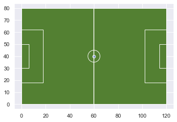


To load all the events from a single match we start with the matches json file. This is provided to the load_single_match function. You have two options, provide the id for the match using the matchid property, or use an index set as matchindex. The default is to use the first match (matchindex = 0)


```python
pth_to_matches = "open-data-master/data/matches/37/42.json"
pth_to_events = "open-data-master/data/events"

gdf = ssa.load_single_match(pth_to_matches)
```

Scrolling to the end we can see that event_type, event_time, and goal have been added to the dataframe. This is a geodataframe and can be plotted as I've shown before.


```python
gdf.head()
```


<div>
<style scoped>
    .dataframe tbody tr th:only-of-type {
        vertical-align: middle;
    }

    .dataframe tbody tr th {
        vertical-align: top;
    }

    .dataframe thead th {
        text-align: right;
    }
</style>
<table border="1" class="dataframe">
  <thead>
    <tr style="text-align: right;">
      <th></th>
      <th>id</th>
      <th>index</th>
      <th>period</th>
      <th>timestamp</th>
      <th>minute</th>
      <th>second</th>
      <th>type</th>
      <th>possession</th>
      <th>possession_team</th>
      <th>play_pattern</th>
      <th>...</th>
      <th>block</th>
      <th>miscontrol</th>
      <th>off_camera</th>
      <th>event_time</th>
      <th>goal</th>
      <th>event_type</th>
      <th>x_coord</th>
      <th>y_coord</th>
      <th>team_name</th>
      <th>geometry</th>
    </tr>
  </thead>
  <tbody>
    <tr>
      <th>0</th>
      <td>82a5a5f7-1c9b-4a02-901c-365632336087</td>
      <td>1</td>
      <td>1</td>
      <td>00:00:00.000</td>
      <td>0</td>
      <td>0</td>
      <td>{'id': 35, 'name': 'Starting XI'}</td>
      <td>1</td>
      <td>{'id': 974, 'name': 'Reading WFC'}</td>
      <td>{'id': 1, 'name': 'Regular Play'}</td>
      <td>...</td>
      <td>NaN</td>
      <td>NaN</td>
      <td>NaN</td>
      <td>2020-02-12 20:30:00.000000000</td>
      <td>0</td>
      <td>Starting XI</td>
      <td>None</td>
      <td>None</td>
      <td>Reading WFC</td>
      <td>None</td>
    </tr>
    <tr>
      <th>1</th>
      <td>730b4c77-1bd4-424b-a48a-c3035fa520b1</td>
      <td>2</td>
      <td>1</td>
      <td>00:00:00.000</td>
      <td>0</td>
      <td>0</td>
      <td>{'id': 35, 'name': 'Starting XI'}</td>
      <td>1</td>
      <td>{'id': 974, 'name': 'Reading WFC'}</td>
      <td>{'id': 1, 'name': 'Regular Play'}</td>
      <td>...</td>
      <td>NaN</td>
      <td>NaN</td>
      <td>NaN</td>
      <td>2020-02-12 20:30:00.000000000</td>
      <td>0</td>
      <td>Starting XI</td>
      <td>None</td>
      <td>None</td>
      <td>West Ham United LFC</td>
      <td>None</td>
    </tr>
    <tr>
      <th>2</th>
      <td>c83b7ba6-01cd-4bfd-8be0-85134ee07957</td>
      <td>3</td>
      <td>1</td>
      <td>00:00:00.000</td>
      <td>0</td>
      <td>0</td>
      <td>{'id': 18, 'name': 'Half Start'}</td>
      <td>1</td>
      <td>{'id': 974, 'name': 'Reading WFC'}</td>
      <td>{'id': 1, 'name': 'Regular Play'}</td>
      <td>...</td>
      <td>NaN</td>
      <td>NaN</td>
      <td>NaN</td>
      <td>2020-02-12 20:30:00.000000000</td>
      <td>0</td>
      <td>Half Start</td>
      <td>None</td>
      <td>None</td>
      <td>West Ham United LFC</td>
      <td>None</td>
    </tr>
    <tr>
      <th>3</th>
      <td>914bb7c5-6a9c-460b-b939-5706a242ef96</td>
      <td>4</td>
      <td>1</td>
      <td>00:00:00.000</td>
      <td>0</td>
      <td>0</td>
      <td>{'id': 18, 'name': 'Half Start'}</td>
      <td>1</td>
      <td>{'id': 974, 'name': 'Reading WFC'}</td>
      <td>{'id': 1, 'name': 'Regular Play'}</td>
      <td>...</td>
      <td>NaN</td>
      <td>NaN</td>
      <td>NaN</td>
      <td>2020-02-12 20:30:00.000000000</td>
      <td>0</td>
      <td>Half Start</td>
      <td>None</td>
      <td>None</td>
      <td>Reading WFC</td>
      <td>None</td>
    </tr>
    <tr>
      <th>4</th>
      <td>6e2b3a1f-90ad-4b88-b68a-7a50fd0eae84</td>
      <td>5</td>
      <td>1</td>
      <td>00:00:00.046</td>
      <td>0</td>
      <td>0</td>
      <td>{'id': 30, 'name': 'Pass'}</td>
      <td>2</td>
      <td>{'id': 974, 'name': 'Reading WFC'}</td>
      <td>{'id': 9, 'name': 'From Kick Off'}</td>
      <td>...</td>
      <td>NaN</td>
      <td>NaN</td>
      <td>NaN</td>
      <td>2020-02-12 20:30:00.046000128</td>
      <td>0</td>
      <td>Pass</td>
      <td>61</td>
      <td>39.9</td>
      <td>Reading WFC</td>
      <td>POINT (61.00000 39.90000)</td>
    </tr>
  </tbody>
</table>
<p>5 rows × 47 columns</p>
</div>


Here is the plot we ended with in the previous document showing the first goal, and the events that preceded it by 90 seconds.


```python
start_time = gdf.sort_values(by="event_time",ascending=True)['event_time'].iloc[0]
gdf['total_seconds'] = gdf["event_time"].apply(lambda x: (x-start_time).total_seconds())
goal_time = gdf.loc[gdf['goal'] == 1].iloc[0]['event_time']
goal_time_prev = goal_time - timedelta(seconds = 90)
ax = pitchgdf.plot(facecolor = SpatialSoccer.GREEN_PITCH_COLOR,edgecolor=SpatialSoccer.WHITE_LINE_COLOR);
gdf.loc[(gdf['event_time'] >=goal_time_prev) & (gdf['event_time'] <=goal_time)].plot(ax=ax,column="total_seconds",legend=True);
```


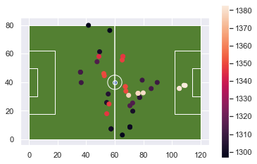


## Triangles

To build the triangles we'll pull out the data points of just the scoring team. Both goals were scored by Reading WFC. I'll use the SciPy library to build all these basic tesselations. Scipy.spatial includes many useful analysis functions. For example, if you want to analyze millions of events, it may be helpful to create an index that will speed up spatial calculations. You can also calculate distances and distance matrices very quickly with this library.


```python
gdf.loc[gdf['goal'] ==1]
```


<div>
<style scoped>
    .dataframe tbody tr th:only-of-type {
        vertical-align: middle;
    }

    .dataframe tbody tr th {
        vertical-align: top;
    }

    .dataframe thead th {
        text-align: right;
    }
</style>
<table border="1" class="dataframe">
  <thead>
    <tr style="text-align: right;">
      <th></th>
      <th>id</th>
      <th>index</th>
      <th>period</th>
      <th>timestamp</th>
      <th>minute</th>
      <th>second</th>
      <th>type</th>
      <th>possession</th>
      <th>possession_team</th>
      <th>play_pattern</th>
      <th>...</th>
      <th>miscontrol</th>
      <th>off_camera</th>
      <th>event_time</th>
      <th>goal</th>
      <th>event_type</th>
      <th>x_coord</th>
      <th>y_coord</th>
      <th>team_name</th>
      <th>geometry</th>
      <th>total_seconds</th>
    </tr>
  </thead>
  <tbody>
    <tr>
      <th>760</th>
      <td>6979be9f-11b1-493c-9396-8eba1d5452a0</td>
      <td>761</td>
      <td>1</td>
      <td>00:23:02.903</td>
      <td>23</td>
      <td>2</td>
      <td>{'id': 16, 'name': 'Shot'}</td>
      <td>56</td>
      <td>{'id': 974, 'name': 'Reading WFC'}</td>
      <td>{'id': 3, 'name': 'From Free Kick'}</td>
      <td>...</td>
      <td>NaN</td>
      <td>NaN</td>
      <td>2020-02-12 20:53:02.903000064</td>
      <td>1</td>
      <td>Shot</td>
      <td>109.3</td>
      <td>37.8</td>
      <td>Reading WFC</td>
      <td>POINT (109.30000 37.80000)</td>
      <td>1382.903</td>
    </tr>
    <tr>
      <th>1968</th>
      <td>9279f054-b4d6-4650-91b3-1a5ff464e02f</td>
      <td>1969</td>
      <td>2</td>
      <td>00:17:29.462</td>
      <td>62</td>
      <td>29</td>
      <td>{'id': 16, 'name': 'Shot'}</td>
      <td>129</td>
      <td>{'id': 974, 'name': 'Reading WFC'}</td>
      <td>{'id': 6, 'name': 'From Counter'}</td>
      <td>...</td>
      <td>NaN</td>
      <td>NaN</td>
      <td>2020-02-12 21:48:33.139000064</td>
      <td>1</td>
      <td>Shot</td>
      <td>102.3</td>
      <td>41.8</td>
      <td>Reading WFC</td>
      <td>POINT (102.30000 41.80000)</td>
      <td>4713.139</td>
    </tr>
  </tbody>
</table>
<p>2 rows × 48 columns</p>
</div>


I'm going to first pull out only the events from the preceeding 90 seconds and then create separate dataframes for each team's events.


```python
first_goal_all_events = gdf.loc[(gdf['event_time'] >=goal_time_prev) & (gdf['event_time'] <=goal_time)].copy()
reading_first_goal = first_goal_all_events.loc[first_goal_all_events['team_name']=="Reading WFC"]
ax = pitchgdf.plot(facecolor = SpatialSoccer.GREEN_PITCH_COLOR,edgecolor=SpatialSoccer.WHITE_LINE_COLOR);
first_goal_all_events.plot(ax=ax,column="total_seconds",legend=True);
```


```python
ax = pitchgdf.plot(facecolor = SpatialSoccer.GREEN_PITCH_COLOR,edgecolor=SpatialSoccer.WHITE_LINE_COLOR);
reading_first_goal.plot(ax=ax,column="total_seconds",legend=True);
```


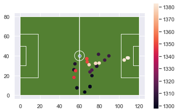


The Delaunay class will create the triangles for us. We need to provide a numpy array of point locations. Then it gives you an array of triangles to build from the point indexes.


```python
from scipy.spatial import Delaunay
points = reading_first_goal[['x_coord','y_coord']].values
tri = Delaunay(points)
```

Then we need to create the triangles from the points. We can get those through the triangles simplices.I'll create a geodataframe for each of these.


```python
index_list = []
tri_geom = []
for i,t in enumerate(points[tri.simplices]):
    tri_geom.append(Polygon(t))
    index_list.append(i)
tri_gdf = gpd.GeoDataFrame({"order":index_list},geometry=tri_geom)
tri_gdf.plot();
```


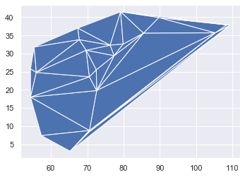


I'd like to also include where the West Ham players were in all this sequence. So assuming they would be on the opposite goal I will flip and mirror the players.


```python
ax = pitchgdf.plot(facecolor = SpatialSoccer.GREEN_PITCH_COLOR,edgecolor=SpatialSoccer.WHITE_LINE_COLOR);
reading_first_goal.plot(ax=ax,color="blue")
wh = first_goal_all_events.loc[first_goal_all_events['team_name']=="West Ham United LFC"].copy()
wh['y_coord'] = SpatialSoccer.flip_coordinates(wh['y_coord'].values.astype(np.float64),80,0)
wh['x_coord'] = SpatialSoccer.flip_coordinates(wh['x_coord'].values.astype(np.float64),120,0)
wh = wh.set_geometry( [Point((x[0],x[1])) for x in wh[['x_coord','y_coord']].values])
wh.plot(ax=ax,color="red")
tri_gdf.plot(ax=ax,facecolor="None",edgecolor="black");
```


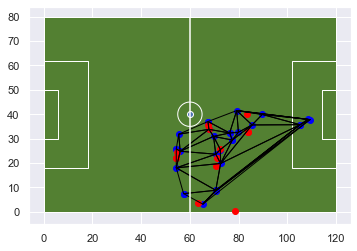


```python
first_goal_all_events[['location','geometry']].head()
SpatialSoccer.flip_coordinates(wh['y_coord'].values.astype(np.float64))
```


    [40.2,
     36.599999999999994,
     21.699999999999996,
     0.09999999999999432,
     7.399999999999999,
     7.399999999999999,
     14.699999999999996,
     18.4,
     18.4,
     18.4,
     15.899999999999999,
     4.899999999999999,
     6.399999999999999]


Not particularly interesting in this dataset since the events are all single discrete events. But I think we can descern a little bit what happened here. West ham had the ball and then Reading broke away here to score. The actual goal was scored on based on a free kick.

## Voronoi Tesselation

The voronoi diagram will tesselate space based on those triangles. Instead, I will use the position of the players using the freeze_frame information on the shot for the first goal. I'll pull that out into a separate dataframe. The locations will need to be fixed again.

Unfortunately, 'shot' does not include the player that scored, that's in the other part of the object. So I'll extract that and add it to the freeze frame dataframe.


```python
shot_goal = gdf.loc[gdf['goal'] ==1]['shot'].iloc[0]
ff = shot_goal['freeze_frame']
ff_df = pd.DataFrame(ff)
ff_df.head()
```


<div>
<style scoped>
    .dataframe tbody tr th:only-of-type {
        vertical-align: middle;
    }

    .dataframe tbody tr th {
        vertical-align: top;
    }

    .dataframe thead th {
        text-align: right;
    }
</style>
<table border="1" class="dataframe">
  <thead>
    <tr style="text-align: right;">
      <th></th>
      <th>location</th>
      <th>player</th>
      <th>position</th>
      <th>teammate</th>
    </tr>
  </thead>
  <tbody>
    <tr>
      <th>0</th>
      <td>[98.1, 37.4]</td>
      <td>{'id': 31554, 'name': 'Jacinta Galabadaarachchi'}</td>
      <td>{'id': 21, 'name': 'Left Wing'}</td>
      <td>False</td>
    </tr>
    <tr>
      <th>1</th>
      <td>[111.9, 36.0]</td>
      <td>{'id': 31628, 'name': 'Kristine Leine'}</td>
      <td>{'id': 5, 'name': 'Left Center Back'}</td>
      <td>True</td>
    </tr>
    <tr>
      <th>2</th>
      <td>[116.2, 41.8]</td>
      <td>{'id': 22027, 'name': 'Anne Moorhouse'}</td>
      <td>{'id': 1, 'name': 'Goalkeeper'}</td>
      <td>False</td>
    </tr>
    <tr>
      <th>3</th>
      <td>[110.6, 42.4]</td>
      <td>{'id': 34232, 'name': 'Grace Fisk'}</td>
      <td>{'id': 3, 'name': 'Right Center Back'}</td>
      <td>False</td>
    </tr>
    <tr>
      <th>4</th>
      <td>[111.3, 39.6]</td>
      <td>{'id': 31553, 'name': 'Cecilie Redisch Kvamme'}</td>
      <td>{'id': 2, 'name': 'Right Back'}</td>
      <td>False</td>
    </tr>
  </tbody>
</table>
</div>


```python
jm = gdf.loc[gdf['goal'] ==1][['location','player','position']].iloc[0]
jm = jm.to_dict()
jm['teammate']= True
ff_df = ff_df.append(jm,ignore_index=True)
ff_df
```


<div>
<style scoped>
    .dataframe tbody tr th:only-of-type {
        vertical-align: middle;
    }

    .dataframe tbody tr th {
        vertical-align: top;
    }

    .dataframe thead th {
        text-align: right;
    }
</style>
<table border="1" class="dataframe">
  <thead>
    <tr style="text-align: right;">
      <th></th>
      <th>location</th>
      <th>player</th>
      <th>position</th>
      <th>teammate</th>
    </tr>
  </thead>
  <tbody>
    <tr>
      <th>0</th>
      <td>[98.1, 37.4]</td>
      <td>{'id': 31554, 'name': 'Jacinta Galabadaarachchi'}</td>
      <td>{'id': 21, 'name': 'Left Wing'}</td>
      <td>False</td>
    </tr>
    <tr>
      <th>1</th>
      <td>[111.9, 36.0]</td>
      <td>{'id': 31628, 'name': 'Kristine Leine'}</td>
      <td>{'id': 5, 'name': 'Left Center Back'}</td>
      <td>True</td>
    </tr>
    <tr>
      <th>2</th>
      <td>[116.2, 41.8]</td>
      <td>{'id': 22027, 'name': 'Anne Moorhouse'}</td>
      <td>{'id': 1, 'name': 'Goalkeeper'}</td>
      <td>False</td>
    </tr>
    <tr>
      <th>3</th>
      <td>[110.6, 42.4]</td>
      <td>{'id': 34232, 'name': 'Grace Fisk'}</td>
      <td>{'id': 3, 'name': 'Right Center Back'}</td>
      <td>False</td>
    </tr>
    <tr>
      <th>4</th>
      <td>[111.3, 39.6]</td>
      <td>{'id': 31553, 'name': 'Cecilie Redisch Kvamme'}</td>
      <td>{'id': 2, 'name': 'Right Back'}</td>
      <td>False</td>
    </tr>
    <tr>
      <th>5</th>
      <td>[112.6, 42.3]</td>
      <td>{'id': 31558, 'name': 'Martha Thomas'}</td>
      <td>{'id': 23, 'name': 'Center Forward'}</td>
      <td>False</td>
    </tr>
    <tr>
      <th>6</th>
      <td>[112.6, 43.8]</td>
      <td>{'id': 18149, 'name': 'Remi Allen'}</td>
      <td>{'id': 13, 'name': 'Right Center Midfield'}</td>
      <td>True</td>
    </tr>
    <tr>
      <th>7</th>
      <td>[108.1, 44.7]</td>
      <td>{'id': 26570, 'name': 'Amalie Vevle Eikeland'}</td>
      <td>{'id': 24, 'name': 'Left Center Forward'}</td>
      <td>True</td>
    </tr>
    <tr>
      <th>8</th>
      <td>[106.1, 43.6]</td>
      <td>{'id': 18151, 'name': 'Gilly Louise Scarlett F...</td>
      <td>{'id': 5, 'name': 'Left Center Back'}</td>
      <td>False</td>
    </tr>
    <tr>
      <th>9</th>
      <td>[105.0, 49.2]</td>
      <td>{'id': 31556, 'name': 'Laura Vetterlein'}</td>
      <td>{'id': 6, 'name': 'Left Back'}</td>
      <td>False</td>
    </tr>
    <tr>
      <th>10</th>
      <td>[106.9, 52.1]</td>
      <td>{'id': 15723, 'name': 'Brooke Chaplen'}</td>
      <td>{'id': 22, 'name': 'Right Center Forward'}</td>
      <td>True</td>
    </tr>
    <tr>
      <th>11</th>
      <td>[109.3, 42.2]</td>
      <td>{'id': 10190, 'name': 'Jade Moore'}</td>
      <td>{'id': 10, 'name': 'Center Defensive Midfield'}</td>
      <td>True</td>
    </tr>
  </tbody>
</table>
</div>


```python
ff_df['position_name'] = ff_df['position'].apply(lambda x: x.get('name'))
ff_df['player_name'] = ff_df['player'].apply(lambda x: x.get('name'))
ff_df.head()
```


<div>
<style scoped>
    .dataframe tbody tr th:only-of-type {
        vertical-align: middle;
    }

    .dataframe tbody tr th {
        vertical-align: top;
    }

    .dataframe thead th {
        text-align: right;
    }
</style>
<table border="1" class="dataframe">
  <thead>
    <tr style="text-align: right;">
      <th></th>
      <th>location</th>
      <th>player</th>
      <th>position</th>
      <th>teammate</th>
      <th>position_name</th>
      <th>player_name</th>
    </tr>
  </thead>
  <tbody>
    <tr>
      <th>0</th>
      <td>[98.1, 37.4]</td>
      <td>{'id': 31554, 'name': 'Jacinta Galabadaarachchi'}</td>
      <td>{'id': 21, 'name': 'Left Wing'}</td>
      <td>False</td>
      <td>Left Wing</td>
      <td>Jacinta Galabadaarachchi</td>
    </tr>
    <tr>
      <th>1</th>
      <td>[111.9, 36.0]</td>
      <td>{'id': 31628, 'name': 'Kristine Leine'}</td>
      <td>{'id': 5, 'name': 'Left Center Back'}</td>
      <td>True</td>
      <td>Left Center Back</td>
      <td>Kristine Leine</td>
    </tr>
    <tr>
      <th>2</th>
      <td>[116.2, 41.8]</td>
      <td>{'id': 22027, 'name': 'Anne Moorhouse'}</td>
      <td>{'id': 1, 'name': 'Goalkeeper'}</td>
      <td>False</td>
      <td>Goalkeeper</td>
      <td>Anne Moorhouse</td>
    </tr>
    <tr>
      <th>3</th>
      <td>[110.6, 42.4]</td>
      <td>{'id': 34232, 'name': 'Grace Fisk'}</td>
      <td>{'id': 3, 'name': 'Right Center Back'}</td>
      <td>False</td>
      <td>Right Center Back</td>
      <td>Grace Fisk</td>
    </tr>
    <tr>
      <th>4</th>
      <td>[111.3, 39.6]</td>
      <td>{'id': 31553, 'name': 'Cecilie Redisch Kvamme'}</td>
      <td>{'id': 2, 'name': 'Right Back'}</td>
      <td>False</td>
      <td>Right Back</td>
      <td>Cecilie Redisch Kvamme</td>
    </tr>
  </tbody>
</table>
</div>


```python
geometry = ssa.get_location_coords(ff_df)
ff_gdf = gpd.GeoDataFrame(ff_df,geometry=geometry)
ff_gdf
```


<div>
<style scoped>
    .dataframe tbody tr th:only-of-type {
        vertical-align: middle;
    }

    .dataframe tbody tr th {
        vertical-align: top;
    }

    .dataframe thead th {
        text-align: right;
    }
</style>
<table border="1" class="dataframe">
  <thead>
    <tr style="text-align: right;">
      <th></th>
      <th>location</th>
      <th>player</th>
      <th>position</th>
      <th>teammate</th>
      <th>position_name</th>
      <th>player_name</th>
      <th>x_coord</th>
      <th>y_coord</th>
      <th>geometry</th>
    </tr>
  </thead>
  <tbody>
    <tr>
      <th>0</th>
      <td>[98.1, 37.4]</td>
      <td>{'id': 31554, 'name': 'Jacinta Galabadaarachchi'}</td>
      <td>{'id': 21, 'name': 'Left Wing'}</td>
      <td>False</td>
      <td>Left Wing</td>
      <td>Jacinta Galabadaarachchi</td>
      <td>98.1</td>
      <td>42.6</td>
      <td>POINT (98.10000 42.60000)</td>
    </tr>
    <tr>
      <th>1</th>
      <td>[111.9, 36.0]</td>
      <td>{'id': 31628, 'name': 'Kristine Leine'}</td>
      <td>{'id': 5, 'name': 'Left Center Back'}</td>
      <td>True</td>
      <td>Left Center Back</td>
      <td>Kristine Leine</td>
      <td>111.9</td>
      <td>44.0</td>
      <td>POINT (111.90000 44.00000)</td>
    </tr>
    <tr>
      <th>2</th>
      <td>[116.2, 41.8]</td>
      <td>{'id': 22027, 'name': 'Anne Moorhouse'}</td>
      <td>{'id': 1, 'name': 'Goalkeeper'}</td>
      <td>False</td>
      <td>Goalkeeper</td>
      <td>Anne Moorhouse</td>
      <td>116.2</td>
      <td>38.2</td>
      <td>POINT (116.20000 38.20000)</td>
    </tr>
    <tr>
      <th>3</th>
      <td>[110.6, 42.4]</td>
      <td>{'id': 34232, 'name': 'Grace Fisk'}</td>
      <td>{'id': 3, 'name': 'Right Center Back'}</td>
      <td>False</td>
      <td>Right Center Back</td>
      <td>Grace Fisk</td>
      <td>110.6</td>
      <td>37.6</td>
      <td>POINT (110.60000 37.60000)</td>
    </tr>
    <tr>
      <th>4</th>
      <td>[111.3, 39.6]</td>
      <td>{'id': 31553, 'name': 'Cecilie Redisch Kvamme'}</td>
      <td>{'id': 2, 'name': 'Right Back'}</td>
      <td>False</td>
      <td>Right Back</td>
      <td>Cecilie Redisch Kvamme</td>
      <td>111.3</td>
      <td>40.4</td>
      <td>POINT (111.30000 40.40000)</td>
    </tr>
    <tr>
      <th>5</th>
      <td>[112.6, 42.3]</td>
      <td>{'id': 31558, 'name': 'Martha Thomas'}</td>
      <td>{'id': 23, 'name': 'Center Forward'}</td>
      <td>False</td>
      <td>Center Forward</td>
      <td>Martha Thomas</td>
      <td>112.6</td>
      <td>37.7</td>
      <td>POINT (112.60000 37.70000)</td>
    </tr>
    <tr>
      <th>6</th>
      <td>[112.6, 43.8]</td>
      <td>{'id': 18149, 'name': 'Remi Allen'}</td>
      <td>{'id': 13, 'name': 'Right Center Midfield'}</td>
      <td>True</td>
      <td>Right Center Midfield</td>
      <td>Remi Allen</td>
      <td>112.6</td>
      <td>36.2</td>
      <td>POINT (112.60000 36.20000)</td>
    </tr>
    <tr>
      <th>7</th>
      <td>[108.1, 44.7]</td>
      <td>{'id': 26570, 'name': 'Amalie Vevle Eikeland'}</td>
      <td>{'id': 24, 'name': 'Left Center Forward'}</td>
      <td>True</td>
      <td>Left Center Forward</td>
      <td>Amalie Vevle Eikeland</td>
      <td>108.1</td>
      <td>35.3</td>
      <td>POINT (108.10000 35.30000)</td>
    </tr>
    <tr>
      <th>8</th>
      <td>[106.1, 43.6]</td>
      <td>{'id': 18151, 'name': 'Gilly Louise Scarlett F...</td>
      <td>{'id': 5, 'name': 'Left Center Back'}</td>
      <td>False</td>
      <td>Left Center Back</td>
      <td>Gilly Louise Scarlett Flaherty</td>
      <td>106.1</td>
      <td>36.4</td>
      <td>POINT (106.10000 36.40000)</td>
    </tr>
    <tr>
      <th>9</th>
      <td>[105.0, 49.2]</td>
      <td>{'id': 31556, 'name': 'Laura Vetterlein'}</td>
      <td>{'id': 6, 'name': 'Left Back'}</td>
      <td>False</td>
      <td>Left Back</td>
      <td>Laura Vetterlein</td>
      <td>105.0</td>
      <td>30.8</td>
      <td>POINT (105.00000 30.80000)</td>
    </tr>
    <tr>
      <th>10</th>
      <td>[106.9, 52.1]</td>
      <td>{'id': 15723, 'name': 'Brooke Chaplen'}</td>
      <td>{'id': 22, 'name': 'Right Center Forward'}</td>
      <td>True</td>
      <td>Right Center Forward</td>
      <td>Brooke Chaplen</td>
      <td>106.9</td>
      <td>27.9</td>
      <td>POINT (106.90000 27.90000)</td>
    </tr>
    <tr>
      <th>11</th>
      <td>[109.3, 42.2]</td>
      <td>{'id': 10190, 'name': 'Jade Moore'}</td>
      <td>{'id': 10, 'name': 'Center Defensive Midfield'}</td>
      <td>True</td>
      <td>Center Defensive Midfield</td>
      <td>Jade Moore</td>
      <td>109.3</td>
      <td>37.8</td>
      <td>POINT (109.30000 37.80000)</td>
    </tr>
  </tbody>
</table>
</div>


Now that we have all the information extracted, we can plot it quickly to see the layout. While not a pretty legend, the False values indicate the West Ham players that were by their goal, and are shown as black dots. The Reading are shown as white dots. We want to see the vornoi polygons of the Reading players to compare if we think the West Ham defense were poorly positioned to respond. Jade Moore is the player that scored the goal.


```python
ax = pitchgdf.plot(facecolor = SpatialSoccer.GREEN_PITCH_COLOR,edgecolor=SpatialSoccer.WHITE_LINE_COLOR);
ff_gdf.plot(ax=ax,column='teammate',legend=True)
ff_gdf.loc[ff_gdf['player_name']=='Jade Moore'].plot(ax=ax,marker="x",markersize=50);
```


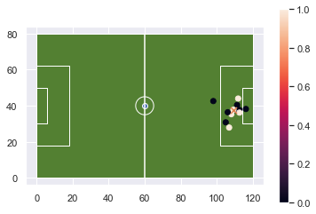


```python
from scipy.spatial import Voronoi
points = ff_gdf.loc[ff_gdf['teammate']==True][['x_coord','y_coord']].values
vor = Voronoi(points)
```

As before I create spatial objects and a GeoDataFrame to store them. The -1 values indicate that the line extends to infinity and we cannot really create anything form those.


```python
lines = [LineString(vor.vertices[line]) for line in vor.ridge_vertices if -1 not in line]
index_list = [i for i in range(0,len(lines))]
vor_gdf = gpd.GeoDataFrame({"order":index_list},geometry=lines)
vor_gdf.plot();

```


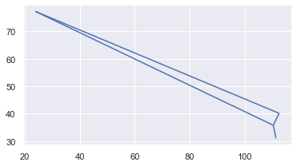


```python
ax = pitchgdf.plot(facecolor = SpatialSoccer.GREEN_PITCH_COLOR,edgecolor=SpatialSoccer.WHITE_LINE_COLOR);
ax.set_xlim([90,120])
ax.set_ylim([20,60])
ff_gdf.plot(ax=ax,column='teammate',legend=True)
ff_gdf.loc[ff_gdf['player_name']=='Jade Moore'].plot(ax=ax,marker="x",markersize=50)
vor_gdf.plot(ax=ax,linewidth=2,color='red')
for i,row in ff_gdf.loc[ff_gdf['teammate']==False].iterrows():
    ax.text(x =row['x_coord'],y =row['y_coord'],s =row['position_name'],fontsize=10)
```


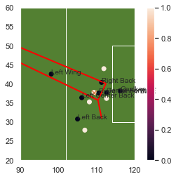


Above we can see, I think at least, the west ham players are leaving a lot of gaps. Two fall on or nearly on the vornoi region edge (red line) a bad position to be in. The keeper seems off where they should be too. Maybe she even had her view blocked by one of the defenders. I could not find a video that highlighted the goal, so I'm just guessing.

Part of the problem is there are only 6 points to work with, so we ended up with very few lines separating the diagram. We also have lines that extend off into infinity. It's involved, but we could generate complete polygons based on the study area (e.g. the football pitch).

Otherwise there is a python library called geovoronoi that will accept a set of points, and a polygon area, then return a complete set of voronoi regions that cut off at the end of the pitch polygon.


## More Complex

Let's look at an example that would have more points that we can get a sense of the zones the players may play in.

To do this there will be several steps. I will extract the Pass events for Reading WFC in the First period.

From this I would like to average the location. In other words, I find the mean center of the pass originations for each player. Then I will use this average location to create voronoi diagram. This provides some sense of where each player was for many of the passes.

On a side note, passes contain many different types and play patterns. So a play pattern will be called a Throw In, the Type of event is a Pass and the Type of Pass is "Throw-In". It might be worth also, distinguishing between "Regular Play" play patterns for the passes.

### Extract

Begin by extracting the events we are interested in.


```python
passes = gdf.loc[(gdf['event_type']=='Pass') & (gdf['team_name']=='Reading WFC') & (gdf['period']==1)].copy()
passes.head()
```


<div>
<style scoped>
    .dataframe tbody tr th:only-of-type {
        vertical-align: middle;
    }

    .dataframe tbody tr th {
        vertical-align: top;
    }

    .dataframe thead th {
        text-align: right;
    }
</style>
<table border="1" class="dataframe">
  <thead>
    <tr style="text-align: right;">
      <th></th>
      <th>id</th>
      <th>index</th>
      <th>period</th>
      <th>timestamp</th>
      <th>minute</th>
      <th>second</th>
      <th>type</th>
      <th>possession</th>
      <th>possession_team</th>
      <th>play_pattern</th>
      <th>...</th>
      <th>miscontrol</th>
      <th>off_camera</th>
      <th>event_time</th>
      <th>goal</th>
      <th>event_type</th>
      <th>x_coord</th>
      <th>y_coord</th>
      <th>team_name</th>
      <th>geometry</th>
      <th>total_seconds</th>
    </tr>
  </thead>
  <tbody>
    <tr>
      <th>4</th>
      <td>6e2b3a1f-90ad-4b88-b68a-7a50fd0eae84</td>
      <td>5</td>
      <td>1</td>
      <td>00:00:00.046</td>
      <td>0</td>
      <td>0</td>
      <td>{'id': 30, 'name': 'Pass'}</td>
      <td>2</td>
      <td>{'id': 974, 'name': 'Reading WFC'}</td>
      <td>{'id': 9, 'name': 'From Kick Off'}</td>
      <td>...</td>
      <td>NaN</td>
      <td>NaN</td>
      <td>2020-02-12 20:30:00.046000128</td>
      <td>0</td>
      <td>Pass</td>
      <td>61</td>
      <td>39.9</td>
      <td>Reading WFC</td>
      <td>POINT (61.00000 39.90000)</td>
      <td>0.046</td>
    </tr>
    <tr>
      <th>7</th>
      <td>ecd37567-9854-40b6-95b5-df52d1ae24a6</td>
      <td>8</td>
      <td>1</td>
      <td>00:00:00.897</td>
      <td>0</td>
      <td>0</td>
      <td>{'id': 30, 'name': 'Pass'}</td>
      <td>2</td>
      <td>{'id': 974, 'name': 'Reading WFC'}</td>
      <td>{'id': 9, 'name': 'From Kick Off'}</td>
      <td>...</td>
      <td>NaN</td>
      <td>NaN</td>
      <td>2020-02-12 20:30:00.896999936</td>
      <td>0</td>
      <td>Pass</td>
      <td>54.8</td>
      <td>39.5</td>
      <td>Reading WFC</td>
      <td>POINT (54.80000 39.50000)</td>
      <td>0.897</td>
    </tr>
    <tr>
      <th>24</th>
      <td>bf181399-ca57-40d8-96a6-8d45251c33b1</td>
      <td>25</td>
      <td>1</td>
      <td>00:00:13.385</td>
      <td>0</td>
      <td>13</td>
      <td>{'id': 30, 'name': 'Pass'}</td>
      <td>2</td>
      <td>{'id': 974, 'name': 'Reading WFC'}</td>
      <td>{'id': 9, 'name': 'From Kick Off'}</td>
      <td>...</td>
      <td>NaN</td>
      <td>NaN</td>
      <td>2020-02-12 20:30:13.384999936</td>
      <td>0</td>
      <td>Pass</td>
      <td>77.4</td>
      <td>5.9</td>
      <td>Reading WFC</td>
      <td>POINT (77.40000 5.90000)</td>
      <td>13.385</td>
    </tr>
    <tr>
      <th>39</th>
      <td>552984bd-e414-4b9a-b9d9-b982168854bb</td>
      <td>40</td>
      <td>1</td>
      <td>00:01:04.448</td>
      <td>1</td>
      <td>4</td>
      <td>{'id': 30, 'name': 'Pass'}</td>
      <td>4</td>
      <td>{'id': 972, 'name': 'West Ham United LFC'}</td>
      <td>{'id': 4, 'name': 'From Throw In'}</td>
      <td>...</td>
      <td>NaN</td>
      <td>NaN</td>
      <td>2020-02-12 20:31:04.448000000</td>
      <td>0</td>
      <td>Pass</td>
      <td>68.4</td>
      <td>49.4</td>
      <td>Reading WFC</td>
      <td>POINT (68.40000 49.40000)</td>
      <td>64.448</td>
    </tr>
    <tr>
      <th>64</th>
      <td>93a79db7-c61a-4c93-94de-5a3dbed52bb7</td>
      <td>65</td>
      <td>1</td>
      <td>00:02:17.194</td>
      <td>2</td>
      <td>17</td>
      <td>{'id': 30, 'name': 'Pass'}</td>
      <td>6</td>
      <td>{'id': 974, 'name': 'Reading WFC'}</td>
      <td>{'id': 1, 'name': 'Regular Play'}</td>
      <td>...</td>
      <td>NaN</td>
      <td>NaN</td>
      <td>2020-02-12 20:32:17.193999872</td>
      <td>0</td>
      <td>Pass</td>
      <td>13.2</td>
      <td>42</td>
      <td>Reading WFC</td>
      <td>POINT (13.20000 42.00000)</td>
      <td>137.194</td>
    </tr>
  </tbody>
</table>
<p>5 rows × 48 columns</p>
</div>


### Plot

A quick plot reveals the locations.


```python
ax = pitchgdf.plot(facecolor = SpatialSoccer.GREEN_PITCH_COLOR,edgecolor=SpatialSoccer.WHITE_LINE_COLOR);
passes.plot(ax=ax);
```


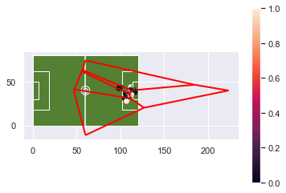


### Player Name

We will use the player name to aggregate the data to calculate the mean center for each player's passes.


```python
passes['player_name'] = passes['player'].apply(lambda x: x.get('name'))
passes.head()
```


<div>
<style scoped>
    .dataframe tbody tr th:only-of-type {
        vertical-align: middle;
    }

    .dataframe tbody tr th {
        vertical-align: top;
    }

    .dataframe thead th {
        text-align: right;
    }
</style>
<table border="1" class="dataframe">
  <thead>
    <tr style="text-align: right;">
      <th></th>
      <th>id</th>
      <th>index</th>
      <th>period</th>
      <th>timestamp</th>
      <th>minute</th>
      <th>second</th>
      <th>type</th>
      <th>possession</th>
      <th>possession_team</th>
      <th>play_pattern</th>
      <th>...</th>
      <th>off_camera</th>
      <th>event_time</th>
      <th>goal</th>
      <th>event_type</th>
      <th>x_coord</th>
      <th>y_coord</th>
      <th>team_name</th>
      <th>geometry</th>
      <th>total_seconds</th>
      <th>player_name</th>
    </tr>
  </thead>
  <tbody>
    <tr>
      <th>4</th>
      <td>6e2b3a1f-90ad-4b88-b68a-7a50fd0eae84</td>
      <td>5</td>
      <td>1</td>
      <td>00:00:00.046</td>
      <td>0</td>
      <td>0</td>
      <td>{'id': 30, 'name': 'Pass'}</td>
      <td>2</td>
      <td>{'id': 974, 'name': 'Reading WFC'}</td>
      <td>{'id': 9, 'name': 'From Kick Off'}</td>
      <td>...</td>
      <td>NaN</td>
      <td>2020-02-12 20:30:00.046000128</td>
      <td>0</td>
      <td>Pass</td>
      <td>61</td>
      <td>39.9</td>
      <td>Reading WFC</td>
      <td>POINT (61.00000 39.90000)</td>
      <td>0.046</td>
      <td>Jade Moore</td>
    </tr>
    <tr>
      <th>7</th>
      <td>ecd37567-9854-40b6-95b5-df52d1ae24a6</td>
      <td>8</td>
      <td>1</td>
      <td>00:00:00.897</td>
      <td>0</td>
      <td>0</td>
      <td>{'id': 30, 'name': 'Pass'}</td>
      <td>2</td>
      <td>{'id': 974, 'name': 'Reading WFC'}</td>
      <td>{'id': 9, 'name': 'From Kick Off'}</td>
      <td>...</td>
      <td>NaN</td>
      <td>2020-02-12 20:30:00.896999936</td>
      <td>0</td>
      <td>Pass</td>
      <td>54.8</td>
      <td>39.5</td>
      <td>Reading WFC</td>
      <td>POINT (54.80000 39.50000)</td>
      <td>0.897</td>
      <td>Fara Williams</td>
    </tr>
    <tr>
      <th>24</th>
      <td>bf181399-ca57-40d8-96a6-8d45251c33b1</td>
      <td>25</td>
      <td>1</td>
      <td>00:00:13.385</td>
      <td>0</td>
      <td>13</td>
      <td>{'id': 30, 'name': 'Pass'}</td>
      <td>2</td>
      <td>{'id': 974, 'name': 'Reading WFC'}</td>
      <td>{'id': 9, 'name': 'From Kick Off'}</td>
      <td>...</td>
      <td>NaN</td>
      <td>2020-02-12 20:30:13.384999936</td>
      <td>0</td>
      <td>Pass</td>
      <td>77.4</td>
      <td>5.9</td>
      <td>Reading WFC</td>
      <td>POINT (77.40000 5.90000)</td>
      <td>13.385</td>
      <td>Fara Williams</td>
    </tr>
    <tr>
      <th>39</th>
      <td>552984bd-e414-4b9a-b9d9-b982168854bb</td>
      <td>40</td>
      <td>1</td>
      <td>00:01:04.448</td>
      <td>1</td>
      <td>4</td>
      <td>{'id': 30, 'name': 'Pass'}</td>
      <td>4</td>
      <td>{'id': 972, 'name': 'West Ham United LFC'}</td>
      <td>{'id': 4, 'name': 'From Throw In'}</td>
      <td>...</td>
      <td>NaN</td>
      <td>2020-02-12 20:31:04.448000000</td>
      <td>0</td>
      <td>Pass</td>
      <td>68.4</td>
      <td>49.4</td>
      <td>Reading WFC</td>
      <td>POINT (68.40000 49.40000)</td>
      <td>64.448</td>
      <td>Angharad James</td>
    </tr>
    <tr>
      <th>64</th>
      <td>93a79db7-c61a-4c93-94de-5a3dbed52bb7</td>
      <td>65</td>
      <td>1</td>
      <td>00:02:17.194</td>
      <td>2</td>
      <td>17</td>
      <td>{'id': 30, 'name': 'Pass'}</td>
      <td>6</td>
      <td>{'id': 974, 'name': 'Reading WFC'}</td>
      <td>{'id': 1, 'name': 'Regular Play'}</td>
      <td>...</td>
      <td>NaN</td>
      <td>2020-02-12 20:32:17.193999872</td>
      <td>0</td>
      <td>Pass</td>
      <td>13.2</td>
      <td>42</td>
      <td>Reading WFC</td>
      <td>POINT (13.20000 42.00000)</td>
      <td>137.194</td>
      <td>Rachael Laws</td>
    </tr>
  </tbody>
</table>
<p>5 rows × 49 columns</p>
</div>


### Location Data Type Correction

When location is created there are events without location, and a None datatype is put in place. This causes Pandas to store the data as an object. We need them as a number to calculate the average. A quick, if inefficient solution, is to create a new coordinate column with the values as a float.


```python
passes.dtypes
```


    id                         object
    index                       int64
    period                      int64
    timestamp                  object
    minute                      int64
    second                      int64
    type                       object
    possession                  int64
    possession_team            object
    play_pattern               object
    team                       object
    duration                  float64
    tactics                    object
    related_events             object
    half_start                 object
    player                     object
    position                   object
    location                   object
    pass                       object
    carry                      object
    under_pressure             object
    counterpress               object
    dribble                    object
    ball_receipt               object
    interception               object
    clearance                  object
    duel                       object
    out                        object
    shot                       object
    goalkeeper                 object
    foul_committed             object
    foul_won                   object
    bad_behaviour              object
    ball_recovery              object
    substitution               object
    injury_stoppage            object
    50_50                      object
    block                      object
    miscontrol                 object
    off_camera                 object
    event_time         datetime64[ns]
    goal                        int64
    event_type                 object
    x_coord                    object
    y_coord                    object
    team_name                  object
    geometry                 geometry
    total_seconds             float64
    player_name                object
    y_coord2                  float64
    x_coord2                  float64
    dtype: object


```python
passes['y_coord2'] = passes['y_coord'].values.astype(np.float64)
passes['x_coord2'] = passes['x_coord'].values.astype(np.float64)
```

### Group By

Group by is used to aggregate by player and calculate the average of each of the coordinates. I use reset_index to make the player name appear as a column in the new dataframe. Then I make the dataframe a geodataframe for easy plotting.


```python
average_position = passes.groupby('player_name').mean()[['x_coord2','y_coord2']].reset_index()
average_position_gdf = gpd.GeoDataFrame(average_position,
                                        geometry=[Point((x[0],x[1])) for x in average_position[['x_coord2','y_coord2']].values])
average_position_gdf.head()
```


<div>
<style scoped>
    .dataframe tbody tr th:only-of-type {
        vertical-align: middle;
    }

    .dataframe tbody tr th {
        vertical-align: top;
    }

    .dataframe thead th {
        text-align: right;
    }
</style>
<table border="1" class="dataframe">
  <thead>
    <tr style="text-align: right;">
      <th></th>
      <th>player_name</th>
      <th>x_coord2</th>
      <th>y_coord2</th>
      <th>geometry</th>
    </tr>
  </thead>
  <tbody>
    <tr>
      <th>0</th>
      <td>Amalie Vevle Eikeland</td>
      <td>69.742857</td>
      <td>48.928571</td>
      <td>POINT (69.74286 48.92857)</td>
    </tr>
    <tr>
      <th>1</th>
      <td>Angharad James</td>
      <td>58.500000</td>
      <td>14.457895</td>
      <td>POINT (58.50000 14.45789)</td>
    </tr>
    <tr>
      <th>2</th>
      <td>Brooke Chaplen</td>
      <td>81.577778</td>
      <td>33.433333</td>
      <td>POINT (81.57778 33.43333)</td>
    </tr>
    <tr>
      <th>3</th>
      <td>Fara Williams</td>
      <td>60.300000</td>
      <td>35.544444</td>
      <td>POINT (60.30000 35.54444)</td>
    </tr>
    <tr>
      <th>4</th>
      <td>Jade Moore</td>
      <td>67.311765</td>
      <td>44.400000</td>
      <td>POINT (67.31176 44.40000)</td>
    </tr>
  </tbody>
</table>
</div>


```python
ax = pitchgdf.plot(facecolor = SpatialSoccer.GREEN_PITCH_COLOR,edgecolor=SpatialSoccer.WHITE_LINE_COLOR);

for i,row in average_position_gdf.iterrows():
    ax.scatter(row['x_coord2'],row['y_coord2'],label=row['player_name'],color=SpatialSoccer.ELEVEN_COLORS[i])
leg = ax.legend()
box = ax.get_position()
ax.set_position([box.x0, box.y0, box.width * 0.8, box.height])
#leg = ax.get_legend()
leg.set_bbox_to_anchor((1, 1))
```


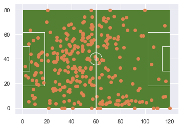


```python
ax = pitchgdf.plot(facecolor = SpatialSoccer.GREEN_PITCH_COLOR,edgecolor=SpatialSoccer.WHITE_LINE_COLOR);
passes.plot(ax=ax,column='player_name',legend=True,cmap='Set3');
box = ax.get_position()
ax.set_position([box.x0, box.y0, box.width * 0.8, box.height])
leg = ax.get_legend()
leg.set_bbox_to_anchor((1, 1))
```


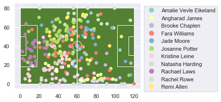


Finally the coordinates for the averate location are passed to the Voronoi scipy class and then converted to lines. This gives us a sense of where on average each player was for their originating pass. I plot the points a little differently so I can make sure I have 11 distinct colors. Even then they get a little hard to tell them apart. A bigger marker, or marker type may help.


```python
points = average_position_gdf[['x_coord2','y_coord2']].values
vor = Voronoi(points)
lines = [LineString(vor.vertices[line]) for line in vor.ridge_vertices if -1 not in line]
index_list = [i for i in range(0,len(lines))]
vor_gdf = gpd.GeoDataFrame({"order":index_list},geometry=lines)
ax = pitchgdf.plot(facecolor = SpatialSoccer.GREEN_PITCH_COLOR,edgecolor=SpatialSoccer.WHITE_LINE_COLOR);
ax.set_xlim([-5,125])
ax.set_ylim([-5,85])
for i,row in average_position_gdf.iterrows():
    ax.scatter(row['x_coord2'],row['y_coord2'],label=row['player_name'],color=SpatialSoccer.ELEVEN_COLORS[i])
leg = ax.legend()
box = ax.get_position()
ax.set_position([box.x0, box.y0, box.width * 0.8, box.height])
leg.set_bbox_to_anchor((1, 1))

vor_gdf.plot(ax=ax,linewidth=2,color='red');
```


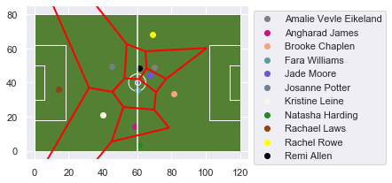


When we have more points to work with, our tesselation looks a little better.
Overall, this gives a pretty good sense of the overall zones that the different players played within. Chaplen Eikeland, and Moore spent most of their time towards the middle of the y-axis and closer to the opposing goal. Rowe, James,Williams and Harding spent most there time along the halfway field. Rowe and Leine 

Perhaps I should say "time" because this is just one view. It is the average location of a pass originating from these players. So it is where the players were at one point in Reading's time of posession.

Averages are tricky, because they can be pulled in the direction of extreme values. Maybe some of the defenders are closer to the half-way line because they pressed up a few times and this made their average pass origination seem further up then where they actually were for most of the game. This may explain why James is lined up to the right of the goalie, when her position seems to really be on the [left](https://www.google.com/search?q=reading+wfc+february+2020&rlz=1C1GCEB_enUS797US797&oq=read&aqs=chrome.0.69i59l2j69i57j69i60j69i65l3j69i64.3455j1j7&sourceid=chrome&ie=UTF-8#sie=m;/g/11fmbbx8hc;2;/m/0bbwt5m;ln;fp;1;;).

Just as a comparison, we can perform the same exercise with West Ham's first period passing.

However so I can see where they fit on the field in comparison to Reading, I'm actually going to flip the x-coordinate, and put the y-coordinate back the way it was.

Now the goalkeeper is on the opposite end, the left and right center-backs are on the left and right-hand side of the goalkepper.

Confusing, I know. 

But as I work through this, I understand the motivation behind the way they have location established. Even if I find it counterintuitive, from their perspective (I assume) they want to quickly look at the play of individual events and maybe similar events across multiple games. This would be difficult to visualize if you are constantly dealing with two different directions of play. 


```python
passes = gdf.loc[(gdf['event_type']=='Pass') & (gdf['team_name']=='West Ham United LFC') & (gdf['period']==1)].copy()
passes['player_name'] = passes['player'].apply(lambda x: x.get('name'))
passes['position_name'] = passes['position'].apply(lambda x: x.get('name'))
passes['y_coord2'] = SpatialSoccer.flip_coordinates(passes['y_coord'].values.astype(np.float64))
passes['x_coord2'] = SpatialSoccer.flip_coordinates(passes['x_coord'].values.astype(np.float64))
average_position = passes.groupby('position_name').mean()[['x_coord2','y_coord2']].reset_index()
average_position_gdf = gpd.GeoDataFrame(average_position,
                                        geometry=[Point((x[0],x[1])) for x in average_position[['x_coord2','y_coord2']].values])
points = average_position_gdf[['x_coord2','y_coord2']].values
vor = Voronoi(points)
lines = [LineString(vor.vertices[line]) for line in vor.ridge_vertices if -1 not in line]
index_list = [i for i in range(0,len(lines))]
vor_gdf = gpd.GeoDataFrame({"order":index_list},geometry=lines)
ax = pitchgdf.plot(facecolor = SpatialSoccer.GREEN_PITCH_COLOR,edgecolor=SpatialSoccer.WHITE_LINE_COLOR);
ax.set_xlim([-5,125])
ax.set_ylim([-5,85])
for i,row in average_position_gdf.iterrows():
    ax.scatter(row['x_coord2'],row['y_coord2'],label=row['position_name'],color=SpatialSoccer.ELEVEN_COLORS[i])
leg = ax.legend()
box = ax.get_position()
ax.set_position([box.x0, box.y0, box.width * 0.8, box.height])

leg.set_bbox_to_anchor((1, 1))

vor_gdf.plot(ax=ax,linewidth=2,color='red');
```


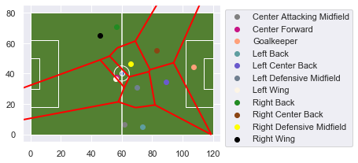


```python

```
