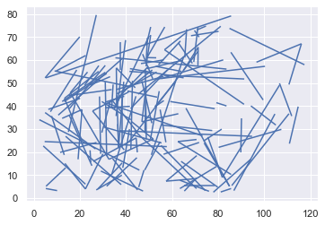
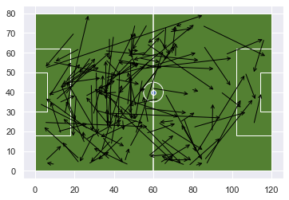
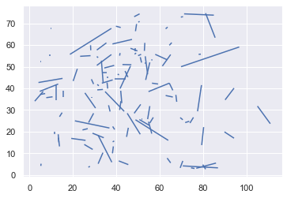
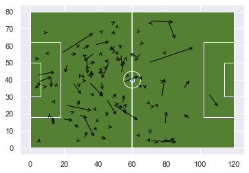
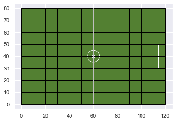
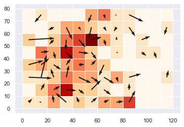
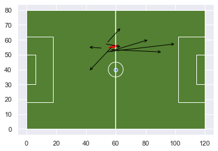
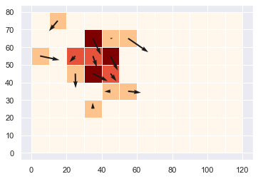
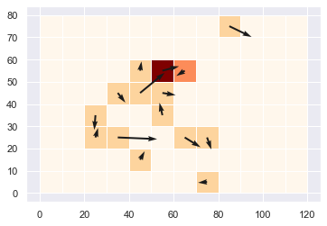
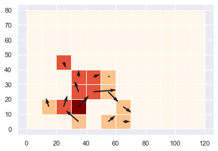

# Basic Trajectories

So far I have only prepared data and looked at the origin of the pass. That is only one part of the pass, there is also a destination. The destiantion has a location coordinate pair as well. This can be visualized as a basic trajectory. It does not necessarily have time points associated with it, so it technically speaking is more of a directional arrow. 

There is other pieces of information that I will not examine such as whether the pass succeeded or failed. There are many options you could add to the base that I present.

I will look at these in the aggregate and averages to understand how the ball moved on the field. This is just a limited sample, and you could be free to come up with different combinations of how to visualize this. 


```python
#processing json
import json

#base libraries for analysis
from ssalib import SpatialSoccer

#handling time
from dateutil.parser import parse
from datetime import datetime
from datetime import timedelta
#dataframes and plotting
import geopandas as gpd
from shapely.geometry.point import Point
from shapely.geometry import LineString
from shapely.geometry import Polygon
import matplotlib.pyplot as plt
import numpy as np
import seaborn as sns
import pandas as pd

sns.set()
%matplotlib inline
```

I'll use the same match of Reading vs West Ham. I'll focus only on Reading WFC for this document.


```python
ssa = SpatialSoccer()
pth_to_matches = "open-data-master/data/matches/37/42.json"
gdf = ssa.load_single_match(pth_to_matches)
pitchgdf = SpatialSoccer.build_polygon_pitch_statbomb()
pitchgdf.plot(facecolor = SpatialSoccer.GREEN_PITCH_COLOR,edgecolor=SpatialSoccer.WHITE_LINE_COLOR);
passes = gdf.loc[(gdf['event_type']=='Pass') & (gdf['team_name']=='Reading WFC')].copy()
passes.head()
```


<div>
<style scoped>
    .dataframe tbody tr th:only-of-type {
        vertical-align: middle;
    }

    .dataframe tbody tr th {
        vertical-align: top;
    }

    .dataframe thead th {
        text-align: right;
    }
</style>
<table border="1" class="dataframe">
  <thead>
    <tr style="text-align: right;">
      <th></th>
      <th>id</th>
      <th>index</th>
      <th>period</th>
      <th>timestamp</th>
      <th>minute</th>
      <th>second</th>
      <th>type</th>
      <th>possession</th>
      <th>possession_team</th>
      <th>play_pattern</th>
      <th>...</th>
      <th>block</th>
      <th>miscontrol</th>
      <th>off_camera</th>
      <th>event_time</th>
      <th>goal</th>
      <th>event_type</th>
      <th>x_coord</th>
      <th>y_coord</th>
      <th>team_name</th>
      <th>geometry</th>
    </tr>
  </thead>
  <tbody>
    <tr>
      <th>4</th>
      <td>6e2b3a1f-90ad-4b88-b68a-7a50fd0eae84</td>
      <td>5</td>
      <td>1</td>
      <td>00:00:00.046</td>
      <td>0</td>
      <td>0</td>
      <td>{'id': 30, 'name': 'Pass'}</td>
      <td>2</td>
      <td>{'id': 974, 'name': 'Reading WFC'}</td>
      <td>{'id': 9, 'name': 'From Kick Off'}</td>
      <td>...</td>
      <td>NaN</td>
      <td>NaN</td>
      <td>NaN</td>
      <td>2020-02-12 20:30:00.046000128</td>
      <td>0</td>
      <td>Pass</td>
      <td>61</td>
      <td>39.9</td>
      <td>Reading WFC</td>
      <td>POINT (61.00000 39.90000)</td>
    </tr>
    <tr>
      <th>7</th>
      <td>ecd37567-9854-40b6-95b5-df52d1ae24a6</td>
      <td>8</td>
      <td>1</td>
      <td>00:00:00.897</td>
      <td>0</td>
      <td>0</td>
      <td>{'id': 30, 'name': 'Pass'}</td>
      <td>2</td>
      <td>{'id': 974, 'name': 'Reading WFC'}</td>
      <td>{'id': 9, 'name': 'From Kick Off'}</td>
      <td>...</td>
      <td>NaN</td>
      <td>NaN</td>
      <td>NaN</td>
      <td>2020-02-12 20:30:00.896999936</td>
      <td>0</td>
      <td>Pass</td>
      <td>54.8</td>
      <td>39.5</td>
      <td>Reading WFC</td>
      <td>POINT (54.80000 39.50000)</td>
    </tr>
    <tr>
      <th>24</th>
      <td>bf181399-ca57-40d8-96a6-8d45251c33b1</td>
      <td>25</td>
      <td>1</td>
      <td>00:00:13.385</td>
      <td>0</td>
      <td>13</td>
      <td>{'id': 30, 'name': 'Pass'}</td>
      <td>2</td>
      <td>{'id': 974, 'name': 'Reading WFC'}</td>
      <td>{'id': 9, 'name': 'From Kick Off'}</td>
      <td>...</td>
      <td>NaN</td>
      <td>NaN</td>
      <td>NaN</td>
      <td>2020-02-12 20:30:13.384999936</td>
      <td>0</td>
      <td>Pass</td>
      <td>77.4</td>
      <td>5.9</td>
      <td>Reading WFC</td>
      <td>POINT (77.40000 5.90000)</td>
    </tr>
    <tr>
      <th>39</th>
      <td>552984bd-e414-4b9a-b9d9-b982168854bb</td>
      <td>40</td>
      <td>1</td>
      <td>00:01:04.448</td>
      <td>1</td>
      <td>4</td>
      <td>{'id': 30, 'name': 'Pass'}</td>
      <td>4</td>
      <td>{'id': 972, 'name': 'West Ham United LFC'}</td>
      <td>{'id': 4, 'name': 'From Throw In'}</td>
      <td>...</td>
      <td>NaN</td>
      <td>NaN</td>
      <td>NaN</td>
      <td>2020-02-12 20:31:04.448000000</td>
      <td>0</td>
      <td>Pass</td>
      <td>68.4</td>
      <td>49.4</td>
      <td>Reading WFC</td>
      <td>POINT (68.40000 49.40000)</td>
    </tr>
    <tr>
      <th>64</th>
      <td>93a79db7-c61a-4c93-94de-5a3dbed52bb7</td>
      <td>65</td>
      <td>1</td>
      <td>00:02:17.194</td>
      <td>2</td>
      <td>17</td>
      <td>{'id': 30, 'name': 'Pass'}</td>
      <td>6</td>
      <td>{'id': 974, 'name': 'Reading WFC'}</td>
      <td>{'id': 1, 'name': 'Regular Play'}</td>
      <td>...</td>
      <td>NaN</td>
      <td>NaN</td>
      <td>NaN</td>
      <td>2020-02-12 20:32:17.193999872</td>
      <td>0</td>
      <td>Pass</td>
      <td>13.2</td>
      <td>42</td>
      <td>Reading WFC</td>
      <td>POINT (13.20000 42.00000)</td>
    </tr>
  </tbody>
</table>
<p>5 rows × 47 columns</p>
</div>


The play pattern provides some more information about the type of pass. These could include Throw Ins, so I will limit the play pattern to regular play. The pass may be on the ground or in the air. End Location is common to the pass regardless of the play pattern.


```python
passes['pattern_name'] =  passes['play_pattern'].apply(lambda x: x.get('name'))
passes['end_location'] =  passes['pass'].apply(lambda x: x.get('end_location'))
```


```python
passes.head()
```


<div>
<style scoped>
    .dataframe tbody tr th:only-of-type {
        vertical-align: middle;
    }

    .dataframe tbody tr th {
        vertical-align: top;
    }

    .dataframe thead th {
        text-align: right;
    }
</style>
<table border="1" class="dataframe">
  <thead>
    <tr style="text-align: right;">
      <th></th>
      <th>id</th>
      <th>index</th>
      <th>period</th>
      <th>timestamp</th>
      <th>minute</th>
      <th>second</th>
      <th>type</th>
      <th>possession</th>
      <th>possession_team</th>
      <th>play_pattern</th>
      <th>...</th>
      <th>off_camera</th>
      <th>event_time</th>
      <th>goal</th>
      <th>event_type</th>
      <th>x_coord</th>
      <th>y_coord</th>
      <th>team_name</th>
      <th>geometry</th>
      <th>pattern_name</th>
      <th>end_location</th>
    </tr>
  </thead>
  <tbody>
    <tr>
      <th>4</th>
      <td>6e2b3a1f-90ad-4b88-b68a-7a50fd0eae84</td>
      <td>5</td>
      <td>1</td>
      <td>00:00:00.046</td>
      <td>0</td>
      <td>0</td>
      <td>{'id': 30, 'name': 'Pass'}</td>
      <td>2</td>
      <td>{'id': 974, 'name': 'Reading WFC'}</td>
      <td>{'id': 9, 'name': 'From Kick Off'}</td>
      <td>...</td>
      <td>NaN</td>
      <td>2020-02-12 20:30:00.046000128</td>
      <td>0</td>
      <td>Pass</td>
      <td>61</td>
      <td>39.9</td>
      <td>Reading WFC</td>
      <td>POINT (61.00000 39.90000)</td>
      <td>From Kick Off</td>
      <td>[54.1, 41.8]</td>
    </tr>
    <tr>
      <th>7</th>
      <td>ecd37567-9854-40b6-95b5-df52d1ae24a6</td>
      <td>8</td>
      <td>1</td>
      <td>00:00:00.897</td>
      <td>0</td>
      <td>0</td>
      <td>{'id': 30, 'name': 'Pass'}</td>
      <td>2</td>
      <td>{'id': 974, 'name': 'Reading WFC'}</td>
      <td>{'id': 9, 'name': 'From Kick Off'}</td>
      <td>...</td>
      <td>NaN</td>
      <td>2020-02-12 20:30:00.896999936</td>
      <td>0</td>
      <td>Pass</td>
      <td>54.8</td>
      <td>39.5</td>
      <td>Reading WFC</td>
      <td>POINT (54.80000 39.50000)</td>
      <td>From Kick Off</td>
      <td>[77.7, 75.4]</td>
    </tr>
    <tr>
      <th>24</th>
      <td>bf181399-ca57-40d8-96a6-8d45251c33b1</td>
      <td>25</td>
      <td>1</td>
      <td>00:00:13.385</td>
      <td>0</td>
      <td>13</td>
      <td>{'id': 30, 'name': 'Pass'}</td>
      <td>2</td>
      <td>{'id': 974, 'name': 'Reading WFC'}</td>
      <td>{'id': 9, 'name': 'From Kick Off'}</td>
      <td>...</td>
      <td>NaN</td>
      <td>2020-02-12 20:30:13.384999936</td>
      <td>0</td>
      <td>Pass</td>
      <td>77.4</td>
      <td>5.9</td>
      <td>Reading WFC</td>
      <td>POINT (77.40000 5.90000)</td>
      <td>From Kick Off</td>
      <td>[108.1, 70.0]</td>
    </tr>
    <tr>
      <th>39</th>
      <td>552984bd-e414-4b9a-b9d9-b982168854bb</td>
      <td>40</td>
      <td>1</td>
      <td>00:01:04.448</td>
      <td>1</td>
      <td>4</td>
      <td>{'id': 30, 'name': 'Pass'}</td>
      <td>4</td>
      <td>{'id': 972, 'name': 'West Ham United LFC'}</td>
      <td>{'id': 4, 'name': 'From Throw In'}</td>
      <td>...</td>
      <td>NaN</td>
      <td>2020-02-12 20:31:04.448000000</td>
      <td>0</td>
      <td>Pass</td>
      <td>68.4</td>
      <td>49.4</td>
      <td>Reading WFC</td>
      <td>POINT (68.40000 49.40000)</td>
      <td>From Throw In</td>
      <td>[57.3, 25.3]</td>
    </tr>
    <tr>
      <th>64</th>
      <td>93a79db7-c61a-4c93-94de-5a3dbed52bb7</td>
      <td>65</td>
      <td>1</td>
      <td>00:02:17.194</td>
      <td>2</td>
      <td>17</td>
      <td>{'id': 30, 'name': 'Pass'}</td>
      <td>6</td>
      <td>{'id': 974, 'name': 'Reading WFC'}</td>
      <td>{'id': 1, 'name': 'Regular Play'}</td>
      <td>...</td>
      <td>NaN</td>
      <td>2020-02-12 20:32:17.193999872</td>
      <td>0</td>
      <td>Pass</td>
      <td>13.2</td>
      <td>42</td>
      <td>Reading WFC</td>
      <td>POINT (13.20000 42.00000)</td>
      <td>Regular Play</td>
      <td>[31.6, 25.8]</td>
    </tr>
  </tbody>
</table>
<p>5 rows × 49 columns</p>
</div>


This converts the location on the y-axis to run from 0 to 80. Then creates a line from the start of the pass to the end of the pass. This becomes the default geometry in the geodataframe for easier visualization.


```python
end_geometry = ssa.get_location_coords(passes,location_name='end_location',out_x_name='e_x_coord',out_y_name='e_y_coord')
lines = [LineString(x) for x in list(zip(passes['geometry'].values,end_geometry))]
passes = passes.set_geometry(lines)
```


```python
passes.loc[(passes['pattern_name']=='Regular Play')& (gdf['period']==1)].plot();
```





The spaghetti plot above is very useful, or it is hard to understand what is going on overall. I'll extract only passes in period 1 that were regular play.


```python
p1_rp = passes.loc[(passes['pattern_name']=='Regular Play')& (gdf['period']==1)].copy()
```


```python
ax = pitchgdf.plot(facecolor = SpatialSoccer.GREEN_PITCH_COLOR,edgecolor=SpatialSoccer.WHITE_LINE_COLOR);
#p1_rp.plot(ax=ax)
for i,row in p1_rp.iterrows():
    ax.annotate("", xy=(row["e_x_coord"], row["e_y_coord"]), xytext=(row["x_coord"], row["y_coord"]),
                arrowprops=dict(arrowstyle="->",color="black"))

```





It may be useful to aggregate the information and look at averages. We can calculate the length of the line for example using geopandas. The average length of the passes was 21 (meters I believe). This is probably pulled by extremely long passes, so the median might be a more useful measure.


```python
p1_rp['geometry'].length.mean()
```


    21.10148561685386


```python
p1_rp['geometry'].length.median()
```


    18.030805528805026


We could also look at a Carry event, which has a natural length to it as well.


```python
carries = gdf.loc[(gdf['event_type']=='Carry') & (gdf['team_name']=='Reading WFC')].copy()
carries['pattern_name'] =  carries['play_pattern'].apply(lambda x: x.get('name'))
carries['end_location'] =  carries['carry'].apply(lambda x: x.get('end_location'))
end_geometry = ssa.get_location_coords(carries,location_name='end_location',out_x_name='e_x_coord',out_y_name='e_y_coord')
lines = [LineString(x) for x in list(zip(carries['geometry'].values,end_geometry))]
carries = carries.set_geometry(lines)
carries.loc[(carries['pattern_name']=='Regular Play')& (gdf['period']==1)].plot();
p1_rp_c = carries.loc[(carries['pattern_name']=='Regular Play')& (gdf['period']==1)].copy()
```





```python
ax = pitchgdf.plot(facecolor = SpatialSoccer.GREEN_PITCH_COLOR,edgecolor=SpatialSoccer.WHITE_LINE_COLOR);
#p1_rp.plot(ax=ax)
for i,row in p1_rp_c.iterrows():
    ax.annotate("", xy=(row["e_x_coord"], row["e_y_coord"]), xytext=(row["x_coord"], row["y_coord"]),
                arrowprops=dict(arrowstyle="->",color="black"))
```





Carries were much shorter, traversing on average 4 meters. It is harder to move with the ball if you don't have enough space :).


```python
p1_rp_c['geometry'].length.mean()
```


    4.319919884676205


## Averages

We can aggregate and average the passes in different meaningful ways. Again, some of this is based on the Soccermatics book (although they have a different approach to calculating the average direction of passes).

I will overlay a fishnet \ polygonal grid over the soccer field. I've included this as a function in SpatialSoccer. It defaults to the length and width of the field specified by StatsBomb. You are required to specify a grid cell size. I selected 10, which seemed reasonable. Too big and you smooth out the information, too small and the data is almost too sparse. 

From the grid we can aggregate the passes and count up how many occured in each cell, average the length, and find the average bearing\direction\angle of pass from that grid cell.


```python
grid = SpatialSoccer.build_grid(10)
ax = pitchgdf.plot(facecolor = SpatialSoccer.GREEN_PITCH_COLOR,edgecolor=SpatialSoccer.WHITE_LINE_COLOR);
grid.plot(ax=ax,facecolor="None",edgecolor="Black");
```





There is a bearing function that calculates the angle of the line the pass took. This is an estimate of the angle, as the ball may have curved or done something that is not captured by two static points.

The length is calculated from the line.


```python
p1_rp['angle'] = p1_rp['geometry'].apply(lambda x: SpatialSoccer.bearing(x.coords[0],x.coords[-1]))
p1_rp['length'] = p1_rp['geometry'].apply(lambda x: x.length)
```

To count up the points within each of the grid cells, I returned the default geodataframe geomtry to the origin point of the pass. I also wanted to preserve the line geometry so I added that to a new column.


```python
p1_rp['lines'] = p1_rp['geometry']
p1_rp = p1_rp.set_geometry([Point(x.coords[0]) for x in p1_rp['geometry'].values])
```

### Spatial Join

I use GeoPandas' spatial join function to assign the grid-cell id to the pass data based on the shared spatial location.


```python
s_join = gpd.sjoin(grid,p1_rp)
s_join.head()
```


<div>
<style scoped>
    .dataframe tbody tr th:only-of-type {
        vertical-align: middle;
    }

    .dataframe tbody tr th {
        vertical-align: top;
    }

    .dataframe thead th {
        text-align: right;
    }
</style>
<table border="1" class="dataframe">
  <thead>
    <tr style="text-align: right;">
      <th></th>
      <th>cell</th>
      <th>centroid</th>
      <th>geometry</th>
      <th>index_right</th>
      <th>id</th>
      <th>index</th>
      <th>period</th>
      <th>timestamp</th>
      <th>minute</th>
      <th>second</th>
      <th>...</th>
      <th>x_coord</th>
      <th>y_coord</th>
      <th>team_name</th>
      <th>pattern_name</th>
      <th>end_location</th>
      <th>e_x_coord</th>
      <th>e_y_coord</th>
      <th>angle</th>
      <th>length</th>
      <th>lines</th>
    </tr>
  </thead>
  <tbody>
    <tr>
      <th>0</th>
      <td>r0c0</td>
      <td>POINT (5 5)</td>
      <td>POLYGON ((0.00000 0.00000, 10.00000 0.00000, 1...</td>
      <td>108</td>
      <td>22930987-6c24-4692-b293-49630284b8f9</td>
      <td>109</td>
      <td>1</td>
      <td>00:03:11.031</td>
      <td>3</td>
      <td>11</td>
      <td>...</td>
      <td>5.3</td>
      <td>5.2</td>
      <td>Reading WFC</td>
      <td>Regular Play</td>
      <td>[13.8, 66.8]</td>
      <td>13.8</td>
      <td>13.2</td>
      <td>43.264295</td>
      <td>11.672618</td>
      <td>LINESTRING (5.30000 5.20000, 13.80000 13.20000)</td>
    </tr>
    <tr>
      <th>2</th>
      <td>r2c0</td>
      <td>POINT (5 25)</td>
      <td>POLYGON ((0.00000 20.00000, 10.00000 20.00000,...</td>
      <td>468</td>
      <td>4578c871-0411-43c9-84bc-f4804f6ea106</td>
      <td>469</td>
      <td>1</td>
      <td>00:15:02.980</td>
      <td>15</td>
      <td>2</td>
      <td>...</td>
      <td>4.7</td>
      <td>24.6</td>
      <td>Reading WFC</td>
      <td>Regular Play</td>
      <td>[57.7, 57.6]</td>
      <td>57.7</td>
      <td>22.4</td>
      <td>-2.376951</td>
      <td>53.045641</td>
      <td>LINESTRING (4.70000 24.60000, 57.70000 22.40000)</td>
    </tr>
    <tr>
      <th>3</th>
      <td>r3c0</td>
      <td>POINT (5 35)</td>
      <td>POLYGON ((0.00000 30.00000, 10.00000 30.00000,...</td>
      <td>984</td>
      <td>aca83980-6962-42c9-b46b-18f3f4c9d0b2</td>
      <td>985</td>
      <td>1</td>
      <td>00:29:55.075</td>
      <td>29</td>
      <td>55</td>
      <td>...</td>
      <td>2.4</td>
      <td>34.1</td>
      <td>Reading WFC</td>
      <td>Regular Play</td>
      <td>[45.8, 67.8]</td>
      <td>45.8</td>
      <td>12.2</td>
      <td>-26.775890</td>
      <td>48.612447</td>
      <td>LINESTRING (2.40000 34.10000, 45.80000 12.20000)</td>
    </tr>
    <tr>
      <th>3</th>
      <td>r3c0</td>
      <td>POINT (5 35)</td>
      <td>POLYGON ((0.00000 30.00000, 10.00000 30.00000,...</td>
      <td>1243</td>
      <td>ce9ac7ed-8d1c-45fb-8176-cef01bdc3970</td>
      <td>1244</td>
      <td>1</td>
      <td>00:37:01.837</td>
      <td>37</td>
      <td>1</td>
      <td>...</td>
      <td>7.2</td>
      <td>37.6</td>
      <td>Reading WFC</td>
      <td>Regular Play</td>
      <td>[18.6, 24.3]</td>
      <td>18.6</td>
      <td>55.7</td>
      <td>57.795871</td>
      <td>21.390886</td>
      <td>LINESTRING (7.20000 37.60000, 18.60000 55.70000)</td>
    </tr>
    <tr>
      <th>5</th>
      <td>r5c0</td>
      <td>POINT (5 55)</td>
      <td>POLYGON ((0.00000 50.00000, 10.00000 50.00000,...</td>
      <td>277</td>
      <td>8ff7489b-3a3a-4a6a-964a-ca4ac2f003fa</td>
      <td>278</td>
      <td>1</td>
      <td>00:08:23.668</td>
      <td>8</td>
      <td>23</td>
      <td>...</td>
      <td>5.2</td>
      <td>52.3</td>
      <td>Reading WFC</td>
      <td>Regular Play</td>
      <td>[85.6, 0.8]</td>
      <td>85.6</td>
      <td>79.2</td>
      <td>18.499062</td>
      <td>84.780717</td>
      <td>LINESTRING (5.20000 52.30000, 85.60000 79.20000)</td>
    </tr>
  </tbody>
</table>
<p>5 rows × 57 columns</p>
</div>


A groupby command will group all the cell ids and produce the count of passes, average angle, and average length.


```python

grouped = s_join.groupby("cell").agg({'id':'size', 'angle':'mean','length':'mean'}).rename(columns={'id':'count','angle':'avg_angle','length':'avg_length'}).reset_index()
```

The result of the groupby is merged back to the grid cell data for visualization.

The average of the passes from that origin are visualized as an arrow that originates from the cell center. This is calculated from the centroid column which are tuples of x and y coordinates.

The x and y direction are taken from the average angle. This just includes direction and not the average length of the passes from that cell.

You can see many cells did not have a pass from it.


```python
gridpasscount = grid.merge(grouped, how='left',on='cell')
gridpasscount['count'].fillna(0,inplace=True)
gridpasscount['grid_x'] = gridpasscount['centroid'].apply(lambda p: p.x)
gridpasscount['grid_y'] = gridpasscount['centroid'].apply(lambda p: p.y)
gridpasscount['x_direct']= gridpasscount[['avg_angle','avg_length']].apply(lambda a: np.cos(np.radians(a[0])),axis=1)
gridpasscount['y_direct'] = gridpasscount[['avg_angle','avg_length']].apply(lambda a: np.sin(np.radians(a[0])),axis=1)
gridpasscount.head()
```


<div>
<style scoped>
    .dataframe tbody tr th:only-of-type {
        vertical-align: middle;
    }

    .dataframe tbody tr th {
        vertical-align: top;
    }

    .dataframe thead th {
        text-align: right;
    }
</style>
<table border="1" class="dataframe">
  <thead>
    <tr style="text-align: right;">
      <th></th>
      <th>cell</th>
      <th>centroid</th>
      <th>geometry</th>
      <th>count</th>
      <th>avg_angle</th>
      <th>avg_length</th>
      <th>grid_x</th>
      <th>grid_y</th>
      <th>x_direct</th>
      <th>y_direct</th>
    </tr>
  </thead>
  <tbody>
    <tr>
      <th>0</th>
      <td>r0c0</td>
      <td>POINT (5 5)</td>
      <td>POLYGON ((0.00000 0.00000, 10.00000 0.00000, 1...</td>
      <td>1.0</td>
      <td>43.264295</td>
      <td>11.672618</td>
      <td>5.0</td>
      <td>5.0</td>
      <td>0.728200</td>
      <td>0.685365</td>
    </tr>
    <tr>
      <th>1</th>
      <td>r1c0</td>
      <td>POINT (5 15)</td>
      <td>POLYGON ((0.00000 10.00000, 10.00000 10.00000,...</td>
      <td>0.0</td>
      <td>NaN</td>
      <td>NaN</td>
      <td>5.0</td>
      <td>15.0</td>
      <td>NaN</td>
      <td>NaN</td>
    </tr>
    <tr>
      <th>2</th>
      <td>r2c0</td>
      <td>POINT (5 25)</td>
      <td>POLYGON ((0.00000 20.00000, 10.00000 20.00000,...</td>
      <td>1.0</td>
      <td>-2.376951</td>
      <td>53.045641</td>
      <td>5.0</td>
      <td>25.0</td>
      <td>0.999140</td>
      <td>-0.041474</td>
    </tr>
    <tr>
      <th>3</th>
      <td>r3c0</td>
      <td>POINT (5 35)</td>
      <td>POLYGON ((0.00000 30.00000, 10.00000 30.00000,...</td>
      <td>2.0</td>
      <td>15.509990</td>
      <td>35.001666</td>
      <td>5.0</td>
      <td>35.0</td>
      <td>0.963584</td>
      <td>0.267406</td>
    </tr>
    <tr>
      <th>4</th>
      <td>r4c0</td>
      <td>POINT (5 45)</td>
      <td>POLYGON ((0.00000 40.00000, 10.00000 40.00000,...</td>
      <td>0.0</td>
      <td>NaN</td>
      <td>NaN</td>
      <td>5.0</td>
      <td>45.0</td>
      <td>NaN</td>
      <td>NaN</td>
    </tr>
  </tbody>
</table>
</div>


This visualization combines the frequency of passes from that cell, and the average direction of the pass from that cell. The length of the arrow is constant across all the cells. This plot indicates the direction of play from cells on average. Many of the passes seemed to be directed towards the middle of the field.


```python
ax = gridpasscount.plot(column="count",cmap='OrRd');
ax.quiver(gridpasscount['grid_x'].values,gridpasscount['grid_y'].values,
          gridpasscount['x_direct'].values,gridpasscount['y_direct'].values);
```


We can also extend the arrows to include the average length of the pass from that cell. Passes that are close to the goal have a further length. Probably because the goalkeeper could have the time to kick it out farther. Most passes on average tended to be shorter, between the different cells in the 5 to 10 meter range.


```python
gridpasscount['x_direct']= gridpasscount[['avg_angle','avg_length']].apply(lambda a: np.cos(np.radians(a[0]))*a[1],axis=1)
gridpasscount['y_direct'] = gridpasscount[['avg_angle','avg_length']].apply(lambda a: np.sin(np.radians(a[0]))*a[1],axis=1)
ax = gridpasscount.plot(column="count",cmap='OrRd');
ax.quiver(gridpasscount['grid_x'].values,gridpasscount['grid_y'].values,
          gridpasscount['x_direct'].values,gridpasscount['y_direct'].values);
```





The cell id is formatted by row number and column number from 0. So the darkest grid cell is at row 5 column 5 or r5c5. We can pull out the passes that originated from there and compare them to the averaged value.

Five of the passes within that cell were towards the right-hand side of the pitch (from above) and 2 in the opposite direction. The direction of the red arrow is pretty good in this sense.

However, the length seems a little short, **there may need to be a different formula to calculate this.**


```python
ax = pitchgdf.plot(facecolor = SpatialSoccer.GREEN_PITCH_COLOR,edgecolor=SpatialSoccer.WHITE_LINE_COLOR);
#p1_rp.plot(ax=ax)
ax.quiver(gridpasscount.loc[gridpasscount['cell']=='r5c5']['grid_x'].values,
          gridpasscount.loc[gridpasscount['cell']=='r5c5']['grid_y'].values,
          gridpasscount.loc[gridpasscount['cell']=='r5c5']['x_direct'].values,
          gridpasscount.loc[gridpasscount['cell']=='r5c5']['y_direct'].values,color="red");
for i,row in s_join.loc[s_join['cell']=='r5c5'].iterrows():
    ax.annotate("", xy=(row["e_x_coord"], row["e_y_coord"]), xytext=(row["x_coord"], row["y_coord"]),
                arrowprops=dict(arrowstyle="->",color="black"))

```





## By Player

We can also evaluate the passing by player to see their overall performance.  It appears Josanne Potter had 23 pass types in the dataset, so we will use her as an example.


```python
s_join['player_name'] = s_join['player'].apply(lambda x: x.get('name'))

s_join.groupby('player_name')['cell'].count()

```


    player_name
    Amalie Vevle Eikeland     5
    Angharad James           14
    Brooke Chaplen            4
    Fara Williams            19
    Jade Moore                9
    Josanne Potter           23
    Kristine Leine           22
    Natasha Harding          11
    Rachael Laws             14
    Rachel Rowe               7
    Remi Allen               19
    Name: cell, dtype: int64


Grouping and Plotting combined.


```python
grouped_potter = s_join.loc[s_join['player_name']=='Josanne Potter'].groupby("cell").agg({'id':'size',
                                                                                     'angle':'mean',
                                                                                     'length':'mean'}).rename(columns={'id':'count',
                                                                                                                       'angle':'avg_angle',
                                                                                                                       'length':'avg_length'}).reset_index()
gridpasscount = grid.merge(grouped_potter, how='left',on='cell')
gridpasscount['count'].fillna(0,inplace=True)
gridpasscount['grid_x'] = gridpasscount['centroid'].apply(lambda p: p.x)
gridpasscount['grid_y'] = gridpasscount['centroid'].apply(lambda p: p.y)
gridpasscount['x_direct']= gridpasscount[['avg_angle','avg_length']].apply(lambda a: np.cos(np.radians(a[0]))*a[1],axis=1)
gridpasscount['y_direct'] = gridpasscount[['avg_angle','avg_length']].apply(lambda a: np.sin(np.radians(a[0]))*a[1],axis=1)
ax = gridpasscount.plot(column="count",cmap='OrRd');
ax.quiver(gridpasscount['grid_x'].values,gridpasscount['grid_y'].values,
          gridpasscount['x_direct'].values,gridpasscount['y_direct'].values);
```





The position of Potter is a little mixed it seems. According to her [wikipedia](https://en.wikipedia.org/wiki/Jo_Potter) page she is a midfielder and centre back. According to the [lineup](https://www.google.com/search?q=reading+wfc+february+2020&rlz=1C1GCEB_enUS797US797&oq=read&aqs=chrome.0.69i59l2j69i57j69i60j69i65l3j69i64.3455j1j7&sourceid=chrome&ie=UTF-8#sie=m;/g/11fmbbx8hc;2;/m/0bbwt5m;ln;fp;1;;) she was in the left centerback (assuming goalkeeper is on the left of the goal). But the position in the StatsBomb dataset has her as right centerback.

Let's assume the location reflects the left centerback position since that matches the lineup summary from the match summary page, and she lines up to the left-hand side of the keeper. She seems for the most part to feed the ball from the sides towards the center of the field on average. 

The player in this midfield center area could have been (we could pull out who the receiving player was if we wanted to) Fara Williams. In the dataset she is called an Center Attacking Midfield. Many of her passes are right around midfield.


```python
grouped_williams = s_join.loc[s_join['player_name']=='Fara Williams'].groupby("cell").agg({'id':'size',
                                                                                     'angle':'mean',
                                                                                     'length':'mean'}).rename(columns={'id':'count',
                                                                                                                       'angle':'avg_angle',
                                                                                                                       'length':'avg_length'}).reset_index()
gridpasscount = grid.merge(grouped_williams, how='left',on='cell')
gridpasscount['count'].fillna(0,inplace=True)
gridpasscount['grid_x'] = gridpasscount['centroid'].apply(lambda p: p.x)
gridpasscount['grid_y'] = gridpasscount['centroid'].apply(lambda p: p.y)
gridpasscount['x_direct']= gridpasscount[['avg_angle','avg_length']].apply(lambda a: np.cos(np.radians(a[0]))*a[1],axis=1)
gridpasscount['y_direct'] = gridpasscount[['avg_angle','avg_length']].apply(lambda a: np.sin(np.radians(a[0]))*a[1],axis=1)
ax = gridpasscount.plot(column="count",cmap='OrRd');
ax.quiver(gridpasscount['grid_x'].values,gridpasscount['grid_y'].values,
          gridpasscount['x_direct'].values,gridpasscount['y_direct'].values);
```





We can add the recipient name to see some of the interaction between two players. Here, Potter seemed to pass more to Leine, although Williams was a close second.

She has similar behavior of moving the ball towards the center. But if you look at the person she passed to most often to was Laws, the goalkeeper. That probably is why so many of the passes head in that direction.


```python
s_join['recipient'] = None
s_join['recipient'] = s_join['pass'].apply(lambda x: x.get('recipient'))
s_join['recipient_name'] = s_join['recipient'].apply(lambda x: x.get('name') if x else None)
s_join.loc[s_join['player_name']=='Josanne Potter'].groupby(['player_name','recipient_name'])['cell'].count()
```


    player_name     recipient_name       
    Josanne Potter  Amalie Vevle Eikeland    1
                    Angharad James           2
                    Brooke Chaplen           1
                    Fara Williams            5
                    Jade Moore               1
                    Kristine Leine           8
                    Rachael Laws             2
                    Remi Allen               2
    Name: cell, dtype: int64


```python
grouped_leine = s_join.loc[s_join['player_name']=='Kristine Leine'].groupby("cell").agg({'id':'size',
                                                                                     'angle':'mean',
                                                                                     'length':'mean'}).rename(columns={'id':'count',
                                                                                                                       'angle':'avg_angle',
                                                                                                                       'length':'avg_length'}).reset_index()
gridpasscount = grid.merge(grouped_leine, how='left',on='cell')
gridpasscount['count'].fillna(0,inplace=True)
gridpasscount['grid_x'] = gridpasscount['centroid'].apply(lambda p: p.x)
gridpasscount['grid_y'] = gridpasscount['centroid'].apply(lambda p: p.y)
gridpasscount['x_direct']= gridpasscount[['avg_angle','avg_length']].apply(lambda a: np.cos(np.radians(a[0]))*a[1],axis=1)
gridpasscount['y_direct'] = gridpasscount[['avg_angle','avg_length']].apply(lambda a: np.sin(np.radians(a[0]))*a[1],axis=1)
ax = gridpasscount.plot(column="count",cmap='OrRd');
ax.quiver(gridpasscount['grid_x'].values,gridpasscount['grid_y'].values,
          gridpasscount['x_direct'].values,gridpasscount['y_direct'].values);
```





```python
s_join.loc[s_join['player_name']=='Kristine Leine'].groupby(['player_name','recipient_name'])['cell'].count()
```


    player_name     recipient_name 
    Kristine Leine  Angharad James     1
                    Brooke Chaplen     1
                    Fara Williams      2
                    Jade Moore         1
                    Josanne Potter     4
                    Natasha Harding    4
                    Rachael Laws       6
                    Remi Allen         3
    Name: cell, dtype: int64


```python

```
