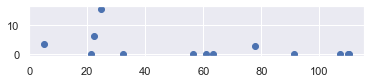
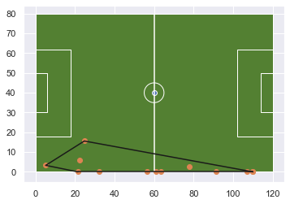
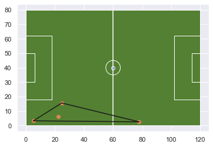
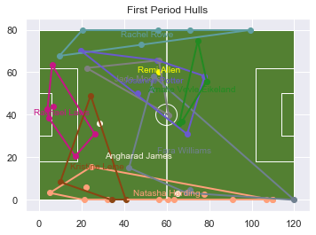
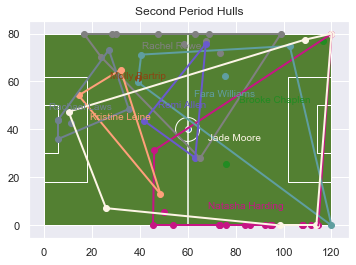
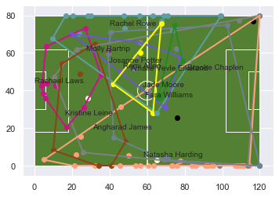
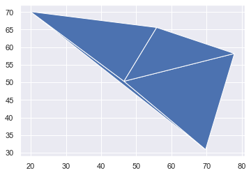
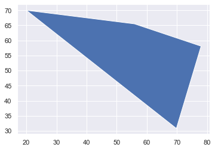
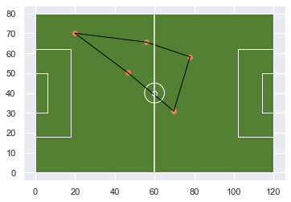
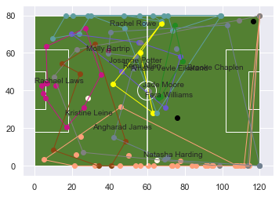

# Possessions (DRAFT)

Admittedly, most of this is really just me trying to understand how StatsBomb is providing possession information. I looked at this in my own way earlier by using time and the preceeding events to understand possession. Here I look at the possession field provided by StatsBomb. This is predetermined switches in possession in a numeric order (integer). This makes it easy to do some quick analysis on team's possessions, but there are still different ways to look at it.

All in in all this leads up to creating some convex hulls. Easily done with ConvexHull from scipy.spatial.

Sumpter's *Soccermatics* uses some hulls in chapter 7 The Tactical Map. In particular in the Juventus Hull subsection. "I first looked at the points in the match where possession switched from Real Madrid to Juventus." Here we have two different possession switches, where a team gains possession, and where a team looses possession.

Convex hulls are also quite common in Geography and Geographic Information Systems. They are a subset of minimum bounding geometry. For example, you could also create the minimum bounding rectangle (just the min x and y to the max x and y of all the points). A convex hull is the minimum area around the points, but doesn't really follow the outside edge of the points. A concave hull follows the outside boundary of the points. I'm not sure which would be better reflective of the space that a player would occupy. In either case you need a minimum of 3 points to create a hull.


```python
#processing json
import json

#base libraries for analysis
from ssalib import SpatialSoccer

#handling time
from dateutil.parser import parse
from datetime import datetime
from datetime import timedelta
#dataframes and plotting
import geopandas as gpd
from shapely.geometry.point import Point
from shapely.geometry import LineString
from shapely.geometry import Polygon
import matplotlib.pyplot as plt
import numpy as np
import seaborn as sns
import pandas as pd

sns.set()
%matplotlib inline
```

I'll use the same match of Reading vs West Ham. I'll focus only on Reading WFC for this document.


```python
ssa = SpatialSoccer()
pth_to_matches = "open-data-master/data/matches/37/42.json"
gdf = ssa.load_single_match(pth_to_matches)
pitchgdf = SpatialSoccer.build_polygon_pitch_statsbomb()
pitchgdf.plot(facecolor = SpatialSoccer.GREEN_PITCH_COLOR,edgecolor=SpatialSoccer.WHITE_LINE_COLOR);
passes = gdf.loc[(gdf['event_type']=='Pass') & (gdf['team_name']=='Reading WFC')].copy()
passes.head()
```


<div>
<style scoped>
    .dataframe tbody tr th:only-of-type {
        vertical-align: middle;
    }

    .dataframe tbody tr th {
        vertical-align: top;
    }

    .dataframe thead th {
        text-align: right;
    }
</style>
<table border="1" class="dataframe">
  <thead>
    <tr style="text-align: right;">
      <th></th>
      <th>id</th>
      <th>index</th>
      <th>period</th>
      <th>timestamp</th>
      <th>minute</th>
      <th>second</th>
      <th>type</th>
      <th>possession</th>
      <th>possession_team</th>
      <th>play_pattern</th>
      <th>...</th>
      <th>block</th>
      <th>miscontrol</th>
      <th>off_camera</th>
      <th>event_time</th>
      <th>goal</th>
      <th>event_type</th>
      <th>x_coord</th>
      <th>y_coord</th>
      <th>team_name</th>
      <th>geometry</th>
    </tr>
  </thead>
  <tbody>
    <tr>
      <th>4</th>
      <td>6e2b3a1f-90ad-4b88-b68a-7a50fd0eae84</td>
      <td>5</td>
      <td>1</td>
      <td>00:00:00.046</td>
      <td>0</td>
      <td>0</td>
      <td>{'id': 30, 'name': 'Pass'}</td>
      <td>2</td>
      <td>{'id': 974, 'name': 'Reading WFC'}</td>
      <td>{'id': 9, 'name': 'From Kick Off'}</td>
      <td>...</td>
      <td>NaN</td>
      <td>NaN</td>
      <td>NaN</td>
      <td>2020-02-12 20:30:00.046000128</td>
      <td>0</td>
      <td>Pass</td>
      <td>61</td>
      <td>39.9</td>
      <td>Reading WFC</td>
      <td>POINT (61.00000 39.90000)</td>
    </tr>
    <tr>
      <th>7</th>
      <td>ecd37567-9854-40b6-95b5-df52d1ae24a6</td>
      <td>8</td>
      <td>1</td>
      <td>00:00:00.897</td>
      <td>0</td>
      <td>0</td>
      <td>{'id': 30, 'name': 'Pass'}</td>
      <td>2</td>
      <td>{'id': 974, 'name': 'Reading WFC'}</td>
      <td>{'id': 9, 'name': 'From Kick Off'}</td>
      <td>...</td>
      <td>NaN</td>
      <td>NaN</td>
      <td>NaN</td>
      <td>2020-02-12 20:30:00.896999936</td>
      <td>0</td>
      <td>Pass</td>
      <td>54.8</td>
      <td>39.5</td>
      <td>Reading WFC</td>
      <td>POINT (54.80000 39.50000)</td>
    </tr>
    <tr>
      <th>24</th>
      <td>bf181399-ca57-40d8-96a6-8d45251c33b1</td>
      <td>25</td>
      <td>1</td>
      <td>00:00:13.385</td>
      <td>0</td>
      <td>13</td>
      <td>{'id': 30, 'name': 'Pass'}</td>
      <td>2</td>
      <td>{'id': 974, 'name': 'Reading WFC'}</td>
      <td>{'id': 9, 'name': 'From Kick Off'}</td>
      <td>...</td>
      <td>NaN</td>
      <td>NaN</td>
      <td>NaN</td>
      <td>2020-02-12 20:30:13.384999936</td>
      <td>0</td>
      <td>Pass</td>
      <td>77.4</td>
      <td>5.9</td>
      <td>Reading WFC</td>
      <td>POINT (77.40000 5.90000)</td>
    </tr>
    <tr>
      <th>39</th>
      <td>552984bd-e414-4b9a-b9d9-b982168854bb</td>
      <td>40</td>
      <td>1</td>
      <td>00:01:04.448</td>
      <td>1</td>
      <td>4</td>
      <td>{'id': 30, 'name': 'Pass'}</td>
      <td>4</td>
      <td>{'id': 972, 'name': 'West Ham United LFC'}</td>
      <td>{'id': 4, 'name': 'From Throw In'}</td>
      <td>...</td>
      <td>NaN</td>
      <td>NaN</td>
      <td>NaN</td>
      <td>2020-02-12 20:31:04.448000000</td>
      <td>0</td>
      <td>Pass</td>
      <td>68.4</td>
      <td>49.4</td>
      <td>Reading WFC</td>
      <td>POINT (68.40000 49.40000)</td>
    </tr>
    <tr>
      <th>64</th>
      <td>93a79db7-c61a-4c93-94de-5a3dbed52bb7</td>
      <td>65</td>
      <td>1</td>
      <td>00:02:17.194</td>
      <td>2</td>
      <td>17</td>
      <td>{'id': 30, 'name': 'Pass'}</td>
      <td>6</td>
      <td>{'id': 974, 'name': 'Reading WFC'}</td>
      <td>{'id': 1, 'name': 'Regular Play'}</td>
      <td>...</td>
      <td>NaN</td>
      <td>NaN</td>
      <td>NaN</td>
      <td>2020-02-12 20:32:17.193999872</td>
      <td>0</td>
      <td>Pass</td>
      <td>13.2</td>
      <td>42</td>
      <td>Reading WFC</td>
      <td>POINT (13.20000 42.00000)</td>
    </tr>
  </tbody>
</table>
<p>5 rows × 47 columns</p>
</div>


Adding a couple of columns like player name, name of the pattern, and also separating the difference between a possession team, and the team in the field. This was an early experiment that I won't present here. I was curious if the possession team \ team name were different and flagged a change in possession. This doesn't work, because as we will see with possession, a possession may have a team trying to gain possession through pressure, and they are included in the sequence.


```python
gdf['p_team_name'] = gdf['possession_team'].apply(lambda x: x.get('name'))
gdf['diff_name'] = np.where(gdf['p_team_name'] != gdf['team_name'] , 1,0)
gdf['pattern_name'] = gdf['play_pattern'].apply(lambda x: x.get('name'))
def pname(x):
    try:
        return x['name']
    except:
        return None
gdf['player_name'] = gdf['player'].apply(lambda x: pname(x))
```


```python
gdf.loc[gdf['diff_name']==1,['type','possession', 'possession_team', 'play_pattern', 'team','pass','player','related_events']].iloc[20]
```


    type                                  {'id': 17, 'name': 'Pressure'}
    possession                                                         5
    possession_team           {'id': 972, 'name': 'West Ham United LFC'}
    play_pattern                     {'id': 3, 'name': 'From Free Kick'}
    team                              {'id': 974, 'name': 'Reading WFC'}
    pass                                                             NaN
    player                       {'id': 10198, 'name': 'Josanne Potter'}
    related_events     [598d7ec1-ac4b-49de-96ee-de9537790b6f, 7d71562...
    Name: 57, dtype: object


The possession column provides estimation of the sequences of play that lead up to a change of possession. Let's see how this works with the first goal. The goal was flagged in the field goal, and the possession id is 56. If we take two steps back to possession 54, we see that West Ham is in possession of the ball. If you review possession 53 you can see it started because of a foul, hence the play_pattern is a "From Free Kick". The possession started from a free kick.

There is a pass from Flaherty to Galabadaarachchi and carry by Galabadaarachchi. This leads to pressure from Moore and James. Galabadaarachchi attempts to pass to Longhurst and that is incomplete. 

As you can see this information is spread across different fields which makes it complicate to process. Or at least complicated to me as I'm trying to figure what all this information means.


```python
gdf[gdf['goal']==1]
```


<div>
<style scoped>
    .dataframe tbody tr th:only-of-type {
        vertical-align: middle;
    }

    .dataframe tbody tr th {
        vertical-align: top;
    }

    .dataframe thead th {
        text-align: right;
    }
</style>
<table border="1" class="dataframe">
  <thead>
    <tr style="text-align: right;">
      <th></th>
      <th>id</th>
      <th>index</th>
      <th>period</th>
      <th>timestamp</th>
      <th>minute</th>
      <th>second</th>
      <th>type</th>
      <th>possession</th>
      <th>possession_team</th>
      <th>play_pattern</th>
      <th>...</th>
      <th>goal</th>
      <th>event_type</th>
      <th>x_coord</th>
      <th>y_coord</th>
      <th>team_name</th>
      <th>geometry</th>
      <th>p_team_name</th>
      <th>diff_name</th>
      <th>pattern_name</th>
      <th>player_name</th>
    </tr>
  </thead>
  <tbody>
    <tr>
      <th>760</th>
      <td>6979be9f-11b1-493c-9396-8eba1d5452a0</td>
      <td>761</td>
      <td>1</td>
      <td>00:23:02.903</td>
      <td>23</td>
      <td>2</td>
      <td>{'id': 16, 'name': 'Shot'}</td>
      <td>56</td>
      <td>{'id': 974, 'name': 'Reading WFC'}</td>
      <td>{'id': 3, 'name': 'From Free Kick'}</td>
      <td>...</td>
      <td>1</td>
      <td>Shot</td>
      <td>109.3</td>
      <td>37.8</td>
      <td>Reading WFC</td>
      <td>POINT (109.30000 37.80000)</td>
      <td>Reading WFC</td>
      <td>0</td>
      <td>From Free Kick</td>
      <td>Jade Moore</td>
    </tr>
    <tr>
      <th>1968</th>
      <td>9279f054-b4d6-4650-91b3-1a5ff464e02f</td>
      <td>1969</td>
      <td>2</td>
      <td>00:17:29.462</td>
      <td>62</td>
      <td>29</td>
      <td>{'id': 16, 'name': 'Shot'}</td>
      <td>129</td>
      <td>{'id': 974, 'name': 'Reading WFC'}</td>
      <td>{'id': 6, 'name': 'From Counter'}</td>
      <td>...</td>
      <td>1</td>
      <td>Shot</td>
      <td>102.3</td>
      <td>41.8</td>
      <td>Reading WFC</td>
      <td>POINT (102.30000 41.80000)</td>
      <td>Reading WFC</td>
      <td>0</td>
      <td>From Counter</td>
      <td>Brooke Chaplen</td>
    </tr>
  </tbody>
</table>
<p>2 rows × 51 columns</p>
</div>


```python
gdf.loc[gdf['possession']==54,['event_type','possession', 'possession_team', 'play_pattern', 'team',
                               'pass','player','related_events','block','miscontrol','pass','ball_receipt',
                              'diff_name']]
```


<div>
<style scoped>
    .dataframe tbody tr th:only-of-type {
        vertical-align: middle;
    }

    .dataframe tbody tr th {
        vertical-align: top;
    }

    .dataframe thead th {
        text-align: right;
    }
</style>
<table border="1" class="dataframe">
  <thead>
    <tr style="text-align: right;">
      <th></th>
      <th>event_type</th>
      <th>possession</th>
      <th>possession_team</th>
      <th>play_pattern</th>
      <th>team</th>
      <th>pass</th>
      <th>player</th>
      <th>related_events</th>
      <th>block</th>
      <th>miscontrol</th>
      <th>pass</th>
      <th>ball_receipt</th>
      <th>diff_name</th>
    </tr>
  </thead>
  <tbody>
    <tr>
      <th>742</th>
      <td>Pass</td>
      <td>54</td>
      <td>{'id': 972, 'name': 'West Ham United LFC'}</td>
      <td>{'id': 3, 'name': 'From Free Kick'}</td>
      <td>{'id': 972, 'name': 'West Ham United LFC'}</td>
      <td>{'recipient': {'id': 31554, 'name': 'Jacinta G...</td>
      <td>{'id': 18151, 'name': 'Gilly Louise Scarlett F...</td>
      <td>[09a533c1-abc7-44d7-aea6-25f1f397737e]</td>
      <td>NaN</td>
      <td>NaN</td>
      <td>{'recipient': {'id': 31554, 'name': 'Jacinta G...</td>
      <td>NaN</td>
      <td>0</td>
    </tr>
    <tr>
      <th>743</th>
      <td>Ball Receipt*</td>
      <td>54</td>
      <td>{'id': 972, 'name': 'West Ham United LFC'}</td>
      <td>{'id': 3, 'name': 'From Free Kick'}</td>
      <td>{'id': 972, 'name': 'West Ham United LFC'}</td>
      <td>NaN</td>
      <td>{'id': 31554, 'name': 'Jacinta Galabadaarachchi'}</td>
      <td>[395f512f-cdcf-47e8-a379-7b2aa77ea6f1]</td>
      <td>NaN</td>
      <td>NaN</td>
      <td>NaN</td>
      <td>NaN</td>
      <td>0</td>
    </tr>
    <tr>
      <th>744</th>
      <td>Carry</td>
      <td>54</td>
      <td>{'id': 972, 'name': 'West Ham United LFC'}</td>
      <td>{'id': 3, 'name': 'From Free Kick'}</td>
      <td>{'id': 972, 'name': 'West Ham United LFC'}</td>
      <td>NaN</td>
      <td>{'id': 31554, 'name': 'Jacinta Galabadaarachchi'}</td>
      <td>[09a533c1-abc7-44d7-aea6-25f1f397737e, 29e8fa9...</td>
      <td>NaN</td>
      <td>NaN</td>
      <td>NaN</td>
      <td>NaN</td>
      <td>0</td>
    </tr>
    <tr>
      <th>745</th>
      <td>Pressure</td>
      <td>54</td>
      <td>{'id': 972, 'name': 'West Ham United LFC'}</td>
      <td>{'id': 3, 'name': 'From Free Kick'}</td>
      <td>{'id': 974, 'name': 'Reading WFC'}</td>
      <td>NaN</td>
      <td>{'id': 15577, 'name': 'Angharad James'}</td>
      <td>[5fd67303-81a4-4ab9-8274-e9b6c6aca090]</td>
      <td>NaN</td>
      <td>NaN</td>
      <td>NaN</td>
      <td>NaN</td>
      <td>1</td>
    </tr>
    <tr>
      <th>746</th>
      <td>Pressure</td>
      <td>54</td>
      <td>{'id': 972, 'name': 'West Ham United LFC'}</td>
      <td>{'id': 3, 'name': 'From Free Kick'}</td>
      <td>{'id': 974, 'name': 'Reading WFC'}</td>
      <td>NaN</td>
      <td>{'id': 10190, 'name': 'Jade Moore'}</td>
      <td>[f3adc8bc-c16f-4d6f-9ae6-d79739080b53]</td>
      <td>NaN</td>
      <td>NaN</td>
      <td>NaN</td>
      <td>NaN</td>
      <td>1</td>
    </tr>
    <tr>
      <th>747</th>
      <td>Pass</td>
      <td>54</td>
      <td>{'id': 972, 'name': 'West Ham United LFC'}</td>
      <td>{'id': 3, 'name': 'From Free Kick'}</td>
      <td>{'id': 972, 'name': 'West Ham United LFC'}</td>
      <td>{'recipient': {'id': 18147, 'name': 'Kate Long...</td>
      <td>{'id': 31554, 'name': 'Jacinta Galabadaarachchi'}</td>
      <td>[54917bfa-37a4-483b-b418-a571269faa0e, 64a5b5c...</td>
      <td>NaN</td>
      <td>NaN</td>
      <td>{'recipient': {'id': 18147, 'name': 'Kate Long...</td>
      <td>NaN</td>
      <td>0</td>
    </tr>
    <tr>
      <th>748</th>
      <td>Ball Receipt*</td>
      <td>54</td>
      <td>{'id': 972, 'name': 'West Ham United LFC'}</td>
      <td>{'id': 3, 'name': 'From Free Kick'}</td>
      <td>{'id': 972, 'name': 'West Ham United LFC'}</td>
      <td>NaN</td>
      <td>{'id': 18147, 'name': 'Kate Longhurst'}</td>
      <td>[f3adc8bc-c16f-4d6f-9ae6-d79739080b53]</td>
      <td>NaN</td>
      <td>NaN</td>
      <td>NaN</td>
      <td>{'outcome': {'id': 9, 'name': 'Incomplete'}}</td>
      <td>0</td>
    </tr>
  </tbody>
</table>
</div>


The play pattern here is Regular Play since the posession began from a steal or an incomplete pass. It's not clear if it was just flubbed. Eikeland recovers the ball and carries. This result sin a Foul Committed by Longhurst. That makes sense given she was probably the closest as the intended recepient above.


```python
gdf.loc[gdf['possession']==55,['type','possession', 'possession_team', 'play_pattern', 'team','pass','player','related_events']]
```


<div>
<style scoped>
    .dataframe tbody tr th:only-of-type {
        vertical-align: middle;
    }

    .dataframe tbody tr th {
        vertical-align: top;
    }

    .dataframe thead th {
        text-align: right;
    }
</style>
<table border="1" class="dataframe">
  <thead>
    <tr style="text-align: right;">
      <th></th>
      <th>type</th>
      <th>possession</th>
      <th>possession_team</th>
      <th>play_pattern</th>
      <th>team</th>
      <th>pass</th>
      <th>player</th>
      <th>related_events</th>
    </tr>
  </thead>
  <tbody>
    <tr>
      <th>749</th>
      <td>{'id': 2, 'name': 'Ball Recovery'}</td>
      <td>55</td>
      <td>{'id': 974, 'name': 'Reading WFC'}</td>
      <td>{'id': 1, 'name': 'Regular Play'}</td>
      <td>{'id': 974, 'name': 'Reading WFC'}</td>
      <td>NaN</td>
      <td>{'id': 26570, 'name': 'Amalie Vevle Eikeland'}</td>
      <td>[f3adc8bc-c16f-4d6f-9ae6-d79739080b53]</td>
    </tr>
    <tr>
      <th>750</th>
      <td>{'id': 43, 'name': 'Carry'}</td>
      <td>55</td>
      <td>{'id': 974, 'name': 'Reading WFC'}</td>
      <td>{'id': 1, 'name': 'Regular Play'}</td>
      <td>{'id': 974, 'name': 'Reading WFC'}</td>
      <td>NaN</td>
      <td>{'id': 26570, 'name': 'Amalie Vevle Eikeland'}</td>
      <td>[a2967230-85c2-432f-82b2-636d8ad654db, b3952bd...</td>
    </tr>
    <tr>
      <th>751</th>
      <td>{'id': 22, 'name': 'Foul Committed'}</td>
      <td>55</td>
      <td>{'id': 974, 'name': 'Reading WFC'}</td>
      <td>{'id': 1, 'name': 'Regular Play'}</td>
      <td>{'id': 972, 'name': 'West Ham United LFC'}</td>
      <td>NaN</td>
      <td>{'id': 18147, 'name': 'Kate Longhurst'}</td>
      <td>[66a5e128-1b89-4973-a798-8b203d7c22bc, c2e0066...</td>
    </tr>
    <tr>
      <th>752</th>
      <td>{'id': 21, 'name': 'Foul Won'}</td>
      <td>55</td>
      <td>{'id': 974, 'name': 'Reading WFC'}</td>
      <td>{'id': 1, 'name': 'Regular Play'}</td>
      <td>{'id': 974, 'name': 'Reading WFC'}</td>
      <td>NaN</td>
      <td>{'id': 26570, 'name': 'Amalie Vevle Eikeland'}</td>
      <td>[b3952bdf-d13d-47dd-adf4-100baa0c2188]</td>
    </tr>
  </tbody>
</table>
</div>


The play pattern is back to being a Free Kick. Josanne Potter took the free kick it looks like, and passed to Williams. Williams carried then passed to Eikeland, Eikeland to Moore. Moore shoots, scores. Longhurst receives a yellow card for bad behaviour.


```python
gdf.loc[gdf['possession']==56,['type','possession', 'possession_team', 'play_pattern', 'team','pass','player','related_events']]
```


<div>
<style scoped>
    .dataframe tbody tr th:only-of-type {
        vertical-align: middle;
    }

    .dataframe tbody tr th {
        vertical-align: top;
    }

    .dataframe thead th {
        text-align: right;
    }
</style>
<table border="1" class="dataframe">
  <thead>
    <tr style="text-align: right;">
      <th></th>
      <th>type</th>
      <th>possession</th>
      <th>possession_team</th>
      <th>play_pattern</th>
      <th>team</th>
      <th>pass</th>
      <th>player</th>
      <th>related_events</th>
    </tr>
  </thead>
  <tbody>
    <tr>
      <th>753</th>
      <td>{'id': 30, 'name': 'Pass'}</td>
      <td>56</td>
      <td>{'id': 974, 'name': 'Reading WFC'}</td>
      <td>{'id': 3, 'name': 'From Free Kick'}</td>
      <td>{'id': 974, 'name': 'Reading WFC'}</td>
      <td>{'recipient': {'id': 10251, 'name': 'Fara Will...</td>
      <td>{'id': 10198, 'name': 'Josanne Potter'}</td>
      <td>[dab13192-5c22-45f1-8ccb-9104778be052]</td>
    </tr>
    <tr>
      <th>754</th>
      <td>{'id': 42, 'name': 'Ball Receipt*'}</td>
      <td>56</td>
      <td>{'id': 974, 'name': 'Reading WFC'}</td>
      <td>{'id': 3, 'name': 'From Free Kick'}</td>
      <td>{'id': 974, 'name': 'Reading WFC'}</td>
      <td>NaN</td>
      <td>{'id': 10251, 'name': 'Fara Williams'}</td>
      <td>[d67ab41c-13e9-4ffb-a7c3-0e5d5ed3490f]</td>
    </tr>
    <tr>
      <th>755</th>
      <td>{'id': 43, 'name': 'Carry'}</td>
      <td>56</td>
      <td>{'id': 974, 'name': 'Reading WFC'}</td>
      <td>{'id': 3, 'name': 'From Free Kick'}</td>
      <td>{'id': 974, 'name': 'Reading WFC'}</td>
      <td>NaN</td>
      <td>{'id': 10251, 'name': 'Fara Williams'}</td>
      <td>[bc7e47c0-8e81-4d81-8c69-83c744467a07, dab1319...</td>
    </tr>
    <tr>
      <th>756</th>
      <td>{'id': 30, 'name': 'Pass'}</td>
      <td>56</td>
      <td>{'id': 974, 'name': 'Reading WFC'}</td>
      <td>{'id': 3, 'name': 'From Free Kick'}</td>
      <td>{'id': 974, 'name': 'Reading WFC'}</td>
      <td>{'recipient': {'id': 26570, 'name': 'Amalie Ve...</td>
      <td>{'id': 10251, 'name': 'Fara Williams'}</td>
      <td>[1b9b4868-ab97-4845-aa3d-2d51bc72cb21]</td>
    </tr>
    <tr>
      <th>757</th>
      <td>{'id': 42, 'name': 'Ball Receipt*'}</td>
      <td>56</td>
      <td>{'id': 974, 'name': 'Reading WFC'}</td>
      <td>{'id': 3, 'name': 'From Free Kick'}</td>
      <td>{'id': 974, 'name': 'Reading WFC'}</td>
      <td>NaN</td>
      <td>{'id': 26570, 'name': 'Amalie Vevle Eikeland'}</td>
      <td>[bc7e47c0-8e81-4d81-8c69-83c744467a07]</td>
    </tr>
    <tr>
      <th>758</th>
      <td>{'id': 30, 'name': 'Pass'}</td>
      <td>56</td>
      <td>{'id': 974, 'name': 'Reading WFC'}</td>
      <td>{'id': 3, 'name': 'From Free Kick'}</td>
      <td>{'id': 974, 'name': 'Reading WFC'}</td>
      <td>{'recipient': {'id': 10190, 'name': 'Jade Moor...</td>
      <td>{'id': 26570, 'name': 'Amalie Vevle Eikeland'}</td>
      <td>[b84e5347-df50-41c7-88c5-4156bbb78a5e]</td>
    </tr>
    <tr>
      <th>759</th>
      <td>{'id': 42, 'name': 'Ball Receipt*'}</td>
      <td>56</td>
      <td>{'id': 974, 'name': 'Reading WFC'}</td>
      <td>{'id': 3, 'name': 'From Free Kick'}</td>
      <td>{'id': 974, 'name': 'Reading WFC'}</td>
      <td>NaN</td>
      <td>{'id': 10190, 'name': 'Jade Moore'}</td>
      <td>[142e8f4b-af92-47a2-b847-c27ab860a2d1]</td>
    </tr>
    <tr>
      <th>760</th>
      <td>{'id': 16, 'name': 'Shot'}</td>
      <td>56</td>
      <td>{'id': 974, 'name': 'Reading WFC'}</td>
      <td>{'id': 3, 'name': 'From Free Kick'}</td>
      <td>{'id': 974, 'name': 'Reading WFC'}</td>
      <td>NaN</td>
      <td>{'id': 10190, 'name': 'Jade Moore'}</td>
      <td>[588fe4e8-a4d1-4d79-8811-af1237cc8d91]</td>
    </tr>
    <tr>
      <th>761</th>
      <td>{'id': 23, 'name': 'Goal Keeper'}</td>
      <td>56</td>
      <td>{'id': 974, 'name': 'Reading WFC'}</td>
      <td>{'id': 3, 'name': 'From Free Kick'}</td>
      <td>{'id': 972, 'name': 'West Ham United LFC'}</td>
      <td>NaN</td>
      <td>{'id': 22027, 'name': 'Anne Moorhouse'}</td>
      <td>[6979be9f-11b1-493c-9396-8eba1d5452a0]</td>
    </tr>
    <tr>
      <th>762</th>
      <td>{'id': 24, 'name': 'Bad Behaviour'}</td>
      <td>56</td>
      <td>{'id': 974, 'name': 'Reading WFC'}</td>
      <td>{'id': 3, 'name': 'From Free Kick'}</td>
      <td>{'id': 972, 'name': 'West Ham United LFC'}</td>
      <td>NaN</td>
      <td>{'id': 18147, 'name': 'Kate Longhurst'}</td>
      <td>NaN</td>
    </tr>
  </tbody>
</table>
</div>


The last possession by a team can be grabbed by using groupby and ```tail(1)```, or the first possession by ```head(1)```


```python
gdf.groupby('possession').tail(1)
```


<div>
<style scoped>
    .dataframe tbody tr th:only-of-type {
        vertical-align: middle;
    }

    .dataframe tbody tr th {
        vertical-align: top;
    }

    .dataframe thead th {
        text-align: right;
    }
</style>
<table border="1" class="dataframe">
  <thead>
    <tr style="text-align: right;">
      <th></th>
      <th>id</th>
      <th>index</th>
      <th>period</th>
      <th>timestamp</th>
      <th>minute</th>
      <th>second</th>
      <th>type</th>
      <th>possession</th>
      <th>possession_team</th>
      <th>play_pattern</th>
      <th>...</th>
      <th>goal</th>
      <th>event_type</th>
      <th>x_coord</th>
      <th>y_coord</th>
      <th>team_name</th>
      <th>geometry</th>
      <th>p_team_name</th>
      <th>diff_name</th>
      <th>pattern_name</th>
      <th>player_name</th>
    </tr>
  </thead>
  <tbody>
    <tr>
      <th>3</th>
      <td>914bb7c5-6a9c-460b-b939-5706a242ef96</td>
      <td>4</td>
      <td>1</td>
      <td>00:00:00.000</td>
      <td>0</td>
      <td>0</td>
      <td>{'id': 18, 'name': 'Half Start'}</td>
      <td>1</td>
      <td>{'id': 974, 'name': 'Reading WFC'}</td>
      <td>{'id': 1, 'name': 'Regular Play'}</td>
      <td>...</td>
      <td>0</td>
      <td>Half Start</td>
      <td>None</td>
      <td>None</td>
      <td>Reading WFC</td>
      <td>None</td>
      <td>Reading WFC</td>
      <td>0</td>
      <td>Regular Play</td>
      <td>None</td>
    </tr>
    <tr>
      <th>25</th>
      <td>b3760796-0c05-475b-8ceb-ed3a9ee20750</td>
      <td>26</td>
      <td>1</td>
      <td>00:00:15.562</td>
      <td>0</td>
      <td>15</td>
      <td>{'id': 42, 'name': 'Ball Receipt*'}</td>
      <td>2</td>
      <td>{'id': 974, 'name': 'Reading WFC'}</td>
      <td>{'id': 9, 'name': 'From Kick Off'}</td>
      <td>...</td>
      <td>0</td>
      <td>Ball Receipt*</td>
      <td>108.1</td>
      <td>10</td>
      <td>Reading WFC</td>
      <td>POINT (108.10000 10.00000)</td>
      <td>Reading WFC</td>
      <td>0</td>
      <td>From Kick Off</td>
      <td>Natasha Harding</td>
    </tr>
    <tr>
      <th>31</th>
      <td>2ee18e5d-e1be-4516-822d-c3144448b27d</td>
      <td>32</td>
      <td>1</td>
      <td>00:00:33.215</td>
      <td>0</td>
      <td>33</td>
      <td>{'id': 10, 'name': 'Interception'}</td>
      <td>3</td>
      <td>{'id': 972, 'name': 'West Ham United LFC'}</td>
      <td>{'id': 3, 'name': 'From Free Kick'}</td>
      <td>...</td>
      <td>0</td>
      <td>Interception</td>
      <td>82.2</td>
      <td>65.3</td>
      <td>Reading WFC</td>
      <td>POINT (82.20000 65.30000)</td>
      <td>West Ham United LFC</td>
      <td>1</td>
      <td>From Free Kick</td>
      <td>Remi Allen</td>
    </tr>
    <tr>
      <th>45</th>
      <td>97e3d414-7556-45e5-afe1-bcc66bb0874a</td>
      <td>46</td>
      <td>1</td>
      <td>00:01:06.929</td>
      <td>1</td>
      <td>6</td>
      <td>{'id': 21, 'name': 'Foul Won'}</td>
      <td>4</td>
      <td>{'id': 972, 'name': 'West Ham United LFC'}</td>
      <td>{'id': 4, 'name': 'From Throw In'}</td>
      <td>...</td>
      <td>0</td>
      <td>Foul Won</td>
      <td>57.6</td>
      <td>25.1</td>
      <td>West Ham United LFC</td>
      <td>POINT (57.60000 25.10000)</td>
      <td>West Ham United LFC</td>
      <td>0</td>
      <td>From Throw In</td>
      <td>Martha Thomas</td>
    </tr>
    <tr>
      <th>61</th>
      <td>16bfe491-73a4-4f9f-a7ae-40889f6957a5</td>
      <td>62</td>
      <td>1</td>
      <td>00:02:04.001</td>
      <td>2</td>
      <td>4</td>
      <td>{'id': 42, 'name': 'Ball Receipt*'}</td>
      <td>5</td>
      <td>{'id': 972, 'name': 'West Ham United LFC'}</td>
      <td>{'id': 3, 'name': 'From Free Kick'}</td>
      <td>...</td>
      <td>0</td>
      <td>Ball Receipt*</td>
      <td>111.4</td>
      <td>40.1</td>
      <td>West Ham United LFC</td>
      <td>POINT (111.40000 40.10000)</td>
      <td>West Ham United LFC</td>
      <td>0</td>
      <td>From Free Kick</td>
      <td>Martha Thomas</td>
    </tr>
    <tr>
      <th>...</th>
      <td>...</td>
      <td>...</td>
      <td>...</td>
      <td>...</td>
      <td>...</td>
      <td>...</td>
      <td>...</td>
      <td>...</td>
      <td>...</td>
      <td>...</td>
      <td>...</td>
      <td>...</td>
      <td>...</td>
      <td>...</td>
      <td>...</td>
      <td>...</td>
      <td>...</td>
      <td>...</td>
      <td>...</td>
      <td>...</td>
      <td>...</td>
    </tr>
    <tr>
      <th>2802</th>
      <td>817fa887-dea7-4ef3-a215-0e3d461f8117</td>
      <td>2803</td>
      <td>2</td>
      <td>00:48:55.226</td>
      <td>93</td>
      <td>55</td>
      <td>{'id': 38, 'name': 'Miscontrol'}</td>
      <td>193</td>
      <td>{'id': 972, 'name': 'West Ham United LFC'}</td>
      <td>{'id': 4, 'name': 'From Throw In'}</td>
      <td>...</td>
      <td>0</td>
      <td>Miscontrol</td>
      <td>19.3</td>
      <td>71.1</td>
      <td>West Ham United LFC</td>
      <td>POINT (19.30000 71.10000)</td>
      <td>West Ham United LFC</td>
      <td>0</td>
      <td>From Throw In</td>
      <td>Kate Longhurst</td>
    </tr>
    <tr>
      <th>2812</th>
      <td>5952c747-2a69-4585-a61d-7d8155ed569e</td>
      <td>2813</td>
      <td>2</td>
      <td>00:49:29.316</td>
      <td>94</td>
      <td>29</td>
      <td>{'id': 4, 'name': 'Duel'}</td>
      <td>194</td>
      <td>{'id': 974, 'name': 'Reading WFC'}</td>
      <td>{'id': 4, 'name': 'From Throw In'}</td>
      <td>...</td>
      <td>0</td>
      <td>Duel</td>
      <td>4.9</td>
      <td>75.1</td>
      <td>West Ham United LFC</td>
      <td>POINT (4.90000 75.10000)</td>
      <td>Reading WFC</td>
      <td>1</td>
      <td>From Throw In</td>
      <td>Laura Vetterlein</td>
    </tr>
    <tr>
      <th>2821</th>
      <td>009b8c21-c18b-465f-8bb4-4501ac4ca99e</td>
      <td>2822</td>
      <td>2</td>
      <td>00:49:47.930</td>
      <td>94</td>
      <td>47</td>
      <td>{'id': 6, 'name': 'Block'}</td>
      <td>195</td>
      <td>{'id': 974, 'name': 'Reading WFC'}</td>
      <td>{'id': 4, 'name': 'From Throw In'}</td>
      <td>...</td>
      <td>0</td>
      <td>Block</td>
      <td>7.8</td>
      <td>75.8</td>
      <td>West Ham United LFC</td>
      <td>POINT (7.80000 75.80000)</td>
      <td>Reading WFC</td>
      <td>1</td>
      <td>From Throw In</td>
      <td>Alisha Lehmann</td>
    </tr>
    <tr>
      <th>2827</th>
      <td>07bd5150-607a-405d-bc76-ac3522a706c7</td>
      <td>2828</td>
      <td>2</td>
      <td>00:49:59.587</td>
      <td>94</td>
      <td>59</td>
      <td>{'id': 4, 'name': 'Duel'}</td>
      <td>196</td>
      <td>{'id': 974, 'name': 'Reading WFC'}</td>
      <td>{'id': 4, 'name': 'From Throw In'}</td>
      <td>...</td>
      <td>0</td>
      <td>Duel</td>
      <td>6.4</td>
      <td>75.1</td>
      <td>West Ham United LFC</td>
      <td>POINT (6.40000 75.10000)</td>
      <td>Reading WFC</td>
      <td>1</td>
      <td>From Throw In</td>
      <td>Alisha Lehmann</td>
    </tr>
    <tr>
      <th>2830</th>
      <td>def7627b-e139-4868-9b02-f2daa8a1666a</td>
      <td>2831</td>
      <td>2</td>
      <td>00:50:01.994</td>
      <td>95</td>
      <td>1</td>
      <td>{'id': 34, 'name': 'Half End'}</td>
      <td>197</td>
      <td>{'id': 974, 'name': 'Reading WFC'}</td>
      <td>{'id': 4, 'name': 'From Throw In'}</td>
      <td>...</td>
      <td>0</td>
      <td>Half End</td>
      <td>None</td>
      <td>None</td>
      <td>Reading WFC</td>
      <td>None</td>
      <td>Reading WFC</td>
      <td>0</td>
      <td>From Throw In</td>
      <td>None</td>
    </tr>
  </tbody>
</table>
<p>197 rows × 51 columns</p>
</div>


```python
gdf.groupby('possession').head(1)
```


<div>
<style scoped>
    .dataframe tbody tr th:only-of-type {
        vertical-align: middle;
    }

    .dataframe tbody tr th {
        vertical-align: top;
    }

    .dataframe thead th {
        text-align: right;
    }
</style>
<table border="1" class="dataframe">
  <thead>
    <tr style="text-align: right;">
      <th></th>
      <th>id</th>
      <th>index</th>
      <th>period</th>
      <th>timestamp</th>
      <th>minute</th>
      <th>second</th>
      <th>type</th>
      <th>possession</th>
      <th>possession_team</th>
      <th>play_pattern</th>
      <th>...</th>
      <th>goal</th>
      <th>event_type</th>
      <th>x_coord</th>
      <th>y_coord</th>
      <th>team_name</th>
      <th>geometry</th>
      <th>p_team_name</th>
      <th>diff_name</th>
      <th>pattern_name</th>
      <th>player_name</th>
    </tr>
  </thead>
  <tbody>
    <tr>
      <th>0</th>
      <td>82a5a5f7-1c9b-4a02-901c-365632336087</td>
      <td>1</td>
      <td>1</td>
      <td>00:00:00.000</td>
      <td>0</td>
      <td>0</td>
      <td>{'id': 35, 'name': 'Starting XI'}</td>
      <td>1</td>
      <td>{'id': 974, 'name': 'Reading WFC'}</td>
      <td>{'id': 1, 'name': 'Regular Play'}</td>
      <td>...</td>
      <td>0</td>
      <td>Starting XI</td>
      <td>None</td>
      <td>None</td>
      <td>Reading WFC</td>
      <td>None</td>
      <td>Reading WFC</td>
      <td>0</td>
      <td>Regular Play</td>
      <td>None</td>
    </tr>
    <tr>
      <th>4</th>
      <td>6e2b3a1f-90ad-4b88-b68a-7a50fd0eae84</td>
      <td>5</td>
      <td>1</td>
      <td>00:00:00.046</td>
      <td>0</td>
      <td>0</td>
      <td>{'id': 30, 'name': 'Pass'}</td>
      <td>2</td>
      <td>{'id': 974, 'name': 'Reading WFC'}</td>
      <td>{'id': 9, 'name': 'From Kick Off'}</td>
      <td>...</td>
      <td>0</td>
      <td>Pass</td>
      <td>61</td>
      <td>39.9</td>
      <td>Reading WFC</td>
      <td>POINT (61.00000 39.90000)</td>
      <td>Reading WFC</td>
      <td>0</td>
      <td>From Kick Off</td>
      <td>Jade Moore</td>
    </tr>
    <tr>
      <th>26</th>
      <td>fa0db439-8d09-48a9-8f93-4a2b86db3933</td>
      <td>27</td>
      <td>1</td>
      <td>00:00:27.429</td>
      <td>0</td>
      <td>27</td>
      <td>{'id': 30, 'name': 'Pass'}</td>
      <td>3</td>
      <td>{'id': 972, 'name': 'West Ham United LFC'}</td>
      <td>{'id': 3, 'name': 'From Free Kick'}</td>
      <td>...</td>
      <td>0</td>
      <td>Pass</td>
      <td>17.9</td>
      <td>67.3</td>
      <td>West Ham United LFC</td>
      <td>POINT (17.90000 67.30000)</td>
      <td>West Ham United LFC</td>
      <td>0</td>
      <td>From Free Kick</td>
      <td>Gilly Louise Scarlett Flaherty</td>
    </tr>
    <tr>
      <th>32</th>
      <td>9ae74075-3daf-4e34-854d-a48bcea23c5b</td>
      <td>33</td>
      <td>1</td>
      <td>00:00:57.242</td>
      <td>0</td>
      <td>57</td>
      <td>{'id': 30, 'name': 'Pass'}</td>
      <td>4</td>
      <td>{'id': 972, 'name': 'West Ham United LFC'}</td>
      <td>{'id': 4, 'name': 'From Throw In'}</td>
      <td>...</td>
      <td>0</td>
      <td>Pass</td>
      <td>47.1</td>
      <td>0</td>
      <td>West Ham United LFC</td>
      <td>POINT (47.10000 0.00000)</td>
      <td>West Ham United LFC</td>
      <td>0</td>
      <td>From Throw In</td>
      <td>Cecilie Redisch Kvamme</td>
    </tr>
    <tr>
      <th>46</th>
      <td>25da5c0e-8b67-43d3-ac2d-805c1359f95e</td>
      <td>47</td>
      <td>1</td>
      <td>00:01:53.821</td>
      <td>1</td>
      <td>53</td>
      <td>{'id': 30, 'name': 'Pass'}</td>
      <td>5</td>
      <td>{'id': 972, 'name': 'West Ham United LFC'}</td>
      <td>{'id': 3, 'name': 'From Free Kick'}</td>
      <td>...</td>
      <td>0</td>
      <td>Pass</td>
      <td>54.3</td>
      <td>24.1</td>
      <td>West Ham United LFC</td>
      <td>POINT (54.30000 24.10000)</td>
      <td>West Ham United LFC</td>
      <td>0</td>
      <td>From Free Kick</td>
      <td>Tessel Middag</td>
    </tr>
    <tr>
      <th>...</th>
      <td>...</td>
      <td>...</td>
      <td>...</td>
      <td>...</td>
      <td>...</td>
      <td>...</td>
      <td>...</td>
      <td>...</td>
      <td>...</td>
      <td>...</td>
      <td>...</td>
      <td>...</td>
      <td>...</td>
      <td>...</td>
      <td>...</td>
      <td>...</td>
      <td>...</td>
      <td>...</td>
      <td>...</td>
      <td>...</td>
      <td>...</td>
    </tr>
    <tr>
      <th>2798</th>
      <td>c6b0cccb-bd20-4485-96b8-7faf7e493598</td>
      <td>2799</td>
      <td>2</td>
      <td>00:48:54.322</td>
      <td>93</td>
      <td>54</td>
      <td>{'id': 30, 'name': 'Pass'}</td>
      <td>193</td>
      <td>{'id': 972, 'name': 'West Ham United LFC'}</td>
      <td>{'id': 4, 'name': 'From Throw In'}</td>
      <td>...</td>
      <td>0</td>
      <td>Pass</td>
      <td>8</td>
      <td>79.9</td>
      <td>West Ham United LFC</td>
      <td>POINT (8.00000 79.90000)</td>
      <td>West Ham United LFC</td>
      <td>0</td>
      <td>From Throw In</td>
      <td>Laura Vetterlein</td>
    </tr>
    <tr>
      <th>2803</th>
      <td>5d205e19-62e1-4df1-8099-d49872d9c3f0</td>
      <td>2804</td>
      <td>2</td>
      <td>00:49:15.047</td>
      <td>94</td>
      <td>15</td>
      <td>{'id': 30, 'name': 'Pass'}</td>
      <td>194</td>
      <td>{'id': 974, 'name': 'Reading WFC'}</td>
      <td>{'id': 4, 'name': 'From Throw In'}</td>
      <td>...</td>
      <td>0</td>
      <td>Pass</td>
      <td>108.1</td>
      <td>0</td>
      <td>Reading WFC</td>
      <td>POINT (108.10000 0.00000)</td>
      <td>Reading WFC</td>
      <td>0</td>
      <td>From Throw In</td>
      <td>Natasha Harding</td>
    </tr>
    <tr>
      <th>2813</th>
      <td>ca17d251-9872-4729-ae4e-b9052b564581</td>
      <td>2814</td>
      <td>2</td>
      <td>00:49:44.158</td>
      <td>94</td>
      <td>44</td>
      <td>{'id': 30, 'name': 'Pass'}</td>
      <td>195</td>
      <td>{'id': 974, 'name': 'Reading WFC'}</td>
      <td>{'id': 4, 'name': 'From Throw In'}</td>
      <td>...</td>
      <td>0</td>
      <td>Pass</td>
      <td>114.5</td>
      <td>0</td>
      <td>Reading WFC</td>
      <td>POINT (114.50000 0.00000)</td>
      <td>Reading WFC</td>
      <td>0</td>
      <td>From Throw In</td>
      <td>Natasha Harding</td>
    </tr>
    <tr>
      <th>2822</th>
      <td>e8ff2586-c291-4ac7-a2a2-905b2c427765</td>
      <td>2823</td>
      <td>2</td>
      <td>00:49:55.996</td>
      <td>94</td>
      <td>55</td>
      <td>{'id': 30, 'name': 'Pass'}</td>
      <td>196</td>
      <td>{'id': 974, 'name': 'Reading WFC'}</td>
      <td>{'id': 4, 'name': 'From Throw In'}</td>
      <td>...</td>
      <td>0</td>
      <td>Pass</td>
      <td>111.6</td>
      <td>0</td>
      <td>Reading WFC</td>
      <td>POINT (111.60000 0.00000)</td>
      <td>Reading WFC</td>
      <td>0</td>
      <td>From Throw In</td>
      <td>Natasha Harding</td>
    </tr>
    <tr>
      <th>2828</th>
      <td>7688305c-0131-452f-b49b-726a96f7b653</td>
      <td>2829</td>
      <td>2</td>
      <td>00:50:01.933</td>
      <td>95</td>
      <td>1</td>
      <td>{'id': 30, 'name': 'Pass'}</td>
      <td>197</td>
      <td>{'id': 974, 'name': 'Reading WFC'}</td>
      <td>{'id': 4, 'name': 'From Throw In'}</td>
      <td>...</td>
      <td>0</td>
      <td>Pass</td>
      <td>113.7</td>
      <td>0</td>
      <td>Reading WFC</td>
      <td>POINT (113.70000 0.00000)</td>
      <td>Reading WFC</td>
      <td>0</td>
      <td>From Throw In</td>
      <td>Jade Moore</td>
    </tr>
  </tbody>
</table>
<p>197 rows × 51 columns</p>
</div>


The first possession spans a number of types of events. Whereas the last possession can have a number of different causes.

The key for the first event of possession is:

- Ball Recovery: "An attempt to recover a loose ball"
- Duel: "A duel is an 50-50 contest between two players of opposing sides in the match."
- Interception: "Preventing an opponent's pass from reaching their teammates by moving to the passing lane/reacting to intercept it."
- Pass: "Ball is passed between teammates."


```python
gdf.groupby('possession').head(1)['event_type'].unique()
```


    array(['Starting XI', 'Pass', 'Ball Recovery', 'Duel', 'Interception',
           'Goal Keeper', 'Referee Ball-Drop'], dtype=object)


```python
gdf.groupby('possession').tail(1)['event_type'].unique()
```


    array(['Half Start', 'Ball Receipt*', 'Interception', 'Foul Won', 'Duel',
           'Dispossessed', 'Clearance', 'Pass', 'Block', 'Miscontrol',
           'Goal Keeper', 'Pressure', 'Bad Behaviour', 'Dribble',
           'Substitution', 'Ball Recovery', 'Injury Stoppage',
           'Foul Committed', 'Offside', 'Half End'], dtype=object)


If the first part of a possession has the event_type as Pass, it seems to relate to something like a free kick, or a throw in. However there are also 'regular play' and 'from counter' play patterns.


```python
first = gdf.groupby('possession').head(1)
first.loc[first['event_type']=='Pass']['pattern_name'].unique()
```


    array(['From Kick Off', 'From Free Kick', 'From Throw In', 'Regular Play',
           'From Corner', 'From Goal Kick', 'From Counter'], dtype=object)


Here are two starting possessions from a 'From Counter' play pattern. These were both passes. From counters according to StatsBomb's documentation are events are from a counter attack.


```python
first.loc[(first['event_type']=='Pass')&(first['pattern_name']=='From Counter'),['type','possession', 'possession_team', 'play_pattern', 'team','pass','player','related_events']]
```


<div>
<style scoped>
    .dataframe tbody tr th:only-of-type {
        vertical-align: middle;
    }

    .dataframe tbody tr th {
        vertical-align: top;
    }

    .dataframe thead th {
        text-align: right;
    }
</style>
<table border="1" class="dataframe">
  <thead>
    <tr style="text-align: right;">
      <th></th>
      <th>type</th>
      <th>possession</th>
      <th>possession_team</th>
      <th>play_pattern</th>
      <th>team</th>
      <th>pass</th>
      <th>player</th>
      <th>related_events</th>
    </tr>
  </thead>
  <tbody>
    <tr>
      <th>1964</th>
      <td>{'id': 30, 'name': 'Pass'}</td>
      <td>129</td>
      <td>{'id': 974, 'name': 'Reading WFC'}</td>
      <td>{'id': 6, 'name': 'From Counter'}</td>
      <td>{'id': 974, 'name': 'Reading WFC'}</td>
      <td>{'recipient': {'id': 15723, 'name': 'Brooke Ch...</td>
      <td>{'id': 10190, 'name': 'Jade Moore'}</td>
      <td>[77526917-155c-4ebb-ad3d-5c15e8cf0234, a2460c7...</td>
    </tr>
    <tr>
      <th>2425</th>
      <td>{'id': 30, 'name': 'Pass'}</td>
      <td>165</td>
      <td>{'id': 974, 'name': 'Reading WFC'}</td>
      <td>{'id': 6, 'name': 'From Counter'}</td>
      <td>{'id': 974, 'name': 'Reading WFC'}</td>
      <td>{'recipient': {'id': 15723, 'name': 'Brooke Ch...</td>
      <td>{'id': 18149, 'name': 'Remi Allen'}</td>
      <td>[3c1efa7e-ef67-4bf6-93e3-4b7d90aea6f9]</td>
    </tr>
  </tbody>
</table>
</div>


We could chop this up in different ways. Here I'm pullling all the possessions that were Pass, Ball Recovery, Duel, Interception. I could further filter out all the patterns that began from the edges and corners. But this results in two few points.

Then I look specifically at Reading WFC in the first period. Harding had the most beginning posessions, but you can see later that this is actually mostly throw ins.


```python
#possession = first.loc[(first['event_type'].isin(['Pass', 
#                                      'Ball Recovery',
#                                      'Duel',
#                                      'Interception'])) & ~(first['pattern_name'].isin(['From Kick Off', 
#                                                                                                 'From Free Kick', 
#                                                                                                 'From Throw In', 
#                                                                                                 'From Corner', 
#                                                                                                 'From Goal Kick']))]

possession = first.loc[(first['event_type'].isin(['Pass', 
                                      'Ball Recovery',
                                      'Duel',
                                      'Interception']))]

possession[(possession['p_team_name']== 'Reading WFC') & (possession['period']==1)].groupby('player_name')['id'].count()
```


    player_name
    Amalie Vevle Eikeland     4
    Angharad James            2
    Fara Williams             6
    Jade Moore                3
    Josanne Potter            5
    Kristine Leine            4
    Natasha Harding          13
    Rachael Laws              6
    Rachel Rowe               6
    Remi Allen                1
    Name: id, dtype: int64


We need the locations of the player to create the convex hull. These are Harding's locations.


```python
player = possession.loc[(possession['player_name']=='Natasha Harding') & (possession['period']==1)].copy()
player.plot();
```





Hulls can be created using [scipy.spatial ConvexHull](https://docs.scipy.org/doc/scipy/reference/generated/scipy.spatial.ConvexHull.html), and plotted using their example code.

We can see Harding occupies the right side of the field which aligns with her [defensive position](https://www.google.com/search?q=reading+wfc+february+2020&rlz=1C1GCEB_enUS797US797&oq=read&aqs=chrome.0.69i59j69i57j69i60l3j69i65l3.1567j1j4&sourceid=chrome&ie=UTF-8#sie=m;/g/11fmbbx8hc;2;/m/0bbwt5m;ln;fp;1;;)


```python
from scipy.spatial import ConvexHull
points = player[['x_coord','y_coord']].values
hull = ConvexHull(points)
```


```python
ax = pitchgdf.plot(facecolor = SpatialSoccer.GREEN_PITCH_COLOR,edgecolor=SpatialSoccer.WHITE_LINE_COLOR);
player.plot(ax=ax)
for simplex in hull.simplices:
    ax.plot(points[simplex, 0], points[simplex, 1], 'k-')
```





Instead we can filter all the edge and corner initial plays and see what that produces. A much smaller triangle, but is the same general area as the larger hull above.


```python
possession = first.loc[(first['event_type'].isin(['Pass', 
                                      'Ball Recovery',
                                      'Duel',
                                      'Interception'])) & ~(first['pattern_name'].isin(['From Kick Off', 
                                                                                                 'From Free Kick', 
                                                                                                 'From Throw In', 
                                                                                                 'From Corner', 
                                                                                                 'From Goal Kick']))]


player = possession.loc[(possession['player_name']=='Natasha Harding') & (possession['period']==1)].copy()
points = player[['x_coord','y_coord']].values
hull = ConvexHull(points)
ax = pitchgdf.plot(facecolor = SpatialSoccer.GREEN_PITCH_COLOR,edgecolor=SpatialSoccer.WHITE_LINE_COLOR);
player.plot(ax=ax)
for simplex in hull.simplices:
    ax.plot(points[simplex, 0], points[simplex, 1], 'k-')
```





We can look at Potter's hull who lines up more as a midfield or centerback position. She occupies more of the middle of the field.


```python
possession = first.loc[(first['event_type'].isin(['Pass', 
                                      'Ball Recovery',
                                      'Duel',
                                      'Interception']))]

player = possession.loc[(possession['player_name']=='Josanne Potter') & (possession['period']==1)].copy()
points = player[['x_coord','y_coord']].values
hull = ConvexHull(points)
ax = pitchgdf.plot(facecolor = SpatialSoccer.GREEN_PITCH_COLOR,edgecolor=SpatialSoccer.WHITE_LINE_COLOR);
player.plot(ax=ax)
for simplex in hull.simplices:
    ax.plot(points[simplex, 0], points[simplex, 1], 'k-')
```


Finally we can plot all the hulls of all the players. The first period is a little easier to see what is going on. The second period looks confusing, but this is probably because of the corner kicks creating large hulls for some of the periods. Again, I need to review what the location information is showing and whether it makes sense. 


```python
period = 1
names = possession.loc[(possession['p_team_name']== 'Reading WFC') & (possession['period']==period)]['player_name'].unique()
name_colors = {n:c for n,c in zip(names,SpatialSoccer.ELEVEN_COLORS[:len(names)])}
def plotHull(ax,points,color):
    if len(points)<=2:
        return
    hull = ConvexHull(points)
    for simplex in hull.simplices:
        ax.plot(points[simplex, 0], points[simplex, 1], '-',color=color,lw=2)
        
ax = pitchgdf.plot(facecolor = SpatialSoccer.GREEN_PITCH_COLOR,edgecolor=SpatialSoccer.WHITE_LINE_COLOR);

for i,row in possession.loc[(possession['p_team_name']== 'Reading WFC') & (possession['period']==period)].iterrows():
    ax.scatter(row['x_coord'],row['y_coord'],label=row['player_name'],color=name_colors[row['player_name']])
    
for n in names:
    plotHull(ax,
             possession.loc[(possession['player_name']==n) & (possession['period']==period)][['x_coord','y_coord']].values,
            name_colors[n])
    avg = possession.loc[(possession['player_name']==n) & (possession['period']==period)][['x_coord','y_coord']].mean().values
    ax.text(x=avg[0],y=avg[1],s =n,fontsize=10,ha='center',color=name_colors[n])
ax.set_title("First Period Hulls");
```





```python
period = 2
names = possession.loc[(possession['p_team_name']== 'Reading WFC') & (possession['period']==period)]['player_name'].unique()
name_colors = {n:c for n,c in zip(names,SpatialSoccer.ELEVEN_COLORS[:len(names)])}
def plotHull(ax,points,color):
    if len(points)<=2:
        return
    hull = ConvexHull(points)
    for simplex in hull.simplices:
        ax.plot(points[simplex, 0], points[simplex, 1], '-',color=color,lw=2)
        
ax = pitchgdf.plot(facecolor = SpatialSoccer.GREEN_PITCH_COLOR,edgecolor=SpatialSoccer.WHITE_LINE_COLOR);

for i,row in possession.loc[(possession['p_team_name']== 'Reading WFC') & (possession['period']==period)].iterrows():
    ax.scatter(row['x_coord'],row['y_coord'],label=row['player_name'],color=name_colors[row['player_name']])
    
for n in names:
    plotHull(ax,
             possession.loc[(possession['player_name']==n) & (possession['period']==period)][['x_coord','y_coord']].values,
            name_colors[n])
    avg = possession.loc[(possession['player_name']==n) & (possession['period']==period)][['x_coord','y_coord']].mean().values
    ax.text(x=avg[0],y=avg[1],s =n,fontsize=10,ha='center',color=name_colors[n])
ax.set_title("Second Period Hulls");
```





```python
names = possession.loc[(possession['p_team_name']== 'Reading WFC')]['player_name'].unique()
name_colors = {n:c for n,c in zip(names,SpatialSoccer.ELEVEN_COLORS+['#813251'][:len(names)])}
def plotHull(ax,points,color):
    if len(points)<=2:
        return
    hull = ConvexHull(points)
    for simplex in hull.simplices:
        ax.plot(points[simplex, 0], points[simplex, 1], '-',color=color,lw=2)
        
ax = pitchgdf.plot(facecolor = SpatialSoccer.GREEN_PITCH_COLOR,edgecolor=SpatialSoccer.WHITE_LINE_COLOR);

for i,row in possession.loc[(possession['p_team_name']== 'Reading WFC')].iterrows():
    ax.scatter(row['x_coord'],row['y_coord'],label=row['player_name'],color=name_colors[row['player_name']])
    
for n in names:
    plotHull(ax,
             possession.loc[(possession['player_name']==n) ][['x_coord','y_coord']].values,
            name_colors[n])
    avg = possession.loc[(possession['player_name']==n)][['x_coord','y_coord']].mean().values
    ax.text(x=avg[0],y=avg[1],s =n,fontsize=10,ha='center')

```





## Hulls and Delaunay triangulations

As a side note, producing the delaunay triangulation as I've done before actually is the basis for the convex hull. It is the outside edge of the triangles. So if you have the delaunay triangulation you actually have the voronoi diagram and convex hull. While the voronoi tesselation is harder to calculate from the delaunay triangulation, we can use the dissolve function of a geodataframe to produce the convex hull. 

The way the geodataframe dissolve function works I need a column to specify (it's like groupby), but I want to groupby all. So I create a new field with the same value and that produces the single polygon boundary a.k.a the convex hull.


```python
possession = first.loc[(first['event_type'].isin(['Pass', 
                                      'Ball Recovery',
                                      'Duel',
                                      'Interception']))]

player = possession.loc[(possession['player_name']=='Josanne Potter') & (possession['period']==1)].copy()
points = player[['x_coord','y_coord']].values
hull = ConvexHull(points)
ax = pitchgdf.plot(facecolor = SpatialSoccer.GREEN_PITCH_COLOR,edgecolor=SpatialSoccer.WHITE_LINE_COLOR);
player.plot(ax=ax)
for simplex in hull.simplices:
    ax.plot(points[simplex, 0], points[simplex, 1], 'k-')
```


```python
from scipy.spatial import Delaunay
tri = Delaunay(points)
index_list = []
tri_geom = []
for i,t in enumerate(points[tri.simplices]):
    tri_geom.append(Polygon(t))
    index_list.append(i)
tri_gdf = gpd.GeoDataFrame({"order":index_list},geometry=tri_geom)
tri_gdf.plot();
```





```python
tri_gdf['all']=0
tri_gdf.dissolve(by='all').plot();
```





```python
ax = pitchgdf.plot(facecolor = SpatialSoccer.GREEN_PITCH_COLOR,edgecolor=SpatialSoccer.WHITE_LINE_COLOR);
player.plot(ax=ax)
tri_gdf.dissolve(by='all').plot(ax=ax,edgecolor="black",facecolor="None");
```


## Concave hull

Less commonly discussed is the concave hull. This more closely follows the outline of the points. The resason is probably there are less implemenations of the concave hull available. I didn't look, but I don't think that SciPy includes one. I've ported one algorithm to Python that can be used.

It is based on the shared nearest neighbor algorithm proposed here:

**Moreira, A.J., & Santos, M.Y. (2007). Concave hull: A k-nearest neighbours approach for the computation of the region occupied by a set of points. GRAPP.**

The class is concaveHullSimple, and the function create_polygon will create a concave hull around the points. It expects a list of shapely Point objects.

The result is subtle, but the you can see the outside line now intersects the point near the center left of the field.


```python
from cchull import concaveHullSimple
pntgeo = player.geometry.values
cch = concaveHullSimple()
poly = cch.create_polygon(pntgeo)
gdfp = gpd.GeoDataFrame({"index":[1]},geometry = [poly])
ax = pitchgdf.plot(facecolor = SpatialSoccer.GREEN_PITCH_COLOR,edgecolor=SpatialSoccer.WHITE_LINE_COLOR);
player.plot(ax=ax)
gdfp.plot(ax=ax,edgecolor="black",facecolor="None");
```

    Current k 3
    Number k: 3
    Step 2
    Step 3
    Step 4
    Step 5
    Step 6
    cpoint equals firstpoint, length of pointList 1
    





```python
names = possession.loc[(possession['p_team_name']== 'Reading WFC')]['player_name'].unique()
name_colors = {n:c for n,c in zip(names,SpatialSoccer.ELEVEN_COLORS+['#813251'][:len(names)])}
def plotHull(ax,pntgeo, color):
    cch = concaveHullSimple()
    poly = cch.create_polygon(pntgeo)
    gdfp = gpd.GeoDataFrame({"index":[1]},geometry = [poly])
    gdfp.plot(ax=ax,edgecolor=color,facecolor="None");
        
ax = pitchgdf.plot(facecolor = SpatialSoccer.GREEN_PITCH_COLOR,edgecolor=SpatialSoccer.WHITE_LINE_COLOR);

for i,row in possession.loc[(possession['p_team_name']== 'Reading WFC')].iterrows():
    ax.scatter(row['x_coord'],row['y_coord'],label=row['player_name'],color=name_colors[row['player_name']])
    

for n in names:
    plotHull(ax,
             possession.loc[(possession['player_name']==n) ]['geometry'].values,
            name_colors[n])
    avg = possession.loc[(possession['player_name']==n)][['x_coord','y_coord']].mean().values
    ax.text(x=avg[0],y=avg[1],s =n,fontsize=10,ha='center')
```

    Current k 3
    Number k: 3
    Step 2
    Step 3
    Step 4
    Step 5
    Step 6
    Step 7
    Step 8
    cpoint equals firstpoint, length of pointList 3
    Current k 3
    Number k: 3
    Step 2
    Step 3
    Step 4
    Step 5
    Step 6
    Step 7
    Step 8
    Step 9
    Step 10
    Step 11
    Step 12
    cpoint equals firstpoint, length of pointList 2
    Current k 3
    Number k: 3
    Step 2
    Step 3
    Step 4
    Step 5
    Step 6
    Step 7
    Step 8
    Step 9
    Step 10
    Step 11
    Step 12
    Step 13
    Step 14
    Step 15
    Step 16
    Step 17
    Step 18
    cpoint equals firstpoint, length of pointList 14
    Not all points contained increasing k
    Current k 4
    Number k: 4
    Step 2
    Step 3
    Step 4
    Step 5
    Step 6
    Step 7
    Step 8
    Step 9
    Step 10
    Step 11
    Step 12
    Step 13
    Step 14
    Step 15
    Step 16
    Step 17
    Step 18
    Step 19
    Step 20
    Step 21
    Step 22
    cpoint equals firstpoint, length of pointList 10
    Not all points contained increasing k
    Current k 5
    Number k: 5
    Step 2
    Step 3
    Step 4
    Step 5
    Step 6
    Step 7
    Step 8
    Step 9
    Step 10
    Step 11
    Step 12
    Step 13
    Step 14
    Step 15
    Step 16
    Step 17
    Step 18
    Step 19
    Step 20
    cpoint equals firstpoint, length of pointList 12
    Not all points contained increasing k
    Current k 6
    Number k: 6
    Step 2
    Step 3
    Step 4
    Step 5
    Step 6
    Step 7
    Step 8
    Step 9
    Step 10
    Step 11
    Step 12
    Step 13
    Step 14
    Step 15
    cpoint equals firstpoint, length of pointList 17
    Not all points contained increasing k
    Current k 7
    Number k: 7
    Step 2
    Step 3
    Step 4
    Step 5
    Step 6
    Step 7
    Step 8
    Step 9
    Step 10
    Step 11
    Step 12
    Step 13
    Step 14
    Step 15
    Step 16
    cpoint equals firstpoint, length of pointList 16
    Not all points contained increasing k
    Current k 8
    Number k: 8
    Step 2
    Step 3
    Step 4
    Step 5
    Step 6
    Step 7
    Step 8
    Step 9
    Step 10
    Step 11
    Step 12
    Step 13
    Step 14
    Step 15
    cpoint equals firstpoint, length of pointList 17
    Not all points contained increasing k
    Current k 9
    Number k: 9
    Step 2
    Step 3
    Step 4
    Step 5
    Step 6
    Step 7
    Step 8
    Step 9
    Step 10
    Step 11
    Step 12
    Step 13
    cpoint equals firstpoint, length of pointList 19
    Not all points contained increasing k
    Current k 10
    Number k: 10
    Step 2
    Step 3
    Step 4
    Step 5
    Step 6
    Step 7
    Step 8
    Step 9
    Step 10
    Step 11
    Step 12
    cpoint equals firstpoint, length of pointList 20
    Not all points contained increasing k
    Current k 11
    Number k: 11
    Step 2
    Step 3
    Step 4
    Step 5
    Step 6
    Step 7
    Step 8
    Step 9
    Step 10
    Step 11
    Step 12
    cpoint equals firstpoint, length of pointList 20
    Not all points contained increasing k
    Current k 12
    Number k: 12
    Step 2
    Step 3
    Step 4
    Step 5
    Step 6
    Step 7
    Step 8
    Step 9
    Step 10
    cpoint equals firstpoint, length of pointList 22
    Not all points contained increasing k
    Current k 13
    Number k: 13
    Step 2
    Step 3
    Step 4
    Step 5
    Step 6
    Step 7
    Step 8
    Step 9
    Step 10
    cpoint equals firstpoint, length of pointList 22
    Not all points contained increasing k
    Current k 14
    Number k: 14
    Step 2
    Step 3
    Step 4
    Step 5
    Step 6
    Step 7
    Step 8
    Step 9
    Step 10
    cpoint equals firstpoint, length of pointList 22
    Not all points contained increasing k
    Current k 15
    Number k: 15
    Step 2
    Step 3
    Step 4
    Step 5
    Step 6
    Step 7
    Step 8
    Step 9
    cpoint equals firstpoint, length of pointList 23
    Not all points contained increasing k
    Current k 16
    Number k: 16
    Step 2
    Step 3
    Step 4
    Step 5
    Step 6
    Step 7
    Step 8
    cpoint equals firstpoint, length of pointList 24
    Not all points contained increasing k
    Current k 17
    Number k: 17
    Step 2
    Step 3
    Step 4
    Step 5
    Step 6
    Step 7
    Step 8
    cpoint equals firstpoint, length of pointList 24
    Not all points contained increasing k
    Current k 18
    Number k: 18
    Step 2
    Step 3
    Step 4
    Step 5
    Step 6
    Step 7
    Step 8
    cpoint equals firstpoint, length of pointList 24
    Not all points contained increasing k
    Current k 19
    Number k: 19
    Step 2
    Step 3
    Step 4
    Step 5
    Step 6
    Step 7
    Step 8
    cpoint equals firstpoint, length of pointList 24
    Not all points contained increasing k
    Current k 20
    Number k: 20
    Step 2
    Step 3
    Step 4
    Step 5
    Step 6
    Step 7
    Step 8
    cpoint equals firstpoint, length of pointList 24
    Not all points contained increasing k
    Current k 21
    Number k: 21
    Step 2
    Step 3
    Step 4
    Step 5
    Step 6
    Step 7
    Step 8
    cpoint equals firstpoint, length of pointList 24
    Not all points contained increasing k
    Current k 22
    Number k: 22
    Step 2
    Step 3
    Step 4
    Step 5
    Step 6
    Step 7
    Step 8
    Step 9
    cpoint equals firstpoint, length of pointList 23
    Current k 3
    Number k: 3
    Step 2
    Step 3
    Step 4
    Step 5
    Step 6
    Step 7
    Step 8
    Step 9
    Step 10
    Step 11
    Step 12
    Step 13
    Step 14
    Step 15
    Step 16
    Step 17
    Step 18
    cpoint equals firstpoint, length of pointList 2
    Not all points contained increasing k
    Current k 4
    Number k: 4
    Step 2
    Step 3
    Step 4
    Step 5
    Step 6
    Step 7
    Step 8
    Step 9
    Step 10
    Step 11
    Step 12
    Step 13
    Step 14
    Step 15
    Step 16
    cpoint equals firstpoint, length of pointList 4
    Not all points contained increasing k
    Current k 5
    Number k: 5
    Step 2
    Step 3
    Step 4
    Step 5
    Step 6
    Step 7
    Step 8
    Step 9
    Step 10
    Step 11
    Step 12
    Step 13
    Step 14
    Step 15
    cpoint equals firstpoint, length of pointList 5
    Step 16
    cpoint equals firstpoint, length of pointList 4
    Step 17
    cpoint equals firstpoint, length of pointList 3
    Current k 3
    Number k: 3
    Step 2
    Step 3
    Step 4
    Step 5
    Step 6
    cpoint equals firstpoint, length of pointList 1
    Current k 3
    Number k: 3
    Step 2
    Step 3
    Step 4
    Step 5
    Step 6
    Step 7
    Step 8
    cpoint equals firstpoint, length of pointList 5
    Current k 3
    Current k 3
    Number k: 3
    Step 2
    Step 3
    Step 4
    Current k 3
    Number k: 3
    Step 2
    Step 3
    Step 4
    Step 5
    cpoint equals firstpoint, length of pointList 4
    Step 6
    Step 7
    Step 8
    cpoint equals firstpoint, length of pointList 1
    Current k 3
    Number k: 3
    Step 2
    Step 3
    Step 4
    Current k 3
    Current k 3
    




