# Player Space

## Time Geography

Time Geography began in response to the so-called quantitative revolution in geography as a way to think about the movement of individuals: everyone exists somewhere at sometime (Dijst 2009). Hagerstrand introduced a visual language or analytic framework that has sense become more computationally possible. It is considered one “of the earliest analytical perspectives for the analysis of human activity patterns and movements in space-time” (Kwan 2004, p. 267). At its core, it represents a “resource” view of time and space, where “particular intervals” of time are allocated for particular uses in the same way space is allocated (Thrift 1977a, p. 4). 

Within Hägerstrand’s original discussion paper, he laid out the several concepts including paths and prisms. The trace an individual or agent leaves through time and space is termed the space-time path, visualized as a continuous line in 2 or 3-dimensions (2D or 3D). The second important construct is the space-time prism. This may be defined as a volume of potential activity locations when two control points are known, or a measure of accessibility (Winter and Yin 2011; Miller 2014). It “encompasses all locations that can be reached during the unobserved time interval given constraints on the object’s speed” (Miller 2014, 714). Miller (2005) formalized these conceptual constructs in his measurement theory for time geography, supplying parametric functions and mathematical definitions of each. This is useful for defining a standard language of movement analytics, that is applicable to trajectories in sports tracking data.

## Defintions

The finest unit in a space time path is the control point. This is a point with coordinates and a timestamp.

$c_i \equiv c(t_i)=\boldsymbol{\text{x}_i}$

A space-time path is a collection of control points at different intervals of time.

$C = \{c_s,\cdots,c_i,c_j,\cdots,c_E|t_s<\cdots<t_i<t_j<\cdots<t_E\}$

If we consider the two competing (or non-competing) forms of data in football analytics - event-based and tracking data - bot fit within this framework. Event data are coarse time stamp points, and tracking data are fine time stamp events. Tracking data is near-continuous, but is generally collected at a regular interval.

Event-based football data record what happened on the pitch as a form of actions - a pass, a shot, an interception, etc...The action itself is really often made of two control points (the start of the action, and the end of the action.)

If you think about it, these are two levels of uncertainty around where a player was. With event data, we have a control point where we know a player was for certain (start or end, depending on the action), but we do not where they were (or necessarily where they were going). With tracking data, we have control points at a fine time scale and thus are more certain as to the player's exact location.

## Potential Path Areas

The representation of uncertainty between known locations in Time Geography is the space-time prism. While Miller (2005) provides an equation for this, it is better explained as the places an agent\player could visit given a distance, time interval, and maximum velocity. The two-dimensinal representation of the prism is an ellipse. The ellipse is often called the potential path area (the area where an agent could have been given at least one control point).

## PPAs to Events

The idea is that we can use the prism as a definition for where we think a player could have arrived from given the speed of the player, and the speed of the ball. Or at least an idealized version of that information.

To begin, we will use tracking data as a proof of concept to see how well the ellipses represent a player's movements given a limited amount of information. This can be compared to the actual movement of the player.


References can be provided on request or found pretty easily.


```python
import geopandas as gpd
from shapely.geometry.point import Point
from shapely.geometry import LineString
from shapely.geometry import Polygon
import matplotlib.pyplot as plt
import numpy as np
import seaborn as sns
import pandas as pd
from shapely import affinity

%load_ext autoreload
%autoreload 2
sns.set()
%matplotlib inline

```

Two different functions for the potential path area.


```python
import math
def ppa(startPnt,endPnt,average_duration_start, velocity):
    ls = LineString([startPnt,endPnt])
    mp = ls.interpolate(0.5, normalized = True)
    dx = startPnt.x - endPnt.x
    dy = startPnt.y - endPnt.y
    angle =math.degrees(math.atan2(dy,dx))

    a = average_duration_start*velocity

    c = ls.length /2.0

    b = math.sqrt((a**2)-(c**2))

    cp = Ellipse(xy=(mp.x,mp.y), width=a, height=b,angle=angle,facecolor="grey",alpha=.8,ec='k',lw=1.5)
    return cp


def ppa_shapely(startPnt,endPnt,average_duration_start, velocity):
    """
    create a shapely ellipse. adapted from
    https://gis.stackexchange.com/a/243462
    """
    ls = LineString([startPnt,endPnt])
    mp = ls.interpolate(0.5, normalized = True)
    dx = startPnt.x - endPnt.x
    dy = startPnt.y - endPnt.y
    angle =math.degrees(math.atan2(dy,dx))

    a = average_duration_start*velocity

    c = ls.length /2.0

    b = math.sqrt((a**2)-(c**2))
    
    circ = mp.buffer(1)
    ell = affinity.scale(circ, a/2.0,b/2.0)
    ellr = affinity.rotate(ell, angle)
    return ellr
```

# Loading the metrica tracking data


```python
from ssalib2 import SpatialSoccer
sa = SpatialSoccer()
agdf = sa.load_metrica_tracking("sample-data/data/Sample_Game_2/Sample_Game_2_RawTrackingData_Away_Team.csv")
hgdf = sa.load_metrica_tracking("sample-data/data/Sample_Game_2/Sample_Game_2_RawTrackingData_Home_Team.csv",ignore_ball=True)
mgdf = hgdf.append(agdf,ignore_index=True,sort=False)
mgdf['playeridf'] = mgdf['playerid'].apply(lambda x: x.replace("_","")) # This is a fix to make sure the event player id matches the tracking player id
```

Add the velocity information for each player. Just using the first period in this case.


```python
mgdf_1 = mgdf[(mgdf['x_coord'].notnull())&(mgdf['period']==1)].copy()
player_id_field = "playerid"
point_field = "geometry"
time_field = "time"
maxspeed = 12
smooth = True
window = 7
#calculate the individual velocities
SpatialSoccer.player_velocities(mgdf_1,player_id_field,point_field,time_field)
```

Event data from Metrica and extract only the passes for exploring the PPAs.


```python
met_matches = sa.get_match_list_from_source("sample-data/matches.json",SpatialSoccer.METRICA_DATA)
megdf = sa.load_events_from_match("sample-data/data/Sample_Game_2",SpatialSoccer.METRICA_DATA,met_matches[1])
passes = megdf[megdf['event_name']=="PASS"].copy()
pitchgdf = SpatialSoccer.build_polygon_pitch_statsbomb()
```

    sample-data/data/Sample_Game_2\Sample_Game_2_RawEventsData.csv
    1935
    1935
    1935
    

Now that we have the tracking and the event data, I need to find out who the pass went to. This will help me match to the tracking data.


```python
def player_id(x):
    try:
        x = x.split(",")
        return x[9]
    except:
        return ""

passes['recipient_player'] = passes['original_json'].apply(lambda x: player_id(x))

```

We can look at the movement of the player from the 10th event. This is the player that received the pass.


```python
idx = 10
frm_rng = passes.iloc[idx].start_frame
frm_end = passes.iloc[idx].end_frame
dest_player = passes.iloc[idx].recipient_player
mgdf_1[(mgdf_1['frame']>= frm_rng) & (mgdf_1['frame']<=frm_end) & (mgdf_1['playeridf']== dest_player)].plot();
```


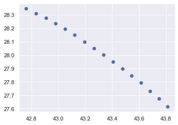


We also want to know the velocity of the ball, and the player. We'll use the average of the player's velecity. Here we may add a caveat that the PPA doesn't really account for any acceleration.


```python
mgdf_1[(mgdf_1['frame']>= frm_rng) & (mgdf_1['frame']<=frm_end) & (mgdf_1['playeridf']== dest_player)]['velocity'].mean()
```


    2.1407646575236954


```python
passes.iloc[idx].start_point.distance(passes.iloc[idx].end_point)/.6
```


    8.432740427115686


The player during the interval we are examining, had an average of 2 units per second, and the ball was moving at 8 units per second.


We can examine the ellipses for the player and the ball in turn. The player's will look like a circle, because we don't have any other information about their movement. The ball is more elliptical, but this is a short pass between the two players at a relatively high velocity. The further the pass the narrower the ellipse.


```python
ball = ppa_shapely(passes.iloc[idx]['start_point'],passes.iloc[idx]['end_point'],1,8)
ball
```


```python
player = ppa_shapely(passes.iloc[idx]['end_point'],passes.iloc[idx]['end_point'],1,3)
player
```


The area of intersection between the two PPAs is the joint-accessibility space. The places both the player and the ball could have come into contact with given the final destination of the pass.


```python
intersection = ball.intersection(player)
ppagdf = gpd.GeoDataFrame(pd.DataFrame({"desc":["BallPPA","PlayerPPA","JointInteraction"]}),geometry=[ball,player,intersection])
ppagdf.plot(column='desc');
```


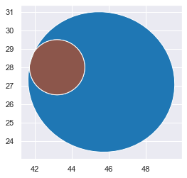


In this instance, the player is actually contained within the PPA of the ball. It's easier to visualize with the player's actual movements.


```python
fig = plt.figure(figsize=(10,10))
ax = fig.add_subplot(111)
pitchgdf.plot(ax=ax,facecolor = SpatialSoccer.GREEN_PITCH_COLOR,edgecolor=SpatialSoccer.WHITE_LINE_COLOR);
ppagdf.plot(ax=ax,column='desc')
ax.scatter(passes.iloc[idx]['start_point'].x,passes.iloc[idx]['start_point'].y,marker="x",s=100,color="red")
ax.scatter(passes.iloc[idx]['end_point'].x,passes.iloc[idx]['end_point'].y,marker="x",s=100,color="red")
mgdf[(mgdf['frame']>= frm_rng) & (mgdf['frame']<=frm_end) & (mgdf['playeridf']== dest_player)].plot(ax=ax,color="Black")
ax.set_xlim([35,60])
ax.set_ylim([20,35]);
```


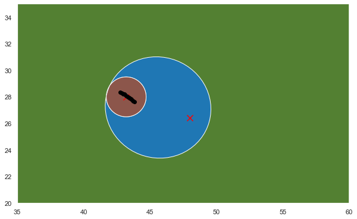


In this case, the joint-accessiblity area actually entirely encompasses all the locations the recieving player was at the start of the event.

How do we interpret the joint-accessiblity area? It isn't the most likely place the player was, but the mostly likely area of interaction between the player and the ball. In the preceding figure it is fairly obvious.


```python
def round_tenth(x):
    return int(math.ceil(x / 10.0)) * 10

for idx in range(10,100,10):
    time = passes.iloc[idx].end_time-passes.iloc[idx].timestamp
    frm_rng = passes.iloc[idx].start_frame
    frm_end = passes.iloc[idx].end_frame
    dest_player = passes.iloc[idx].recipient_player
    
    avg_p_velocity = mgdf_1[(mgdf_1['frame']>= frm_rng) & (mgdf_1['frame']<=frm_end) & (mgdf_1['playeridf']== dest_player)]['velocity'].mean()
    ball_velocity = passes.iloc[idx].start_point.distance(passes.iloc[idx].end_point)/time
    ball = ppa_shapely(passes.iloc[idx]['start_point'],passes.iloc[idx]['end_point'],time,ball_velocity)
    player = ppa_shapely(passes.iloc[idx]['end_point'],passes.iloc[idx]['end_point'],time,avg_p_velocity)
    intersection = ball.intersection(player)
    ppagdf = gpd.GeoDataFrame(pd.DataFrame({"desc":["BallPPA","PlayerPPA","JointInteraction"]}),geometry=[ball,player,intersection])
    fig = plt.figure(figsize=(10,10))
    ax = fig.add_subplot(111)
    pitchgdf.plot(ax=ax,facecolor = SpatialSoccer.GREEN_PITCH_COLOR,edgecolor=SpatialSoccer.WHITE_LINE_COLOR);
    ppagdf.plot(ax=ax,column='desc')
    ax.scatter(passes.iloc[idx]['start_point'].x,passes.iloc[idx]['start_point'].y,marker="x",s=100,color="red")
    ax.scatter(passes.iloc[idx]['end_point'].x,passes.iloc[idx]['end_point'].y,marker="x",s=100,color="red")
    mgdf[(mgdf['frame']>= frm_rng) & (mgdf['frame']<=frm_end) & (mgdf['playeridf']== dest_player)].plot(ax=ax,column="frame")
    minx,miny,maxx,maxy = ppagdf.total_bounds
    ax.set_xlim([round_tenth(minx)-10,round_tenth(maxx)+10])
    ax.set_ylim([round_tenth(miny)-10,round_tenth(maxy)+10])
    plt.savefig("PPA_InferLocation_%s.png"%idx,dpi=150)
    plt.show()

```


```python
from IPython.display import Image
```

In the two images below, the lighter the color of the point the closer in time it is to the end frame or time of the event. Here again, it looks like the joint accessiblity area is close to where the player was. This was a longer pass (given the size and shape of the ball's ppa). The player's ppa, actually is a little small and it may be that the average velocity is underestimating a little the player's potential area.


```python
Image(filename="PPA_InferLocation_20.png")
```


```python
Image(filename="PPA_InferLocation_30.png")
```


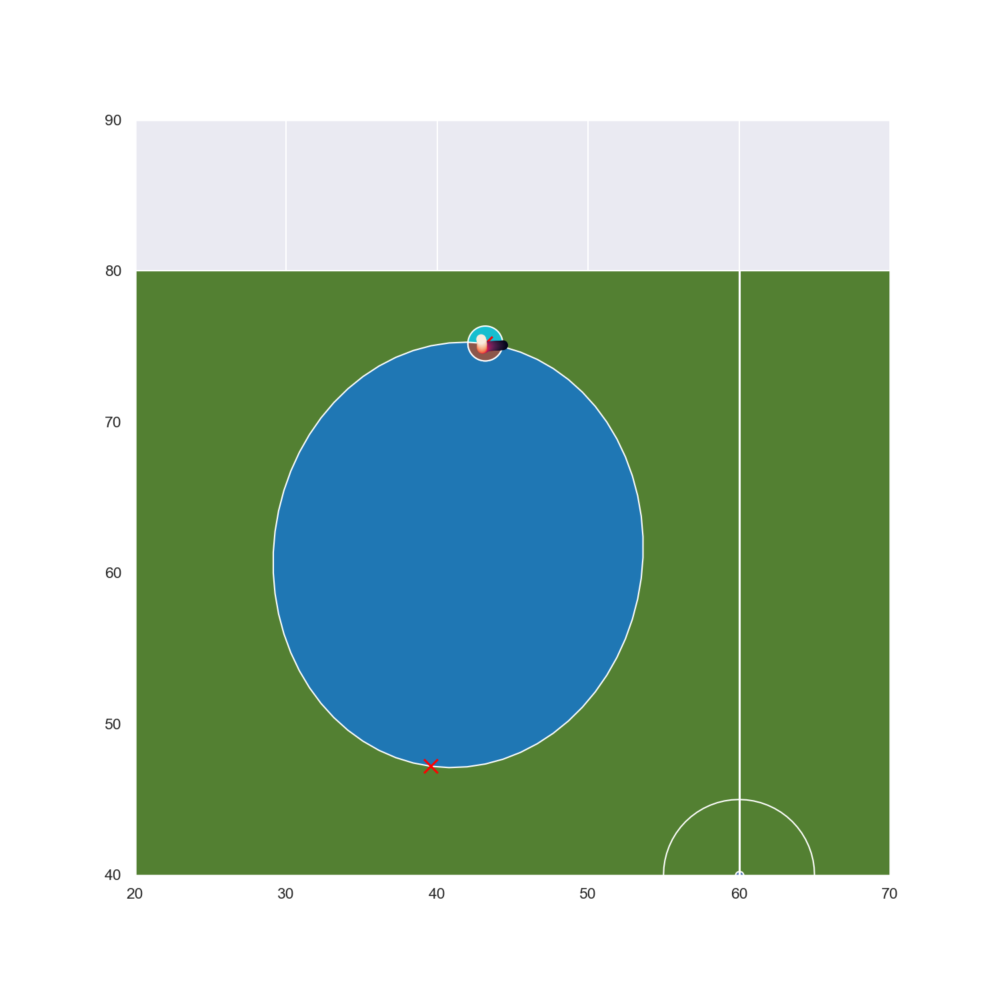


In the next image we can see the limitations of using the joing accessiblity area. This is really due to the fact that we don't know the player's direction of travel. You can also see some impercision issues with the tracking data and event data. The player is not exactly where the ball is when the event says where the target is. Another reason, the ppa is useful, because it is a representation of the uncertainty around the control point.


```python
Image(filename="PPA_InferLocation_40.png")
```


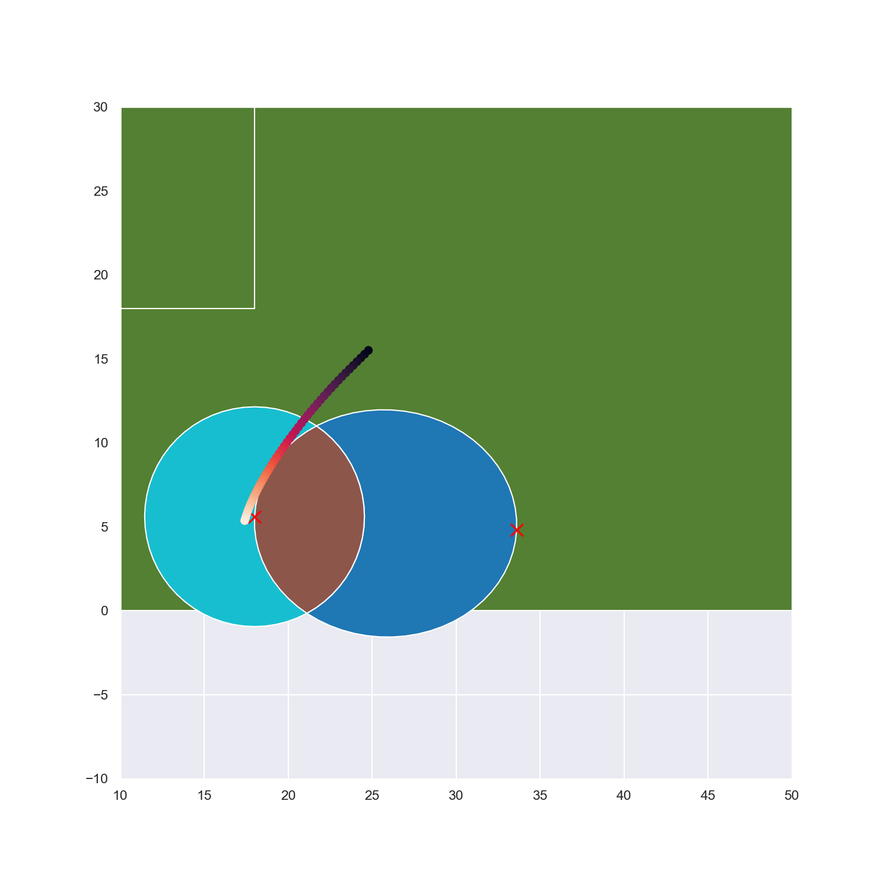


# Infering from event data

The code below is a little overkill for loading up the statsbomb data for a match. I happened to have it on hand and just copied and pasted it.


```python
from ssalib2 import SpatialSoccer
sa = SpatialSoccer()
pitchgdf = SpatialSoccer.build_polygon_pitch_statsbomb()
team_name = "Chelsea FCW"
sb_matches = sa.get_match_list_from_source("open-data-master/data/matches/37/4.json",SpatialSoccer.STATS_BOMB_DATA,team_name=team_name)
m = sb_matches[0]
trajectories = None
   
for m in sb_matches:
    df = sa.load_events_from_match("open-data-master/data/events",SpatialSoccer.STATS_BOMB_DATA,m)
    trajs = m.build_match_trajectories(team_name,only_goals=False)

    try:
        trajectories = trajectories.append(trajs,ignore_index=True,sort=False)
    except:
        try:
            trajectories = trajs.copy()
        except:
            pass
    del trajs
    del df
trajectories.head()
passes = trajectories[trajectories['event_name']=='Pass'].copy()
event_1 = passes.iloc[[0,1]].copy()
```

Here we can see the event data with the start (red) and the end points (purple). We would like to know where we think the player that received the ball was in occuping space. But we need to know or estimate some velocities to use. The ball velocity could be derived from the data (using the trajectory data frame above would tell us the start time of the next event). The player velocity would need to be guessed. I'll use some relatively moderate velocities, and assume about a second passed.


```python

pitchgdf = SpatialSoccer.build_polygon_pitch_statsbomb()
ax = pitchgdf.plot(facecolor = SpatialSoccer.GREEN_PITCH_COLOR,edgecolor=SpatialSoccer.WHITE_LINE_COLOR);
ax.scatter(event_1.iloc[0]['start_point'].x,event_1.iloc[0]['start_point'].y,c="red",s=100,marker="x")
ax.scatter(event_1.iloc[0]['end_point'].x,event_1.iloc[0]['end_point'].y,c="purple",s=100,marker="x");
```


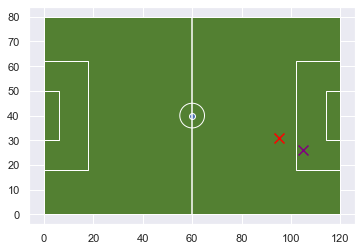


With a ball velocity of 8 and player of 3, we can see that it wasn't possible for the player to reach the ball (no joint accessiblity area). This points to another application of this method: infering velocities. A player and a ball would need to be traveling at a minimum speed in order to reach each other.


```python
ball = ppa_shapely(event_1.iloc[0]['start_point'],event_1.iloc[0]['end_point'],1,8)
player = ppa_shapely(event_1.iloc[0]['end_point'],event_1.iloc[0]['end_point'],1,3)
intersection = ball.intersection(player)
ppagdf = gpd.GeoDataFrame(pd.DataFrame({"desc":["BallPPA","PlayerPPA","JointInteraction"]}),geometry=[ball,player,intersection])
ppagdf.plot(column='desc');
```


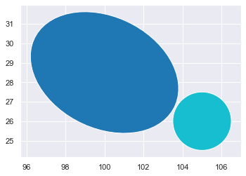


If the ball stays at this speed, and the player moves a little more quicly then we can see there is potential for interaction.


```python
ball = ppa_shapely(event_1.iloc[0]['start_point'],event_1.iloc[0]['end_point'],1,8)
player = ppa_shapely(event_1.iloc[0]['end_point'],event_1.iloc[0]['end_point'],1,4)
intersection = ball.intersection(player)
ppagdf = gpd.GeoDataFrame(pd.DataFrame({"desc":["BallPPA","PlayerPPA","JointInteraction"]}),geometry=[ball,player,intersection])
ppagdf.plot(column='desc');
```


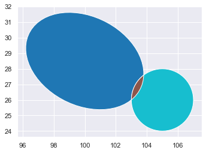


It may help if we can see where the event started and ended.


```python

ax = pitchgdf.plot(facecolor = SpatialSoccer.GREEN_PITCH_COLOR,edgecolor=SpatialSoccer.WHITE_LINE_COLOR);
ppagdf.plot(ax=ax,column='desc')
ax.scatter(event_1.iloc[0]['start_point'].x,event_1.iloc[0]['start_point'].y,c="red",s=100,marker="x")
ax.scatter(event_1.iloc[0]['end_point'].x,event_1.iloc[0]['end_point'].y,c="purple",s=100,marker="x");

ax.set_xlim([90,110])
ax.set_ylim([20,35]);
```


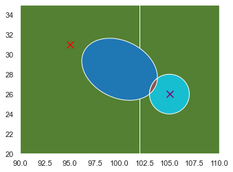


That suggests that the velocity the ball is going is not fast enough, because ellipse doesn't reach the start or end of the event. Or the time interval is not long enough. Increasing the time to 1 and half seconds we can see where the player probably was in relation to the ball.


```python
ball = ppa_shapely(event_1.iloc[0]['start_point'],event_1.iloc[0]['end_point'],1.5,8)
player = ppa_shapely(event_1.iloc[0]['end_point'],event_1.iloc[0]['end_point'],1.5,4)
intersection = ball.intersection(player)
ppagdf = gpd.GeoDataFrame(pd.DataFrame({"desc":["BallPPA","PlayerPPA","JointInteraction"]}),geometry=[ball,player,intersection])

ax = pitchgdf.plot(facecolor = SpatialSoccer.GREEN_PITCH_COLOR,edgecolor=SpatialSoccer.WHITE_LINE_COLOR);
ppagdf.plot(ax=ax,column='desc')
ax.scatter(event_1.iloc[0]['start_point'].x,event_1.iloc[0]['start_point'].y,c="red",s=100,marker="x")
ax.scatter(event_1.iloc[0]['end_point'].x,event_1.iloc[0]['end_point'].y,c="purple",s=100,marker="x");

ax.set_xlim([90,110])
ax.set_ylim([20,35]);
```


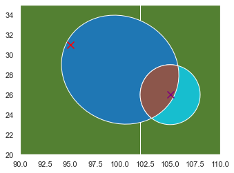


## Infering Positions

Taken of the season, these PPAs may give a good sense of the position and spaces a player tends to occupy. We could look at the individual event points to see this, or a kernel density, but these ppas really convey the physical space better in my opinion. I will first pull out the name of the recipient and the handy duration field to create slightly more accuracte PPA representations.


```python
import json
def get_name(x):
    x = json.loads(x)
    try:
        return x['pass']['recipient']['name']
    except:
        return ""
def get_dur(x):
    x = json.loads(x)
    try:
        return x['duration']
    except:
        return ""
passes['recipient_name'] = passes['original_json'].apply(lambda x: get_name(x))
passes['duration'] = passes['original_json'].apply(lambda x: get_dur(x))
```

We'll take a look at So-yun Ji first. An earlier analysis revealed she was often a recipient (and deliverer) of the ball. 


```python
ppas = []
ppaball = []
ppaint = []
for idx,row in passes[passes['recipient_name']=='So-yun Ji'].iterrows():
    try:
        player = ppa_shapely(row['end_point'],row['end_point'],row['duration'],4)
        ppas.append(player)
        try:
            velocity = row['start_point'].distance(row['end_point']) / row['duration']
            ball = ppa_shapely(row['start_point'],row['end_point'],row['duration'],veolcity)
            ppaball.append(ball)
        except:
            ppaball.append(None)

        try:
            intersection = ball.intersection(player)
            ppaint.append(intersection)
        except:
            ppaint.append(None)
    except:
        pass

ppagdf = gpd.GeoDataFrame(pd.DataFrame({"idx":range(0,len(ppas)),"ball":ppaball,"intersection":ppaint,"player":ppas}),geometry=ppas)
```

After combining the ppa for every time she received a pass, I use a dummy field to force a dissolve to create a bigger representative area of places she likely occupied over the entire season.


```python
ppagdf["dfield"]=0
ax = pitchgdf.plot(facecolor = SpatialSoccer.GREEN_PITCH_COLOR,edgecolor=SpatialSoccer.WHITE_LINE_COLOR);
ppagdf.dissolve(by="dfield").plot(ax=ax,facecolor="None",edgecolor="Black");
ax.set_title("So-yun Ji");
```


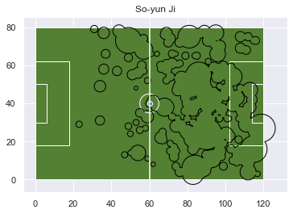


From Chelsea's web page, So-yun is listed as a midfielder. However, given the spaces she occupies (largely in front of the box) she is definitely an attacking midfielder. I admit I haven't been able to see a live match or replay, but this can be derived from the data. Not suprisingly, she wears a number 10 jersey. https://www.chelseafc.com/en/teams/women?pageTab=players

I'll wrap this in a little function to make it easier to repeat and compare different players.


```python
def ppagdffunc(recipientName):
    ppas = []
    ppaball = []
    ppaint = []
    for idx,row in passes[passes['recipient_name']==recipientName].iterrows():
        #try:
        player = ppa_shapely(row['end_point'],row['end_point'],row['duration'],4)
        ppas.append(player)
            #try:
        velocity = row['start_point'].distance(row['end_point']) / row['duration']
        ball = ppa_shapely(row['start_point'],row['end_point'],row['duration'],velocity)
        intersection = ball.intersection(player)
        ppaint.append(intersection)
        ppaball.append(ball)
                
            #except:
                #ppaball.append(None)
                #ppaint.append(None)

                
        #except:
            #pass

    ppagdf = gpd.GeoDataFrame(pd.DataFrame({"idx":range(0,len(ppas)),"ball":ppaball,"intersection":ppaint,"player":ppas}),geometry=ppas)
    return ppagdf
```

Here we can see Millie Bright, listed as a defender. Much of her space is on the right side of the goalie, but she also presses forward a lot. She wears a number 4 jersey, and seems to play the defensive midfield roll.


```python
ppagdf = ppagdffunc("Millie Bright")
ppagdf["dfield"]=0
ax = pitchgdf.plot(facecolor = SpatialSoccer.GREEN_PITCH_COLOR,edgecolor=SpatialSoccer.WHITE_LINE_COLOR);
ppagdf.dissolve(by="dfield").plot(ax=ax,facecolor="None",edgecolor="Black");
ax.set_title("Millie Bright");
```


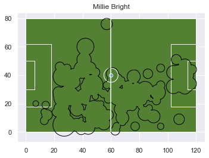


Compare this to just looking at the points of where she received the ball, and you might not really know what to think of her.


```python

ax = pitchgdf.plot(facecolor = SpatialSoccer.GREEN_PITCH_COLOR,edgecolor=SpatialSoccer.WHITE_LINE_COLOR);
for idx,row in passes[passes['recipient_name']=="Millie Bright"].iterrows():
    ax.scatter(row['end_point'].x,row['end_point'].y,color="black")
```


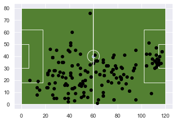


Finally, a forward Fran Kirby. She seems to spend a lot of time on the wings in the corner, but there are three distinct patterns with these players. A more nuanced picture might be created if we were to include some differentiation on their velocity. Or we could use the intersection between the player and ball ppa to filter some of the space.


```python
ppagdf = ppagdffunc("Francesca Kirby")
ppagdf["dfield"]=0
ax = pitchgdf.plot(facecolor = SpatialSoccer.GREEN_PITCH_COLOR,edgecolor=SpatialSoccer.WHITE_LINE_COLOR);
ppagdf.dissolve(by="dfield").plot(ax=ax,facecolor="None",edgecolor="Black");
ax.set_title("Francesca Kirby");
```


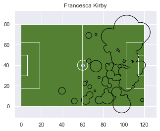


It does not look as nice, but it narrows in on some key areas the player is like to be found.


```python
ppagdf = ppagdf.set_geometry(ppagdf['intersection'].values)
ppagdf["dfield"]=0
ax = pitchgdf.plot(facecolor = SpatialSoccer.GREEN_PITCH_COLOR,edgecolor=SpatialSoccer.WHITE_LINE_COLOR);
ppagdf.dissolve(by="dfield").plot(ax=ax,facecolor="None",edgecolor="Black");
ax.set_title("Millie Bright");
```


```python

```
