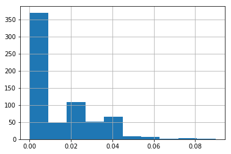
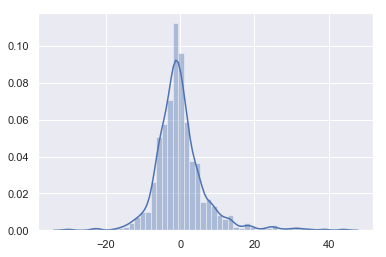
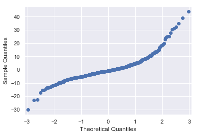
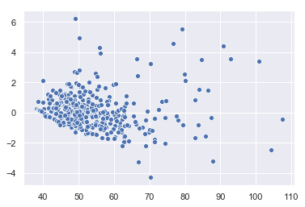
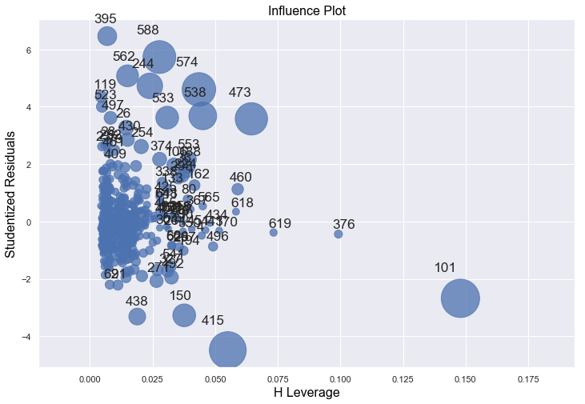
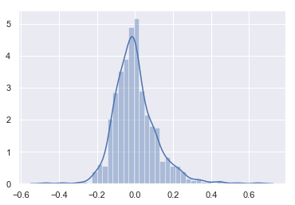
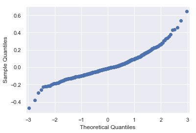
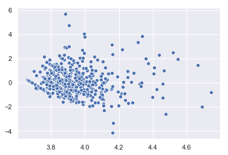
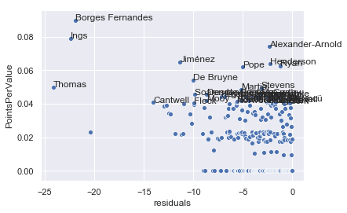

# Creating data

I don't really like the variables available in the players' raw dataset. They're ok, but I want to look at some better metrics. It's hard to tell how a player changes over the season or averages out over a season. I want to know what their minutes per game are for example.

The cleaned dataset for some reason doesn't include the player position information, and I want that too. So I'll go back over the individual player information. 

Again, this can be found in the same repo: [https://github.com/vaastav/Fantasy-Premier-League](https://github.com/vaastav/Fantasy-Premier-League)


First load the data and create a template for the new dataframe.


```python
import pandas as pd

df = pd.read_csv("players_raw.csv",encoding='utf-8')
df.head()
```


<div>
<style scoped>
    .dataframe tbody tr th:only-of-type {
        vertical-align: middle;
    }

    .dataframe tbody tr th {
        vertical-align: top;
    }

    .dataframe thead th {
        text-align: right;
    }
</style>
<table border="1" class="dataframe">
  <thead>
    <tr style="text-align: right;">
      <th></th>
      <th>assists</th>
      <th>bonus</th>
      <th>bps</th>
      <th>chance_of_playing_next_round</th>
      <th>chance_of_playing_this_round</th>
      <th>clean_sheets</th>
      <th>code</th>
      <th>cost_change_event</th>
      <th>cost_change_event_fall</th>
      <th>cost_change_start</th>
      <th>...</th>
      <th>threat_rank_type</th>
      <th>total_points</th>
      <th>transfers_in</th>
      <th>transfers_in_event</th>
      <th>transfers_out</th>
      <th>transfers_out_event</th>
      <th>value_form</th>
      <th>value_season</th>
      <th>web_name</th>
      <th>yellow_cards</th>
    </tr>
  </thead>
  <tbody>
    <tr>
      <th>0</th>
      <td>2</td>
      <td>2</td>
      <td>242</td>
      <td>0</td>
      <td>0</td>
      <td>4</td>
      <td>69140</td>
      <td>0</td>
      <td>0</td>
      <td>-4</td>
      <td>...</td>
      <td>58</td>
      <td>43</td>
      <td>25007</td>
      <td>0</td>
      <td>47630</td>
      <td>0</td>
      <td>0.3</td>
      <td>8.4</td>
      <td>Mustafi</td>
      <td>2</td>
    </tr>
    <tr>
      <th>1</th>
      <td>0</td>
      <td>4</td>
      <td>204</td>
      <td>100</td>
      <td>100</td>
      <td>4</td>
      <td>98745</td>
      <td>0</td>
      <td>0</td>
      <td>-3</td>
      <td>...</td>
      <td>81</td>
      <td>44</td>
      <td>206616</td>
      <td>0</td>
      <td>159819</td>
      <td>0</td>
      <td>0.3</td>
      <td>8.5</td>
      <td>Bellerín</td>
      <td>2</td>
    </tr>
    <tr>
      <th>2</th>
      <td>2</td>
      <td>1</td>
      <td>331</td>
      <td>100</td>
      <td>100</td>
      <td>4</td>
      <td>111457</td>
      <td>0</td>
      <td>0</td>
      <td>-3</td>
      <td>...</td>
      <td>98</td>
      <td>55</td>
      <td>65194</td>
      <td>0</td>
      <td>134275</td>
      <td>0</td>
      <td>0.5</td>
      <td>10.6</td>
      <td>Kolasinac</td>
      <td>4</td>
    </tr>
    <tr>
      <th>3</th>
      <td>2</td>
      <td>3</td>
      <td>244</td>
      <td>100</td>
      <td>100</td>
      <td>3</td>
      <td>154043</td>
      <td>0</td>
      <td>0</td>
      <td>-5</td>
      <td>...</td>
      <td>119</td>
      <td>41</td>
      <td>610816</td>
      <td>0</td>
      <td>653555</td>
      <td>0</td>
      <td>0.1</td>
      <td>9.1</td>
      <td>Maitland-Niles</td>
      <td>4</td>
    </tr>
    <tr>
      <th>4</th>
      <td>0</td>
      <td>5</td>
      <td>305</td>
      <td>100</td>
      <td>100</td>
      <td>4</td>
      <td>39476</td>
      <td>0</td>
      <td>0</td>
      <td>-2</td>
      <td>...</td>
      <td>76</td>
      <td>57</td>
      <td>182201</td>
      <td>0</td>
      <td>231413</td>
      <td>0</td>
      <td>0.0</td>
      <td>11.9</td>
      <td>Sokratis</td>
      <td>6</td>
    </tr>
  </tbody>
</table>
<p>5 rows × 61 columns</p>
</div>


```python
datacollection = {"NameFirst":[],
            "NameLast":[],
            "IDNumber":[],
            "PositionID":[],
            "TotalAssists":[],
            "TotalGoalsScored":[],
            "TotalICTIndex":[],
            "TotalInfluence":[],
            "TotalMinutes":[],
            "TotalPoints":[],
            "TotalThreat":[],
            "CountGW":[],
            "AverageInfluence":[],
            "AverageAssists":[],
            "AverageGoalsScored":[],
            "AverageICTIndex":[],
            "AverageInfluence":[],
            "AverageMinutes":[],
            "AveragePoints":[],
            "MedianPoints":[],
            "PointsPerGame":[],
            "PointsPerMinute":[],
            "AverageValue":[],
            "MedianValue":[],
            "PointsPerValue":[]
           }
```

Now I can walk over each of the player folders and calculate all the new values.


```python
import os
rootdir = r'C:\Users\David\OneDrive\projects\github\Fantasy-Premier-League\data\2019-20\players'

for subdir, dirs, files in os.walk(rootdir):
    for name in dirs:
        print(name)
        splt = name.split("_")
        datacollection['NameFirst'].append(splt[0])
        datacollection['NameLast'].append(splt[1])
        datacollection['IDNumber'].append(splt[2])
        try:
            datacollection['PositionID'].append(df[df['id']==int(splt[2])]['element_type'].values[0])
        except:
            datacollection['PositionID'].append(None)
        filepath = os.path.join(subdir, name, "gw.csv")
        gw = pd.read_csv(filepath)
        datacollection["TotalAssists"].append(gw['assists'].sum())
        datacollection["TotalGoalsScored"].append(gw['goals_scored'].sum())
        datacollection["TotalICTIndex"].append(gw['ict_index'].sum())
        datacollection["TotalInfluence"].append(gw['influence'].sum())
        datacollection["TotalMinutes"].append(gw['minutes'].sum())
        datacollection["TotalPoints"].append(gw['total_points'].sum())
        datacollection["TotalThreat"].append(gw['threat'].sum())
        datacollection["CountGW"].append(len(gw))
        datacollection["AverageAssists"].append(gw['assists'].mean())
        datacollection["AverageGoalsScored"].append(gw['goals_scored'].mean())
        datacollection["AverageICTIndex"].append(gw['ict_index'].mean())
        datacollection["AverageInfluence"].append(gw['influence'].mean())
        datacollection["AverageMinutes"].append(gw['minutes'].mean())
        datacollection["AveragePoints"].append(gw['total_points'].mean())
        datacollection["MedianPoints"].append(gw['total_points'].median())
        datacollection["PointsPerGame"].append(gw['total_points'].sum()/len(gw))
        datacollection["PointsPerMinute"].append(gw['total_points'].sum()/gw['minutes'].sum())
        datacollection["AverageValue"].append(gw['value'].mean())
        datacollection["MedianValue"].append(gw['value'].median())
        gw['pointpervalue'] = gw['total_points'] / gw['value']
        datacollection["PointsPerValue"].append(gw['pointpervalue'].median())

```

    Aaron_Connolly_534
    Aaron_Cresswell_376
    Aaron_Lennon_430
    Aaron_Mooy_516
    Aaron_Ramsdale_494
    Aaron_Wan-Bissaka_122
    Abd-Al-Ali Morakinyo Olaposi_Koiki_596
    Abdoulaye_Doucouré_368
    Adalberto_Peñaranda_648
    

    C:\Users\David\Anaconda3\lib\site-packages\ipykernel_launcher.py:33: RuntimeWarning: invalid value encountered in longlong_scalars
    

    Adama_Traoré_417
    Adam_Idah_538
    Adam_Lallana_195
    Adam_Masina_355
    Adam_Smith_63
    Adam_Webster_493
    Addji Keaninkin Marc-Israel_Guehi_545
    Ademola_Lookman_155
    Adrian_Mariappa_356
    Adrián_San Miguel del Castillo_526
    Ahmed_El Mohamady_22
    Ainsley_Maitland-Niles_4
    Akin_Famewo_552
    Albian_Ajeti_514
    Alexander_Tettey_289
    Alexandre Nascimento_Costa Silva_387
    Alexandre_Jankewitz_649
    Alexandre_Lacazette_12
    Alexis_Mac Allister_627
    Alexis_Sánchez_240
    Alex_Cochrane_666
    Alex_Iwobi_17
    Alex_McCarthy_318
    Alex_Oxlade-Chamberlain_193
    Alfie_Lewis_651
    Alfie_Whiteman_543
    Alireza_Jahanbakhsh_50
    Alisson_Ramses Becker_189
    Allan_Saint-Maximin_500
    Andreas_Christensen_108
    Andreas_Pereira_246
    Andrew_Robertson_181
    Andrew_Surman_80
    Andre_Gray_364
    Andre_Green_32
    Andriy_Yarmolenko_392
    Andros_Townsend_135
    André Filipe_Tavares Gomes_422
    Andy_Carroll_520
    Andy_King_480
    Andy_Lonergan_530
    Angelo_Ogbonna_377
    Angel_Gomes_245
    Angus_Gunn_319
    Anthony_Driscoll-Glennon_572
    Anthony_Gordon_561
    Anthony_Knockaert_52
    Anthony_Martial_239
    Antonio_Rüdiger_104
    Anwar_El Ghazi_30
    Archie_Mair_551
    Armando_Broja_631
    Arnaut_Danjuma Groeneveld_492
    Arthur_Masuaku_378
    Artur_Boruc_73
    Ashley_Barnes_90
    Ashley_Westwood_101
    Ashley_Young_224
    Asmir_Begovic_72
    Axel_Tuanzebe_481
    Aymeric_Laporte_202
    Ayotomiwa_Dele-Bashiru_563
    Ayoze_Pérez_265
    Bailey_Peacock-Farrell_495
    Bamidele_Alli_344
    Beni_Baningime_557
    Benjamin_Chilwell_161
    Benjamin_Mendy_204
    Ben_Davies_329
    Ben_Foster_366
    Ben_Gibson_89
    Ben_Godfrey_273
    Ben_Johnson_384
    Ben_Mee_83
    Ben_Osborn_472
    Beram_Kayal_56
    Bernardo Mota_Veiga de Carvalho e Silva_218
    Bernardo_Costa Da Rosa_595
    Bernardo_Fernandes da Silva Junior_39
    Bernard_Anício Caldeira Duarte_152
    Bernard_Ashley-Seal_559
    Bernd_Leno_14
    Billy_Gilmour_533
    Billy_Sharp_298
    Birkir_Bjarnason_33
    Bjorn_Engels_455
    Bobby_Thomas_639
    Borja_González Tomás_623
    Brandon_Austin_558
    Brandon_Pierrick_580
    Brandon_Williams_549
    Bruno André_Cavaco Jordao_609
    Bruno Miguel_Borges Fernandes_618
    Bukayo_Saka_541
    Callum_Hudson-Odoi_116
    Callum_Robinson_453
    Callum_Slattery_327
    Callum_Wilson_67
    Calum_Chambers_467
    Caoimhin_Kelleher_531
    Carlos_Sánchez_397
    Carl_Jenkinson_9
    Cenk_Tosun_146
    Charlie_Austin_312
    Charlie_Daniels_60
    Charlie_Taylor_87
    Cheikhou_Kouyaté_139
    Che_Adams_437
    Christian_Atsu_267
    Christian_Benteke_129
    Christian_Eriksen_343
    Christian_Fuchs_163
    Christian_Kabasele_354
    Christian_Pulisic_431
    Christian_Saydee_564
    Christoph_Zimmermann_275
    Chris_Basham_423
    Chris_Mepham_61
    Chris_Smalling_223
    Chris_Wood_91
    Ciaran_Clark_259
    Claudio_Bravo_213
    Cole_Palmer_643
    Connor_Wickham_130
    Conor_Coady_403
    Conor_Coventry_664
    Conor_Hourihane_28
    Craig_Cathcart_358
    Craig_Dawson_439
    Curtis_Jones_569
    Cédric_Soares_486
    César_Azpilicueta_105
    Dale_Stephens_57
    Daniel_Adshead_669
    Daniel_Amartey_178
    Daniel_Castelo Podence_619
    Daniel_Ceballos Fernández_469
    Daniel_Drinkwater_120
    Daniel_James_243
    Daniel_N'Lundulu_535
    Danilo Luiz_da Silva_209
    Danny_Ings_313
    Danny_Rose_332
    Danny_Ward_170
    Danny_Welbeck_512
    Dan_Burn_475
    Dan_Gosling_81
    Darnell_Johnson_662
    Darren_Randolph_606
    Daryl_Janmaat_359
    Davide_Zappacosta_109
    David_Brooks_76
    David_Button_48
    David_de Gea_235
    David_Luiz Moreira Marinho_106
    David_Martin_553
    David_McGoldrick_303
    David_Silva_219
    Davinson_Sánchez_333
    Davy_Pröpper_54
    DeAndre_Yedlin_253
    Dean_Henderson_471
    Declan_Rice_395
    Dejan_Lovren_186
    Demarai_Gray_175
    Dennis_Cirkin_655
    Dennis_Praet_517
    Dennis_Srbeny_279
    Diego_Rico_65
    Dimitri_Foulquier_542
    Diogo_Jota_410
    Divock_Origi_188
    Djibril_Sidibé_511
    Domingos_Quina_375
    Dominic_Calvert-Lewin_147
    Dominic_Solanke_69
    Douglas Luiz_Soares de Paulo_470
    Dwight_Gayle_554
    Dwight_McNeil_97
    Ederson_Santana de Moraes_212
    Edward_Nketiah_13
    Eldin_Jakupovic_169
    Ellis_Simms_667
    Emerson_Palmieri dos Santos_107
    Emile_Smith Rowe_576
    Emiliano_Buendía_283
    Emiliano_Martínez_427
    Emil_Krafth_519
    Enda_Stevens_291
    Eric_Bailly_228
    Eric_Dier_350
    Eric_Garcia_544
    Erik_Lamela_346
    Erik_Pieters_447
    Ethan_Ampadu_121
    Etienne_Capoue_373
    Ezequiel_Schelotto_546
    Ezri_Konsa Ngoyo_452
    Fabian_Delph_205
    Fabian_Schär_252
    Fabio Henrique_Tavares_197
    Fabián_Balbuena_382
    Faustino_Anjorin_630
    Federico_Fernández_254
    Felipe Anderson_Pereira Gomes_390
    Fernando_Luiz Rosa_221
    Fikayo_Tomori_529
    Filip_Benkovic_597
    Florian_Lejeune_257
    Florin_Andone_46
    Francisco_Femenía Far_357
    Fraser_Forster_317
    Frederick_Woodman_264
    Frederico_Rodrigues de Paula Santos_244
    Frédéric_Guilbert_458
    Gabriel Fernando_de Jesus_211
    Gabriel Teodoro_Martinelli Silva_504
    Gary_Cahill_503
    Gavin_Kilkenny_565
    Gaëtan_Bong_41
    Gedson_Carvalho Fernandes_605
    Georges-Kévin_Nkoudou_527
    George_Baldock_294
    George_Hirst_661
    Georginio_Wijnaldum_199
    Gerard_Deulofeu_363
    Giovani_Lo Celso_523
    Giovanni_McGregor_608
    Glenn_Murray_44
    Gonçalo Bento_Soares Cardoso_594
    Grady_Diangana_398
    Granit_Xhaka_18
    Grant_Hanley_277
    Gylfi_Sigurdsson_151
    Hamza_Choudhury_180
    Harry_Kane_338
    Harry_Lewis_548
    Harry_Maguire_160
    Harry_Wilson_505
    Harry_Winks_347
    Harvey_Barnes_172
    Harvey_Elliott_550
    Harvey_White_634
    Henrikh_Mkhitaryan_16
    Henri_Lansbury_35
    Heung-Min_Son_342
    Heurelho da Silva_Gomes_513
    Hugo_Lloris_340
    Héctor_Bellerín_2
    Hélder_Costa_418
    Ibrahim_Amadou_507
    Idrissa_Gueye_156
    Ignacio_Pussetto_604
    Ilkay_Gündogan_222
    Indiana_Vassilev_600
    Isaac_Hayden_271
    Isaac_Success Ajayi_365
    Ismaïla_Sarr_525
    Issa_Diop_381
    Ivan_Cavaleiro_419
    Jack_Colback_482
    Jack_Cork_102
    Jack_Grealish_29
    Jack_O'Connell_293
    Jack_Robinson_611
    Jack_Rodwell_591
    Jack_Simpson_66
    Jack_Stacey_446
    Jack_Stephens_308
    Jack_Wilshere_394
    Jack_Young_656
    Jacob_Maddox_663
    Jacob_Murphy_483
    Jairo_Riedewald_539
    Jake_Eastwood_299
    Jake_Vokins_645
    Jamaal_Lascelles_258
    Jamal_Lewis_276
    James_Chester_23
    James_Daly_581
    James_Garner_250
    James_Justin_433
    James_Maddison_171
    James_McArthur_138
    James_McCarthy_157
    James_Milner_200
    James_Tarkowski_84
    James_Tomkins_124
    James_Ward-Prowse_321
    Jamie_Vardy_166
    Jannik_Vestergaard_304
    Jan_Bednarek_307
    Jan_Vertonghen_330
    Japhet_Tanganga_583
    Jarrad_Branthwaite_637
    Jarrod_Bowen_626
    Javier_Hernández Balcázar_386
    Javier_Manquillo_256
    Jay_Rodriguez_451
    Jean-Philippe_Gbamin_497
    Jed_Steer_429
    Jefferson_Lerma_82
    Jeffrey_Schlupp_137
    Jeff_Hendrick_100
    Jeremy_Ngakia_593
    Jesse_Lingard_241
    Jesús_Vallejo Lázaro_473
    Jetro_Willems_498
    Jimmy_Dunne_638
    Joelinton Cássio_Apolinário de Lira_466
    Joel_Matip_185
    Joel_Mumbongo_665
    Joel_Ward_126
    Joe_Hart_95
    Johann Berg_Gudmundsson_96
    John-Kymani_Gordon_668
    John_Egan_295
    John_Fleck_301
    John_Lundstram_297
    John_McGinn_31
    John_Ruddy_412
    John_Stones_207
    Jonas_Lössl_479
    Jonathan_Castro Otto_402
    Jonathan_Kodjia_26
    Jonjo_Shelvey_269
    Jonny_Evans_162
    Jordan_Ayew_468
    Jordan_Henderson_198
    Jordan_Pickford_148
    Jordan_Thomas_650
    Jordon_Ibe_78
    Jorge Luiz_Frello Filho_118
    Jose Luis_Mato Sanmartín_261
    Joseph_Anang_582
    Joseph_Gomez_184
    Joseph_Willock_490
    Joshua_King_68
    Josh_Benson_653
    Josh_Brownhill_620
    Josh_Martin_632
    Josip_Drmic_434
    José Diogo_Dalot Teixeira_229
    José Heriberto_Izquierdo Mena_51
    José Ignacio_Peleteiro Romallo_36
    José Ángel_Esmorís Tasende_440
    José_Holebas_353
    José_Reina_603
    João Filipe Iria_Santos Moutinho_415
    João Manuel_Neves Virgínia_629
    João Pedro Cavaco_Cancelo_518
    João Pedro_Junqueira de Jesus_592
    Juan_Foyth_335
    Juan_Mata_242
    Junior_Stanislas_77
    Jürgen_Locadia_45
    Kaine_Hayden_659
    Karl_Darlow_263
    Kasper_Schmeichel_168
    Kayne_Ramsay_311
    Keinan_Davis_34
    Kelechi_Iheanacho_167
    Kelland_Watts_599
    Kenny_McLean_286
    Ken_Sema_372
    Kepa_Arrizabalaga_111
    Kevin_Danso_532
    Kevin_De Bruyne_215
    Kevin_Long_88
    Ki-Jana_Hoever_628
    Kieran_Tierney_515
    Kieran_Trippier_334
    Kieron_Freeman_292
    Konstantinos_Mavropanos_8
    Kortney_Hause_25
    Kurt_Zouma_459
    Kyle_Walker-Peters_337
    Kyle_Walker_203
    Laurent_Koscielny_7
    Leander_Dendoncker_420
    Leandro_Trossard_421
    Lee_Grant_237
    Leighton_Baines_145
    Leonardo_Campana_652
    Leon_Balogun_40
    Leon_Clarke_547
    Leroy_Sané_216
    Lewis_Bate_657
    Lewis_Cook_79
    Lewis_Dunk_42
    Lewis_Gibson_477
    Liam_Gibson_610
    Lloyd_Kelly_64
    Lovre_Kalinic_474
    Lucas_Digne_141
    Lucas_Rodrigues Moura da Silva_345
    Lucas_Torreira_19
    Lukasz_Fabianski_388
    Lukas_Jensen_641
    Lukas_Rupp_602
    Luka_Milivojevic_134
    Luke_Amos_351
    Luke_Cundle_567
    Luke_Dreher_140
    Luke_Freeman_441
    Luke_Shaw_226
    Luke_Thomas_660
    Lys_Mousset_70
    Maarten_Stekelenburg_149
    Mace_Goodridge_571
    Mahmoud Ahmed_Ibrahim Hassan_465
    Mamadou_Sakho_125
    Manuel_Lanzini_391
    Marcos_Alonso_103
    Marcos_Rojo_227
    Marco_Stiepermann_285
    Marcus_Rashford_233
    Marc_Albrighton_174
    Marc_Navarro_360
    Mario_Lemina_324
    Mario_Vrancic_282
    Marko_Arnautovic_385
    Mark_Duffy_300
    Mark_Noble_396
    Mark_Travers_74
    Martin_Dubravka_262
    Martin_Kelly_128
    Martín_Montoya_38
    Marvelous_Nakamba_491
    Mason_Greenwood_234
    Mason_Holgate_478
    Mason_Mount_463
    Matej_Vydra_92
    Mateo_Kovacic_432
    Mathew_Ryan_47
    Matteo_Darmian_230
    Matteo_Guendouzi_21
    Matthew_Clarke_43
    Matthew_Longstaff_540
    Matthew_Lowton_85
    Matthew_Smith_647
    Matty_James_177
    Matt_Doherty_401
    Matt_Macey_646
    Matt_Ritchie_251
    Matt_Targett_309
    Maximillian_Aarons_274
    Max_Kilman_408
    Max_Meyer_136
    Max_Thompson_640
    Maya_Yoshida_310
    Mbwana_Samatta_613
    Mesut_Özil_15
    Michael_Keane_143
    Michael_McGovern_281
    Michael_Obafemi_314
    Michael_Verrips_521
    Michail_Antonio_389
    Michel_Vorm_555
    Michy_Batshuayi_461
    Miguel_Almirón_266
    Mihai-Alexandru_Dobre_574
    Mohamed_Elneny_20
    Mohamed_Elyounoussi_322
    Mohamed_Salah_191
    Moise_Kean_496
    Morgan_Gibbs-White_416
    Morgan_Schneiderlin_158
    Moritz_Leitner_288
    Moussa_Djenepo_438
    Moussa_Sissoko_349
    Muhamed_Bešić_522
    N'Golo_Kanté_119
    Nabil_Bentaleb_612
    Naby_Keita_196
    Nacho_Monreal_6
    Nampalys_Mendy_179
    Nathaniel_Chalobah_374
    Nathaniel_Phillips_589
    Nathan_Aké_59
    Nathan_Holland_568
    Nathan_Redmond_320
    Nathan_Tella_633
    Neal_Maupay_502
    Neco_Williams_575
    Neil_Taylor_24
    Nemanja_Matic_247
    Nick_Pope_93
    Nicolas_Pépé_488
    Nicolás_Otamendi_208
    Nikola_Tavares_635
    Nya_Kirby_588
    Odion_Ighalo_624
    Oleksandr_Zinchenko_206
    Oliver_McBurnie_501
    Oliver_Norwood_302
    Oliver_Skipp_352
    Olivier_Giroud_110
    Ondrej_Duda_601
    Onel_Hernández_284
    Oriol_Romeu Vidal_328
    Oskar_Buur_587
    Oumar_Niasse_570
    Owen_Otasowie_566
    Pablo_Fornals_399
    Pablo_Marí_617
    Pablo_Zabaleta_379
    Panagiotis_Retsos_625
    Pascal_Groß_49
    Patrick_Cutrone_487
    Patrick_Roberts_435
    Patrick_van Aanholt_123
    Paulo_Gazzaniga_341
    Paul_Dummett_255
    Paul_Pogba_238
    Pedro_Lomba Neto_528
    Pedro_Obiang_400
    Pedro_Rodríguez Ledesma_114
    Philip_Billing_476
    Philip_Heise_484
    Phil_Bardsley_86
    Phil_Foden_220
    Phil_Jagielka_444
    Phil_Jones_231
    Pierre-Emerick_Aubameyang_11
    Pierre-Emile_Højbjerg_325
    Pontus_Dahlberg_367
    Rachid_Ghezzal_173
    Rafael_Camacho_201
    Raheem_Sterling_214
    Ralf_Fahrmann_449
    Ravel_Morrison_456
    Raúl_Jiménez_409
    Reece_James_506
    Reiss_Nelson_489
    Rhian_Brewster_464
    Rhu-endly_Martina_577
    Ricardo Domingos_Barbosa Pereira_159
    Richairo_Zivkovic_622
    Richard_Stearman_296
    Richarlison_de Andrade_150
    Riyad_Mahrez_217
    Robbie_Brady_98
    Robert Kenedy_Nunes do Nascimento_462
    Roberto_Firmino_187
    Roberto_Jimenez Gago_450
    Roberto_Pereyra_369
    Robert_Elliot_573
    Robert_Snodgrass_393
    Rob_Holding_10
    Rodrigo_Hernandez_443
    Rolando_Aarons_499
    Romain_Saïss_407
    Romelu_Lukaku_232
    Ross_Barkley_117
    Ruben_Loftus-Cheek_115
    Rui Pedro_dos Santos Patrício_411
    Ryan_Bennett_404
    Ryan_Bertrand_305
    Ryan_Fraser_75
    Ryan_Fredericks_380
    Ryan_Giles_607
    Ryan_Sessegnon_524
    Rúben Diogo_da Silva Neves_414
    Rúben Gonçalo_Silva Nascimento Vinagre_406
    Sadio_Mané_192
    Sam_Byram_454
    Sam_Gallagher_316
    Sam_Surridge_71
    Sam_Woods_578
    Sander_Berge_621
    Scott_Carson_562
    Scott_Dann_127
    Scott_McTominay_248
    Sead_Kolasinac_3
    Seamus_Coleman_144
    Sean_Longstaff_270
    Sebastian_Prödl_361
    Serge_Aurier_336
    Sergio_Agüero_210
    Sergio_Romero_236
    Shane_Duffy_37
    Shane_Long_315
    Shkodran_Mustafi_1
    Simon_Francis_62
    Simon_Mignolet_190
    Simon_Moore_436
    Sofiane_Boufal_508
    Sokratis_Papastathopoulos_5
    Solomon_March_55
    Stephen_Henderson_556
    Steven_Alzate_537
    Steven_Bergwijn_615
    Steven_Defour_99
    Steve_Cook_58
    Stuart_Armstrong_323
    Sung-yueng_Ki_268
    Sébastien_Haller_457
    Tahith_Chong_249
    Takumi_Minamino_590
    Tammy_Abraham_460
    Tanguy_Ndombele_442
    Tariq_Lamptey_586
    Taylor_Harwood-Bellis_642
    Taylor_Perry_560
    Teemu_Pukki_278
    Theo_Walcott_153
    Thomas_Allan_598
    Timm_Klose_272
    Timothy_Fosu-Mensah_658
    Tim_Krul_280
    Toby_Alderweireld_331
    Todd_Cantwell_287
    Tomas_Soucek_616
    Tommy_Doyle_644
    Tom_Cleverley_371
    Tom_Davies_154
    Tom_Heaton_94
    Tom_Trybull_290
    Trent_Alexander-Arnold_182
    Troy_Deeney_362
    Troy_Parrott_509
    Tudor_Baluta_536
    Tyreece_John-Jules_585
    Tyreke_Johnson_326
    Tyrick_Mitchell_579
    Tyrone_Mings_445
    Valentino_Lazaro_614
    Vicente_Guaita_131
    Victor_Lindelöf_225
    Victor_Wanyama_348
    Vincent_Janssen_339
    Virgil_van Dijk_183
    Víctor_Camarasa_510
    Wayne_Hennessey_132
    Wesley_Hoedt_485
    Wesley_Moraes_428
    Wes_Morgan_165
    Wilfred_Ndidi_176
    Wilfried_Zaha_133
    William_Smallbone_584
    Willian_Borges Da Silva_113
    Willy_Boly_405
    Willy_Caballero_112
    Will_Ferry_654
    Will_Hughes_370
    Will_Norris_413
    Winston_Reid_383
    Xherdan_Shaqiri_194
    Yan_Valery_306
    Yerry_Mina_142
    Yoshinori_Muto_260
    Youri_Tielemans_448
    Yves_Bissouma_53
    Zech_Medley_636
    Çaglar_Söyüncü_164
    Ørjan_Nyland_27
    

Create the new dataframe.


```python
finaldf = pd.DataFrame(datacollection)
```


```python
finaldf.head()
```


<div>
<style scoped>
    .dataframe tbody tr th:only-of-type {
        vertical-align: middle;
    }

    .dataframe tbody tr th {
        vertical-align: top;
    }

    .dataframe thead th {
        text-align: right;
    }
</style>
<table border="1" class="dataframe">
  <thead>
    <tr style="text-align: right;">
      <th></th>
      <th>NameFirst</th>
      <th>NameLast</th>
      <th>IDNumber</th>
      <th>PositionID</th>
      <th>TotalAssists</th>
      <th>TotalGoalsScored</th>
      <th>TotalICTIndex</th>
      <th>TotalInfluence</th>
      <th>TotalMinutes</th>
      <th>TotalPoints</th>
      <th>...</th>
      <th>AverageGoalsScored</th>
      <th>AverageICTIndex</th>
      <th>AverageMinutes</th>
      <th>AveragePoints</th>
      <th>MedianPoints</th>
      <th>PointsPerGame</th>
      <th>PointsPerMinute</th>
      <th>AverageValue</th>
      <th>MedianValue</th>
      <th>PointsPerValue</th>
    </tr>
  </thead>
  <tbody>
    <tr>
      <th>0</th>
      <td>Aaron</td>
      <td>Connolly</td>
      <td>534</td>
      <td>4</td>
      <td>3</td>
      <td>3</td>
      <td>76.0</td>
      <td>150.6</td>
      <td>1250</td>
      <td>61</td>
      <td>...</td>
      <td>0.085714</td>
      <td>2.171429</td>
      <td>35.714286</td>
      <td>1.742857</td>
      <td>1.0</td>
      <td>1.742857</td>
      <td>0.048800</td>
      <td>44.285714</td>
      <td>45.0</td>
      <td>0.022222</td>
    </tr>
    <tr>
      <th>1</th>
      <td>Aaron</td>
      <td>Cresswell</td>
      <td>376</td>
      <td>2</td>
      <td>0</td>
      <td>3</td>
      <td>115.9</td>
      <td>535.4</td>
      <td>2727</td>
      <td>79</td>
      <td>...</td>
      <td>0.078947</td>
      <td>3.050000</td>
      <td>71.763158</td>
      <td>2.078947</td>
      <td>1.0</td>
      <td>2.078947</td>
      <td>0.028970</td>
      <td>47.236842</td>
      <td>47.0</td>
      <td>0.021739</td>
    </tr>
    <tr>
      <th>2</th>
      <td>Aaron</td>
      <td>Lennon</td>
      <td>430</td>
      <td>3</td>
      <td>0</td>
      <td>0</td>
      <td>9.6</td>
      <td>45.0</td>
      <td>485</td>
      <td>15</td>
      <td>...</td>
      <td>0.000000</td>
      <td>0.252632</td>
      <td>12.763158</td>
      <td>0.394737</td>
      <td>0.0</td>
      <td>0.394737</td>
      <td>0.030928</td>
      <td>47.078947</td>
      <td>47.0</td>
      <td>0.000000</td>
    </tr>
    <tr>
      <th>3</th>
      <td>Aaron</td>
      <td>Mooy</td>
      <td>516</td>
      <td>3</td>
      <td>2</td>
      <td>2</td>
      <td>134.0</td>
      <td>436.6</td>
      <td>2079</td>
      <td>80</td>
      <td>...</td>
      <td>0.052632</td>
      <td>3.526316</td>
      <td>54.710526</td>
      <td>2.105263</td>
      <td>2.0</td>
      <td>2.105263</td>
      <td>0.038480</td>
      <td>48.131579</td>
      <td>48.0</td>
      <td>0.041667</td>
    </tr>
    <tr>
      <th>4</th>
      <td>Aaron</td>
      <td>Ramsdale</td>
      <td>494</td>
      <td>1</td>
      <td>1</td>
      <td>0</td>
      <td>99.7</td>
      <td>973.8</td>
      <td>3330</td>
      <td>126</td>
      <td>...</td>
      <td>0.000000</td>
      <td>2.623684</td>
      <td>87.631579</td>
      <td>3.315789</td>
      <td>2.0</td>
      <td>3.315789</td>
      <td>0.037838</td>
      <td>45.657895</td>
      <td>45.0</td>
      <td>0.044444</td>
    </tr>
  </tbody>
</table>
<p>5 rows × 24 columns</p>
</div>


The Points Per Value metric is calculated to see how many points you get for every pound spent. These are useful to estimate how many points you might expect for their price. For example, Borges Fernandes is the best points per value. We can expect .09 points for every pound you spent, with the estimate that Borges Fernandes typically costs 8.7 million pounds. If you followed the previous notebook, Ings came up a lot as an undervalued player. Here you can also see that he gits you almost .08 points for every pound spent, and typically costs 6.5 million pounds.


```python
finaldf.sort_values("PointsPerValue",ascending=False)[0:20]
```


<div>
<style scoped>
    .dataframe tbody tr th:only-of-type {
        vertical-align: middle;
    }

    .dataframe tbody tr th {
        vertical-align: top;
    }

    .dataframe thead th {
        text-align: right;
    }
</style>
<table border="1" class="dataframe">
  <thead>
    <tr style="text-align: right;">
      <th></th>
      <th>NameFirst</th>
      <th>NameLast</th>
      <th>IDNumber</th>
      <th>PositionID</th>
      <th>TotalAssists</th>
      <th>TotalGoalsScored</th>
      <th>TotalICTIndex</th>
      <th>TotalInfluence</th>
      <th>TotalMinutes</th>
      <th>TotalPoints</th>
      <th>...</th>
      <th>AverageGoalsScored</th>
      <th>AverageICTIndex</th>
      <th>AverageMinutes</th>
      <th>AveragePoints</th>
      <th>MedianPoints</th>
      <th>PointsPerGame</th>
      <th>PointsPerMinute</th>
      <th>AverageValue</th>
      <th>MedianValue</th>
      <th>PointsPerValue</th>
    </tr>
  </thead>
  <tbody>
    <tr>
      <th>101</th>
      <td>Bruno Miguel</td>
      <td>Borges Fernandes</td>
      <td>618</td>
      <td>3</td>
      <td>8</td>
      <td>8</td>
      <td>139.2</td>
      <td>551.8</td>
      <td>1187</td>
      <td>117</td>
      <td>...</td>
      <td>0.571429</td>
      <td>9.942857</td>
      <td>84.785714</td>
      <td>8.357143</td>
      <td>7.5</td>
      <td>8.357143</td>
      <td>0.098568</td>
      <td>86.071429</td>
      <td>87.0</td>
      <td>0.089826</td>
    </tr>
    <tr>
      <th>150</th>
      <td>Danny</td>
      <td>Ings</td>
      <td>313</td>
      <td>4</td>
      <td>2</td>
      <td>22</td>
      <td>302.4</td>
      <td>1010.0</td>
      <td>2800</td>
      <td>198</td>
      <td>...</td>
      <td>0.578947</td>
      <td>7.957895</td>
      <td>73.684211</td>
      <td>5.210526</td>
      <td>5.0</td>
      <td>5.210526</td>
      <td>0.070714</td>
      <td>66.026316</td>
      <td>65.5</td>
      <td>0.078980</td>
    </tr>
    <tr>
      <th>628</th>
      <td>Trent</td>
      <td>Alexander-Arnold</td>
      <td>182</td>
      <td>2</td>
      <td>15</td>
      <td>4</td>
      <td>282.8</td>
      <td>1026.8</td>
      <td>3173</td>
      <td>210</td>
      <td>...</td>
      <td>0.105263</td>
      <td>7.442105</td>
      <td>83.500000</td>
      <td>5.526316</td>
      <td>5.5</td>
      <td>5.526316</td>
      <td>0.066183</td>
      <td>74.263158</td>
      <td>73.5</td>
      <td>0.074176</td>
    </tr>
    <tr>
      <th>40</th>
      <td>Andrew</td>
      <td>Robertson</td>
      <td>181</td>
      <td>2</td>
      <td>12</td>
      <td>2</td>
      <td>221.7</td>
      <td>845.8</td>
      <td>3111</td>
      <td>181</td>
      <td>...</td>
      <td>0.052632</td>
      <td>5.834211</td>
      <td>81.868421</td>
      <td>4.763158</td>
      <td>5.0</td>
      <td>4.763158</td>
      <td>0.058181</td>
      <td>69.842105</td>
      <td>70.0</td>
      <td>0.072464</td>
    </tr>
    <tr>
      <th>541</th>
      <td>Raúl</td>
      <td>Jiménez</td>
      <td>409</td>
      <td>4</td>
      <td>7</td>
      <td>17</td>
      <td>325.4</td>
      <td>911.6</td>
      <td>3241</td>
      <td>194</td>
      <td>...</td>
      <td>0.447368</td>
      <td>8.563158</td>
      <td>85.289474</td>
      <td>5.105263</td>
      <td>5.0</td>
      <td>5.105263</td>
      <td>0.059858</td>
      <td>76.473684</td>
      <td>75.0</td>
      <td>0.064946</td>
    </tr>
    <tr>
      <th>170</th>
      <td>Dean</td>
      <td>Henderson</td>
      <td>471</td>
      <td>1</td>
      <td>1</td>
      <td>0</td>
      <td>74.8</td>
      <td>718.8</td>
      <td>3240</td>
      <td>160</td>
      <td>...</td>
      <td>0.000000</td>
      <td>1.968421</td>
      <td>85.263158</td>
      <td>4.210526</td>
      <td>3.0</td>
      <td>4.210526</td>
      <td>0.049383</td>
      <td>48.657895</td>
      <td>48.5</td>
      <td>0.063830</td>
    </tr>
    <tr>
      <th>443</th>
      <td>Mathew</td>
      <td>Ryan</td>
      <td>47</td>
      <td>1</td>
      <td>0</td>
      <td>0</td>
      <td>100.1</td>
      <td>1000.0</td>
      <td>3420</td>
      <td>135</td>
      <td>...</td>
      <td>0.000000</td>
      <td>2.634211</td>
      <td>90.000000</td>
      <td>3.552632</td>
      <td>3.0</td>
      <td>3.552632</td>
      <td>0.039474</td>
      <td>47.210526</td>
      <td>47.0</td>
      <td>0.062500</td>
    </tr>
    <tr>
      <th>496</th>
      <td>Nick</td>
      <td>Pope</td>
      <td>93</td>
      <td>1</td>
      <td>0</td>
      <td>0</td>
      <td>93.1</td>
      <td>900.0</td>
      <td>3420</td>
      <td>170</td>
      <td>...</td>
      <td>0.000000</td>
      <td>2.450000</td>
      <td>90.000000</td>
      <td>4.473684</td>
      <td>3.0</td>
      <td>4.473684</td>
      <td>0.049708</td>
      <td>47.394737</td>
      <td>47.0</td>
      <td>0.061915</td>
    </tr>
    <tr>
      <th>641</th>
      <td>Virgil</td>
      <td>van Dijk</td>
      <td>183</td>
      <td>2</td>
      <td>2</td>
      <td>5</td>
      <td>154.8</td>
      <td>930.2</td>
      <td>3420</td>
      <td>178</td>
      <td>...</td>
      <td>0.131579</td>
      <td>4.073684</td>
      <td>90.000000</td>
      <td>4.684211</td>
      <td>4.0</td>
      <td>4.684211</td>
      <td>0.052047</td>
      <td>64.710526</td>
      <td>65.0</td>
      <td>0.061080</td>
    </tr>
    <tr>
      <th>434</th>
      <td>Martin</td>
      <td>Dubravka</td>
      <td>262</td>
      <td>1</td>
      <td>0</td>
      <td>0</td>
      <td>102.0</td>
      <td>1019.0</td>
      <td>3420</td>
      <td>143</td>
      <td>...</td>
      <td>0.000000</td>
      <td>2.684211</td>
      <td>90.000000</td>
      <td>3.763158</td>
      <td>3.0</td>
      <td>3.763158</td>
      <td>0.041813</td>
      <td>50.236842</td>
      <td>50.0</td>
      <td>0.060000</td>
    </tr>
    <tr>
      <th>367</th>
      <td>Kasper</td>
      <td>Schmeichel</td>
      <td>168</td>
      <td>1</td>
      <td>0</td>
      <td>0</td>
      <td>89.6</td>
      <td>863.4</td>
      <td>3420</td>
      <td>156</td>
      <td>...</td>
      <td>0.000000</td>
      <td>2.357895</td>
      <td>90.000000</td>
      <td>4.105263</td>
      <td>3.0</td>
      <td>4.105263</td>
      <td>0.045614</td>
      <td>52.684211</td>
      <td>53.5</td>
      <td>0.060000</td>
    </tr>
    <tr>
      <th>565</th>
      <td>Rui Pedro</td>
      <td>dos Santos Patrício</td>
      <td>411</td>
      <td>1</td>
      <td>0</td>
      <td>0</td>
      <td>74.3</td>
      <td>741.0</td>
      <td>3420</td>
      <td>153</td>
      <td>...</td>
      <td>0.000000</td>
      <td>1.955263</td>
      <td>90.000000</td>
      <td>4.026316</td>
      <td>3.0</td>
      <td>4.026316</td>
      <td>0.044737</td>
      <td>51.710526</td>
      <td>52.0</td>
      <td>0.057692</td>
    </tr>
    <tr>
      <th>376</th>
      <td>Kevin</td>
      <td>De Bruyne</td>
      <td>215</td>
      <td>3</td>
      <td>23</td>
      <td>13</td>
      <td>432.1</td>
      <td>1322.2</td>
      <td>2790</td>
      <td>251</td>
      <td>...</td>
      <td>0.342105</td>
      <td>11.371053</td>
      <td>73.421053</td>
      <td>6.605263</td>
      <td>5.5</td>
      <td>6.605263</td>
      <td>0.089964</td>
      <td>103.447368</td>
      <td>104.5</td>
      <td>0.054079</td>
    </tr>
    <tr>
      <th>415</th>
      <td>Luke</td>
      <td>Thomas</td>
      <td>660</td>
      <td>2</td>
      <td>1</td>
      <td>0</td>
      <td>23.9</td>
      <td>78.4</td>
      <td>267</td>
      <td>15</td>
      <td>...</td>
      <td>0.000000</td>
      <td>7.966667</td>
      <td>89.000000</td>
      <td>5.000000</td>
      <td>2.0</td>
      <td>5.000000</td>
      <td>0.056180</td>
      <td>40.000000</td>
      <td>40.0</td>
      <td>0.050000</td>
    </tr>
    <tr>
      <th>197</th>
      <td>Enda</td>
      <td>Stevens</td>
      <td>291</td>
      <td>2</td>
      <td>4</td>
      <td>2</td>
      <td>153.5</td>
      <td>641.0</td>
      <td>3345</td>
      <td>142</td>
      <td>...</td>
      <td>0.052632</td>
      <td>4.039474</td>
      <td>88.026316</td>
      <td>3.736842</td>
      <td>2.5</td>
      <td>3.736842</td>
      <td>0.042451</td>
      <td>50.842105</td>
      <td>51.0</td>
      <td>0.049412</td>
    </tr>
    <tr>
      <th>56</th>
      <td>Anthony</td>
      <td>Martial</td>
      <td>239</td>
      <td>3</td>
      <td>9</td>
      <td>17</td>
      <td>259.4</td>
      <td>855.6</td>
      <td>2625</td>
      <td>200</td>
      <td>...</td>
      <td>0.447368</td>
      <td>6.826316</td>
      <td>69.078947</td>
      <td>5.263158</td>
      <td>4.0</td>
      <td>5.263158</td>
      <td>0.076190</td>
      <td>78.526316</td>
      <td>78.0</td>
      <td>0.048399</td>
    </tr>
    <tr>
      <th>451</th>
      <td>Matt</td>
      <td>Doherty</td>
      <td>401</td>
      <td>2</td>
      <td>8</td>
      <td>4</td>
      <td>160.0</td>
      <td>576.2</td>
      <td>2836</td>
      <td>167</td>
      <td>...</td>
      <td>0.105263</td>
      <td>4.210526</td>
      <td>74.631579</td>
      <td>4.394737</td>
      <td>3.0</td>
      <td>4.394737</td>
      <td>0.058886</td>
      <td>61.315789</td>
      <td>61.0</td>
      <td>0.047436</td>
    </tr>
    <tr>
      <th>162</th>
      <td>David</td>
      <td>de Gea</td>
      <td>235</td>
      <td>1</td>
      <td>0</td>
      <td>0</td>
      <td>69.2</td>
      <td>695.0</td>
      <td>3420</td>
      <td>143</td>
      <td>...</td>
      <td>0.000000</td>
      <td>1.821053</td>
      <td>90.000000</td>
      <td>3.763158</td>
      <td>2.5</td>
      <td>3.763158</td>
      <td>0.041813</td>
      <td>54.473684</td>
      <td>55.0</td>
      <td>0.046141</td>
    </tr>
    <tr>
      <th>185</th>
      <td>Douglas Luiz</td>
      <td>Soares de Paulo</td>
      <td>470</td>
      <td>3</td>
      <td>2</td>
      <td>3</td>
      <td>118.0</td>
      <td>508.6</td>
      <td>2604</td>
      <td>90</td>
      <td>...</td>
      <td>0.078947</td>
      <td>3.105263</td>
      <td>68.526316</td>
      <td>2.368421</td>
      <td>2.0</td>
      <td>2.368421</td>
      <td>0.034562</td>
      <td>44.394737</td>
      <td>44.0</td>
      <td>0.045455</td>
    </tr>
    <tr>
      <th>31</th>
      <td>Alex</td>
      <td>McCarthy</td>
      <td>318</td>
      <td>1</td>
      <td>0</td>
      <td>0</td>
      <td>66.0</td>
      <td>652.0</td>
      <td>2520</td>
      <td>104</td>
      <td>...</td>
      <td>0.000000</td>
      <td>1.736842</td>
      <td>66.315789</td>
      <td>2.736842</td>
      <td>2.0</td>
      <td>2.736842</td>
      <td>0.041270</td>
      <td>43.973684</td>
      <td>44.0</td>
      <td>0.045455</td>
    </tr>
  </tbody>
</table>
<p>20 rows × 24 columns</p>
</div>


```python
%matplotlib inline
finaldf['PointsPerValue'].hist()
```


    <matplotlib.axes._subplots.AxesSubplot at 0x1d702ab2710>





Save the data for easy replication.


```python
finaldf.to_csv("combinedgw.csv")
```


```python
import numpy as np
import seaborn as sns
import statsmodels.api as sm
import statsmodels.formula.api as smf
import matplotlib.pyplot as plt
sns.set()
```

Prepare the dummy coded data as before.


```python
positions = finaldf['PositionID']
finaldf = pd.get_dummies(finaldf,columns=["PositionID"],prefix="pos")
finaldf['PositionID'] = positions
finaldf
```


<div>
<style scoped>
    .dataframe tbody tr th:only-of-type {
        vertical-align: middle;
    }

    .dataframe tbody tr th {
        vertical-align: top;
    }

    .dataframe thead th {
        text-align: right;
    }
</style>
<table border="1" class="dataframe">
  <thead>
    <tr style="text-align: right;">
      <th></th>
      <th>NameFirst</th>
      <th>NameLast</th>
      <th>IDNumber</th>
      <th>TotalAssists</th>
      <th>TotalGoalsScored</th>
      <th>TotalICTIndex</th>
      <th>TotalInfluence</th>
      <th>TotalMinutes</th>
      <th>TotalPoints</th>
      <th>TotalThreat</th>
      <th>...</th>
      <th>PointsPerGame</th>
      <th>PointsPerMinute</th>
      <th>AverageValue</th>
      <th>MedianValue</th>
      <th>PointsPerValue</th>
      <th>pos_1</th>
      <th>pos_2</th>
      <th>pos_3</th>
      <th>pos_4</th>
      <th>PositionID</th>
    </tr>
  </thead>
  <tbody>
    <tr>
      <th>0</th>
      <td>Aaron</td>
      <td>Connolly</td>
      <td>534</td>
      <td>3</td>
      <td>3</td>
      <td>76.0</td>
      <td>150.6</td>
      <td>1250</td>
      <td>61</td>
      <td>530.0</td>
      <td>...</td>
      <td>1.742857</td>
      <td>0.048800</td>
      <td>44.285714</td>
      <td>45.0</td>
      <td>0.022222</td>
      <td>0</td>
      <td>0</td>
      <td>0</td>
      <td>1</td>
      <td>4</td>
    </tr>
    <tr>
      <th>1</th>
      <td>Aaron</td>
      <td>Cresswell</td>
      <td>376</td>
      <td>0</td>
      <td>3</td>
      <td>115.9</td>
      <td>535.4</td>
      <td>2727</td>
      <td>79</td>
      <td>180.0</td>
      <td>...</td>
      <td>2.078947</td>
      <td>0.028970</td>
      <td>47.236842</td>
      <td>47.0</td>
      <td>0.021739</td>
      <td>0</td>
      <td>1</td>
      <td>0</td>
      <td>0</td>
      <td>2</td>
    </tr>
    <tr>
      <th>2</th>
      <td>Aaron</td>
      <td>Lennon</td>
      <td>430</td>
      <td>0</td>
      <td>0</td>
      <td>9.6</td>
      <td>45.0</td>
      <td>485</td>
      <td>15</td>
      <td>12.0</td>
      <td>...</td>
      <td>0.394737</td>
      <td>0.030928</td>
      <td>47.078947</td>
      <td>47.0</td>
      <td>0.000000</td>
      <td>0</td>
      <td>0</td>
      <td>1</td>
      <td>0</td>
      <td>3</td>
    </tr>
    <tr>
      <th>3</th>
      <td>Aaron</td>
      <td>Mooy</td>
      <td>516</td>
      <td>2</td>
      <td>2</td>
      <td>134.0</td>
      <td>436.6</td>
      <td>2079</td>
      <td>80</td>
      <td>291.0</td>
      <td>...</td>
      <td>2.105263</td>
      <td>0.038480</td>
      <td>48.131579</td>
      <td>48.0</td>
      <td>0.041667</td>
      <td>0</td>
      <td>0</td>
      <td>1</td>
      <td>0</td>
      <td>3</td>
    </tr>
    <tr>
      <th>4</th>
      <td>Aaron</td>
      <td>Ramsdale</td>
      <td>494</td>
      <td>1</td>
      <td>0</td>
      <td>99.7</td>
      <td>973.8</td>
      <td>3330</td>
      <td>126</td>
      <td>0.0</td>
      <td>...</td>
      <td>3.315789</td>
      <td>0.037838</td>
      <td>45.657895</td>
      <td>45.0</td>
      <td>0.044444</td>
      <td>1</td>
      <td>0</td>
      <td>0</td>
      <td>0</td>
      <td>1</td>
    </tr>
    <tr>
      <th>...</th>
      <td>...</td>
      <td>...</td>
      <td>...</td>
      <td>...</td>
      <td>...</td>
      <td>...</td>
      <td>...</td>
      <td>...</td>
      <td>...</td>
      <td>...</td>
      <td>...</td>
      <td>...</td>
      <td>...</td>
      <td>...</td>
      <td>...</td>
      <td>...</td>
      <td>...</td>
      <td>...</td>
      <td>...</td>
      <td>...</td>
      <td>...</td>
    </tr>
    <tr>
      <th>661</th>
      <td>Youri</td>
      <td>Tielemans</td>
      <td>448</td>
      <td>6</td>
      <td>3</td>
      <td>187.6</td>
      <td>566.6</td>
      <td>2823</td>
      <td>117</td>
      <td>502.0</td>
      <td>...</td>
      <td>3.078947</td>
      <td>0.041445</td>
      <td>63.500000</td>
      <td>64.0</td>
      <td>0.032522</td>
      <td>0</td>
      <td>0</td>
      <td>1</td>
      <td>0</td>
      <td>3</td>
    </tr>
    <tr>
      <th>662</th>
      <td>Yves</td>
      <td>Bissouma</td>
      <td>53</td>
      <td>0</td>
      <td>1</td>
      <td>45.1</td>
      <td>238.8</td>
      <td>1253</td>
      <td>39</td>
      <td>101.0</td>
      <td>...</td>
      <td>1.026316</td>
      <td>0.031125</td>
      <td>50.000000</td>
      <td>50.0</td>
      <td>0.020000</td>
      <td>0</td>
      <td>0</td>
      <td>1</td>
      <td>0</td>
      <td>3</td>
    </tr>
    <tr>
      <th>663</th>
      <td>Zech</td>
      <td>Medley</td>
      <td>636</td>
      <td>0</td>
      <td>0</td>
      <td>0.0</td>
      <td>0.0</td>
      <td>0</td>
      <td>0</td>
      <td>0.0</td>
      <td>...</td>
      <td>0.000000</td>
      <td>NaN</td>
      <td>40.000000</td>
      <td>40.0</td>
      <td>0.000000</td>
      <td>0</td>
      <td>1</td>
      <td>0</td>
      <td>0</td>
      <td>2</td>
    </tr>
    <tr>
      <th>664</th>
      <td>Çaglar</td>
      <td>Söyüncü</td>
      <td>164</td>
      <td>1</td>
      <td>1</td>
      <td>107.5</td>
      <td>755.6</td>
      <td>3036</td>
      <td>120</td>
      <td>238.0</td>
      <td>...</td>
      <td>3.157895</td>
      <td>0.039526</td>
      <td>48.763158</td>
      <td>49.0</td>
      <td>0.041685</td>
      <td>0</td>
      <td>1</td>
      <td>0</td>
      <td>0</td>
      <td>2</td>
    </tr>
    <tr>
      <th>665</th>
      <td>Ørjan</td>
      <td>Nyland</td>
      <td>27</td>
      <td>0</td>
      <td>0</td>
      <td>10.2</td>
      <td>101.2</td>
      <td>537</td>
      <td>15</td>
      <td>0.0</td>
      <td>...</td>
      <td>0.394737</td>
      <td>0.027933</td>
      <td>43.421053</td>
      <td>43.0</td>
      <td>0.000000</td>
      <td>1</td>
      <td>0</td>
      <td>0</td>
      <td>0</td>
      <td>1</td>
    </tr>
  </tbody>
</table>
<p>666 rows × 28 columns</p>
</div>


Create the reduced data frame.

```python
x_fields = ['PointsPerGame','CountGW','AverageInfluence', 'AverageAssists', 'AverageGoalsScored', 'AverageICTIndex', 'AverageMinutes','pos_2','pos_3','pos_4']
y_fields = ['MedianValue']
df_copy = finaldf[x_fields+y_fields].copy()
df_copy.head()
```


<div>
<style scoped>
    .dataframe tbody tr th:only-of-type {
        vertical-align: middle;
    }

    .dataframe tbody tr th {
        vertical-align: top;
    }

    .dataframe thead th {
        text-align: right;
    }
</style>
<table border="1" class="dataframe">
  <thead>
    <tr style="text-align: right;">
      <th></th>
      <th>PointsPerGame</th>
      <th>CountGW</th>
      <th>AverageInfluence</th>
      <th>AverageAssists</th>
      <th>AverageGoalsScored</th>
      <th>AverageICTIndex</th>
      <th>AverageMinutes</th>
      <th>pos_2</th>
      <th>pos_3</th>
      <th>pos_4</th>
      <th>MedianValue</th>
    </tr>
  </thead>
  <tbody>
    <tr>
      <th>0</th>
      <td>1.742857</td>
      <td>35</td>
      <td>4.302857</td>
      <td>0.085714</td>
      <td>0.085714</td>
      <td>2.171429</td>
      <td>35.714286</td>
      <td>0</td>
      <td>0</td>
      <td>1</td>
      <td>45.0</td>
    </tr>
    <tr>
      <th>1</th>
      <td>2.078947</td>
      <td>38</td>
      <td>14.089474</td>
      <td>0.000000</td>
      <td>0.078947</td>
      <td>3.050000</td>
      <td>71.763158</td>
      <td>1</td>
      <td>0</td>
      <td>0</td>
      <td>47.0</td>
    </tr>
    <tr>
      <th>2</th>
      <td>0.394737</td>
      <td>38</td>
      <td>1.184211</td>
      <td>0.000000</td>
      <td>0.000000</td>
      <td>0.252632</td>
      <td>12.763158</td>
      <td>0</td>
      <td>1</td>
      <td>0</td>
      <td>47.0</td>
    </tr>
    <tr>
      <th>3</th>
      <td>2.105263</td>
      <td>38</td>
      <td>11.489474</td>
      <td>0.052632</td>
      <td>0.052632</td>
      <td>3.526316</td>
      <td>54.710526</td>
      <td>0</td>
      <td>1</td>
      <td>0</td>
      <td>48.0</td>
    </tr>
    <tr>
      <th>4</th>
      <td>3.315789</td>
      <td>38</td>
      <td>25.626316</td>
      <td>0.026316</td>
      <td>0.000000</td>
      <td>2.623684</td>
      <td>87.631579</td>
      <td>0</td>
      <td>0</td>
      <td>0</td>
      <td>45.0</td>
    </tr>
  </tbody>
</table>
</div>


```python
x_trans = ['PointsPerGame','CountGW','AverageInfluence','AverageICTIndex', 'AverageMinutes']
for x in x_trans:
    df_copy[x+"_c"] = df_copy[x].values - df_copy[x].mean()
```

Below I just fit a similar model using the new variables. I end up transforming the median value variable again.


```python
modform = "MedianValue ~ "+"+".join(x_trans) + "+ pos_2 + pos_3 + pos_4"
results = smf.ols(modform, data=df_copy).fit()
```


```python
print(results.summary())
```

                                OLS Regression Results                            
    ==============================================================================
    Dep. Variable:            MedianValue   R-squared:                       0.647
    Model:                            OLS   Adj. R-squared:                  0.642
    Method:                 Least Squares   F-statistic:                     150.2
    Date:                Sun, 02 Aug 2020   Prob (F-statistic):          6.97e-143
    Time:                        13:27:36   Log-Likelihood:                -2240.1
    No. Observations:                 666   AIC:                             4498.
    Df Residuals:                     657   BIC:                             4539.
    Df Model:                           8                                         
    Covariance Type:            nonrobust                                         
    ====================================================================================
                           coef    std err          t      P>|t|      [0.025      0.975]
    ------------------------------------------------------------------------------------
    Intercept           37.2671      1.368     27.249      0.000      34.582      39.953
    PointsPerGame        5.3183      0.847      6.282      0.000       3.656       6.980
    CountGW              0.1844      0.031      5.979      0.000       0.124       0.245
    AverageInfluence     0.1173      0.161      0.727      0.467      -0.200       0.434
    AverageICTIndex      3.6221      0.420      8.629      0.000       2.798       4.446
    AverageMinutes      -0.2971      0.028    -10.674      0.000      -0.352      -0.242
    pos_2                0.3574      0.986      0.363      0.717      -1.578       2.293
    pos_3                4.5843      1.046      4.385      0.000       2.531       6.637
    pos_4                5.8939      1.246      4.730      0.000       3.447       8.341
    ==============================================================================
    Omnibus:                      258.488   Durbin-Watson:                   2.044
    Prob(Omnibus):                  0.000   Jarque-Bera (JB):             1786.446
    Skew:                           1.569   Prob(JB):                         0.00
    Kurtosis:                      10.385   Cond. No.                         388.
    ==============================================================================
    
    Warnings:
    [1] Standard Errors assume that the covariance matrix of the errors is correctly specified.
    


```python
sns.distplot(results.resid);
```

    C:\Users\David\Anaconda3\lib\site-packages\scipy\stats\stats.py:1713: FutureWarning: Using a non-tuple sequence for multidimensional indexing is deprecated; use `arr[tuple(seq)]` instead of `arr[seq]`. In the future this will be interpreted as an array index, `arr[np.array(seq)]`, which will result either in an error or a different result.
      return np.add.reduce(sorted[indexer] * weights, axis=axis) / sumval
    





```python
sm.graphics.qqplot(results.resid)
```





```python
sns.scatterplot(x=results.fittedvalues,y=results.resid_pearson);
```





```python
fig, ax = plt.subplots(figsize=(12,8))
fig = sm.graphics.influence_plot(results, ax=ax, criterion="cooks")
```





```python
modform = "np.log(MedianValue) ~ "+"+".join(x_trans) + "+ pos_2 + pos_3 + pos_4"
results = smf.ols(modform, data=df_copy).fit()
```


```python
sns.distplot(results.resid);
```

    C:\Users\David\Anaconda3\lib\site-packages\scipy\stats\stats.py:1713: FutureWarning: Using a non-tuple sequence for multidimensional indexing is deprecated; use `arr[tuple(seq)]` instead of `arr[seq]`. In the future this will be interpreted as an array index, `arr[np.array(seq)]`, which will result either in an error or a different result.
      return np.add.reduce(sorted[indexer] * weights, axis=axis) / sumval
    





```python
sm.graphics.qqplot(results.resid)
```





```python
sns.scatterplot(x=results.fittedvalues,y=results.resid_pearson);
```





```python
print(results.summary())
```

                                 OLS Regression Results                            
    ===============================================================================
    Dep. Variable:     np.log(MedianValue)   R-squared:                       0.651
    Model:                             OLS   Adj. R-squared:                  0.647
    Method:                  Least Squares   F-statistic:                     153.2
    Date:                 Sun, 02 Aug 2020   Prob (F-statistic):          1.12e-144
    Time:                         13:27:43   Log-Likelihood:                 507.74
    No. Observations:                  666   AIC:                            -997.5
    Df Residuals:                      657   BIC:                            -957.0
    Df Model:                            8                                         
    Covariance Type:             nonrobust                                         
    ====================================================================================
                           coef    std err          t      P>|t|      [0.025      0.975]
    ------------------------------------------------------------------------------------
    Intercept            3.6437      0.022    164.985      0.000       3.600       3.687
    PointsPerGame        0.0895      0.014      6.544      0.000       0.063       0.116
    CountGW              0.0036      0.000      7.321      0.000       0.003       0.005
    AverageInfluence    -0.0013      0.003     -0.486      0.627      -0.006       0.004
    AverageICTIndex      0.0508      0.007      7.490      0.000       0.037       0.064
    AverageMinutes      -0.0036      0.000     -8.041      0.000      -0.004      -0.003
    pos_2                0.0097      0.016      0.610      0.542      -0.022       0.041
    pos_3                0.0996      0.017      5.902      0.000       0.066       0.133
    pos_4                0.1233      0.020      6.126      0.000       0.084       0.163
    ==============================================================================
    Omnibus:                      142.304   Durbin-Watson:                   2.009
    Prob(Omnibus):                  0.000   Jarque-Bera (JB):              475.996
    Skew:                           0.992   Prob(JB):                    4.35e-104
    Kurtosis:                       6.636   Cond. No.                         388.
    ==============================================================================
    
    Warnings:
    [1] Standard Errors assume that the covariance matrix of the errors is correctly specified.
    

Finally, we can see what the model sees as the most undervalued players. Interestingly some of the top players are now considered undervalued like De Bruyne. However, we can compare who is undervalued to who gets a high points per value. Ings, and Thomas again appear and suggest they were probably good value for this past season.
The last week of the FPL (week 38+), the highest scoring team was 146 points. This team included Ings, De Bruyne, Grealish


```python
finaldf['predictedcost'] = np.exp(results.fittedvalues)
finaldf['residuals'] = finaldf['MedianValue'] - finaldf['predictedcost']
undervalued = finaldf.iloc[finaldf[finaldf['residuals']<0].sort_values("residuals",ascending=True).index]
ax = sns.scatterplot(x="residuals",y="PointsPerValue",data=undervalued)
for idx,row in undervalued.iterrows():
    if row["PointsPerValue"] > .04:
        ax.text(row['residuals'],row['PointsPerValue'],row['NameLast'])
```





```python
undervalued.iloc[0:20]
```


<div>
<style scoped>
    .dataframe tbody tr th:only-of-type {
        vertical-align: middle;
    }

    .dataframe tbody tr th {
        vertical-align: top;
    }

    .dataframe thead th {
        text-align: right;
    }
</style>
<table border="1" class="dataframe">
  <thead>
    <tr style="text-align: right;">
      <th></th>
      <th>NameFirst</th>
      <th>NameLast</th>
      <th>IDNumber</th>
      <th>TotalAssists</th>
      <th>TotalGoalsScored</th>
      <th>TotalICTIndex</th>
      <th>TotalInfluence</th>
      <th>TotalMinutes</th>
      <th>TotalPoints</th>
      <th>TotalThreat</th>
      <th>...</th>
      <th>AverageValue</th>
      <th>MedianValue</th>
      <th>PointsPerValue</th>
      <th>pos_1</th>
      <th>pos_2</th>
      <th>pos_3</th>
      <th>pos_4</th>
      <th>PositionID</th>
      <th>predictedcost</th>
      <th>residuals</th>
    </tr>
  </thead>
  <tbody>
    <tr>
      <th>415</th>
      <td>Luke</td>
      <td>Thomas</td>
      <td>660</td>
      <td>1</td>
      <td>0</td>
      <td>23.9</td>
      <td>78.4</td>
      <td>267</td>
      <td>15</td>
      <td>10.0</td>
      <td>...</td>
      <td>40.000000</td>
      <td>40.0</td>
      <td>0.050000</td>
      <td>0</td>
      <td>1</td>
      <td>0</td>
      <td>0</td>
      <td>2</td>
      <td>64.160255</td>
      <td>-24.160255</td>
    </tr>
    <tr>
      <th>150</th>
      <td>Danny</td>
      <td>Ings</td>
      <td>313</td>
      <td>2</td>
      <td>22</td>
      <td>302.4</td>
      <td>1010.0</td>
      <td>2800</td>
      <td>198</td>
      <td>1558.0</td>
      <td>...</td>
      <td>66.026316</td>
      <td>65.5</td>
      <td>0.078980</td>
      <td>0</td>
      <td>0</td>
      <td>0</td>
      <td>1</td>
      <td>4</td>
      <td>87.859822</td>
      <td>-22.359822</td>
    </tr>
    <tr>
      <th>101</th>
      <td>Bruno Miguel</td>
      <td>Borges Fernandes</td>
      <td>618</td>
      <td>8</td>
      <td>8</td>
      <td>139.2</td>
      <td>551.8</td>
      <td>1187</td>
      <td>117</td>
      <td>361.0</td>
      <td>...</td>
      <td>86.071429</td>
      <td>87.0</td>
      <td>0.089826</td>
      <td>0</td>
      <td>0</td>
      <td>1</td>
      <td>0</td>
      <td>3</td>
      <td>108.907718</td>
      <td>-21.907718</td>
    </tr>
    <tr>
      <th>438</th>
      <td>Mason</td>
      <td>Greenwood</td>
      <td>234</td>
      <td>1</td>
      <td>10</td>
      <td>117.0</td>
      <td>449.6</td>
      <td>1303</td>
      <td>103</td>
      <td>502.0</td>
      <td>...</td>
      <td>44.210526</td>
      <td>44.0</td>
      <td>0.023256</td>
      <td>0</td>
      <td>0</td>
      <td>0</td>
      <td>1</td>
      <td>4</td>
      <td>64.420990</td>
      <td>-20.420990</td>
    </tr>
    <tr>
      <th>621</th>
      <td>Todd</td>
      <td>Cantwell</td>
      <td>287</td>
      <td>2</td>
      <td>6</td>
      <td>165.9</td>
      <td>516.4</td>
      <td>2484</td>
      <td>111</td>
      <td>656.0</td>
      <td>...</td>
      <td>47.342105</td>
      <td>47.0</td>
      <td>0.040816</td>
      <td>0</td>
      <td>0</td>
      <td>1</td>
      <td>0</td>
      <td>3</td>
      <td>61.034272</td>
      <td>-14.034272</td>
    </tr>
    <tr>
      <th>9</th>
      <td>Adama</td>
      <td>Traoré</td>
      <td>417</td>
      <td>9</td>
      <td>4</td>
      <td>209.7</td>
      <td>727.2</td>
      <td>2599</td>
      <td>130</td>
      <td>583.0</td>
      <td>...</td>
      <td>54.052632</td>
      <td>53.5</td>
      <td>0.038462</td>
      <td>0</td>
      <td>0</td>
      <td>1</td>
      <td>0</td>
      <td>3</td>
      <td>66.468234</td>
      <td>-12.968234</td>
    </tr>
    <tr>
      <th>336</th>
      <td>Jordan</td>
      <td>Ayew</td>
      <td>468</td>
      <td>3</td>
      <td>9</td>
      <td>192.4</td>
      <td>597.4</td>
      <td>3148</td>
      <td>132</td>
      <td>885.0</td>
      <td>...</td>
      <td>50.763158</td>
      <td>51.0</td>
      <td>0.039216</td>
      <td>0</td>
      <td>0</td>
      <td>0</td>
      <td>1</td>
      <td>4</td>
      <td>63.691326</td>
      <td>-12.691326</td>
    </tr>
    <tr>
      <th>492</th>
      <td>Neal</td>
      <td>Maupay</td>
      <td>502</td>
      <td>3</td>
      <td>10</td>
      <td>240.5</td>
      <td>518.6</td>
      <td>2763</td>
      <td>131</td>
      <td>1519.0</td>
      <td>...</td>
      <td>58.605263</td>
      <td>58.0</td>
      <td>0.034483</td>
      <td>0</td>
      <td>0</td>
      <td>0</td>
      <td>1</td>
      <td>4</td>
      <td>70.471082</td>
      <td>-12.471082</td>
    </tr>
    <tr>
      <th>271</th>
      <td>Jack</td>
      <td>Grealish</td>
      <td>29</td>
      <td>7</td>
      <td>8</td>
      <td>287.0</td>
      <td>826.6</td>
      <td>3233</td>
      <td>149</td>
      <td>837.0</td>
      <td>...</td>
      <td>61.526316</td>
      <td>60.0</td>
      <td>0.033898</td>
      <td>0</td>
      <td>0</td>
      <td>1</td>
      <td>0</td>
      <td>3</td>
      <td>72.321453</td>
      <td>-12.321453</td>
    </tr>
    <tr>
      <th>416</th>
      <td>Lys</td>
      <td>Mousset</td>
      <td>70</td>
      <td>4</td>
      <td>6</td>
      <td>98.1</td>
      <td>303.0</td>
      <td>1223</td>
      <td>84</td>
      <td>530.0</td>
      <td>...</td>
      <td>47.552632</td>
      <td>49.0</td>
      <td>0.021981</td>
      <td>0</td>
      <td>0</td>
      <td>0</td>
      <td>1</td>
      <td>4</td>
      <td>60.822017</td>
      <td>-11.822017</td>
    </tr>
    <tr>
      <th>541</th>
      <td>Raúl</td>
      <td>Jiménez</td>
      <td>409</td>
      <td>7</td>
      <td>17</td>
      <td>325.4</td>
      <td>911.6</td>
      <td>3241</td>
      <td>194</td>
      <td>1680.0</td>
      <td>...</td>
      <td>76.473684</td>
      <td>75.0</td>
      <td>0.064946</td>
      <td>0</td>
      <td>0</td>
      <td>0</td>
      <td>1</td>
      <td>4</td>
      <td>86.348444</td>
      <td>-11.348444</td>
    </tr>
    <tr>
      <th>591</th>
      <td>Shane</td>
      <td>Long</td>
      <td>315</td>
      <td>3</td>
      <td>2</td>
      <td>99.4</td>
      <td>190.8</td>
      <td>1386</td>
      <td>62</td>
      <td>536.0</td>
      <td>...</td>
      <td>46.736842</td>
      <td>46.0</td>
      <td>0.021739</td>
      <td>0</td>
      <td>0</td>
      <td>0</td>
      <td>1</td>
      <td>4</td>
      <td>57.175932</td>
      <td>-11.175932</td>
    </tr>
    <tr>
      <th>0</th>
      <td>Aaron</td>
      <td>Connolly</td>
      <td>534</td>
      <td>3</td>
      <td>3</td>
      <td>76.0</td>
      <td>150.6</td>
      <td>1250</td>
      <td>61</td>
      <td>530.0</td>
      <td>...</td>
      <td>44.285714</td>
      <td>45.0</td>
      <td>0.022222</td>
      <td>0</td>
      <td>0</td>
      <td>0</td>
      <td>1</td>
      <td>4</td>
      <td>56.049849</td>
      <td>-11.049849</td>
    </tr>
    <tr>
      <th>334</th>
      <td>Jonjo</td>
      <td>Shelvey</td>
      <td>269</td>
      <td>2</td>
      <td>6</td>
      <td>150.4</td>
      <td>559.4</td>
      <td>2118</td>
      <td>105</td>
      <td>344.0</td>
      <td>...</td>
      <td>49.815789</td>
      <td>50.0</td>
      <td>0.040000</td>
      <td>0</td>
      <td>0</td>
      <td>1</td>
      <td>0</td>
      <td>3</td>
      <td>60.945449</td>
      <td>-10.945449</td>
    </tr>
    <tr>
      <th>249</th>
      <td>Harvey</td>
      <td>Barnes</td>
      <td>172</td>
      <td>10</td>
      <td>6</td>
      <td>193.7</td>
      <td>525.0</td>
      <td>2075</td>
      <td>133</td>
      <td>893.0</td>
      <td>...</td>
      <td>59.473684</td>
      <td>59.0</td>
      <td>0.033898</td>
      <td>0</td>
      <td>0</td>
      <td>1</td>
      <td>0</td>
      <td>3</td>
      <td>69.337287</td>
      <td>-10.337287</td>
    </tr>
    <tr>
      <th>650</th>
      <td>Willian</td>
      <td>Borges Da Silva</td>
      <td>113</td>
      <td>9</td>
      <td>9</td>
      <td>294.6</td>
      <td>834.8</td>
      <td>2595</td>
      <td>168</td>
      <td>930.0</td>
      <td>...</td>
      <td>70.921053</td>
      <td>71.0</td>
      <td>0.028370</td>
      <td>0</td>
      <td>0</td>
      <td>1</td>
      <td>0</td>
      <td>3</td>
      <td>81.159006</td>
      <td>-10.159006</td>
    </tr>
    <tr>
      <th>376</th>
      <td>Kevin</td>
      <td>De Bruyne</td>
      <td>215</td>
      <td>23</td>
      <td>13</td>
      <td>432.1</td>
      <td>1322.2</td>
      <td>2790</td>
      <td>251</td>
      <td>1005.0</td>
      <td>...</td>
      <td>103.447368</td>
      <td>104.5</td>
      <td>0.054079</td>
      <td>0</td>
      <td>0</td>
      <td>1</td>
      <td>0</td>
      <td>3</td>
      <td>114.517811</td>
      <td>-10.017811</td>
    </tr>
    <tr>
      <th>327</th>
      <td>John</td>
      <td>Lundstram</td>
      <td>297</td>
      <td>4</td>
      <td>5</td>
      <td>133.9</td>
      <td>502.8</td>
      <td>2452</td>
      <td>144</td>
      <td>449.0</td>
      <td>...</td>
      <td>47.526316</td>
      <td>48.0</td>
      <td>0.039608</td>
      <td>0</td>
      <td>1</td>
      <td>0</td>
      <td>0</td>
      <td>2</td>
      <td>57.970096</td>
      <td>-9.970096</td>
    </tr>
    <tr>
      <th>326</th>
      <td>John</td>
      <td>Fleck</td>
      <td>301</td>
      <td>2</td>
      <td>5</td>
      <td>159.6</td>
      <td>527.4</td>
      <td>2515</td>
      <td>101</td>
      <td>419.0</td>
      <td>...</td>
      <td>48.736842</td>
      <td>49.0</td>
      <td>0.040408</td>
      <td>0</td>
      <td>0</td>
      <td>1</td>
      <td>0</td>
      <td>3</td>
      <td>58.918912</td>
      <td>-9.918912</td>
    </tr>
    <tr>
      <th>185</th>
      <td>Douglas Luiz</td>
      <td>Soares de Paulo</td>
      <td>470</td>
      <td>2</td>
      <td>3</td>
      <td>118.0</td>
      <td>508.6</td>
      <td>2604</td>
      <td>90</td>
      <td>377.0</td>
      <td>...</td>
      <td>44.394737</td>
      <td>44.0</td>
      <td>0.045455</td>
      <td>0</td>
      <td>0</td>
      <td>1</td>
      <td>0</td>
      <td>3</td>
      <td>53.884731</td>
      <td>-9.884731</td>
    </tr>
  </tbody>
</table>
<p>20 rows × 30 columns</p>
</div>


```python
undervalued[(undervalued['PositionID']==1)].sort_values(["PointsPerValue"],ascending=False)[['NameFirst','NameLast','PointsPerGame','MedianValue','predictedcost','residuals']].iloc[0:20]
```


<div>
<style scoped>
    .dataframe tbody tr th:only-of-type {
        vertical-align: middle;
    }

    .dataframe tbody tr th {
        vertical-align: top;
    }

    .dataframe thead th {
        text-align: right;
    }
</style>
<table border="1" class="dataframe">
  <thead>
    <tr style="text-align: right;">
      <th></th>
      <th>NameFirst</th>
      <th>NameLast</th>
      <th>PointsPerGame</th>
      <th>MedianValue</th>
      <th>predictedcost</th>
      <th>residuals</th>
    </tr>
  </thead>
  <tbody>
    <tr>
      <th>170</th>
      <td>Dean</td>
      <td>Henderson</td>
      <td>4.210526</td>
      <td>48.5</td>
      <td>50.743125</td>
      <td>-2.243125</td>
    </tr>
    <tr>
      <th>443</th>
      <td>Mathew</td>
      <td>Ryan</td>
      <td>3.552632</td>
      <td>47.0</td>
      <td>48.194185</td>
      <td>-1.194185</td>
    </tr>
    <tr>
      <th>496</th>
      <td>Nick</td>
      <td>Pope</td>
      <td>4.473684</td>
      <td>47.0</td>
      <td>52.019124</td>
      <td>-5.019124</td>
    </tr>
    <tr>
      <th>31</th>
      <td>Alex</td>
      <td>McCarthy</td>
      <td>2.736842</td>
      <td>44.0</td>
      <td>47.176331</td>
      <td>-3.176331</td>
    </tr>
    <tr>
      <th>4</th>
      <td>Aaron</td>
      <td>Ramsdale</td>
      <td>3.315789</td>
      <td>45.0</td>
      <td>47.605561</td>
      <td>-2.605561</td>
    </tr>
    <tr>
      <th>619</th>
      <td>Tim</td>
      <td>Krul</td>
      <td>2.868421</td>
      <td>45.0</td>
      <td>46.401693</td>
      <td>-1.401693</td>
    </tr>
    <tr>
      <th>164</th>
      <td>David</td>
      <td>Martin</td>
      <td>0.645161</td>
      <td>40.0</td>
      <td>43.707658</td>
      <td>-3.707658</td>
    </tr>
    <tr>
      <th>329</th>
      <td>John</td>
      <td>Ruddy</td>
      <td>0.000000</td>
      <td>43.0</td>
      <td>43.916044</td>
      <td>-0.916044</td>
    </tr>
    <tr>
      <th>152</th>
      <td>Danny</td>
      <td>Ward</td>
      <td>0.000000</td>
      <td>43.0</td>
      <td>43.916044</td>
      <td>-0.916044</td>
    </tr>
    <tr>
      <th>283</th>
      <td>Jake</td>
      <td>Eastwood</td>
      <td>0.000000</td>
      <td>43.0</td>
      <td>43.916044</td>
      <td>-0.916044</td>
    </tr>
    <tr>
      <th>366</th>
      <td>Karl</td>
      <td>Darlow</td>
      <td>0.000000</td>
      <td>43.0</td>
      <td>43.916044</td>
      <td>-0.916044</td>
    </tr>
    <tr>
      <th>322</th>
      <td>Joe</td>
      <td>Hart</td>
      <td>0.000000</td>
      <td>43.0</td>
      <td>43.916044</td>
      <td>-0.916044</td>
    </tr>
    <tr>
      <th>331</th>
      <td>Jonas</td>
      <td>Lössl</td>
      <td>0.000000</td>
      <td>43.0</td>
      <td>43.916044</td>
      <td>-0.916044</td>
    </tr>
    <tr>
      <th>220</th>
      <td>Fraser</td>
      <td>Forster</td>
      <td>0.000000</td>
      <td>43.0</td>
      <td>43.916044</td>
      <td>-0.916044</td>
    </tr>
    <tr>
      <th>535</th>
      <td>Pontus</td>
      <td>Dahlberg</td>
      <td>0.000000</td>
      <td>43.0</td>
      <td>43.916044</td>
      <td>-0.916044</td>
    </tr>
    <tr>
      <th>417</th>
      <td>Maarten</td>
      <td>Stekelenburg</td>
      <td>0.000000</td>
      <td>40.0</td>
      <td>43.916044</td>
      <td>-3.916044</td>
    </tr>
    <tr>
      <th>190</th>
      <td>Eldin</td>
      <td>Jakupovic</td>
      <td>0.000000</td>
      <td>43.0</td>
      <td>43.916044</td>
      <td>-0.916044</td>
    </tr>
    <tr>
      <th>63</th>
      <td>Artur</td>
      <td>Boruc</td>
      <td>0.000000</td>
      <td>43.0</td>
      <td>43.916044</td>
      <td>-0.916044</td>
    </tr>
    <tr>
      <th>49</th>
      <td>Andy</td>
      <td>Lonergan</td>
      <td>0.000000</td>
      <td>43.0</td>
      <td>43.756200</td>
      <td>-0.756200</td>
    </tr>
    <tr>
      <th>433</th>
      <td>Mark</td>
      <td>Travers</td>
      <td>0.026316</td>
      <td>43.0</td>
      <td>43.709772</td>
      <td>-0.709772</td>
    </tr>
  </tbody>
</table>
</div>


```python
undervalued[(undervalued['PositionID']==2)].sort_values(["PointsPerValue"],ascending=False)[['NameFirst','NameLast','PointsPerGame','MedianValue','predictedcost','residuals']].iloc[0:20]
```


<div>
<style scoped>
    .dataframe tbody tr th:only-of-type {
        vertical-align: middle;
    }

    .dataframe tbody tr th {
        vertical-align: top;
    }

    .dataframe thead th {
        text-align: right;
    }
</style>
<table border="1" class="dataframe">
  <thead>
    <tr style="text-align: right;">
      <th></th>
      <th>NameFirst</th>
      <th>NameLast</th>
      <th>PointsPerGame</th>
      <th>MedianValue</th>
      <th>predictedcost</th>
      <th>residuals</th>
    </tr>
  </thead>
  <tbody>
    <tr>
      <th>628</th>
      <td>Trent</td>
      <td>Alexander-Arnold</td>
      <td>5.526316</td>
      <td>73.5</td>
      <td>75.808592</td>
      <td>-2.308592</td>
    </tr>
    <tr>
      <th>415</th>
      <td>Luke</td>
      <td>Thomas</td>
      <td>5.000000</td>
      <td>40.0</td>
      <td>64.160255</td>
      <td>-24.160255</td>
    </tr>
    <tr>
      <th>197</th>
      <td>Enda</td>
      <td>Stevens</td>
      <td>3.736842</td>
      <td>51.0</td>
      <td>54.156024</td>
      <td>-3.156024</td>
    </tr>
    <tr>
      <th>325</th>
      <td>John</td>
      <td>Egan</td>
      <td>3.500000</td>
      <td>45.0</td>
      <td>51.839487</td>
      <td>-6.839487</td>
    </tr>
    <tr>
      <th>231</th>
      <td>George</td>
      <td>Baldock</td>
      <td>3.736842</td>
      <td>50.0</td>
      <td>52.152523</td>
      <td>-2.152523</td>
    </tr>
    <tr>
      <th>125</th>
      <td>Chris</td>
      <td>Basham</td>
      <td>3.236842</td>
      <td>45.0</td>
      <td>48.756833</td>
      <td>-3.756833</td>
    </tr>
    <tr>
      <th>272</th>
      <td>Jack</td>
      <td>O'Connell</td>
      <td>2.921053</td>
      <td>46.0</td>
      <td>49.498575</td>
      <td>-3.498575</td>
    </tr>
    <tr>
      <th>664</th>
      <td>Çaglar</td>
      <td>Söyüncü</td>
      <td>3.157895</td>
      <td>49.0</td>
      <td>49.609867</td>
      <td>-0.609867</td>
    </tr>
    <tr>
      <th>398</th>
      <td>Lewis</td>
      <td>Dunk</td>
      <td>3.368421</td>
      <td>47.0</td>
      <td>52.182521</td>
      <td>-5.182521</td>
    </tr>
    <tr>
      <th>327</th>
      <td>John</td>
      <td>Lundstram</td>
      <td>3.789474</td>
      <td>48.0</td>
      <td>57.970096</td>
      <td>-9.970096</td>
    </tr>
    <tr>
      <th>295</th>
      <td>James</td>
      <td>Tarkowski</td>
      <td>3.763158</td>
      <td>51.0</td>
      <td>53.143309</td>
      <td>-2.143309</td>
    </tr>
    <tr>
      <th>587</th>
      <td>Serge</td>
      <td>Aurier</td>
      <td>3.263158</td>
      <td>50.0</td>
      <td>54.302134</td>
      <td>-4.302134</td>
    </tr>
    <tr>
      <th>300</th>
      <td>Jan</td>
      <td>Bednarek</td>
      <td>2.210526</td>
      <td>44.0</td>
      <td>44.326464</td>
      <td>-0.326464</td>
    </tr>
    <tr>
      <th>114</th>
      <td>Charlie</td>
      <td>Taylor</td>
      <td>2.210526</td>
      <td>42.0</td>
      <td>48.353715</td>
      <td>-6.353715</td>
    </tr>
    <tr>
      <th>219</th>
      <td>Francisco</td>
      <td>Femenía Far</td>
      <td>1.421053</td>
      <td>42.0</td>
      <td>44.422837</td>
      <td>-2.422837</td>
    </tr>
    <tr>
      <th>177</th>
      <td>Diego</td>
      <td>Rico</td>
      <td>2.210526</td>
      <td>42.0</td>
      <td>50.181685</td>
      <td>-8.181685</td>
    </tr>
    <tr>
      <th>121</th>
      <td>Christian</td>
      <td>Kabasele</td>
      <td>1.921053</td>
      <td>43.0</td>
      <td>45.940492</td>
      <td>-2.940492</td>
    </tr>
    <tr>
      <th>277</th>
      <td>Jack</td>
      <td>Stephens</td>
      <td>2.236842</td>
      <td>44.0</td>
      <td>46.640041</td>
      <td>-2.640041</td>
    </tr>
    <tr>
      <th>12</th>
      <td>Adam</td>
      <td>Masina</td>
      <td>1.736842</td>
      <td>43.0</td>
      <td>47.075631</td>
      <td>-4.075631</td>
    </tr>
    <tr>
      <th>321</th>
      <td>Joel</td>
      <td>Ward</td>
      <td>2.026316</td>
      <td>43.0</td>
      <td>45.248500</td>
      <td>-2.248500</td>
    </tr>
  </tbody>
</table>
</div>


```python
undervalued[(undervalued['PositionID']==3)].sort_values(["PointsPerValue"],ascending=False)[['NameFirst','NameLast','PointsPerGame','MedianValue','predictedcost','residuals']].iloc[0:20]
```


<div>
<style scoped>
    .dataframe tbody tr th:only-of-type {
        vertical-align: middle;
    }

    .dataframe tbody tr th {
        vertical-align: top;
    }

    .dataframe thead th {
        text-align: right;
    }
</style>
<table border="1" class="dataframe">
  <thead>
    <tr style="text-align: right;">
      <th></th>
      <th>NameFirst</th>
      <th>NameLast</th>
      <th>PointsPerGame</th>
      <th>MedianValue</th>
      <th>predictedcost</th>
      <th>residuals</th>
    </tr>
  </thead>
  <tbody>
    <tr>
      <th>101</th>
      <td>Bruno Miguel</td>
      <td>Borges Fernandes</td>
      <td>8.357143</td>
      <td>87.0</td>
      <td>108.907718</td>
      <td>-21.907718</td>
    </tr>
    <tr>
      <th>376</th>
      <td>Kevin</td>
      <td>De Bruyne</td>
      <td>6.605263</td>
      <td>104.5</td>
      <td>114.517811</td>
      <td>-10.017811</td>
    </tr>
    <tr>
      <th>56</th>
      <td>Anthony</td>
      <td>Martial</td>
      <td>5.263158</td>
      <td>78.0</td>
      <td>83.193205</td>
      <td>-5.193205</td>
    </tr>
    <tr>
      <th>185</th>
      <td>Douglas Luiz</td>
      <td>Soares de Paulo</td>
      <td>2.368421</td>
      <td>44.0</td>
      <td>53.884731</td>
      <td>-9.884731</td>
    </tr>
    <tr>
      <th>388</th>
      <td>Leander</td>
      <td>Dendoncker</td>
      <td>2.631579</td>
      <td>44.0</td>
      <td>52.651074</td>
      <td>-8.651074</td>
    </tr>
    <tr>
      <th>264</th>
      <td>Isaac</td>
      <td>Hayden</td>
      <td>1.921053</td>
      <td>44.0</td>
      <td>51.174322</td>
      <td>-7.174322</td>
    </tr>
    <tr>
      <th>141</th>
      <td>Dale</td>
      <td>Stephens</td>
      <td>1.657895</td>
      <td>44.0</td>
      <td>48.681530</td>
      <td>-4.681530</td>
    </tr>
    <tr>
      <th>23</th>
      <td>Alexander</td>
      <td>Tettey</td>
      <td>1.763158</td>
      <td>45.0</td>
      <td>49.007701</td>
      <td>-4.007701</td>
    </tr>
    <tr>
      <th>579</th>
      <td>Sander</td>
      <td>Berge</td>
      <td>2.857143</td>
      <td>47.5</td>
      <td>49.534383</td>
      <td>-2.034383</td>
    </tr>
    <tr>
      <th>171</th>
      <td>Declan</td>
      <td>Rice</td>
      <td>2.763158</td>
      <td>47.0</td>
      <td>52.301230</td>
      <td>-5.301230</td>
    </tr>
    <tr>
      <th>3</th>
      <td>Aaron</td>
      <td>Mooy</td>
      <td>2.105263</td>
      <td>48.0</td>
      <td>56.656947</td>
      <td>-8.656947</td>
    </tr>
    <tr>
      <th>204</th>
      <td>Etienne</td>
      <td>Capoue</td>
      <td>2.052632</td>
      <td>48.0</td>
      <td>50.393353</td>
      <td>-2.393353</td>
    </tr>
    <tr>
      <th>534</th>
      <td>Pierre-Emile</td>
      <td>Højbjerg</td>
      <td>1.973684</td>
      <td>48.0</td>
      <td>52.370524</td>
      <td>-4.370524</td>
    </tr>
    <tr>
      <th>187</th>
      <td>Dwight</td>
      <td>McNeil</td>
      <td>3.236842</td>
      <td>60.0</td>
      <td>60.368697</td>
      <td>-0.368697</td>
    </tr>
    <tr>
      <th>622</th>
      <td>Tomas</td>
      <td>Soucek</td>
      <td>2.928571</td>
      <td>48.5</td>
      <td>54.076083</td>
      <td>-5.576083</td>
    </tr>
    <tr>
      <th>621</th>
      <td>Todd</td>
      <td>Cantwell</td>
      <td>2.921053</td>
      <td>47.0</td>
      <td>61.034272</td>
      <td>-14.034272</td>
    </tr>
    <tr>
      <th>168</th>
      <td>Davy</td>
      <td>Pröpper</td>
      <td>2.052632</td>
      <td>49.0</td>
      <td>51.575288</td>
      <td>-2.575288</td>
    </tr>
    <tr>
      <th>115</th>
      <td>Cheikhou</td>
      <td>Kouyaté</td>
      <td>2.236842</td>
      <td>49.0</td>
      <td>51.438566</td>
      <td>-2.438566</td>
    </tr>
    <tr>
      <th>372</th>
      <td>Kenny</td>
      <td>McLean</td>
      <td>2.026316</td>
      <td>49.0</td>
      <td>50.663656</td>
      <td>-1.663656</td>
    </tr>
    <tr>
      <th>504</th>
      <td>Oliver</td>
      <td>Norwood</td>
      <td>2.578947</td>
      <td>49.0</td>
      <td>54.673919</td>
      <td>-5.673919</td>
    </tr>
  </tbody>
</table>
</div>


```python
undervalued[(undervalued['PositionID']==4)].sort_values(["PointsPerValue"],ascending=False)[['NameFirst','NameLast','PointsPerGame','MedianValue','predictedcost','residuals']].iloc[0:20]
```


<div>
<style scoped>
    .dataframe tbody tr th:only-of-type {
        vertical-align: middle;
    }

    .dataframe tbody tr th {
        vertical-align: top;
    }

    .dataframe thead th {
        text-align: right;
    }
</style>
<table border="1" class="dataframe">
  <thead>
    <tr style="text-align: right;">
      <th></th>
      <th>NameFirst</th>
      <th>NameLast</th>
      <th>PointsPerGame</th>
      <th>MedianValue</th>
      <th>predictedcost</th>
      <th>residuals</th>
    </tr>
  </thead>
  <tbody>
    <tr>
      <th>150</th>
      <td>Danny</td>
      <td>Ings</td>
      <td>5.210526</td>
      <td>65.5</td>
      <td>87.859822</td>
      <td>-22.359822</td>
    </tr>
    <tr>
      <th>541</th>
      <td>Raúl</td>
      <td>Jiménez</td>
      <td>5.105263</td>
      <td>75.0</td>
      <td>86.348444</td>
      <td>-11.348444</td>
    </tr>
    <tr>
      <th>336</th>
      <td>Jordan</td>
      <td>Ayew</td>
      <td>3.473684</td>
      <td>51.0</td>
      <td>63.691326</td>
      <td>-12.691326</td>
    </tr>
    <tr>
      <th>307</th>
      <td>Jay</td>
      <td>Rodriguez</td>
      <td>2.631579</td>
      <td>57.0</td>
      <td>61.577237</td>
      <td>-4.577237</td>
    </tr>
    <tr>
      <th>492</th>
      <td>Neal</td>
      <td>Maupay</td>
      <td>3.447368</td>
      <td>58.0</td>
      <td>70.471082</td>
      <td>-12.471082</td>
    </tr>
    <tr>
      <th>503</th>
      <td>Oliver</td>
      <td>McBurnie</td>
      <td>2.263158</td>
      <td>57.0</td>
      <td>59.480847</td>
      <td>-2.480847</td>
    </tr>
    <tr>
      <th>128</th>
      <td>Chris</td>
      <td>Wood</td>
      <td>3.578947</td>
      <td>62.0</td>
      <td>68.755116</td>
      <td>-6.755116</td>
    </tr>
    <tr>
      <th>629</th>
      <td>Troy</td>
      <td>Deeney</td>
      <td>2.868421</td>
      <td>62.0</td>
      <td>64.185209</td>
      <td>-2.185209</td>
    </tr>
    <tr>
      <th>234</th>
      <td>Gerard</td>
      <td>Deulofeu</td>
      <td>2.315789</td>
      <td>61.0</td>
      <td>64.011737</td>
      <td>-3.011737</td>
    </tr>
    <tr>
      <th>183</th>
      <td>Dominic</td>
      <td>Calvert-Lewin</td>
      <td>3.315789</td>
      <td>59.0</td>
      <td>67.341105</td>
      <td>-8.341105</td>
    </tr>
    <tr>
      <th>346</th>
      <td>Joshua</td>
      <td>King</td>
      <td>2.605263</td>
      <td>61.0</td>
      <td>61.155711</td>
      <td>-0.155711</td>
    </tr>
    <tr>
      <th>179</th>
      <td>Diogo</td>
      <td>Jota</td>
      <td>2.763158</td>
      <td>61.0</td>
      <td>66.326162</td>
      <td>-5.326162</td>
    </tr>
    <tr>
      <th>614</th>
      <td>Teemu</td>
      <td>Pukki</td>
      <td>3.657895</td>
      <td>65.5</td>
      <td>68.258500</td>
      <td>-2.758500</td>
    </tr>
    <tr>
      <th>609</th>
      <td>Tammy</td>
      <td>Abraham</td>
      <td>4.026316</td>
      <td>76.0</td>
      <td>76.118499</td>
      <td>-0.118499</td>
    </tr>
    <tr>
      <th>438</th>
      <td>Mason</td>
      <td>Greenwood</td>
      <td>2.710526</td>
      <td>44.0</td>
      <td>64.420990</td>
      <td>-20.420990</td>
    </tr>
    <tr>
      <th>232</th>
      <td>George</td>
      <td>Hirst</td>
      <td>0.666667</td>
      <td>45.0</td>
      <td>47.912291</td>
      <td>-2.912291</td>
    </tr>
    <tr>
      <th>0</th>
      <td>Aaron</td>
      <td>Connolly</td>
      <td>1.742857</td>
      <td>45.0</td>
      <td>56.049849</td>
      <td>-11.049849</td>
    </tr>
    <tr>
      <th>416</th>
      <td>Lys</td>
      <td>Mousset</td>
      <td>2.210526</td>
      <td>49.0</td>
      <td>60.822017</td>
      <td>-11.822017</td>
    </tr>
    <tr>
      <th>591</th>
      <td>Shane</td>
      <td>Long</td>
      <td>1.631579</td>
      <td>46.0</td>
      <td>57.175932</td>
      <td>-11.175932</td>
    </tr>
    <tr>
      <th>464</th>
      <td>Michael</td>
      <td>Obafemi</td>
      <td>1.184211</td>
      <td>49.0</td>
      <td>55.414684</td>
      <td>-6.414684</td>
    </tr>
  </tbody>
</table>
</div>


# Overvalued

Who are the most overvalued players? That probably won't surprise you. You will pay for a name and the joy of having them on your team.


```python
overvalued = finaldf.iloc[finaldf[finaldf['residuals']>0].sort_values("residuals",ascending=True).index]
```


```python
overvalued[(overvalued['PositionID']==3)].sort_values(["residuals"],ascending=False)[['NameFirst','NameLast','PointsPerGame','MedianValue','predictedcost','residuals']].iloc[0:20]
```


<div>
<style scoped>
    .dataframe tbody tr th:only-of-type {
        vertical-align: middle;
    }

    .dataframe tbody tr th {
        vertical-align: top;
    }

    .dataframe thead th {
        text-align: right;
    }
</style>
<table border="1" class="dataframe">
  <thead>
    <tr style="text-align: right;">
      <th></th>
      <th>NameFirst</th>
      <th>NameLast</th>
      <th>PointsPerGame</th>
      <th>MedianValue</th>
      <th>predictedcost</th>
      <th>residuals</th>
    </tr>
  </thead>
  <tbody>
    <tr>
      <th>395</th>
      <td>Leroy</td>
      <td>Sané</td>
      <td>0.026316</td>
      <td>93.0</td>
      <td>48.646107</td>
      <td>44.353893</td>
    </tr>
    <tr>
      <th>119</th>
      <td>Christian</td>
      <td>Eriksen</td>
      <td>1.263158</td>
      <td>86.0</td>
      <td>54.261240</td>
      <td>31.738760</td>
    </tr>
    <tr>
      <th>574</th>
      <td>Sadio</td>
      <td>Mané</td>
      <td>5.815789</td>
      <td>122.0</td>
      <td>91.704515</td>
      <td>30.295485</td>
    </tr>
    <tr>
      <th>523</th>
      <td>Paul</td>
      <td>Pogba</td>
      <td>1.342105</td>
      <td>84.0</td>
      <td>54.565149</td>
      <td>29.434851</td>
    </tr>
    <tr>
      <th>497</th>
      <td>Nicolas</td>
      <td>Pépé</td>
      <td>2.789474</td>
      <td>91.5</td>
      <td>64.072796</td>
      <td>27.427204</td>
    </tr>
    <tr>
      <th>538</th>
      <td>Raheem</td>
      <td>Sterling</td>
      <td>5.368421</td>
      <td>118.0</td>
      <td>94.370372</td>
      <td>23.629628</td>
    </tr>
    <tr>
      <th>254</th>
      <td>Heung-Min</td>
      <td>Son</td>
      <td>4.447368</td>
      <td>98.0</td>
      <td>78.068617</td>
      <td>19.931383</td>
    </tr>
    <tr>
      <th>73</th>
      <td>Bamidele</td>
      <td>Alli</td>
      <td>3.078947</td>
      <td>84.0</td>
      <td>64.272313</td>
      <td>19.727687</td>
    </tr>
    <tr>
      <th>28</th>
      <td>Alexis</td>
      <td>Sánchez</td>
      <td>0.000000</td>
      <td>68.0</td>
      <td>48.517656</td>
      <td>19.482344</td>
    </tr>
    <tr>
      <th>235</th>
      <td>Giovani</td>
      <td>Lo Celso</td>
      <td>1.421053</td>
      <td>73.0</td>
      <td>53.702262</td>
      <td>19.297738</td>
    </tr>
    <tr>
      <th>473</th>
      <td>Mohamed</td>
      <td>Salah</td>
      <td>6.131579</td>
      <td>125.0</td>
      <td>105.901783</td>
      <td>19.098217</td>
    </tr>
    <tr>
      <th>252</th>
      <td>Henrikh</td>
      <td>Mkhitaryan</td>
      <td>0.105263</td>
      <td>68.0</td>
      <td>49.018247</td>
      <td>18.981753</td>
    </tr>
    <tr>
      <th>461</th>
      <td>Mesut</td>
      <td>Özil</td>
      <td>1.394737</td>
      <td>72.0</td>
      <td>54.365265</td>
      <td>17.634735</td>
    </tr>
    <tr>
      <th>601</th>
      <td>Steven</td>
      <td>Bergwijn</td>
      <td>3.071429</td>
      <td>74.0</td>
      <td>57.812128</td>
      <td>16.187872</td>
    </tr>
    <tr>
      <th>242</th>
      <td>Gylfi</td>
      <td>Sigurdsson</td>
      <td>2.500000</td>
      <td>73.0</td>
      <td>58.863524</td>
      <td>14.136476</td>
    </tr>
    <tr>
      <th>526</th>
      <td>Pedro</td>
      <td>Rodríguez Ledesma</td>
      <td>0.842105</td>
      <td>68.0</td>
      <td>53.936557</td>
      <td>14.063443</td>
    </tr>
    <tr>
      <th>409</th>
      <td>Luka</td>
      <td>Milivojevic</td>
      <td>2.131579</td>
      <td>67.0</td>
      <td>53.094726</td>
      <td>13.905274</td>
    </tr>
    <tr>
      <th>608</th>
      <td>Takumi</td>
      <td>Minamino</td>
      <td>0.611111</td>
      <td>60.5</td>
      <td>46.987249</td>
      <td>13.512751</td>
    </tr>
    <tr>
      <th>564</th>
      <td>Ruben</td>
      <td>Loftus-Cheek</td>
      <td>0.315789</td>
      <td>63.0</td>
      <td>49.508078</td>
      <td>13.491922</td>
    </tr>
    <tr>
      <th>160</th>
      <td>David</td>
      <td>Brooks</td>
      <td>0.552632</td>
      <td>63.0</td>
      <td>50.125607</td>
      <td>12.874393</td>
    </tr>
  </tbody>
</table>
</div>


And who is just right?


```python
justright = finaldf.iloc[finaldf[(finaldf['residuals']<=.5)&(finaldf['residuals']>=-.5)].sort_values("residuals",ascending=True).index]
```


```python
justright[(justright['PositionID']==3)].sort_values(["residuals"],ascending=True)[['NameFirst','NameLast','PointsPerGame','MedianValue','predictedcost','residuals']].iloc[0:20]
```


<div>
<style scoped>
    .dataframe tbody tr th:only-of-type {
        vertical-align: middle;
    }

    .dataframe tbody tr th {
        vertical-align: top;
    }

    .dataframe thead th {
        text-align: right;
    }
</style>
<table border="1" class="dataframe">
  <thead>
    <tr style="text-align: right;">
      <th></th>
      <th>NameFirst</th>
      <th>NameLast</th>
      <th>PointsPerGame</th>
      <th>MedianValue</th>
      <th>predictedcost</th>
      <th>residuals</th>
    </tr>
  </thead>
  <tbody>
    <tr>
      <th>308</th>
      <td>Jean-Philippe</td>
      <td>Gbamin</td>
      <td>0.105263</td>
      <td>48.0</td>
      <td>48.487788</td>
      <td>-0.487788</td>
    </tr>
    <tr>
      <th>187</th>
      <td>Dwight</td>
      <td>McNeil</td>
      <td>3.236842</td>
      <td>60.0</td>
      <td>60.368697</td>
      <td>-0.368697</td>
    </tr>
    <tr>
      <th>270</th>
      <td>Jack</td>
      <td>Cork</td>
      <td>1.842105</td>
      <td>49.0</td>
      <td>49.291841</td>
      <td>-0.291841</td>
    </tr>
    <tr>
      <th>572</th>
      <td>Rúben Diogo</td>
      <td>da Silva Neves</td>
      <td>2.552632</td>
      <td>53.0</td>
      <td>53.220987</td>
      <td>-0.220987</td>
    </tr>
    <tr>
      <th>100</th>
      <td>Bruno André</td>
      <td>Cavaco Jordao</td>
      <td>0.062500</td>
      <td>45.0</td>
      <td>45.144222</td>
      <td>-0.144222</td>
    </tr>
    <tr>
      <th>104</th>
      <td>Callum</td>
      <td>Robinson</td>
      <td>0.868421</td>
      <td>51.0</td>
      <td>51.108142</td>
      <td>-0.108142</td>
    </tr>
    <tr>
      <th>500</th>
      <td>Nya</td>
      <td>Kirby</td>
      <td>0.000000</td>
      <td>45.0</td>
      <td>45.105307</td>
      <td>-0.105307</td>
    </tr>
    <tr>
      <th>86</th>
      <td>Bernardo</td>
      <td>Costa Da Rosa</td>
      <td>0.000000</td>
      <td>45.0</td>
      <td>45.105307</td>
      <td>-0.105307</td>
    </tr>
    <tr>
      <th>175</th>
      <td>Dennis</td>
      <td>Praet</td>
      <td>1.421053</td>
      <td>53.0</td>
      <td>53.052907</td>
      <td>-0.052907</td>
    </tr>
    <tr>
      <th>274</th>
      <td>Jack</td>
      <td>Rodwell</td>
      <td>0.058824</td>
      <td>45.0</td>
      <td>45.043829</td>
      <td>-0.043829</td>
    </tr>
    <tr>
      <th>294</th>
      <td>James</td>
      <td>Milner</td>
      <td>1.289474</td>
      <td>53.0</td>
      <td>52.993586</td>
      <td>0.006414</td>
    </tr>
    <tr>
      <th>469</th>
      <td>Miguel</td>
      <td>Almirón</td>
      <td>2.868421</td>
      <td>58.0</td>
      <td>57.957706</td>
      <td>0.042294</td>
    </tr>
    <tr>
      <th>616</th>
      <td>Thomas</td>
      <td>Allan</td>
      <td>0.000000</td>
      <td>45.0</td>
      <td>44.941135</td>
      <td>0.058865</td>
    </tr>
    <tr>
      <th>199</th>
      <td>Eric</td>
      <td>Dier</td>
      <td>0.947368</td>
      <td>49.0</td>
      <td>48.923286</td>
      <td>0.076714</td>
    </tr>
    <tr>
      <th>310</th>
      <td>Jefferson</td>
      <td>Lerma</td>
      <td>1.710526</td>
      <td>48.0</td>
      <td>47.914545</td>
      <td>0.085455</td>
    </tr>
    <tr>
      <th>229</th>
      <td>Gedson</td>
      <td>Carvalho Fernandes</td>
      <td>0.437500</td>
      <td>47.0</td>
      <td>46.914446</td>
      <td>0.085554</td>
    </tr>
    <tr>
      <th>236</th>
      <td>Giovanni</td>
      <td>McGregor</td>
      <td>0.000000</td>
      <td>45.0</td>
      <td>44.777560</td>
      <td>0.222440</td>
    </tr>
    <tr>
      <th>662</th>
      <td>Yves</td>
      <td>Bissouma</td>
      <td>1.026316</td>
      <td>50.0</td>
      <td>49.742908</td>
      <td>0.257092</td>
    </tr>
    <tr>
      <th>122</th>
      <td>Christian</td>
      <td>Pulisic</td>
      <td>3.342105</td>
      <td>72.0</td>
      <td>71.657435</td>
      <td>0.342565</td>
    </tr>
    <tr>
      <th>491</th>
      <td>Nathan</td>
      <td>Tella</td>
      <td>0.111111</td>
      <td>45.0</td>
      <td>44.530724</td>
      <td>0.469276</td>
    </tr>
  </tbody>
</table>
</div>


# Conclusion


I think this approach is useful for finding affordable players that will provide points. Some of this comes down to luck too. If you had De Bruyne on your team this year you would probably be in good shape. I think the points per value is a useful metric, especially when combined with the over\under valued predictions from the model. 

## A grain of salt...

Remember, I'm still new to FPL (not to statistics) and so maybe I'm way off base. It's hard to ground truth these results because there are a lot of variables to account for. It would be great if each week a prediction could be made that included which players did well in certain types of weather or different stadiums, but I don't think that is very likely.
