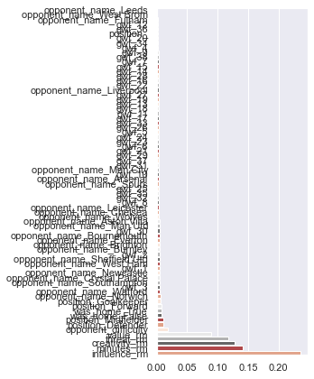
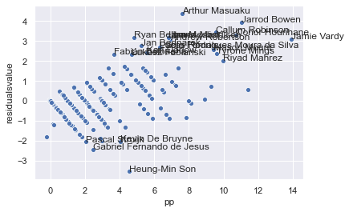

# Predicting FPL Points by gameweek

Inspired by Fantasy Football Hub's point predictor as well as the Better FPL Google Chrome extension, I thought it would be interesting to try and develop my own machine learning model to predict a player's point performance in Fantasy Premier League. I didn't see any documentation behind the Hub's model, so I had to think through a way to approach this data in my own way. Obviously, Fantasy Football Hub has a financial incentive to keep that proprietary. That also gives them access to things like OptaSports data feed. I'm using only openly available data through the github repository Fantasy Premier League. An excellent aggregation of the open premier league API and some other resources.

One way to approach this is to build separate models to predict the action's behind the points. That is if you can predict a player's minutes you can probably then predict their assists and goals. When you predict this, you can estimate how many points they will earn. That's a more complicated model.

Instead, I went with total points as my dependent variable. Initially, I decided to include variables like goals, clean sheets and assists. However, I took those out because it felt that I would need to be able to predict values for those in the future weeks. Instead I decided to use Influence, Creativity, and Threat as my main variables. I've already used those to estimate a player's value and found them to be highly correlated with a player's value and performance variables. In addition I include minutes, the value of the player, and opponent information.

I decided to include the player value so I could have something tracking the market for a player. If everyone is buying someone, they either had a really good previous match or have a favorable fixture coming up. Of course, this backfired for a number managers who used their wildcard after game week 2 2020, bringing in Wolves players who blanked in game week 3.

## Smoothing

To account for the bouncing up and down of a player's metrics, I decided to smooth out Influence, Creativity, Threat, minutes, and value. I did this using a three game week window for each player. In a sense, if you played poorly for the two preceding weeks and had a brace then the good week is lowered and the preceding weeks are raised. I'm not sure if this is the best approach, but I didn't want to be too reliant on the previous match's performance. 

I guess another approach would be to not smooth, but then take the average only when you make a prediction for the coming game week.


## Independence
Because I’m using individual player information over the 2019-20 and 2020-21 seasons to estimate points, it’s important consider what model to use. Using a simple linear regression wouldn’t work because of all the violations in the independence assumption. That is the same player is repeated, the data is smoothed, and even the being on a squad may violate this assumption. A 3 level model may work with match nested within player nested within team. That is a little complex and I know I will need a lot of variables. Instead I’ll use a gradient boosted regression tree, or random forest, which will avoid some of the assumptions I need to make with other models.

## Let's begin


```python
import pandas as pd
import os
```

## Setup the data

Need to pull out some of the datasets to make it easier to match. One of the problems is with teams relegated and promoted between seasons. So I need at least the first few games of the current season to make a better prediction. Also, it is easierto get the name of the team instead of id, which changes from season to season (in this dataset at least)

- Get current and past team names
- Get information on the fixture difficulty
- Get the past players and their position information (this is not in the player gameweek data)


```python
#Dataset folders
folders = ["2019-20","2020-21"]
values = {1:"Goalkeeper",2:"Defender",3:"Midfielder",4:"Forward"}
players = {}
teams = {}
fixtures = {}

for f in folders:
    positions = {}
    teamnames = {}
    codeid = {}
    fixture = {}

    tdf = pd.read_csv("{0}/teams.csv".format(f),encoding='UTF-8')
    for idx,row in tdf.iterrows():
        teamnames[row['id']] = {"name": row['name']}
        codeid[row['code']]=row['id']
    teams[f]=teamnames
        
    pdf = pd.read_csv("{0}/players_raw.csv".format(f),encoding='UTF-8')
    for idx,row in pdf.iterrows():
        positions[row['id']] = {"name": row['first_name'] + " " + row['second_name'],
                                "position":values[row['element_type']],
                                "teamname":teamnames[codeid[row['team_code']]]['name'],
                                "teamid":codeid[row['team_code']]}
    players[f] = positions
    fdf = pd.read_csv("{0}/fixtures.csv".format(f),encoding='UTF-8')
    for idx,row in fdf.iterrows():
        fixture[row['id']] = {"awayteamid": row['team_a'],
                              "awayteamname": teamnames[row['team_a']]['name'],
                             "awayteamdiff": row['team_a_difficulty'],
                             "hometeamid": row['team_h'],
                             "hometeamdiff": row['team_h_difficulty'],
                             "hometeamname": teamnames[row['team_h']]['name']}
    fixtures[f]=fixture
    del pdf
    del tdf
    del fdf

```

Now we can load the game week data and match it to the other tables.


```python
def getdifficulty(fixtureid,hometeam,season, fd):
    if hometeam:
        return fd[season][fixtureid]['hometeamdiff']
    else:
        return fd[season][fixtureid]['awayteamdiff']
    

combined = None
for f in folders:
    for root, dirs, files in os.walk("{0}/players".format(f)):
        for di in dirs:
            temp = pd.read_csv("{0}/players/{1}/gw.csv".format(f,di),encoding='UTF-8')
            names = di.split("_")
            idv = names.pop()
            temp['id'] = idv
            temp['name'] = [" ".join(names) for i in range(len(temp))]
            temp['gw'] = temp['round']
            temp['source_year']=f
            temp['opponent_name'] = temp['opponent_team'].apply(lambda x: teams[f][x]['name'])
            temp['opponent_difficulty'] = temp[['fixture','was_home']].apply(lambda x: getdifficulty(x[0],x[1],f,fixtures),axis=1)
            
            try:
                temp['position'] = players[f][int(idv)]['position']
                temp['matchname'] = players[f][int(idv)]['name']
                temp['playerteam'] = players[f][int(idv)]['teamname']
                temp['playerteamid'] = players[f][int(idv)]['teamid']
            except:
                temp['position'] =""
                temp['matchname'] = ""
            try:
                combined = combined.append(temp)
            except:
                combined = temp.copy()

```

These are the fields that are going to be used. I separate the smooted fields to make it more automated.


```python
#numericfields = ['assists', 'bonus', 'bps', 'clean_sheets', 'creativity', 'goals_conceded', 'goals_scored',  'influence',
#                 'minutes', 'own_goals', 'penalties_missed', 'penalties_saved', 'red_cards', 'saves', 'threat',
#                'value', 'yellow_cards']
numericfields = ['creativity', 'influence', 'minutes', 'threat', 'value']
non_smoothed = ['opponent_difficulty','was_home']
categoricalfields =  ['opponent_name','gwf','position']
```


```python
for nf in numericfields:
    combined[nf+"_rm"] = 0.0
    for nm in combined['name'].unique():
        combined.loc[combined['name']==nm,nf+"_rm"]=combined[combined['name']==nm][nf].rolling(3,min_periods=1).mean()
    
```

2019-20 is a weird season for obvious reasons. The round or gameweek label doesn't run from 1 to 38. It will be easier to match the tables if they are standardized to run from 1 to 38.


```python
if len(combined['gw'].unique()) ==38:
    fixgw = {k:i+1 for i,k in enumerate(sorted(list(combined['gw'].unique())))}
    combined['gwf'] = combined['gw'].apply(lambda x: fixgw[x])
else:
    print("too few games")
fixgw
```


    {1: 1,
     2: 2,
     3: 3,
     4: 4,
     5: 5,
     6: 6,
     7: 7,
     8: 8,
     9: 9,
     10: 10,
     11: 11,
     12: 12,
     13: 13,
     14: 14,
     15: 15,
     16: 16,
     17: 17,
     18: 18,
     19: 19,
     20: 20,
     21: 21,
     22: 22,
     23: 23,
     24: 24,
     25: 25,
     26: 26,
     27: 27,
     28: 28,
     29: 29,
     39: 30,
     40: 31,
     41: 32,
     42: 33,
     43: 34,
     44: 35,
     45: 36,
     46: 37,
     47: 38}


Final list of dependent and independent variables. I'll pull these out in a new dataframe, then create dummy variables for game week and opponent.


```python
yfield = ['total_points']
fieldstouse = [f+"_rm" for f in numericfields] + categoricalfields + non_smoothed
fieldstouse
```


    ['creativity_rm',
     'influence_rm',
     'minutes_rm',
     'threat_rm',
     'value_rm',
     'opponent_name',
     'gwf',
     'position',
     'opponent_difficulty',
     'was_home']


```python
finaldf = combined[fieldstouse+yfield].copy()
finaldf = pd.get_dummies(finaldf,columns=categoricalfields)
finaldf.head()
```


<div>
<style scoped>
    .dataframe tbody tr th:only-of-type {
        vertical-align: middle;
    }

    .dataframe tbody tr th {
        vertical-align: top;
    }

    .dataframe thead th {
        text-align: right;
    }
</style>
<table border="1" class="dataframe">
  <thead>
    <tr style="text-align: right;">
      <th></th>
      <th>creativity_rm</th>
      <th>influence_rm</th>
      <th>minutes_rm</th>
      <th>threat_rm</th>
      <th>value_rm</th>
      <th>opponent_difficulty</th>
      <th>was_home</th>
      <th>total_points</th>
      <th>opponent_name_Arsenal</th>
      <th>opponent_name_Aston Villa</th>
      <th>...</th>
      <th>gwf_33</th>
      <th>gwf_34</th>
      <th>gwf_35</th>
      <th>gwf_36</th>
      <th>gwf_37</th>
      <th>gwf_38</th>
      <th>position_Defender</th>
      <th>position_Forward</th>
      <th>position_Goalkeeper</th>
      <th>position_Midfielder</th>
    </tr>
  </thead>
  <tbody>
    <tr>
      <th>0</th>
      <td>0.100000</td>
      <td>0.200000</td>
      <td>24.000000</td>
      <td>0.000000</td>
      <td>45.0</td>
      <td>4</td>
      <td>False</td>
      <td>1</td>
      <td>0</td>
      <td>0</td>
      <td>...</td>
      <td>0</td>
      <td>0</td>
      <td>0</td>
      <td>0</td>
      <td>0</td>
      <td>0</td>
      <td>0</td>
      <td>1</td>
      <td>0</td>
      <td>0</td>
    </tr>
    <tr>
      <th>1</th>
      <td>0.200000</td>
      <td>0.600000</td>
      <td>15.000000</td>
      <td>10.500000</td>
      <td>45.0</td>
      <td>3</td>
      <td>True</td>
      <td>1</td>
      <td>0</td>
      <td>0</td>
      <td>...</td>
      <td>0</td>
      <td>0</td>
      <td>0</td>
      <td>0</td>
      <td>0</td>
      <td>0</td>
      <td>0</td>
      <td>1</td>
      <td>0</td>
      <td>0</td>
    </tr>
    <tr>
      <th>2</th>
      <td>1.733333</td>
      <td>1.066667</td>
      <td>16.666667</td>
      <td>13.000000</td>
      <td>45.0</td>
      <td>2</td>
      <td>False</td>
      <td>1</td>
      <td>0</td>
      <td>0</td>
      <td>...</td>
      <td>0</td>
      <td>0</td>
      <td>0</td>
      <td>0</td>
      <td>0</td>
      <td>0</td>
      <td>0</td>
      <td>1</td>
      <td>0</td>
      <td>0</td>
    </tr>
    <tr>
      <th>3</th>
      <td>1.900000</td>
      <td>1.066667</td>
      <td>17.000000</td>
      <td>13.000000</td>
      <td>45.0</td>
      <td>4</td>
      <td>False</td>
      <td>1</td>
      <td>0</td>
      <td>0</td>
      <td>...</td>
      <td>0</td>
      <td>0</td>
      <td>0</td>
      <td>0</td>
      <td>0</td>
      <td>0</td>
      <td>0</td>
      <td>1</td>
      <td>0</td>
      <td>0</td>
    </tr>
    <tr>
      <th>4</th>
      <td>9.733333</td>
      <td>24.133333</td>
      <td>41.333333</td>
      <td>41.666667</td>
      <td>45.0</td>
      <td>3</td>
      <td>True</td>
      <td>13</td>
      <td>0</td>
      <td>0</td>
      <td>...</td>
      <td>0</td>
      <td>0</td>
      <td>0</td>
      <td>0</td>
      <td>0</td>
      <td>0</td>
      <td>0</td>
      <td>1</td>
      <td>0</td>
      <td>0</td>
    </tr>
  </tbody>
</table>
<p>5 rows × 73 columns</p>
</div>


Finally pull out the x and y arrays for input into the regression tree.


```python
xfields = list(finaldf.columns)
xfields.remove("total_points")
X = finaldf[xfields].values
y = finaldf[yfield].values.ravel()
```


```python
import numpy as np
from sklearn.metrics import mean_squared_error
from sklearn.model_selection import ShuffleSplit
from sklearn.metrics import r2_score
from sklearn.metrics import mean_absolute_error
from sklearn.metrics import mean_squared_error
from sklearn.model_selection import train_test_split
from sklearn.metrics import make_scorer
from sklearn.model_selection import GridSearchCV
from sklearn.ensemble import GradientBoostingRegressor
```

Some functions to make it easier to create the model.

Run these if you want to try and find the optimal parameters using grid search cross validation. It can take a while to find the optimal. Even then I reduced the quality of the model because it felt like it was overfitting the dataset too much (just too good of a model). It may even still be too good to be honest.


```python
def performance_metric_r2(y_true, y_predict):
    """ Calculates and returns the performance score between 
        true and predicted values based on the metric chosen. """
    
    # TODO: Calculate the performance score between 'y_true' and 'y_predict'
    score = r2_score(y_true, y_predict)
    
    # Return the score
    return score

def performance_metric_mae(y_true, y_predict):
    """ Calculates and returns the performance score between 
        true and predicted values based on the metric chosen. """
    
    # TODO: Calculate the performance score between 'y_true' and 'y_predict'
    score = -1*mean_absolute_error(y_true, y_predict)
    
    # Return the score
    return score

def performance_metric_mse(y_true, y_predict):
    """ Calculates and returns the performance score between 
        true and predicted values based on the metric chosen. """
    
    # TODO: Calculate the performance score between 'y_true' and 'y_predict'
    score = -1*mean_squared_error(y_true, y_predict)
    
    # Return the score
    return score

#score = performance_metric([3, -0.5, 2, 7, 4.2], [2.5, 0.0, 2.1, 7.8, 5.3])
#print("Model has a coefficient of determination, R^2, of {:.3f}.".format(score))


def fit_model(X, y,params=None,r2=True,mae=False,mse=False):
    """ Performs grid search over the 'max_depth' parameter for a 
        decision tree regressor trained on the input data [X, y]. """
    
    # Create cross-validation sets from the training data
    cv_sets = ShuffleSplit(X.shape[0], test_size = 0.20, random_state = 0)

    # TODO: Create a decision tree regressor object
    regressor = GradientBoostingRegressor()#DecisionTreeRegressor()

    # TODO: Create a dictionary for the parameter 'max_depth' with a range from 1 to 10
    if params == None:
        params = {'n_estimators': [100,200,300,400,500],
                  'max_depth': list(range(2,15)),
                  'min_samples_leaf':list(range(1,20)),
                  'max_features':["auto","sqrt","log2"],
                  'loss':['ls', 'lad', 'huber', 'quantile'],
                 "learning_rate":[.1,.01],
                 "subsample":[.7,0.5,1.0]}
        #
    # TODO: Transform 'performance_metric' into a scoring function using 'make_scorer' 
    if r2:
        scoring_fnc = make_scorer(performance_metric_r2)
    if mae:
        scoring_fnc = make_scorer(performance_metric_mae)
    if mse:
        scoring_fnc = make_scorer(performance_metric_mse)
    else:
        scoring_fnc = make_scorer(performance_metric_r2)
    # TODO: Create the grid search object
    grid = GridSearchCV(regressor, params, scoring = scoring_fnc,cv=5)

    # Fit the grid search object to the data to compute the optimal model
    grid = grid.fit(X, y)

    # Return the optimal model after fitting the data
    return grid.best_estimator_

print ("running")
params = {'n_estimators': [300],
                  'max_depth': [1,8,20],
                  'min_samples_leaf':[2,10],
                  'max_features':["auto","sqrt","log2"],
                  'loss':['ls','lad'],
                 "learning_rate":[.1,.01,.001],
                 "subsample":[.5,1]}
print (params)

reg = fit_model(X, y,params,r2=False,mae=False,mse=True)
tempPred= reg.predict(X)
                                       
                                       
print("Parameter 'max_depth' is {} for the optimal model.".format(reg.get_params()['max_depth']))
# Produce the value for 'max_depth'
print("Parameter 'min_samples_leaf' is {} for the optimal model.".format(reg.get_params()['min_samples_leaf']))
print("Parameter 'estimators' is {} for the optimal model.".format(reg.get_params()['n_estimators']))
print("Parameter 'maxfeatures' is {} for the optimal model.".format(reg.get_params()['max_features']))
print("Parameter 'loss' is {} for the optimal model.".format(reg.get_params()['loss']))
print("Parameter 'learning_rate' is {} for the optimal model.".format(reg.get_params()['learning_rate']))
print("Parameter 'subsample' is {} for the optimal model.".format(reg.get_params()['subsample']))


print(mean_squared_error(y, tempPred))
print(performance_metric_mae(y,tempPred)*-1)
```

    running
    {'n_estimators': [300], 'max_depth': [1, 8, 20], 'min_samples_leaf': [2, 10], 'max_features': ['auto', 'sqrt', 'log2'], 'loss': ['ls', 'lad'], 'learning_rate': [0.1, 0.01, 0.001], 'subsample': [0.5, 1]}
    Parameter 'max_depth' is 20 for the optimal model.
    Parameter 'min_samples_leaf' is 2 for the optimal model.
    Parameter 'estimators' is 300 for the optimal model.
    Parameter 'maxfeatures' is log2 for the optimal model.
    Parameter 'loss' is ls for the optimal model.
    Parameter 'learning_rate' is 0.01 for the optimal model.
    Parameter 'subsample' is 0.5 for the optimal model.
    0.7004562048121326
    0.461319596349153
    

You can see which variables \ features are the most important in make a prediction. In this case ICT obviously, but also value, minutes, and opponent strength.


```python
import matplotlib.pyplot as plt
import seaborn as sns
sns.set()
fig, ax = plt.subplots()
fig.set_size_inches(5, 6)
labelsImp = xfields
indexes = range(0,len(reg.feature_importances_))
l = list(zip(indexes,list(reg.feature_importances_)))
l.sort(key=lambda x: x[1])
labelind = [x[0] for x in l]
values = [x[1] for x in l]
lbls = [labelsImp[x[0]] for x in l]
sns.barplot(values,lbls,palette=sns.color_palette("RdGy"),ax=ax)
plt.tight_layout()
#plt.savefig("variable importance rf.png",dpi=300)
```





```python
params = {'n_estimators': [500],
                  'max_depth': [35],
                  'min_samples_leaf':[2],
                  'max_features':["log2"],
                  'loss':['ls'],
                 "learning_rate":[.01],
                 "subsample":[.5]}
print (params)
reg = fit_model(X, y,params,r2=False,mae=False,mse=True)
predicted_points = reg.predict(X)


print(r2_score(y, predicted_points))
```

    {'n_estimators': [500], 'max_depth': [35], 'min_samples_leaf': [2], 'max_features': ['log2'], 'loss': ['ls'], 'learning_rate': [0.01], 'subsample': [0.5]}
    0.9174437125069
    


```python
print(mean_squared_error(y, predicted_points))
print(performance_metric_mae(y, predicted_points)*-1)
print(r2_score(y, predicted_points))
```

    0.527432138789291
    0.38895890802677296
    0.9174437125069
    

We can see the model has trouble with high points (e.g. Jamie Vardy), and tends to over estimate or someone like Son underestimated them.. That isn't too surprising. Most players average under 4 points regardless of their position.


```python
finaldf['pp'] = predicted_points
finaldf['name'] = combined['name']
finaldf['source_year'] = combined['source_year']
finaldf['playerteamid'] = combined['playerteamid']
finaldf['playerteamname'] = combined['playerteam']
```


```python

finaldf['residualsvalue'] = finaldf['total_points'] - finaldf['pp']
ax = sns.scatterplot(x="pp",y="residualsvalue",data=finaldf[(finaldf['gwf_3']==1)&(finaldf['source_year']=='2020-21')])
for idx,row in finaldf[(finaldf['gwf_3']==1)&(finaldf['source_year']=='2020-21')].iterrows():
    if row["residualsvalue"] > 2:
        ax.text(row['pp'],row['residualsvalue'],row['name'])
    if row["residualsvalue"] <-2:
        ax.text(row['pp'],row['residualsvalue'],row['name'])
```





# Prediction

Now for the prediction. I usethe smoothed values from all the players in game week 3 in 2020. First I grab the future fixtures (this can be used for each week), then assign them to game week 4 of all the players.

You can see these predictions in a visualization here [Player Point Predictions](https://public.tableau.com/profile/ssalib2#!/vizhome/PlayerPointPredictions/PlayerPointPredictions).


```python
fdf = pd.read_csv("2020-21/fixtures.csv".format(f),encoding='UTF-8')
upcoming = {}
for idx,row in fdf.iterrows():
    if row['event'] in upcoming.keys():
        upcoming[row['event']].append({"fixtureid":row['id'],
                            "awayteamid": row['team_a'],
                          "awayteamname": teamnames[row['team_a']]['name'],
                         "awayteamdiff": row['team_a_difficulty'],
                         "hometeamid": row['team_h'],
                         "hometeamdiff": row['team_h_difficulty'],
                         "hometeamname": teamnames[row['team_h']]['name']} )
    else:
        upcoming[row['event']] = [{"fixtureid":row['id'],
                            "awayteamid": row['team_a'],
                          "awayteamname": teamnames[row['team_a']]['name'],
                         "awayteamdiff": row['team_a_difficulty'],
                         "hometeamid": row['team_h'],
                         "hometeamdiff": row['team_h_difficulty'],
                         "hometeamname": teamnames[row['team_h']]['name']}]
```


```python
playerpred = finaldf[(finaldf['gwf_3']==1)&(finaldf['source_year']=="2020-21")].copy()

for idx,row in playerpred.iterrows():
    for k in row.keys():
        if "opponent_name" in k:
            playerpred[k]=0
        if "gwf_" in k:
            playerpred[k]=0
playerpred['OpponentLabel'] = ""
playerpred['gwf_4'] = 1
for f in upcoming[4.0]:
    playerpred.loc[playerpred['playerteamid'] == f['awayteamid'],"opponent_difficulty"] = f['awayteamdiff']
    playerpred.loc[playerpred['playerteamid'] == f['awayteamid'],"was_home"] = 0
    playerpred.loc[playerpred['playerteamid'] == f['awayteamid'],"opponent_name_{0}".format(f['hometeamname'])] = 1
    playerpred.loc[playerpred['playerteamid'] == f['awayteamid'],"OpponentLabel"] = f['hometeamname']
    playerpred.loc[playerpred['playerteamid'] == f['hometeamid'],"opponent_difficulty"] = f['hometeamdiff']
    playerpred.loc[playerpred['playerteamid'] == f['hometeamid'],"was_home"] = 1
    playerpred.loc[playerpred['playerteamid'] == f['hometeamid'],"opponent_name_{0}".format(f['awayteamname'])] = 1
    playerpred.loc[playerpred['playerteamid'] == f['hometeamid'],"OpponentLabel"] = f['awayteamname']

Xp = playerpred[xfields].values
yp = playerpred[yfield].values.ravel()
predicted_points_p = reg.predict(Xp)
playerpred['gw4pp'] = predicted_points_p
```


```python
fplteam = ['Illan Meslier','Trent Alexander-Arnold','Stuart Dallas','Virgil van Dijk','Gabriel Magalhães',
           'Donny van de Beek','Bruno Miguel Borges Fernandes','Andros Townsend','Timo Werner','Raúl Jiménez','Neal Maupay',
          'Liam Cooper','Declan Rice']
for x in fplteam:
    print(x)
    print(playerpred[playerpred['name']==x][['gw4pp','opponent_difficulty']])

```

    Illan Meslier
          gw4pp  opponent_difficulty
    2  3.001944                    4
    Trent Alexander-Arnold
          gw4pp  opponent_difficulty
    2  4.259211                    2
    Stuart Dallas
          gw4pp  opponent_difficulty
    2  1.459816                    4
    Virgil van Dijk
          gw4pp  opponent_difficulty
    2  4.184963                    2
    Gabriel Magalhães
          gw4pp  opponent_difficulty
    2  2.950942                    3
    Donny van de Beek
        gw4pp  opponent_difficulty
    1  2.7269                    3
    Bruno Miguel Borges Fernandes
          gw4pp  opponent_difficulty
    1  8.918539                    3
    Andros Townsend
          gw4pp  opponent_difficulty
    2  5.525414                    4
    Timo Werner
          gw4pp  opponent_difficulty
    2  3.307104                    2
    Raúl Jiménez
          gw4pp  opponent_difficulty
    2  6.602244                    2
    Neal Maupay
          gw4pp  opponent_difficulty
    2  7.412055                    3
    Liam Cooper
         gw4pp  opponent_difficulty
    2  0.55204                    4
    Declan Rice
          gw4pp  opponent_difficulty
    2  2.249204                    4
    


```python
import pickle
from joblib import dump, load
#pickle.dumps(reg,open("pointpredictor_all.p",'w'))
dump(reg, 'pointpredictor_reduced.joblib') 
```


    ['pointpredictor_reduced.joblib']


```python
reg = load("pointpredictor_reduced.joblib")
```


```python
playerpred.to_csv("playerpointpredictions_gw4.csv")
```


```python

```
