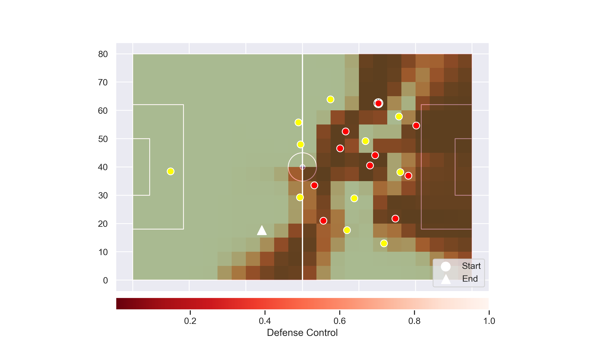

# Liverpool 2019 Goals Summary


### Keywords: Fast and Opportunistic

Liverpool is a fast team compared to their opponents. If you consider the speed of each player their overall speed is about 1 meter per second faster than the opponents in this goal dataset (vertical line inside the boxes). 


This speed can be combined with pressing and taken advantage of player's mistakes. A good example is from this match betwen Southampton. What began as a set piece opportunity for Southampton quickly turned into a goal for Liverpool, through their speed and constant pressure.


<iframe
    width="560"
    height="315"
    src="https://www.youtube.com/embed/lUM3ylbRF0w?start=461&end=482"
    frameborder="0"
    allowfullscreen
></iframe>


<iframe width="560" height="315" src="https://www.youtube.com/embed/s-FWBB0sffs" frameborder="0" allow="accelerometer; autoplay; encrypted-media; gyroscope; picture-in-picture" allowfullscreen></iframe>


## Passing Information

Trent Alexander-Arnold, Sadio Mane, and Roberto Firmino were most frequent in starting a pass to the other players. Sadio Mane also was frequently the recipient of these passes from the other players. Sadio Mane's most frequent partnership was to Roberto Firmino, and the opposite was also true. Mohammad Salah was an active recipient of the ball, but less frequent in terms of starting a passing play. This is probably due to his position and speed.


### By Overall Position

Not surprisingly, midfielders play an important role in distributing the ball to the forwards. However, every position still works towards moving the ball to the other positions.


## Risk and Reward

Liverpool relies on their speed and passing ability to create chances. Often this means they will pass into an area that is not under their control. On average, the opponent teams have a greater than 56% chance of getting to the ball before Liverpool (derived from pitch control probabilities). The reward, of course, is that the risky pass results in a goal, but it's also very possible that the ball could have been intercepted.

For example, in this sequence of passes against Everton , Everton had a 65% chance of getting to the ball over Liverpool. However, Liverpool's speed gave them an edge.

You may need to visit the video below if it does not appear: [https://youtu.be/1bE6rjf_9MY?t=155](https://youtu.be/1bE6rjf_9MY?t=155)


<iframe
    width="560"
    height="315"
    src="https://youtu.be/1bE6rjf_9MY?t=155"
    frameborder="0"
    allowfullscreen
></iframe>


The play below demonstrates a pass made across the field from Trent Alexander-Arnold to Sadio Mane. This pass was placed in area of the pitch that was largely under control of Everton before it left Alexander-Arnold's foot.


<iframe width="560" height="315" src="https://www.youtube.com/embed/UnsL_LbxEdI" frameborder="0" allow="accelerometer; autoplay; encrypted-media; gyroscope; picture-in-picture" allowfullscreen></iframe>


In the figure below presents pitch control from the point of the pass start, and represent areas that Alexander-Arnold could pass to and which player would most likely reach the ball first. The darker areas are locations that a Liverpool player was more likely to reach. The triangle represents the final location of the pass event, this area at the start of the pass was under the control of Everton. Alexander-Arnold had the confidence Sadio Mane would be able to reach the point faster than anyone else.


```python
Image("everton_pitchcontrol_2ndpass.png")
```





If we assume a constant velocity of 5 meters per second, these potential path areas (ellipses) demonstrate the areas that could be reached from the player's position at the beginning of the pass event. There is at least one Liverpool player (Mane) and one Everton player that could have reached the ball by the time it landed. Possibly a Second Everton player. None of their ellipses touch the final position, so they would have had to have sped up to reach it in time.


```python
Image("everton_pitchcontrol_2ndpass_ellipse.png")
```


Notes:

I spoke generally about Liverpool, but it shouldn't be forgotten this is a biased sample of highlight worthy goals. There is no comparison to failed attempts. For example: How often does liverpool place the ball in these limited control spaces and then lose?
