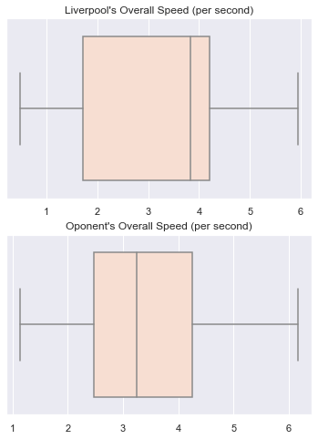

```python
import geopandas as gpd
from shapely.geometry.point import Point
from shapely.geometry import LineString
from shapely.geometry import Polygon
import matplotlib.pyplot as plt
import numpy as np
import seaborn as sns
import pandas as pd
from shapely import affinity
from IPython.display import IFrame
from IPython.display import Image
from IPython.core.display import display, HTML


```


```python
%load_ext autoreload
%autoreload 2
sns.set()
%matplotlib inline
palette = sns.color_palette("Reds")

# Use palplot and pass in the variable:
sns.set_palette(palette)
```


```python
from ssalib2 import SpatialSoccer
```


```python
data = pd.read_csv('positional_data/liverpool_2019.csv')
data['team'].fillna('ball',inplace=True)
pitchgdf = SpatialSoccer.build_polygon_pitch_statsbomb()
ball_only = data[data['team']=='ball'].copy()
points = []
for idx,row in ball_only.iterrows():
    point = Point(SpatialSoccer.percent_coordinates_to_statsbomb(row['x'],row['y'],flip_y=False))
    points.append(point)

ball_gdf = gpd.GeoDataFrame(ball_only,geometry=points)
ball_gdf['time'] = ball_gdf['frame']/20
points = []
buffers = []
for idx,row in data[data['team']!='ball'].iterrows():
    point = Point(SpatialSoccer.percent_coordinates_to_statsbomb(row['x'],row['y'],flip_y=False))
    points.append(point)
    buffers.append(point.buffer(1.8))
gdf_all = gpd.GeoDataFrame(data[data['team']!='ball'],geometry=points)
gdf_all["buffer"] = buffers
gdf_all["point"] = points
gdf_all['ballposession'] = np.zeros(len(gdf_all))
gdf_all['time'] = gdf_all['frame']/20
eventdf = pd.read_csv("liverpool_pass_events_probability.csv")
```


```python
# -*- coding: utf-8 -*-
"""
Produces simple Sankey Diagrams with matplotlib.
@author: Anneya Golob & marcomanz & pierre-sassoulas & jorwoods
                      .-.
                 .--.(   ).--.
      <-.  .-.-.(.->          )_  .--.
       `-`(     )-'             `)    )
         (o  o  )                `)`-'
        (      )                ,)
        ( ()  )                 )
         `---"\    ,    ,    ,/`
               `--' `--' `--'
                |  |   |   |
                |  |   |   |
                '  |   '   |
"""

from collections import defaultdict

import matplotlib
matplotlib.use('Agg')
import matplotlib.pyplot as plt
import numpy as np
import pandas as pd
import seaborn as sns


class PySankeyException(Exception):
    pass


class NullsInFrame(PySankeyException):
    pass


class LabelMismatch(PySankeyException):
    pass


def check_data_matches_labels(labels, data, side):
    if len(labels) > 0:
        if isinstance(data, list):
            data = set(data)
        if isinstance(data, pd.Series):
            data = set(data.unique().tolist())
        if isinstance(labels, list):
            labels = set(labels)
        if labels != data:
            msg = "\n"
            if len(labels) <= 20:
                msg = "Labels: " + ",".join(labels) + "\n"
            if len(data) < 20:
                msg += "Data: " + ",".join(data)
            raise LabelMismatch('{0} labels and data do not match.{1}'.format(side, msg))


def sankey(left, right, leftWeight=None, rightWeight=None, colorDict=None,
           leftLabels=None, rightLabels=None, aspect=4, rightColor=False,
           fontsize=14, figureName=None, closePlot=False,fileType="png",resolution=150,returnFigure=False,
           fig=None,subplot=111):
    '''
    Make Sankey Diagram showing flow from left-->right

    Inputs:
        left = NumPy array of object labels on the left of the diagram
        right = NumPy array of corresponding labels on the right of the diagram
            len(right) == len(left)
        leftWeight = NumPy array of weights for each strip starting from the
            left of the diagram, if not specified 1 is assigned
        rightWeight = NumPy array of weights for each strip starting from the
            right of the diagram, if not specified the corresponding leftWeight
            is assigned
        colorDict = Dictionary of colors to use for each label
            {'label':'color'}
        leftLabels = order of the left labels in the diagram
        rightLabels = order of the right labels in the diagram
        aspect = vertical extent of the diagram in units of horizontal extent
        rightColor = If true, each strip in the diagram will be be colored
                    according to its left label
    Ouput:
        None
    '''
    if leftWeight is None:
        leftWeight = []
    if rightWeight is None:
        rightWeight = []
    if leftLabels is None:
        leftLabels = []
    if rightLabels is None:
        rightLabels = []
    # Check weights
    if len(leftWeight) == 0:
        leftWeight = np.ones(len(left))

    if len(rightWeight) == 0:
        rightWeight = leftWeight
    if fig == None:
        plt.figure()
    else:
        fig.add_subplot(subplot) 
        
    plt.rc('text', usetex=False)
    #plt.rc('font', family='serif')

    # Create Dataframe
    if isinstance(left, pd.Series):
        left = left.reset_index(drop=True)
    if isinstance(right, pd.Series):
        right = right.reset_index(drop=True)
    dataFrame = pd.DataFrame({'left': left, 'right': right, 'leftWeight': leftWeight,
                              'rightWeight': rightWeight}, index=range(len(left)))

    if len(dataFrame[(dataFrame.left.isnull()) | (dataFrame.right.isnull())]):
        raise NullsInFrame('Sankey graph does not support null values.')

    # Identify all labels that appear 'left' or 'right'
    allLabels = pd.Series(np.r_[dataFrame.left.unique(), dataFrame.right.unique()]).unique()

    # Identify left labels
    if len(leftLabels) == 0:
        leftLabels = pd.Series(dataFrame.left.unique()).unique()
    else:
        check_data_matches_labels(leftLabels, dataFrame['left'], 'left')

    # Identify right labels
    if len(rightLabels) == 0:
        rightLabels = pd.Series(dataFrame.right.unique()).unique()
    else:
        check_data_matches_labels(rightLabels, dataFrame['right'], 'right')
    # If no colorDict given, make one
    if colorDict is None:
        colorDict = {}
        palette = "Reds"
        colorPalette = sns.color_palette(palette, len(allLabels))
        for i, label in enumerate(allLabels):
            colorDict[label] = colorPalette[i]
    else:
        missing = [label for label in allLabels if label not in colorDict.keys()]
        if missing:
            msg = "The colorDict parameter is missing values for the following labels : "
            msg += '{}'.format(', '.join(missing))
            raise ValueError(msg)

    # Determine widths of individual strips
    ns_l = defaultdict()
    ns_r = defaultdict()
    for leftLabel in leftLabels:
        leftDict = {}
        rightDict = {}
        for rightLabel in rightLabels:
            leftDict[rightLabel] = dataFrame[(dataFrame.left == leftLabel) & (dataFrame.right == rightLabel)].leftWeight.sum()
            rightDict[rightLabel] = dataFrame[(dataFrame.left == leftLabel) & (dataFrame.right == rightLabel)].rightWeight.sum()
        ns_l[leftLabel] = leftDict
        ns_r[leftLabel] = rightDict

    # Determine positions of left label patches and total widths
    leftWidths = defaultdict()
    for i, leftLabel in enumerate(leftLabels):
        myD = {}
        myD['left'] = dataFrame[dataFrame.left == leftLabel].leftWeight.sum()
        if i == 0:
            myD['bottom'] = 0
            myD['top'] = myD['left']
        else:
            myD['bottom'] = leftWidths[leftLabels[i - 1]]['top'] + 0.02 * dataFrame.leftWeight.sum()
            myD['top'] = myD['bottom'] + myD['left']
            topEdge = myD['top']
        leftWidths[leftLabel] = myD

    # Determine positions of right label patches and total widths
    rightWidths = defaultdict()
    for i, rightLabel in enumerate(rightLabels):
        myD = {}
        myD['right'] = dataFrame[dataFrame.right == rightLabel].rightWeight.sum()
        if i == 0:
            myD['bottom'] = 0
            myD['top'] = myD['right']
        else:
            myD['bottom'] = rightWidths[rightLabels[i - 1]]['top'] + 0.02 * dataFrame.rightWeight.sum()
            myD['top'] = myD['bottom'] + myD['right']
            topEdge = myD['top']
        rightWidths[rightLabel] = myD

    # Total vertical extent of diagram
    xMax = topEdge / aspect

    # Draw vertical bars on left and right of each  label's section & print label
    for leftLabel in leftLabels:
        plt.fill_between(
            [-0.02 * xMax, 0],
            2 * [leftWidths[leftLabel]['bottom']],
            2 * [leftWidths[leftLabel]['bottom'] + leftWidths[leftLabel]['left']],
            color=colorDict[leftLabel],
            alpha=0.99
        )
        plt.text(
            -0.05 * xMax,
            leftWidths[leftLabel]['bottom'] + 0.5 * leftWidths[leftLabel]['left'],
            leftLabel,
            {'ha': 'right', 'va': 'center'},
            fontsize=fontsize
        )
    for rightLabel in rightLabels:
        plt.fill_between(
            [xMax, 1.02 * xMax], 2 * [rightWidths[rightLabel]['bottom']],
            2 * [rightWidths[rightLabel]['bottom'] + rightWidths[rightLabel]['right']],
            color=colorDict[rightLabel],
            alpha=0.99
        )
        plt.text(
            1.05 * xMax,
            rightWidths[rightLabel]['bottom'] + 0.5 * rightWidths[rightLabel]['right'],
            rightLabel,
            {'ha': 'left', 'va': 'center'},
            fontsize=fontsize
        )

    # Plot strips
    for leftLabel in leftLabels:
        for rightLabel in rightLabels:
            labelColor = leftLabel
            if rightColor:
                labelColor = rightLabel
            if len(dataFrame[(dataFrame.left == leftLabel) & (dataFrame.right == rightLabel)]) > 0:
                # Create array of y values for each strip, half at left value,
                # half at right, convolve
                ys_d = np.array(50 * [leftWidths[leftLabel]['bottom']] + 50 * [rightWidths[rightLabel]['bottom']])
                ys_d = np.convolve(ys_d, 0.05 * np.ones(20), mode='valid')
                ys_d = np.convolve(ys_d, 0.05 * np.ones(20), mode='valid')
                ys_u = np.array(50 * [leftWidths[leftLabel]['bottom'] + ns_l[leftLabel][rightLabel]] + 50 * [rightWidths[rightLabel]['bottom'] + ns_r[leftLabel][rightLabel]])
                ys_u = np.convolve(ys_u, 0.05 * np.ones(20), mode='valid')
                ys_u = np.convolve(ys_u, 0.05 * np.ones(20), mode='valid')

                # Update bottom edges at each label so next strip starts at the right place
                leftWidths[leftLabel]['bottom'] += ns_l[leftLabel][rightLabel]
                rightWidths[rightLabel]['bottom'] += ns_r[leftLabel][rightLabel]
                plt.fill_between(
                    np.linspace(0, xMax, len(ys_d)), ys_d, ys_u, alpha=0.65,
                    color=colorDict[labelColor]
                )
    plt.gca().axis('off')
    #plt.gcf().set_size_inches(10,10)
    if figureName != None:
        plt.savefig("{}.{}".format(figureName,fileType), bbox_inches='tight', dpi=resolution)
    if closePlot:
        plt.close()
    if returnFigure:
        return (plt.gca(),plt.gcf())
```

# Liverpool 2019 Goals Summary


### Keywords: Fast and Opportunistic

Liverpool is a fast team compared to their opponents. If you consider the speed of each player their overall speed is about 1 meter per second faster than the opponents in this goal dataset (vertical line inside the boxes). 


```python
attack_velocities = []
defense_velocities = []
for play in gdf_all['play'].unique():
    gdf = gdf_all[gdf_all['play']==play].copy()
    SpatialSoccer.player_velocities(gdf,"player","geometry","time")
    attack_velocities.append(np.median(gdf[(gdf['team']=='attack')&(gdf['velocity'].notnull())]['velocity'].values)) #[g for g in gdf[(gdf['team']=='attack')&(gdf['velocity'].notnull())]['velocity'].values]
    defense_velocities.append(np.median( gdf[(gdf['team']=='defense')&(gdf['velocity'].notnull())]['velocity'].values)) #[g for g in gdf[(gdf['team']=='defense')&(gdf['velocity'].notnull())]['velocity'].values]
```


```python
#sns.distplot(attack_velocities,kde=False, bins=10);
fig = plt.figure(figsize = (6,8))
ax = fig.add_subplot(211)
sns.boxplot(ax=ax, x=attack_velocities);
ax.set_title("Liverpool's Overall Speed (per second)")
ax = fig.add_subplot(212)
sns.boxplot(ax=ax, x=defense_velocities);
ax.set_title("Oponent's Overall Speed (per second)");

```





This speed can be combined with pressing and taken advantage of player's mistakes. A good example is from this match betwen Southampton. What began as a set piece opportunity for Southampton quickly turned into a goal for Liverpool, through their speed and constant pressure.


```python
import IPython

IPython.display.IFrame('https://www.youtube.com/embed/lUM3ylbRF0w?start=461&end=482',560,315)

```


<iframe
    width="560"
    height="315"
    src="https://www.youtube.com/embed/lUM3ylbRF0w?start=461&end=482"
    frameborder="0"
    allowfullscreen
></iframe>


```python
IPython.display.Video('liverpool_goals/posession_Southampton 1 - [2] Liverpool.mp4',width=800)
```


<video src="liverpool_goals/posession_Southampton 1 - [2] Liverpool.mp4" controls  width="800" >
      Your browser does not support the <code>video</code> element.
    </video>


## Passing Information

Trent Alexander-Arnold, Sadio Mane, and Roberto Firmino were most frequent in starting a pass to the other players. Sadio Mane also was frequently the recipient of these passes from the other players. Sadio Mane's most frequent partnership was to Roberto Firmino, and the opposite was also true. Mohammad Salah was an active recipient of the ball, but less frequent in terms of starting a passing play. This is probably due to his position and speed.


```python
counts = eventdf[eventdf['event_type']=='pass'][['player_start','player_end','player_shirt_start','player_shirt_end']].groupby(['player_shirt_start','player_shirt_end']).count().reset_index().rename(columns = {'player_shirt_start':'source',
'player_shirt_end':'target','player_start':'value'})
names = {4.0:['Virgil van Dijk','Defender','#fff5f0'],
        5.0:['Georginio Wijnaldum','Midfielder','#fee0d2'],
        7.0:['James Milner','Midfielder','#fcbba1'],
        8.0:['Naby Keïta','Midfielder','#fc9272'],
        9.0:['Roberto Firmino','Forward','#fb6a4a'],
        10.0:['Sadio Mane','Forward','#ef3b2c'],
        11.0:['Mohamed Salah','Forward',''],
        12.0:['Joe Gomez','Defender',''],
        14.0:['Jordan Henderson','Midfielder',''],
        20.0:['Adam Lallana','Midfielder',''],
        23.0:['Xherdan Shaqiri','Forward',''],
        26.0:['Andrew Robertson', 'Defender',''],
        27.0:['Divock Origi','Forward',''],
        66.0:['Trent Alexander-Arnold','Defender','']}

counts['sourcename'] = counts['source'].apply(lambda x: names[x][0])
counts['targetname'] = counts['target'].apply(lambda x: names[x][0])
counts['sourcepos'] = counts['source'].apply(lambda x: names[x][1])
counts['targetpos'] = counts['target'].apply(lambda x: names[x][1])
fig = plt.figure(figsize = (10,10))

sankey(
    left=counts['sourcename'], right=counts['targetname'],leftWeight= counts['value'], rightWeight=counts['value'], aspect=4,
    fontsize=12, figureName="test_passes",rightColor=False,resolution=300,
    returnFigure=False, fig=fig,subplot=111
)

```


### By Overall Position

Not surprisingly, midfielders play an important role in distributing the ball to the forwards. However, every position still works towards moving the ball to the other positions.


```python
countspos = counts[['sourcepos','targetpos','value']].groupby(['sourcepos','targetpos']).sum().reset_index()
```


```python
fig = plt.figure(figsize = (10,10))
sankey(
    left=countspos['sourcepos'], right=countspos['targetpos'],leftWeight= counts['value'], rightWeight=counts['value'], aspect=4,
    fontsize=8, figureName="test_passes",rightColor=False,returnFigure=False, fig=fig,subplot=111
)
```


## Risk and Reward

Liverpool relies on their speed and passing ability to create chances. Often this means they will pass into an area that is not under their control. On average, the opponent teams have a greater than 56% chance of getting to the ball before Liverpool (derived from pitch control probabilities). The reward, of course, is that the risky pass results in a goal, but it's also very possible that the ball could have been intercepted.

For example, in this sequence of passes against Everton , Everton had a 65% chance of getting to the ball over Liverpool. However, Liverpool's speed gave them an edge.

You may need to visit the video below if it does not appear: [https://youtu.be/1bE6rjf_9MY?t=155](https://youtu.be/1bE6rjf_9MY?t=155)


```python
IPython.display.IFrame('https://youtu.be/1bE6rjf_9MY?t=155',560,315)
```


<iframe
    width="560"
    height="315"
    src="https://youtu.be/1bE6rjf_9MY?t=155"
    frameborder="0"
    allowfullscreen
></iframe>


The play below demonstrates a pass made across the field from Trent Alexander-Arnold to Sadio Mane. This pass was placed in area of the pitch that was largely under control of Everton before it left Alexander-Arnold's foot.


```python
IPython.display.Video('liverpool_goals/posession_Liverpool [2] - 0 Everton.mp4',width=800)
```


<video src="liverpool_goals/posession_Liverpool [2] - 0 Everton.mp4" controls  width="800" >
      Your browser does not support the <code>video</code> element.
    </video>


In the figure below presents pitch control from the point of the pass start, and represent areas that Alexander-Arnold could pass to and which player would most likely reach the ball first. The darker areas are locations that a Liverpool player was more likely to reach. The triangle represents the final location of the pass event, this area at the start of the pass was under the control of Everton. Alexander-Arnold had the confidence Sadio Mane would be able to reach the point faster than anyone else.


```python
Image("everton_pitchcontrol_2ndpass.png")
```


If we assume a constant velocity of 5 meters per second, these potential path areas (ellipses) demonstrate the areas that could be reached from the player's position at the beginning of the pass event. There is at least one Liverpool player (Mane) and one Everton player that could have reached the ball by the time it landed. Possibly a Second Everton player. None of their ellipses touch the final position, so they would have had to have sped up to reach it in time.


```python
Image("everton_pitchcontrol_2ndpass_ellipse.png")
```


Notes:

I spoke generally about Liverpool, but it shouldn't be forgotten this is a biased sample of highlight worthy goals. There is no comparison to failed attempts. For example: How often does liverpool place the ball in these limited control spaces and then lose?
