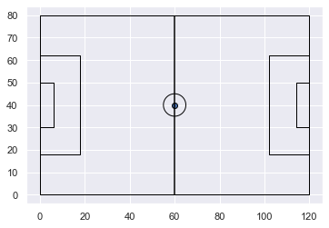
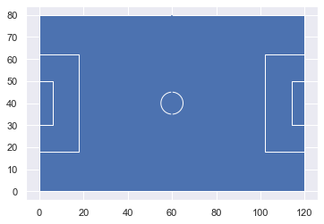

# Spatial Soccer

### Building a geographic approach to analyzing football data

Soccer (football) is one of the most spatial sports out there. I guess all sports are inherently spatial, but with soccer there is the constant movement of a ball on the soccer pitch along with the dynamics of the player positioning. This all happens with a nicely defined boundary and acts as a closed space. Ice hockey of course is very similar to this, but is played on ice with higher scoring. Basketball would also be very spatial with constant movement. Some geographers have already looked at basketball (most famously by [Kirk Goldsberry's shot maps](https://grantland.com/features/nba-finals-2014-miami-heat-san-antonio-spurs-shooters-lebron-james/)).

This shall be my attempt to understand the dynamics of soccer using mapping and spatial analyses approaches. I'm particularly interested in spatial trajectories and have studied these before. I have a background in Time Geography, which lends itself so well to movement and interactions. I hope to build towards that, but the data only goes so far.

Ultimately, that means I will be using Python's extensive Spatial libraries like shapely, and geopandas to build visualizations of soccer data.

The dataset I'm using is pulled from StatsBomb and their dump of structured matches. Events have already been classified for us (pass, receive, shot, goal, etc...). Unfortunately there doesn't seem to be true streaming data available from something like TRACAB. The raw data would require processing. Ideally, we could know where each player was at each time point to really understand trajectories and interactions between players. 

Here are some of the libraries I will be using.


```python
import geopandas as gpd
from shapely.geometry.point import Point
from shapely.geometry import LineString
from shapely.geometry import Polygon
import matplotlib.pyplot as plt
import numpy as np
import seaborn as sns
import pandas as pd

sns.set()
%matplotlib inline

```

## Pitch Coordinates

To begin it is useful to build the pitch and have it on hand as a background for visualizaitons. According the the event guide from StatsBomb, the pitch coordinates are organized with the origin in the upper left. I have a lot of trouble thinking in this way, and to really open up visualization and analysis possiblities it will be easier to flip the origin.  In Geography, we tend to follow the cartesian coordinate system where the origin would be in the lower left and positively increasing to the right and up. I know with some graphic programs it is common to have an origin in the upper left and then positively increasing values as you go down and to the right. I assume this was done because of the tracking system, but I'm not sure the motivation for this.

I have two simple functions to do this for me. One could do a whole list, the other is for one at a time.


```python
def FlipCoords(list_of_values):
    mx = max(list_of_values)
    mn = min(list_of_values)
    return [(mx+mn)-x for x in list_of_values]

def FlipCoordsMinMax(value,mx,mn):
    return (mx+mn)-value


FlipCoords([0,18,30,36,44,50,62,80])
```


    [80, 62, 50, 44, 36, 30, 18, 0]


I pulled out the coordinate pairs for each of the main features, excluding the actual net. I decided to use polygons rather than lines because I could always visualize the polygons as lines if I want. It will be more flexible. Each list of coordinate pairs ends with the same beginning pair.


```python
#polygons
outside_line_pairs = [(0,0),(120,0),(120,80),(0,80),(0,0)]
left_penalty_box = [(0,18),(18,18),(18,62),(0,62),(0,18)]
right_penalty_box = [(120,18),(102,18),(102,62),(120,62),(120,18)]
left_goal_box = [(0,30),(6,30),(6,50),(0,50),(0,30)]
right_goal_box = [(120,30),(114,30),(114,50),(120,50),(120,30)]

#circle
center = [(60,40)]

#linestring
halfway_line = [(60,0),(60,80)]


```

These were the raw coordinates taken from the StatsBomb documentation. They need to be flipped along the Y-Axis. I did this individually. I'm sure there would be faster ways to do this.


```python
#Y Correction

outside_line_pairs = [(v[0],FlipCoordsMinMax(v[1],80,0)) for v in outside_line_pairs]
left_penalty_box = [(v[0],FlipCoordsMinMax(v[1],80,0)) for v in left_penalty_box]
right_penalty_box = [(v[0],FlipCoordsMinMax(v[1],80,0)) for v in right_penalty_box]
left_goal_box = [(v[0],FlipCoordsMinMax(v[1],80,0)) for v in left_goal_box]
right_goal_box = [(v[0],FlipCoordsMinMax(v[1],80,0)) for v in right_goal_box]
center = [(v[0],FlipCoordsMinMax(v[1],80,0)) for v in center]
halfway_line = [(v[0],FlipCoordsMinMax(v[1],80,0)) for v in halfway_line]
```

I initially create a dataframe to store a description of each polygon. Left and right is determined by how you look down on the pitch. Secondly, I build a list of the actual polygon objects, and a line string. I used the buffer tool to create the circle at the center of the pitch.

Alternatively, I could have made each half of the field a separate polygon.


```python
#DataFrame
df_dict = {"Description":['Outside Boundary Line','Left Side Penalty Box','Right Side Penalty Box',
                          'Left Goal Box', 'Right Goal Box','Center Circle Point', 'Center Circle','Halfway Line']}
geometry = [Polygon(outside_line_pairs),Polygon(left_penalty_box),
           Polygon(right_penalty_box),Polygon(left_goal_box),Polygon(right_goal_box),Point(center),
           Point(center).buffer(5),LineString(halfway_line)]
pitchgdf = gpd.GeoDataFrame(df_dict,geometry=geometry)
```

Geopandas includes a plot function that that will automatically plot out the geographic data. The default is pretty good with seaborn set. Unfortunately, we lost the halfway line.


```python
pitchgdf.plot();
```


Colors and other options can be set directly.


```python
pitchgdf.plot(facecolor='none', edgecolor='black');
```





Alternatively you could iterate and plot each piece individually. Finally, you can save this as a pickle for later, but it is a little tricky to load it back into geopandas. I will package all of this up into a class called SpatialSoccer to make it easier to use in the other notebooks.


```python
pitchgdf.to_pickle("pitchgdf.p")
```

To load it back from a pickle.


```python
pitchdf = pd.read_pickle("pitchgdf.p")
pitchgdf = gpd.GeoDataFrame(pitchdf).set_geometry('geometry')
pitchgdf.plot();
```





```python
pitchgdf.plot(facecolor='#538032', edgecolor='#ffffff');
```


```python

```
