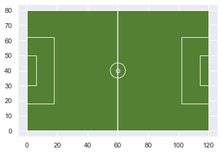
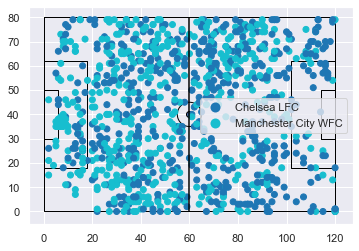
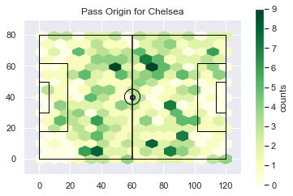
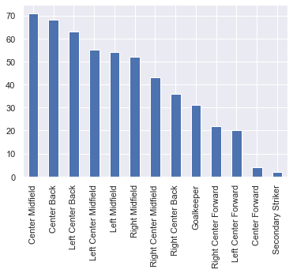
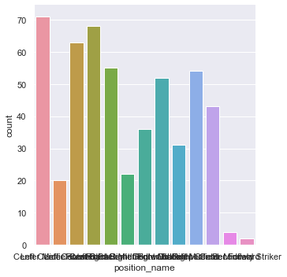
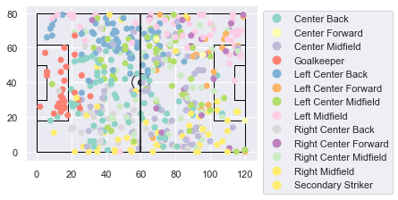
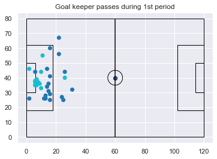

# Loading Events


A big portion of the work will be to load the data into a useable form. The data from StatsBomb comes as a JSON format which is great way to share data in a structured form. However, it tends to be nested in different ways (values of objects or arrays) which does not necessarily fit into the dataframe view of analysis. That will require some processing. I will experiment in some different ways to load and visualize the data.

Python, naturally, includes a json library that makes it easy to load and parse json data. Pandas also includes a function to load data from json into a dataframe. Now, what ends up happening here, is we get a mix of columns that contain a single value and columns that hold dictionaries reflective of the json data structure.

I've added two new libraries to my import. One is for the json data, and the other is my SpatialSoccer class that contains a couple of static methods that I developed in the previous document. This will contain things I would like to carry over across each document, and code I think I will want to reuse.


```python
import json
from ssalib import SpatialSoccer
import geopandas as gpd
from shapely.geometry.point import Point
from shapely.geometry import LineString
from shapely.geometry import Polygon
import matplotlib.pyplot as plt
import numpy as np
import seaborn as sns
import pandas as pd

sns.set()
%matplotlib inline
```

## Data Organization

StatsBomb organizes their data dump into Competitions, Matches, Lineups, and Events. Competitions are a list of competition objects that provide information on the season, country, and competition (e.g. league).

```
{
  "competition_id" : 37,
  "season_id" : 42,
  "country_name" : "England",
  "competition_name" : "FA Women's Super League",
  "competition_gender" : "female",
  "season_name" : "2019/2020",
  "match_updated" : "2020-02-13T22:15:33.718689",
  "match_available" : "2020-02-13T22:15:33.718689"
}
```

Matches are organized by their competition ID (in a folder), then by the season id. So Competition 37 season 42 is the FA Women's Super League season id 42. This file would contain a list of the matches that were played. Each match object provides a detailed accounting of the overall picture of that match.

```
{
  "match_id" : 2275038,
  "match_date" : "2020-02-12",
  "kick_off" : "20:30:00.000",
  "competition" : {
    "competition_id" : 37,
    "country_name" : "England",
    "competition_name" : "FA Women's Super League"
  },
  "season" : {
    "season_id" : 42,
    "season_name" : "2019/2020"
  },
  "home_team" : {
    "home_team_id" : 974,
    "home_team_name" : "Reading WFC",
    "home_team_gender" : "female",
    "home_team_group" : null,
    "country" : {
      "id" : 68,
      "name" : "England"
    },
    "managers" : [ {
      "id" : 144,
      "name" : "Kelly Chambers",
      "nickname" : null,
      "dob" : null,
      "country" : {
        "id" : 68,
        "name" : "England"
      }
    } ]
  },
  "away_team" : {
    "away_team_id" : 972,
    "away_team_name" : "West Ham United LFC",
    "away_team_gender" : "female",
    "away_team_group" : null,
    "country" : {
      "id" : 68,
      "name" : "England"
    },
    "managers" : [ {
      "id" : 139,
      "name" : "Matt Beard",
      "nickname" : null,
      "dob" : "1978-01-09",
      "country" : {
        "id" : 68,
        "name" : "England"
      }
    } ]
  },
  "home_score" : 2,
  "away_score" : 0,
  "match_status" : "available",
  "last_updated" : "2020-02-13T21:25:53.724546",
  "metadata" : {
    "data_version" : "1.1.0",
    "shot_fidelity_version" : "2",
    "xy_fidelity_version" : "2"
  },
  "match_week" : 16,
  "competition_stage" : {
    "id" : 1,
    "name" : "Regular Season"
  },
  "stadium" : {
    "id" : 577,
    "name" : "Adams Park",
    "country" : {
      "id" : 68,
      "name" : "England"
    }
  },
  "referee" : {
    "id" : 937,
    "name" : "A. Bryne"
  }
},
```

The key information in that object is match_id. This corresponds to the name of the JSON file in both the lineup and events.

Lineups consist of a list of the teams, and each team has a list of players.

```
{
    "player_id" : 10190,
    "player_name" : "Jade Moore",
    "player_nickname" : null,
    "jersey_number" : 18,
    "country" : {
      "id" : 68,
      "name" : "England"
    }
  }
```
  
The events are organized by...um...events. Things that happened during the game. Each of these events can contain different information depending on the type of event. For examle, the type of event "Starting XI" contains a "tactics" property which contains a "lineup" property which is a list of all the members of the team on the pitch, and their position. A pass looks like this. The important keys generally are "id", and "type". Further along, we will also be interested in the key "location" and "timestamp". Id is really important because that is how you can link an event. Sometimes it will tell you the related events that led to or follow on from the event.
  
```
{
  "id" : "6e2b3a1f-90ad-4b88-b68a-7a50fd0eae84",
  "index" : 5,
  "period" : 1,
  "timestamp" : "00:00:00.046",
  "minute" : 0,
  "second" : 0,
  "type" : {
    "id" : 30,
    "name" : "Pass"
  },
  "possession" : 2,
  "possession_team" : {
    "id" : 974,
    "name" : "Reading WFC"
  },
  "play_pattern" : {
    "id" : 9,
    "name" : "From Kick Off"
  },
  "team" : {
    "id" : 974,
    "name" : "Reading WFC"
  },
  "player" : {
    "id" : 10190,
    "name" : "Jade Moore"
  },
  "position" : {
    "id" : 10,
    "name" : "Center Defensive Midfield"
  },
  "location" : [ 61.0, 40.1 ],
  "duration" : 0.771676,
  "related_events" : [ "b70634e5-cec5-40e2-9015-0dd3a4a1845e" ],
  "pass" : {
    "recipient" : {
      "id" : 10251,
      "name" : "Fara Williams"
    },
    "length" : 7.106335,
    "angle" : 2.900027,
    "height" : {
      "id" : 1,
      "name" : "Ground Pass"
    },
    "end_location" : [ 54.1, 41.8 ],
    "type" : {
      "id" : 65,
      "name" : "Kick Off"
    },
    "body_part" : {
      "id" : 40,
      "name" : "Right Foot"
    }
  }
}
```

The property that describes more detail about the even is named the same as the type of event. For example: Carry is defined as "A player controls the ball at their feet while moving or standing still."

By default the event has a location, but carry has a property called carry that provides the end_location of the event.

```
{
  "id" : "dcb125cc-1b40-48a2-9963-41e150856dbb",
  "index" : 7,
  "period" : 1,
  "timestamp" : "00:00:00.817",
  "minute" : 0,
  "second" : 0,
  "type" : {
    "id" : 43,
    "name" : "Carry"
  },
  "possession" : 2,
  "possession_team" : {
    "id" : 974,
    "name" : "Reading WFC"
  },
  "play_pattern" : {
    "id" : 9,
    "name" : "From Kick Off"
  },
  "team" : {
    "id" : 974,
    "name" : "Reading WFC"
  },
  "player" : {
    "id" : 10251,
    "name" : "Fara Williams"
  },
  "position" : {
    "id" : 19,
    "name" : "Center Attacking Midfield"
  },
  "location" : [ 54.1, 41.8 ],
  "duration" : 0.08,
  "related_events" : [ "b70634e5-cec5-40e2-9015-0dd3a4a1845e", "ecd37567-9854-40b6-95b5-df52d1ae24a6" ],
  "carry" : {
    "end_location" : [ 54.8, 40.5 ]
  }
}
```

We can begin must by loading a json file up. This will produce a list of dictionary objects for each event in the file. In this case there were 2,960 different events.


```python
pth = "open-data-master/data/events/7298.json"
with open(pth, "rb") as read_file:
    event = json.load(read_file)
len(event)
```


    2960


Let's just pull out one type of event. I could add this to a dataframe and then be able to manipulate the dataframe by pulling out information, but I'll just begin will grabbing all the pass events as a toy example to start to visualize on pitchmap.

I loop through the events to find events' with the type "Pass" then add that to a new list. There were 1,000 passes in this match.


```python
passes = []
for d in event:
    if d['type']['name'] == "Pass":
        passes.append(d)
len(passes)
```


    1000


Pandas works its magic and parses through the list of dictionaries to create a dataframe. As you can see some are direct values like "id" and some are storing a dictionary with key value pairs, like "type".


```python
df = pd.DataFrame(passes)
df.head()
```


<div>
<style scoped>
    .dataframe tbody tr th:only-of-type {
        vertical-align: middle;
    }

    .dataframe tbody tr th {
        vertical-align: top;
    }

    .dataframe thead th {
        text-align: right;
    }
</style>
<table border="1" class="dataframe">
  <thead>
    <tr style="text-align: right;">
      <th></th>
      <th>id</th>
      <th>index</th>
      <th>period</th>
      <th>timestamp</th>
      <th>minute</th>
      <th>second</th>
      <th>type</th>
      <th>possession</th>
      <th>possession_team</th>
      <th>play_pattern</th>
      <th>off_camera</th>
      <th>team</th>
      <th>player</th>
      <th>position</th>
      <th>location</th>
      <th>duration</th>
      <th>related_events</th>
      <th>pass</th>
      <th>under_pressure</th>
    </tr>
  </thead>
  <tbody>
    <tr>
      <th>0</th>
      <td>272ef47d-171f-4395-a156-f4979e7bf352</td>
      <td>5</td>
      <td>1</td>
      <td>00:00:00.100</td>
      <td>0</td>
      <td>0</td>
      <td>{'id': 30, 'name': 'Pass'}</td>
      <td>2</td>
      <td>{'id': 971, 'name': 'Chelsea LFC'}</td>
      <td>{'id': 9, 'name': 'From Kick Off'}</td>
      <td>False</td>
      <td>{'id': 971, 'name': 'Chelsea LFC'}</td>
      <td>{'id': 4647, 'name': 'So-yun Ji'}</td>
      <td>{'id': 14, 'name': 'Center Midfield'}</td>
      <td>[61.0, 40.0]</td>
      <td>0.000</td>
      <td>[237cac8c-5cb0-4015-9d08-c7df9699a136]</td>
      <td>{'recipient': {'id': 4659, 'name': 'Ramona Bac...</td>
      <td>NaN</td>
    </tr>
    <tr>
      <th>1</th>
      <td>1b5ea4d5-1200-4fe4-b43c-112b6414dff2</td>
      <td>8</td>
      <td>1</td>
      <td>00:00:00.500</td>
      <td>0</td>
      <td>0</td>
      <td>{'id': 30, 'name': 'Pass'}</td>
      <td>2</td>
      <td>{'id': 971, 'name': 'Chelsea LFC'}</td>
      <td>{'id': 9, 'name': 'From Kick Off'}</td>
      <td>False</td>
      <td>{'id': 971, 'name': 'Chelsea LFC'}</td>
      <td>{'id': 4659, 'name': 'Ramona Bachmann'}</td>
      <td>{'id': 24, 'name': 'Left Center Forward'}</td>
      <td>[69.0, 33.0]</td>
      <td>1.640</td>
      <td>[4360d68e-392e-4b30-8808-7b7310c9c273, d74db26...</td>
      <td>{'recipient': {'id': 4634, 'name': 'Crystal Du...</td>
      <td>True</td>
    </tr>
    <tr>
      <th>2</th>
      <td>9773edb1-6279-4f3c-85d2-9e0d5e9cf6c0</td>
      <td>13</td>
      <td>1</td>
      <td>00:00:25.873</td>
      <td>0</td>
      <td>25</td>
      <td>{'id': 30, 'name': 'Pass'}</td>
      <td>3</td>
      <td>{'id': 746, 'name': 'Manchester City WFC'}</td>
      <td>{'id': 7, 'name': 'From Goal Kick'}</td>
      <td>False</td>
      <td>{'id': 746, 'name': 'Manchester City WFC'}</td>
      <td>{'id': 4637, 'name': 'Ellie Roebuck'}</td>
      <td>{'id': 1, 'name': 'Goalkeeper'}</td>
      <td>[6.0, 43.0]</td>
      <td>2.587</td>
      <td>[6aa96cce-d444-4600-b2c7-d3898444a745, e7730cf...</td>
      <td>{'recipient': {'id': 4654, 'name': 'Nikita Par...</td>
      <td>NaN</td>
    </tr>
    <tr>
      <th>3</th>
      <td>6aa96cce-d444-4600-b2c7-d3898444a745</td>
      <td>14</td>
      <td>1</td>
      <td>00:00:28.460</td>
      <td>0</td>
      <td>28</td>
      <td>{'id': 30, 'name': 'Pass'}</td>
      <td>3</td>
      <td>{'id': 746, 'name': 'Manchester City WFC'}</td>
      <td>{'id': 7, 'name': 'From Goal Kick'}</td>
      <td>False</td>
      <td>{'id': 971, 'name': 'Chelsea LFC'}</td>
      <td>{'id': 4633, 'name': 'Magdalena Ericsson'}</td>
      <td>{'id': 5, 'name': 'Left Center Back'}</td>
      <td>[62.0, 12.0]</td>
      <td>1.173</td>
      <td>[923ed5d7-5735-408f-acc7-6daad2f8d940, 9773edb...</td>
      <td>{'recipient': {'id': 4634, 'name': 'Crystal Du...</td>
      <td>NaN</td>
    </tr>
    <tr>
      <th>4</th>
      <td>e7397ac3-df03-4ef4-a423-b739f6c4f547</td>
      <td>17</td>
      <td>1</td>
      <td>00:00:29.633</td>
      <td>0</td>
      <td>29</td>
      <td>{'id': 30, 'name': 'Pass'}</td>
      <td>3</td>
      <td>{'id': 746, 'name': 'Manchester City WFC'}</td>
      <td>{'id': 7, 'name': 'From Goal Kick'}</td>
      <td>False</td>
      <td>{'id': 746, 'name': 'Manchester City WFC'}</td>
      <td>{'id': 4649, 'name': 'Esme Beth Morgan'}</td>
      <td>{'id': 2, 'name': 'Right Back'}</td>
      <td>[41.0, 71.0]</td>
      <td>0.147</td>
      <td>[3b719419-9fde-4ef2-a515-1995c4b5fc0e, 6aa96cc...</td>
      <td>{'length': 2.828427, 'angle': 0.7853982, 'heig...</td>
      <td>True</td>
    </tr>
  </tbody>
</table>
</div>


### Extracting values

There were two teams participating in this match, but their names are buried within the team column. Actually in possession_team or team will show the name of the team. We can use apply and a lambda function to get that value and put it in a new column called team_name.


```python
df['team_name'] = df['team'].apply(lambda x: x.get('name'))
df.head()
```


<div>
<style scoped>
    .dataframe tbody tr th:only-of-type {
        vertical-align: middle;
    }

    .dataframe tbody tr th {
        vertical-align: top;
    }

    .dataframe thead th {
        text-align: right;
    }
</style>
<table border="1" class="dataframe">
  <thead>
    <tr style="text-align: right;">
      <th></th>
      <th>id</th>
      <th>index</th>
      <th>period</th>
      <th>timestamp</th>
      <th>minute</th>
      <th>second</th>
      <th>type</th>
      <th>possession</th>
      <th>possession_team</th>
      <th>play_pattern</th>
      <th>off_camera</th>
      <th>team</th>
      <th>player</th>
      <th>position</th>
      <th>location</th>
      <th>duration</th>
      <th>related_events</th>
      <th>pass</th>
      <th>under_pressure</th>
      <th>team_name</th>
    </tr>
  </thead>
  <tbody>
    <tr>
      <th>0</th>
      <td>272ef47d-171f-4395-a156-f4979e7bf352</td>
      <td>5</td>
      <td>1</td>
      <td>00:00:00.100</td>
      <td>0</td>
      <td>0</td>
      <td>{'id': 30, 'name': 'Pass'}</td>
      <td>2</td>
      <td>{'id': 971, 'name': 'Chelsea LFC'}</td>
      <td>{'id': 9, 'name': 'From Kick Off'}</td>
      <td>False</td>
      <td>{'id': 971, 'name': 'Chelsea LFC'}</td>
      <td>{'id': 4647, 'name': 'So-yun Ji'}</td>
      <td>{'id': 14, 'name': 'Center Midfield'}</td>
      <td>[61.0, 40.0]</td>
      <td>0.000</td>
      <td>[237cac8c-5cb0-4015-9d08-c7df9699a136]</td>
      <td>{'recipient': {'id': 4659, 'name': 'Ramona Bac...</td>
      <td>NaN</td>
      <td>Chelsea LFC</td>
    </tr>
    <tr>
      <th>1</th>
      <td>1b5ea4d5-1200-4fe4-b43c-112b6414dff2</td>
      <td>8</td>
      <td>1</td>
      <td>00:00:00.500</td>
      <td>0</td>
      <td>0</td>
      <td>{'id': 30, 'name': 'Pass'}</td>
      <td>2</td>
      <td>{'id': 971, 'name': 'Chelsea LFC'}</td>
      <td>{'id': 9, 'name': 'From Kick Off'}</td>
      <td>False</td>
      <td>{'id': 971, 'name': 'Chelsea LFC'}</td>
      <td>{'id': 4659, 'name': 'Ramona Bachmann'}</td>
      <td>{'id': 24, 'name': 'Left Center Forward'}</td>
      <td>[69.0, 33.0]</td>
      <td>1.640</td>
      <td>[4360d68e-392e-4b30-8808-7b7310c9c273, d74db26...</td>
      <td>{'recipient': {'id': 4634, 'name': 'Crystal Du...</td>
      <td>True</td>
      <td>Chelsea LFC</td>
    </tr>
    <tr>
      <th>2</th>
      <td>9773edb1-6279-4f3c-85d2-9e0d5e9cf6c0</td>
      <td>13</td>
      <td>1</td>
      <td>00:00:25.873</td>
      <td>0</td>
      <td>25</td>
      <td>{'id': 30, 'name': 'Pass'}</td>
      <td>3</td>
      <td>{'id': 746, 'name': 'Manchester City WFC'}</td>
      <td>{'id': 7, 'name': 'From Goal Kick'}</td>
      <td>False</td>
      <td>{'id': 746, 'name': 'Manchester City WFC'}</td>
      <td>{'id': 4637, 'name': 'Ellie Roebuck'}</td>
      <td>{'id': 1, 'name': 'Goalkeeper'}</td>
      <td>[6.0, 43.0]</td>
      <td>2.587</td>
      <td>[6aa96cce-d444-4600-b2c7-d3898444a745, e7730cf...</td>
      <td>{'recipient': {'id': 4654, 'name': 'Nikita Par...</td>
      <td>NaN</td>
      <td>Manchester City WFC</td>
    </tr>
    <tr>
      <th>3</th>
      <td>6aa96cce-d444-4600-b2c7-d3898444a745</td>
      <td>14</td>
      <td>1</td>
      <td>00:00:28.460</td>
      <td>0</td>
      <td>28</td>
      <td>{'id': 30, 'name': 'Pass'}</td>
      <td>3</td>
      <td>{'id': 746, 'name': 'Manchester City WFC'}</td>
      <td>{'id': 7, 'name': 'From Goal Kick'}</td>
      <td>False</td>
      <td>{'id': 971, 'name': 'Chelsea LFC'}</td>
      <td>{'id': 4633, 'name': 'Magdalena Ericsson'}</td>
      <td>{'id': 5, 'name': 'Left Center Back'}</td>
      <td>[62.0, 12.0]</td>
      <td>1.173</td>
      <td>[923ed5d7-5735-408f-acc7-6daad2f8d940, 9773edb...</td>
      <td>{'recipient': {'id': 4634, 'name': 'Crystal Du...</td>
      <td>NaN</td>
      <td>Chelsea LFC</td>
    </tr>
    <tr>
      <th>4</th>
      <td>e7397ac3-df03-4ef4-a423-b739f6c4f547</td>
      <td>17</td>
      <td>1</td>
      <td>00:00:29.633</td>
      <td>0</td>
      <td>29</td>
      <td>{'id': 30, 'name': 'Pass'}</td>
      <td>3</td>
      <td>{'id': 746, 'name': 'Manchester City WFC'}</td>
      <td>{'id': 7, 'name': 'From Goal Kick'}</td>
      <td>False</td>
      <td>{'id': 746, 'name': 'Manchester City WFC'}</td>
      <td>{'id': 4649, 'name': 'Esme Beth Morgan'}</td>
      <td>{'id': 2, 'name': 'Right Back'}</td>
      <td>[41.0, 71.0]</td>
      <td>0.147</td>
      <td>[3b719419-9fde-4ef2-a515-1995c4b5fc0e, 6aa96cc...</td>
      <td>{'length': 2.828427, 'angle': 0.7853982, 'heig...</td>
      <td>True</td>
      <td>Manchester City WFC</td>
    </tr>
  </tbody>
</table>
</div>


### Convert to geopandas

To convert ot geopandas we need to create a list of the events' geometries. This is just a point of where the event happened. First we need to extract the coordinates so we can "fix" the y-axis. The coordinates are stored in a location column and are a list of numbers. The first is the x-coordinate and the second is they y-coordinate. Again, this can be done quickly using apply and the function developed in the previous document stored in the SpatialSoccer library.


```python
df['x_coord'] = df['location'].apply(lambda x: x[0])
df['y_coord'] = df['location'].apply(lambda x: SpatialSoccer.flip_coordinate_min_max(x[1],0,80))
```

Then the geometry can be created using shapely's Point class. This is added to a new GeoDataframe, and the pitch background is also called up in either way you want to do it.


```python
geometry = [Point(a) for a in df[['x_coord','y_coord']].values]
passesgdf = gpd.GeoDataFrame(df,geometry=geometry)
```


```python
#pitchdf = pd.read_pickle("pitchgdf.p")
#pitchgdf = gpd.GeoDataFrame(pitchdf).set_geometry('geometry')
pitchgdf = SpatialSoccer.build_polygon_pitch_statsbomb()
pitchgdf.plot(facecolor = SpatialSoccer.GREEN_PITCH_COLOR,edgecolor=SpatialSoccer.WHITE_LINE_COLOR);
```





Geopandas can layer the spatial data and quickly visualize based on a class\categorical or numerical data. The legend isn't placed well, but this can be fixed later. I like to initialize the figure and axis then pass the axis to the plot function.


```python
fig = plt.figure()
ax = fig.add_subplot(111)
pitchgdf.plot(ax=ax,facecolor='none', edgecolor='black')
passesgdf.plot(ax=ax,column='team_name',legend=True);
```





There's no real pattern descernible above. Some things may be to separate the passes from the first and second halves. We'll also look at a measure of posession I am experimenting with. 

First though we can do some basic visualizations for team passes using a hexbin plot.

First I pull out Chelsea's passess using a copy. The dataset is pretty small so it won't take much memory to keep two dataframes like this.


```python
chelseapasses = passesgdf[passesgdf['team_name']=="Chelsea LFC"].copy()
```

Then I create a hexbin plot and overlay the pitch on it. Each bin counts up how many passes were within it. The darker the color the more passes **originated** from that location.

There is some interesting patterns, but it would probably be helpful to break this information by halves. Does that dark spot in the top of the map on the right-side of the half line indicate passes leaving the defensive zone or entering?

Either way there seems to be some very specific areas where the passes originated from more than other places on the pitch. That might indicate a lot of activity from a specific player.


```python
fig = plt.figure()
ax = fig.add_subplot(111)
hb = ax.hexbin(chelseapasses['x_coord'], chelsepasses['y_coord'], gridsize=15,cmap='YlGn')
ax.axis([-10, 130, -10, 90])
cb = fig.colorbar(hb, ax=ax)
cb.set_label('counts')
pitchgdf.plot(ax=ax,facecolor='none', edgecolor='black')
ax.set_title("Pass Origin for Chelsea");
```





```python
chelseapasses['position_name'] = df['position'].apply(lambda x: x.get("name"))
chelseapasses['position_name'].value_counts().plot.bar();
```


    <matplotlib.axes._subplots.AxesSubplot at 0x28cc19f9bc8>





Or categorical through seaborn. This would require some more cleanup to get it looking nice with the labels.


```python
sns.catplot(x="position_name", kind="count", data=chelseapasses);
```





We can even plot the activity by position.


```python
fig = plt.figure()
ax = fig.add_subplot(111)

pitchgdf.plot(ax=ax,facecolor='none', edgecolor='black')
chelseapasses.plot(ax=ax,column='position_name',legend=True,cmap='Set3');
box = ax.get_position()
ax.set_position([box.x0, box.y0, box.width * 0.8, box.height])
leg = ax.get_legend()
leg.set_bbox_to_anchor((1, 1))
```





### More complex

More complex extractions may be needed, such as with nested dictionaries stored in a value. Passes come with information about the body part used for the pass. This might provide some useful information, but pass is made up of multiple pieces of information. To get to right foot we have to pass through body_part.

```
"pass" : {
    "recipient" : {
      "id" : 15723,
      "name" : "Brooke Chaplen"
    },
    "length" : 15.62626,
    "angle" : -0.41497546,
    "height" : {
      "id" : 2,
      "name" : "Low Pass"
    },
    "end_location" : [ 77.3, 70.0 ],
    "outcome" : {
      "id" : 9,
      "name" : "Incomplete"
    },
    "body_part" : {
      "id" : 40,
      "name" : "Right Foot"
    }
  }
```

Not all passes use a foot, some are the throw-ins labeled as a pass in StatsBomb's dataset.

```
"pass" : {
    "recipient" : {
      "id" : 15723,
      "name" : "Brooke Chaplen"
    },
    "length" : 18.250753,
    "angle" : -0.44159237,
    "height" : {
      "id" : 3,
      "name" : "High Pass"
    },
    "end_location" : [ 79.9, 72.2 ],
    "outcome" : {
      "id" : 9,
      "name" : "Incomplete"
    },
    "type" : {
      "id" : 67,
      "name" : "Throw-in"
    }
  }
```

We can create a more complicated extraction by creating a function to test if body_part.name exists.


```python
def getBodyPart(x):
    try:
        return(x['body_part']['name'])
    except:
        return None
passesgdf['foot'] = df['pass'].apply(lambda x: getBodyPart(x))
passesgdf.head()
```


<div>
<style scoped>
    .dataframe tbody tr th:only-of-type {
        vertical-align: middle;
    }

    .dataframe tbody tr th {
        vertical-align: top;
    }

    .dataframe thead th {
        text-align: right;
    }
</style>
<table border="1" class="dataframe">
  <thead>
    <tr style="text-align: right;">
      <th></th>
      <th>id</th>
      <th>index</th>
      <th>period</th>
      <th>timestamp</th>
      <th>minute</th>
      <th>second</th>
      <th>type</th>
      <th>possession</th>
      <th>possession_team</th>
      <th>play_pattern</th>
      <th>...</th>
      <th>location</th>
      <th>duration</th>
      <th>related_events</th>
      <th>pass</th>
      <th>under_pressure</th>
      <th>team_name</th>
      <th>x_coord</th>
      <th>y_coord</th>
      <th>geometry</th>
      <th>foot</th>
    </tr>
  </thead>
  <tbody>
    <tr>
      <th>0</th>
      <td>272ef47d-171f-4395-a156-f4979e7bf352</td>
      <td>5</td>
      <td>1</td>
      <td>00:00:00.100</td>
      <td>0</td>
      <td>0</td>
      <td>{'id': 30, 'name': 'Pass'}</td>
      <td>2</td>
      <td>{'id': 971, 'name': 'Chelsea LFC'}</td>
      <td>{'id': 9, 'name': 'From Kick Off'}</td>
      <td>...</td>
      <td>[61.0, 40.0]</td>
      <td>0.000</td>
      <td>[237cac8c-5cb0-4015-9d08-c7df9699a136]</td>
      <td>{'recipient': {'id': 4659, 'name': 'Ramona Bac...</td>
      <td>NaN</td>
      <td>Chelsea LFC</td>
      <td>61.0</td>
      <td>40.0</td>
      <td>POINT (61.00000 40.00000)</td>
      <td>Right Foot</td>
    </tr>
    <tr>
      <th>1</th>
      <td>1b5ea4d5-1200-4fe4-b43c-112b6414dff2</td>
      <td>8</td>
      <td>1</td>
      <td>00:00:00.500</td>
      <td>0</td>
      <td>0</td>
      <td>{'id': 30, 'name': 'Pass'}</td>
      <td>2</td>
      <td>{'id': 971, 'name': 'Chelsea LFC'}</td>
      <td>{'id': 9, 'name': 'From Kick Off'}</td>
      <td>...</td>
      <td>[69.0, 33.0]</td>
      <td>1.640</td>
      <td>[4360d68e-392e-4b30-8808-7b7310c9c273, d74db26...</td>
      <td>{'recipient': {'id': 4634, 'name': 'Crystal Du...</td>
      <td>True</td>
      <td>Chelsea LFC</td>
      <td>69.0</td>
      <td>47.0</td>
      <td>POINT (69.00000 47.00000)</td>
      <td>Right Foot</td>
    </tr>
    <tr>
      <th>2</th>
      <td>9773edb1-6279-4f3c-85d2-9e0d5e9cf6c0</td>
      <td>13</td>
      <td>1</td>
      <td>00:00:25.873</td>
      <td>0</td>
      <td>25</td>
      <td>{'id': 30, 'name': 'Pass'}</td>
      <td>3</td>
      <td>{'id': 746, 'name': 'Manchester City WFC'}</td>
      <td>{'id': 7, 'name': 'From Goal Kick'}</td>
      <td>...</td>
      <td>[6.0, 43.0]</td>
      <td>2.587</td>
      <td>[6aa96cce-d444-4600-b2c7-d3898444a745, e7730cf...</td>
      <td>{'recipient': {'id': 4654, 'name': 'Nikita Par...</td>
      <td>NaN</td>
      <td>Manchester City WFC</td>
      <td>6.0</td>
      <td>37.0</td>
      <td>POINT (6.00000 37.00000)</td>
      <td>Right Foot</td>
    </tr>
    <tr>
      <th>3</th>
      <td>6aa96cce-d444-4600-b2c7-d3898444a745</td>
      <td>14</td>
      <td>1</td>
      <td>00:00:28.460</td>
      <td>0</td>
      <td>28</td>
      <td>{'id': 30, 'name': 'Pass'}</td>
      <td>3</td>
      <td>{'id': 746, 'name': 'Manchester City WFC'}</td>
      <td>{'id': 7, 'name': 'From Goal Kick'}</td>
      <td>...</td>
      <td>[62.0, 12.0]</td>
      <td>1.173</td>
      <td>[923ed5d7-5735-408f-acc7-6daad2f8d940, 9773edb...</td>
      <td>{'recipient': {'id': 4634, 'name': 'Crystal Du...</td>
      <td>NaN</td>
      <td>Chelsea LFC</td>
      <td>62.0</td>
      <td>68.0</td>
      <td>POINT (62.00000 68.00000)</td>
      <td>Right Foot</td>
    </tr>
    <tr>
      <th>4</th>
      <td>e7397ac3-df03-4ef4-a423-b739f6c4f547</td>
      <td>17</td>
      <td>1</td>
      <td>00:00:29.633</td>
      <td>0</td>
      <td>29</td>
      <td>{'id': 30, 'name': 'Pass'}</td>
      <td>3</td>
      <td>{'id': 746, 'name': 'Manchester City WFC'}</td>
      <td>{'id': 7, 'name': 'From Goal Kick'}</td>
      <td>...</td>
      <td>[41.0, 71.0]</td>
      <td>0.147</td>
      <td>[3b719419-9fde-4ef2-a515-1995c4b5fc0e, 6aa96cc...</td>
      <td>{'length': 2.828427, 'angle': 0.7853982, 'heig...</td>
      <td>True</td>
      <td>Manchester City WFC</td>
      <td>41.0</td>
      <td>9.0</td>
      <td>POINT (41.00000 9.00000)</td>
      <td>Right Foot</td>
    </tr>
  </tbody>
</table>
<p>5 rows × 24 columns</p>
</div>


And we can see all the categories of body parts.


```python
chelseapasses = passesgdf[passesgdf['team_name']=="Chelsea LFC"].copy()
chelseapasses['foot'].unique()
```


    array(['Right Foot', None, 'Left Foot', 'Head', 'Keeper Arm', 'Drop Kick',
           'Other'], dtype=object)


To visualize just Right and Left feet, we can iterate through the dataframe rows and plot them using the x and y coordinates directly onto the field. I wouldn't recommend doing this for 100s of thousands of rows of data as it will be very slow.


```python
fig = plt.figure()
ax = fig.add_subplot(111)
pitchgdf.plot(ax=ax,facecolor='none', edgecolor='black')
for i,row in chelseapasses.iterrows():
    if row['foot'] =='Right Foot':
        ax.scatter(row['x_coord'],row['y_coord'], color = "red")
    if row['foot'] =='Left Foot':
        ax.scatter(row['x_coord'],row['y_coord'], color = "blue")
```


This document was meant to help me get familiar with how the StatsBomb data is structured and to play around with some plotting of based on the spatial and attribute information contained. 

## Location Problems

The location value contained in the property of an event is very counterintuitive for me. I would expect, as I've already described, that the origin should be a the lower left corner. That's easily fixed.

I would also expect that the reflect the actual position on the field. It doesn't. If you search for locations involving a goalkeeper, you will find that they are always towards 0. Of course if you have ever watched soccer, you know that the location of the goalkeepers are always on opposite sides of the field.

For example, these are all the passes that originated from the Goalkeeper for the first period. You would expect the keeper to be on one side of the field and not all on the same side of the field.

This makes it particularly difficult to evaluate where the teams were in comparison to each other during the same period of play.

Scanning through the documentation, it does not appear there is a direction of play attribute to indicate which side of the field a team started on. This would also flip during halftime.

To further complicate this, there is a freeze_frame dictionary available during a goal score. These seem to be correct in that they reflect where both teams were (at least some of the players) when the goal was scored (or leading up to the score).

Flipping the coordinates to compare teams becomes more complicated. I'm not entirely clear, because I haven't experimented yet, but I think you need to flip the x-coordinate, then mirror the y-coordinate. Something to keep in mind.

### Advantage

There is at least one major advantage to this approach. If you can imagine reviewing data across matches and seasons, then you don't want to have to place everything in the same direction. You want to see them as if they were flowing. So it is a good idea to only change that if you are hoping to compare teams during a specific period.


```python
passesgdf['position_name'] = passesgdf['position'].apply(lambda x: x.get('name'))
goalkeepergdf = passesgdf.loc[(passesgdf['position_name']=='Goalkeeper')&(passesgdf['period']==1)].copy()
fig = plt.figure()
ax = fig.add_subplot(111)
pitchgdf.plot(ax=ax,facecolor='none', edgecolor='black')
goalkeepergdf.plot(ax=ax,column='team_name')
ax.set_title("Goal keeper passes during 1st period");
```





```python

```
