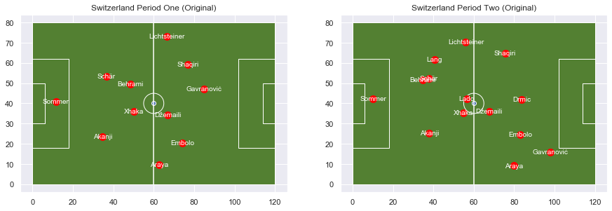
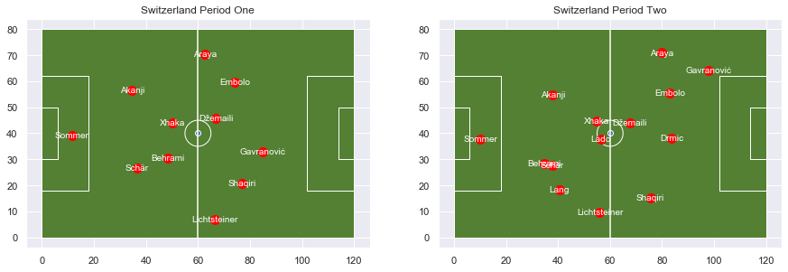
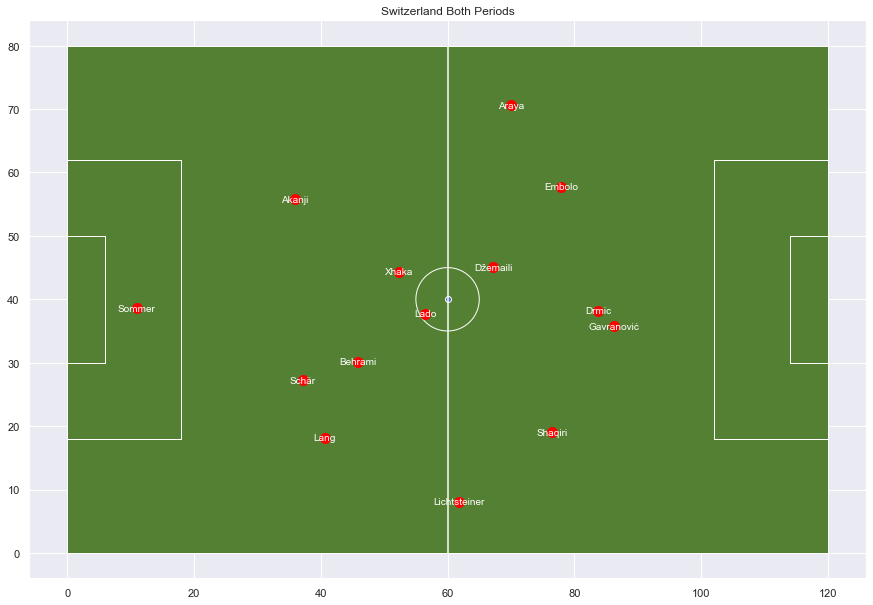
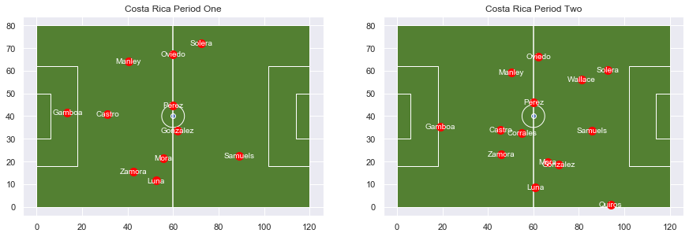
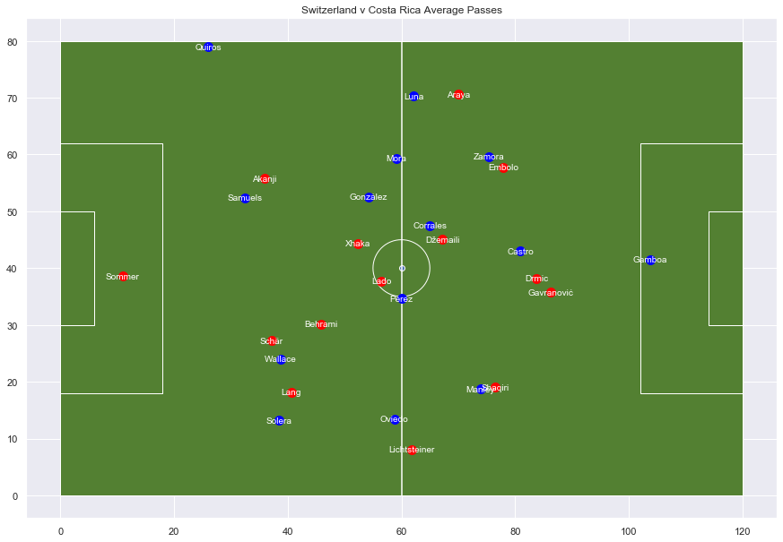

# Location

As I've worked through some of the other projects and documents, in the back of my mind I've had my doubts if I'm handling location correctly. So I thought I would do a deeper dive to make sure I understood it well enough.

I selected a match I knew would have a lot more information and some videos available. It is from the 2018 world cup match between Switzerland and Costa Rica. I have a family connection to Switzerland, so always have some support for them. Regardless, you can find the line up video on Youtube: [Lineup](https://youtu.be/dCm5HspZHd0). I put the embed below but it may not play.


```python

from IPython.display import IFrame
from IPython.display import Image
from IPython.core.display import display, HTML

```


```python
IFrame("https://www.youtube.com/embed/dCm5HspZHd0",560,315,allow="accelerometer; autoplay; encrypted-media; gyroscope; picture-in-picture")
```


<iframe
    width="560"
    height="315"
    src="https://www.youtube.com/embed/dCm5HspZHd0?allow=accelerometer%3B+autoplay%3B+encrypted-media%3B+gyroscope%3B+picture-in-picture"
    frameborder="0"
    allowfullscreen
></iframe>


```python
#processing json
import json

#base libraries for analysis
from ssalib import SpatialSoccer

#handling time
from dateutil.parser import parse
from datetime import datetime
from datetime import timedelta
#dataframes and plotting
import geopandas as gpd
from shapely.geometry.point import Point
from shapely.geometry import LineString
from shapely.geometry import Polygon
import matplotlib.pyplot as plt
import numpy as np
import seaborn as sns
import pandas as pd

sns.set()
%matplotlib inline
```


```python
ssa = SpatialSoccer()
pth_to_matches = "open-data-master/data/matches/43/3.json"
gdf = ssa.load_single_match(pth_to_matches,matchindex=10)
pitchgdf = SpatialSoccer.build_polygon_pitch_statsbomb()
#pitchgdf.plot(facecolor = SpatialSoccer.GREEN_PITCH_COLOR,edgecolor=SpatialSoccer.WHITE_LINE_COLOR);
gdf.head()
```


<div>
<style scoped>
    .dataframe tbody tr th:only-of-type {
        vertical-align: middle;
    }

    .dataframe tbody tr th {
        vertical-align: top;
    }

    .dataframe thead th {
        text-align: right;
    }
</style>
<table border="1" class="dataframe">
  <thead>
    <tr style="text-align: right;">
      <th></th>
      <th>id</th>
      <th>index</th>
      <th>period</th>
      <th>timestamp</th>
      <th>minute</th>
      <th>second</th>
      <th>type</th>
      <th>possession</th>
      <th>possession_team</th>
      <th>play_pattern</th>
      <th>...</th>
      <th>clearance</th>
      <th>substitution</th>
      <th>bad_behaviour</th>
      <th>event_time</th>
      <th>goal</th>
      <th>event_type</th>
      <th>x_coord</th>
      <th>y_coord</th>
      <th>team_name</th>
      <th>geometry</th>
    </tr>
  </thead>
  <tbody>
    <tr>
      <th>0</th>
      <td>dc25d16b-5e67-430f-80ed-4030ad8af0cd</td>
      <td>1</td>
      <td>1</td>
      <td>00:00:00.000</td>
      <td>0</td>
      <td>0</td>
      <td>{'id': 35, 'name': 'Starting XI'}</td>
      <td>1</td>
      <td>{'id': 773, 'name': 'Switzerland'}</td>
      <td>{'id': 1, 'name': 'Regular Play'}</td>
      <td>...</td>
      <td>NaN</td>
      <td>NaN</td>
      <td>NaN</td>
      <td>2018-06-27 20:00:00.000000000</td>
      <td>0</td>
      <td>Starting XI</td>
      <td>None</td>
      <td>None</td>
      <td>Switzerland</td>
      <td>None</td>
    </tr>
    <tr>
      <th>1</th>
      <td>95af188b-b1b5-4206-bfa8-616b24274787</td>
      <td>2</td>
      <td>1</td>
      <td>00:00:00.000</td>
      <td>0</td>
      <td>0</td>
      <td>{'id': 35, 'name': 'Starting XI'}</td>
      <td>1</td>
      <td>{'id': 773, 'name': 'Switzerland'}</td>
      <td>{'id': 1, 'name': 'Regular Play'}</td>
      <td>...</td>
      <td>NaN</td>
      <td>NaN</td>
      <td>NaN</td>
      <td>2018-06-27 20:00:00.000000000</td>
      <td>0</td>
      <td>Starting XI</td>
      <td>None</td>
      <td>None</td>
      <td>Costa Rica</td>
      <td>None</td>
    </tr>
    <tr>
      <th>2</th>
      <td>37373f72-f435-444f-ac80-ba4242ec8853</td>
      <td>3</td>
      <td>1</td>
      <td>00:00:00.000</td>
      <td>0</td>
      <td>0</td>
      <td>{'id': 18, 'name': 'Half Start'}</td>
      <td>1</td>
      <td>{'id': 773, 'name': 'Switzerland'}</td>
      <td>{'id': 1, 'name': 'Regular Play'}</td>
      <td>...</td>
      <td>NaN</td>
      <td>NaN</td>
      <td>NaN</td>
      <td>2018-06-27 20:00:00.000000000</td>
      <td>0</td>
      <td>Half Start</td>
      <td>None</td>
      <td>None</td>
      <td>Costa Rica</td>
      <td>None</td>
    </tr>
    <tr>
      <th>3</th>
      <td>13583a48-0d00-4d54-974f-25bac4d5c93b</td>
      <td>4</td>
      <td>1</td>
      <td>00:00:00.000</td>
      <td>0</td>
      <td>0</td>
      <td>{'id': 18, 'name': 'Half Start'}</td>
      <td>1</td>
      <td>{'id': 773, 'name': 'Switzerland'}</td>
      <td>{'id': 1, 'name': 'Regular Play'}</td>
      <td>...</td>
      <td>NaN</td>
      <td>NaN</td>
      <td>NaN</td>
      <td>2018-06-27 20:00:00.000000000</td>
      <td>0</td>
      <td>Half Start</td>
      <td>None</td>
      <td>None</td>
      <td>Switzerland</td>
      <td>None</td>
    </tr>
    <tr>
      <th>4</th>
      <td>5fd3ab21-1338-4043-88a3-1cced40767fc</td>
      <td>5</td>
      <td>1</td>
      <td>00:00:00.493</td>
      <td>0</td>
      <td>0</td>
      <td>{'id': 30, 'name': 'Pass'}</td>
      <td>2</td>
      <td>{'id': 773, 'name': 'Switzerland'}</td>
      <td>{'id': 9, 'name': 'From Kick Off'}</td>
      <td>...</td>
      <td>NaN</td>
      <td>NaN</td>
      <td>NaN</td>
      <td>2018-06-27 20:00:00.492999936</td>
      <td>0</td>
      <td>Pass</td>
      <td>61</td>
      <td>40</td>
      <td>Switzerland</td>
      <td>POINT (61.00000 40.00000)</td>
    </tr>
  </tbody>
</table>
<p>5 rows × 41 columns</p>
</div>


# Plotting Original Location

Just so we have a comparison I'll plot the original coordinates from location here. I am still using the pitch gdf and I will explain the code separately. The advantage of using the match between Switzerland and Costa Rica is of course there are plenty of video highlights to compare against. In the case above (you probably have to click the link because of copyright restrictions), we get the line up of both teams visually displayed. 

I feel intuitively the location of the players should reflect where they are in relation to how their keeper faces. So Lichtsteiner, or Shaqiri should appear to the right-hand side of the goalkeeper Sommer if we assume the goal is aligned with an origin on the left.

This is not the case as you can see with the labels that are placed at the player's mean center location of play based on their passes. Shaquiri is on the left and Akanji is on the right. Not what I would be expecting.


```python
passes_1 = gdf.loc[(gdf['event_type']=='Pass') & (gdf['team_name']=='Switzerland') & (gdf['period']==1)].copy()
passes_2 = gdf.loc[(gdf['event_type']=='Pass') & (gdf['team_name']=='Switzerland') & (gdf['period']==2)].copy()
for df in [passes_1,passes_2]:
    df['player_name'] = df['player'].apply(lambda x: x.get('name'))
    df['y_coord'] = df['y_coord'].values.astype(np.float64)
    df['x_coord'] = df['x_coord'].values.astype(np.float64)
    
    df['x_orig'] = None
    df['y_orig'] = None
    df.loc[df['location'].notnull(),['x_orig']] = df.loc[df['location'].notnull()]['location'].apply(lambda x: float(x[0]))
    df.loc[df['location'].notnull(),['y_orig']] = df.loc[df['location'].notnull()]['location'].apply(lambda x: float(x[1]))

p1_avg = passes_1.groupby(['player_name'])["x_orig","y_orig"].mean().reset_index()
p2_avg = passes_2.groupby(['player_name'])["x_orig","y_orig"].mean().reset_index()
fig = plt.figure(figsize=(15,15))
ax = fig.add_subplot(121)
pitchgdf.plot(ax=ax,facecolor = SpatialSoccer.GREEN_PITCH_COLOR,edgecolor=SpatialSoccer.WHITE_LINE_COLOR);
for i,row in p1_avg.iterrows():
    ax.plot([row['x_orig']], [row['y_orig']], marker='o', markersize=10, color="red")
    ax.text(row['x_orig'], row['y_orig'], row['player_name'].split(' ')[-1], color='white', size=10, ha='center', va='center')
ax.set_title("Switzerland Period One (Original)")
ax = fig.add_subplot(122)
pitchgdf.plot(ax=ax,facecolor = SpatialSoccer.GREEN_PITCH_COLOR,edgecolor=SpatialSoccer.WHITE_LINE_COLOR);
for i,row in p2_avg.iterrows():
    ax.plot([row['x_orig']], [row['y_orig']], marker='o', markersize=10, color="red")
    #stackName = "\n".join()
    ax.text(row['x_orig'], row['y_orig'], row['player_name'].split(' ')[-1], color='white', size=10, ha='center', va='center')
ax.set_title("Switzerland Period Two (Original)");
```





# Flipping location

The flipped location along the y-axis on the other hand will get them in line with the goalkeeper.

We can start by filtering out the passes for Switzerland, and separating the period of play.

Again, i have to correct for the x and y coordinate datatypes, so I can easily take the average of the location.


```python
passes_1 = gdf.loc[(gdf['event_type']=='Pass') & (gdf['team_name']=='Switzerland') & (gdf['period']==1)].copy()
passes_2 = gdf.loc[(gdf['event_type']=='Pass') & (gdf['team_name']=='Switzerland') & (gdf['period']==2)].copy()
passes = gdf.loc[(gdf['event_type']=='Pass') & (gdf['team_name']=='Switzerland')].copy()
for df in [passes_1,passes_2,passes]:
    df['player_name'] = df['player'].apply(lambda x: x.get('name'))
    df['y_coord'] = df['y_coord'].values.astype(np.float64)
    df['x_coord'] = df['x_coord'].values.astype(np.float64)
```

Using group by will average the x and y coordinates for each player. Optionally you could make these geodataframes, but since I am plotting individually to get the name of the player showing up, I skip this step.


```python
p1_avg = passes_1.groupby(['player_name'])["x_coord","y_coord"].mean().reset_index()
p2_avg = passes_2.groupby(['player_name'])["x_coord","y_coord"].mean().reset_index()
#for df in [p1_avg,p2_avg]:
    #df['pnts'] = [Point(x,y) for x,y in df[["x_coord","y_coord"]].values]
#p1_avg = gpd.GeoDataFrame(p1_avg,geometry=p1_avg['pnts'].values)
#p2_avg = gpd.GeoDataFrame(p1_avg,geometry=p2_avg['pnts'].values)
p2_avg
```


<div>
<style scoped>
    .dataframe tbody tr th:only-of-type {
        vertical-align: middle;
    }

    .dataframe tbody tr th {
        vertical-align: top;
    }

    .dataframe thead th {
        text-align: right;
    }
</style>
<table border="1" class="dataframe">
  <thead>
    <tr style="text-align: right;">
      <th></th>
      <th>player_name</th>
      <th>x_coord</th>
      <th>y_coord</th>
    </tr>
  </thead>
  <tbody>
    <tr>
      <th>0</th>
      <td>Blerim Džemaili</td>
      <td>67.600000</td>
      <td>43.900000</td>
    </tr>
    <tr>
      <th>1</th>
      <td>Breel-Donald Embolo</td>
      <td>83.000000</td>
      <td>55.272727</td>
    </tr>
    <tr>
      <th>2</th>
      <td>Denis Lemi Zakaria Lako Lado</td>
      <td>56.500000</td>
      <td>37.727273</td>
    </tr>
    <tr>
      <th>3</th>
      <td>Fabian Lukas Schär</td>
      <td>37.733333</td>
      <td>27.755556</td>
    </tr>
    <tr>
      <th>4</th>
      <td>Granit Xhaka</td>
      <td>54.956522</td>
      <td>44.739130</td>
    </tr>
    <tr>
      <th>5</th>
      <td>Josip Drmic</td>
      <td>83.800000</td>
      <td>38.200000</td>
    </tr>
    <tr>
      <th>6</th>
      <td>Manuel Obafemi Akanji</td>
      <td>37.931034</td>
      <td>54.827586</td>
    </tr>
    <tr>
      <th>7</th>
      <td>Mario Gavranović</td>
      <td>98.000000</td>
      <td>64.000000</td>
    </tr>
    <tr>
      <th>8</th>
      <td>Michael Lang</td>
      <td>40.600000</td>
      <td>18.200000</td>
    </tr>
    <tr>
      <th>9</th>
      <td>Ricardo Iván Rodríguez Araya</td>
      <td>79.791667</td>
      <td>70.875000</td>
    </tr>
    <tr>
      <th>10</th>
      <td>Stephan Lichtsteiner</td>
      <td>56.041667</td>
      <td>9.583333</td>
    </tr>
    <tr>
      <th>11</th>
      <td>Valon Behrami</td>
      <td>34.666667</td>
      <td>28.333333</td>
    </tr>
    <tr>
      <th>12</th>
      <td>Xherdan Shaqiri</td>
      <td>75.500000</td>
      <td>15.166667</td>
    </tr>
    <tr>
      <th>13</th>
      <td>Yann Sommer</td>
      <td>10.187500</td>
      <td>37.812500</td>
    </tr>
  </tbody>
</table>
</div>


Now we can see the position of the players in relation to the goalkeeper if their goal was on the left hand side of the pitch. 

Period 2 actually keeps the players in the same positions in relation to the left hand side of the field. You can tell that by the position o fthe keeper. More players are added for the substition. On a side note, Gavranovic passed more from the upper side of the field during the second period.. The other players tended to be fixed in their position.


```python
fig = plt.figure(figsize=(15,15))
ax = fig.add_subplot(121)
pitchgdf.plot(ax=ax,facecolor = SpatialSoccer.GREEN_PITCH_COLOR,edgecolor=SpatialSoccer.WHITE_LINE_COLOR);
for i,row in p1_avg.iterrows():
    ax.plot([row['x_coord']], [row['y_coord']], marker='o', markersize=10, color="red")
    ax.text(row['x_coord'], row['y_coord'],  row['player_name'].split(' ')[-1], color='white', size=10, ha='center', va='center')
ax.set_title("Switzerland Period One")
ax = fig.add_subplot(122)
pitchgdf.plot(ax=ax,facecolor = SpatialSoccer.GREEN_PITCH_COLOR,edgecolor=SpatialSoccer.WHITE_LINE_COLOR);
for i,row in p2_avg.iterrows():
    ax.plot([row['x_coord']], [row['y_coord']], marker='o', markersize=10, color="red")
    ax.text(row['x_coord'], row['y_coord'],  row['player_name'].split(' ')[-1], color='white', size=10, ha='center', va='center')
ax.set_title("Switzerland Period Two");
```





Since we know that regardless of the period, the location has been normalized so that the position is in reference to the left side of the field (and then flipped by me so the y-axis places the origin in 0) we could look at passes for everyone across all periods. Rodriguez\Araya and Lictsteiner both play pretty far up, but as I have said in other documents, the mean center is pulled in direction of the extremes. So they probably handle throw-ins or corner kicks that are much further in the offensive zone.


```python
pa_avg = passes.groupby(['player_name'])["x_coord","y_coord"].mean().reset_index()
fig = plt.figure(figsize=(15,15))
ax = fig.add_subplot(111)
pitchgdf.plot(ax=ax,facecolor = SpatialSoccer.GREEN_PITCH_COLOR,edgecolor=SpatialSoccer.WHITE_LINE_COLOR);
for i,row in pa_avg.iterrows():
    ax.plot([row['x_coord']], [row['y_coord']], marker='o', markersize=10, color="red")
    ax.text(row['x_coord'], row['y_coord'],  row['player_name'].split(' ')[-1], color='white', size=10, ha='center', va='center')
ax.set_title("Switzerland Both Periods");

```





For comparison we can also look at the away team Costa Rica (away in the match file). This also confirms that the location along the y needs to be flipped to make sense of their position in relation to the keeper. It also is clear that every team's location treats their defensive area as the left goal and offensive area as the right goal.


```python
passes_1 = gdf.loc[(gdf['event_type']=='Pass') & (gdf['team_name']=='Costa Rica') & (gdf['period']==1)].copy()
passes_2 = gdf.loc[(gdf['event_type']=='Pass') & (gdf['team_name']=='Costa Rica') & (gdf['period']==2)].copy()
for df in [passes_1,passes_2]:
    df['player_name'] = df['player'].apply(lambda x: x.get('name'))
    df['y_coord'] = df['y_coord'].values.astype(np.float64)
    df['x_coord'] = df['x_coord'].values.astype(np.float64)
p1_avg = passes_1.groupby(['player_name'])["x_coord","y_coord"].mean().reset_index()
p2_avg = passes_2.groupby(['player_name'])["x_coord","y_coord"].mean().reset_index()
fig = plt.figure(figsize=(15,15))
ax = fig.add_subplot(121)
pitchgdf.plot(ax=ax,facecolor = SpatialSoccer.GREEN_PITCH_COLOR,edgecolor=SpatialSoccer.WHITE_LINE_COLOR);
for i,row in p1_avg.iterrows():
    ax.plot([row['x_coord']], [row['y_coord']], marker='o', markersize=10, color="red")
    ax.text(row['x_coord'], row['y_coord'], row['player_name'].split(' ')[-1], color='white', size=10, ha='center', va='center')
ax.set_title("Costa Rica Period One")
ax = fig.add_subplot(122)
pitchgdf.plot(ax=ax,facecolor = SpatialSoccer.GREEN_PITCH_COLOR,edgecolor=SpatialSoccer.WHITE_LINE_COLOR);
for i,row in p2_avg.iterrows():
    ax.plot([row['x_coord']], [row['y_coord']], marker='o', markersize=10, color="red")
    ax.text(row['x_coord'], row['y_coord'], row['player_name'].split(' ')[-1], color='white', size=10, ha='center', va='center')
ax.set_title("Costa Rica Period Two");
```





If you wish to look at the positions in relation to each other as if they were facing each other. Then you need to make sure to flip the x and y again.

The lineups in the video don't match the name, so I have the full names below for each team to compare. I believe Gonzalez in the back is Castro in my plot.

It looks like if we were to do a deeper dive, the relationship in space between Waston (Manley) and Shaqiri would be interesting to explore.


```python
passes_cr = gdf.loc[(gdf['event_type']=='Pass') & (gdf['team_name']=='Costa Rica')].copy()
passes_ch = gdf.loc[(gdf['event_type']=='Pass') & (gdf['team_name']=='Switzerland')].copy()
for df in [passes_cr,passes_ch]:
    df['player_name'] = df['player'].apply(lambda x: x.get('name'))
    df['y_coord'] = df['y_coord'].values.astype(np.float64)
    df['x_coord'] = df['x_coord'].values.astype(np.float64)
    
passes_cr['y_coord'] = SpatialSoccer.flip_coordinates(passes_cr['y_coord'].values.astype(np.float64),80,0)
passes_cr['x_coord'] = SpatialSoccer.flip_coordinates(passes_cr['x_coord'].values.astype(np.float64),120,0)

pcr_avg = passes_cr.groupby(['player_name'])["x_coord","y_coord"].mean().reset_index()
pch_avg = passes_ch.groupby(['player_name'])["x_coord","y_coord"].mean().reset_index()

fig = plt.figure(figsize=(15,15))
ax = fig.add_subplot(111)
pitchgdf.plot(ax=ax,facecolor = SpatialSoccer.GREEN_PITCH_COLOR,edgecolor=SpatialSoccer.WHITE_LINE_COLOR);
for i,row in pch_avg.iterrows():
    ax.plot([row['x_coord']], [row['y_coord']], marker='o', markersize=10, color="red")
    ax.text(row['x_coord'], row['y_coord'], row['player_name'].split(' ')[-1], color='white', size=10, ha='center', va='center')
for i,row in pcr_avg.iterrows():
    ax.plot([row['x_coord']], [row['y_coord']], marker='o', markersize=10, color="blue")
    ax.text(row['x_coord'], row['y_coord'], row['player_name'].split(' ')[-1], color='white', size=10, ha='center', va='center')
ax.set_title("Switzerland v Costa Rica Average Passes");

```





```python
pcr_avg
```


<div>
<style scoped>
    .dataframe tbody tr th:only-of-type {
        vertical-align: middle;
    }

    .dataframe tbody tr th {
        vertical-align: top;
    }

    .dataframe thead th {
        text-align: right;
    }
</style>
<table border="1" class="dataframe">
  <thead>
    <tr style="text-align: right;">
      <th></th>
      <th>player_name</th>
      <th>x_coord</th>
      <th>y_coord</th>
    </tr>
  </thead>
  <tbody>
    <tr>
      <th>0</th>
      <td>Bryan Oviedo</td>
      <td>58.763158</td>
      <td>13.394737</td>
    </tr>
    <tr>
      <th>1</th>
      <td>Bryan Ruiz González</td>
      <td>54.250000</td>
      <td>52.500000</td>
    </tr>
    <tr>
      <th>2</th>
      <td>Celso Borges Mora</td>
      <td>59.050000</td>
      <td>59.350000</td>
    </tr>
    <tr>
      <th>3</th>
      <td>Cristian Gamboa Luna</td>
      <td>62.160000</td>
      <td>70.280000</td>
    </tr>
    <tr>
      <th>4</th>
      <td>Daniel Colindres Solera</td>
      <td>38.482759</td>
      <td>13.172414</td>
    </tr>
    <tr>
      <th>5</th>
      <td>David Alberto Guzmán Pérez</td>
      <td>60.000000</td>
      <td>34.652174</td>
    </tr>
    <tr>
      <th>6</th>
      <td>Giancarlo González Castro</td>
      <td>80.909091</td>
      <td>43.000000</td>
    </tr>
    <tr>
      <th>7</th>
      <td>Ian Rey Smith Quiros</td>
      <td>26.000000</td>
      <td>79.000000</td>
    </tr>
    <tr>
      <th>8</th>
      <td>Joel Nathaniel Campbell Samuels</td>
      <td>32.521739</td>
      <td>52.347826</td>
    </tr>
    <tr>
      <th>9</th>
      <td>Johnny Acosta Zamora</td>
      <td>75.370370</td>
      <td>59.666667</td>
    </tr>
    <tr>
      <th>10</th>
      <td>Kendall Jamaal Waston Manley</td>
      <td>73.878049</td>
      <td>18.682927</td>
    </tr>
    <tr>
      <th>11</th>
      <td>Keylor Navas Gamboa</td>
      <td>103.687500</td>
      <td>41.500000</td>
    </tr>
    <tr>
      <th>12</th>
      <td>Rodney Wallace</td>
      <td>38.800000</td>
      <td>24.000000</td>
    </tr>
    <tr>
      <th>13</th>
      <td>Rándall Azofeifa Corrales</td>
      <td>65.000000</td>
      <td>47.500000</td>
    </tr>
  </tbody>
</table>
</div>


```python
pch_avg
```


<div>
<style scoped>
    .dataframe tbody tr th:only-of-type {
        vertical-align: middle;
    }

    .dataframe tbody tr th {
        vertical-align: top;
    }

    .dataframe thead th {
        text-align: right;
    }
</style>
<table border="1" class="dataframe">
  <thead>
    <tr style="text-align: right;">
      <th></th>
      <th>player_name</th>
      <th>x_coord</th>
      <th>y_coord</th>
    </tr>
  </thead>
  <tbody>
    <tr>
      <th>0</th>
      <td>Blerim Džemaili</td>
      <td>67.161290</td>
      <td>45.032258</td>
    </tr>
    <tr>
      <th>1</th>
      <td>Breel-Donald Embolo</td>
      <td>77.884615</td>
      <td>57.730769</td>
    </tr>
    <tr>
      <th>2</th>
      <td>Denis Lemi Zakaria Lako Lado</td>
      <td>56.500000</td>
      <td>37.727273</td>
    </tr>
    <tr>
      <th>3</th>
      <td>Fabian Lukas Schär</td>
      <td>37.176471</td>
      <td>27.247059</td>
    </tr>
    <tr>
      <th>4</th>
      <td>Granit Xhaka</td>
      <td>52.411765</td>
      <td>44.352941</td>
    </tr>
    <tr>
      <th>5</th>
      <td>Josip Drmic</td>
      <td>83.800000</td>
      <td>38.200000</td>
    </tr>
    <tr>
      <th>6</th>
      <td>Manuel Obafemi Akanji</td>
      <td>35.935065</td>
      <td>55.792208</td>
    </tr>
    <tr>
      <th>7</th>
      <td>Mario Gavranović</td>
      <td>86.181818</td>
      <td>35.727273</td>
    </tr>
    <tr>
      <th>8</th>
      <td>Michael Lang</td>
      <td>40.600000</td>
      <td>18.200000</td>
    </tr>
    <tr>
      <th>9</th>
      <td>Ricardo Iván Rodríguez Araya</td>
      <td>70.053571</td>
      <td>70.625000</td>
    </tr>
    <tr>
      <th>10</th>
      <td>Stephan Lichtsteiner</td>
      <td>61.759259</td>
      <td>8.055556</td>
    </tr>
    <tr>
      <th>11</th>
      <td>Valon Behrami</td>
      <td>45.833333</td>
      <td>30.145833</td>
    </tr>
    <tr>
      <th>12</th>
      <td>Xherdan Shaqiri</td>
      <td>76.513514</td>
      <td>19.000000</td>
    </tr>
    <tr>
      <th>13</th>
      <td>Yann Sommer</td>
      <td>10.944444</td>
      <td>38.611111</td>
    </tr>
  </tbody>
</table>
</div>


```python

```
