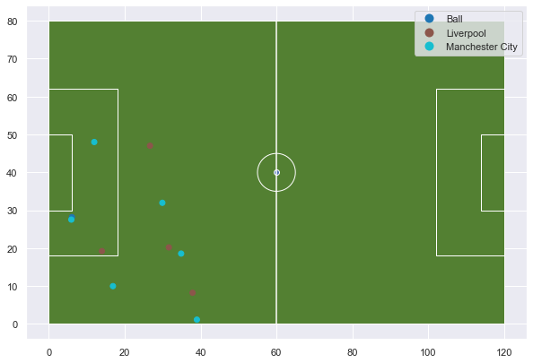

```python
import geopandas as gpd
from shapely.geometry.point import Point
from shapely.geometry import LineString
from shapely.geometry import Polygon
import matplotlib.pyplot as plt
import numpy as np
import seaborn as sns
import pandas as pd
from shapely import affinity

%load_ext autoreload
%autoreload 2
sns.set()
%matplotlib inline
```


```python
from ssalib2 import SpatialSoccer
```


```python
matchesfile = "skillcorner/data/matches.json"
```


```python
ssa = SpatialSoccer()
```


```python
scmatches = ssa.get_match_list_from_source(matchesfile,SpatialSoccer.SKILLCORNER_DATA)
```


```python
for m in scmatches:
    print(m.match_id)
```

    4039
    3749
    3518
    3442
    2841
    2440
    2417
    2269
    2068
    


```python
trks = "skillcorner/data/matches/{0}/structured_data.json".format(scmatches[0].match_id)
metadata = "skillcorner/data/matches/{0}/match_data.json".format(scmatches[0].match_id)
gdf_4039 = ssa.load_skillcorner_tracking(trks,metadata) 

```

    Processing tracks...
    Completed!
    


```python
pitchgdf = SpatialSoccer.build_polygon_pitch_statsbomb()
```


```python
fig = plt.figure(figsize=(10,10))
ax = fig.add_subplot(111)
pitchgdf.plot(ax=ax,facecolor = SpatialSoccer.GREEN_PITCH_COLOR,edgecolor=SpatialSoccer.WHITE_LINE_COLOR)
gdf_4039[gdf_4039['frame']==769].plot(ax=ax,column="team",legend=True);
```





```python
gdf_4039[gdf_4039['frame']==769]
```


<div>
<style scoped>
    .dataframe tbody tr th:only-of-type {
        vertical-align: middle;
    }

    .dataframe tbody tr th {
        vertical-align: top;
    }

    .dataframe thead th {
        text-align: right;
    }
</style>
<table border="1" class="dataframe">
  <thead>
    <tr style="text-align: right;">
      <th></th>
      <th>group</th>
      <th>team</th>
      <th>period</th>
      <th>frame</th>
      <th>x_coord</th>
      <th>y_coord</th>
      <th>z_coord</th>
      <th>time</th>
      <th>point</th>
      <th>objectid</th>
      <th>trackid</th>
      <th>playername</th>
      <th>position</th>
      <th>type</th>
      <th>geometry</th>
    </tr>
  </thead>
  <tbody>
    <tr>
      <th>2432</th>
      <td>home team</td>
      <td>Ball</td>
      <td>1.0</td>
      <td>769</td>
      <td>6.084542</td>
      <td>28.181237</td>
      <td>0.0</td>
      <td>0:32.70</td>
      <td>POINT (6.084541672914286 28.181237246)</td>
      <td>55</td>
      <td>-248</td>
      <td>Ball</td>
      <td>None</td>
      <td>Ball</td>
      <td>POINT (6.08454 28.18124)</td>
    </tr>
    <tr>
      <th>2433</th>
      <td>home team</td>
      <td>Liverpool</td>
      <td>1.0</td>
      <td>769</td>
      <td>37.892835</td>
      <td>8.230850</td>
      <td>0.0</td>
      <td>0:32.70</td>
      <td>POINT (37.89283513702857 8.230849835058825)</td>
      <td>3847</td>
      <td>363</td>
      <td>Wijnaldum</td>
      <td>LM</td>
      <td>Player</td>
      <td>POINT (37.89284 8.23085)</td>
    </tr>
    <tr>
      <th>2434</th>
      <td>home team</td>
      <td>Manchester City</td>
      <td>1.0</td>
      <td>769</td>
      <td>39.031461</td>
      <td>1.128840</td>
      <td>0.0</td>
      <td>0:32.70</td>
      <td>POINT (39.03146123565715 1.128840085882354)</td>
      <td>6037</td>
      <td>349</td>
      <td>Walker</td>
      <td>RWB</td>
      <td>Player</td>
      <td>POINT (39.03146 1.12884)</td>
    </tr>
    <tr>
      <th>2435</th>
      <td>home team</td>
      <td>Manchester City</td>
      <td>1.0</td>
      <td>769</td>
      <td>5.924875</td>
      <td>27.529299</td>
      <td>0.0</td>
      <td>0:32.70</td>
      <td>POINT (5.924875064799997 27.52929938611765)</td>
      <td>2934</td>
      <td>361</td>
      <td>Ederson</td>
      <td>GK</td>
      <td>Player</td>
      <td>POINT (5.92488 27.52930)</td>
    </tr>
    <tr>
      <th>2436</th>
      <td>home team</td>
      <td>Manchester City</td>
      <td>1.0</td>
      <td>769</td>
      <td>16.900084</td>
      <td>9.972088</td>
      <td>0.0</td>
      <td>0:32.70</td>
      <td>POINT (16.9000844112 9.972088276823527)</td>
      <td>24015</td>
      <td>351</td>
      <td>Garcia</td>
      <td>RCB</td>
      <td>Player</td>
      <td>POINT (16.90008 9.97209)</td>
    </tr>
    <tr>
      <th>2437</th>
      <td>home team</td>
      <td>Liverpool</td>
      <td>1.0</td>
      <td>769</td>
      <td>13.985947</td>
      <td>19.219016</td>
      <td>0.0</td>
      <td>0:32.70</td>
      <td>POINT (13.98594696662857 19.219016174)</td>
      <td>9449</td>
      <td>346</td>
      <td>Mane</td>
      <td>LW</td>
      <td>Player</td>
      <td>POINT (13.98595 19.21902)</td>
    </tr>
    <tr>
      <th>2438</th>
      <td>home team</td>
      <td>Liverpool</td>
      <td>1.0</td>
      <td>769</td>
      <td>26.665849</td>
      <td>47.024937</td>
      <td>0.0</td>
      <td>0:32.70</td>
      <td>POINT (26.66584860868572 47.02493659588235)</td>
      <td>7745</td>
      <td>362</td>
      <td>Salah</td>
      <td>RW</td>
      <td>Player</td>
      <td>POINT (26.66585 47.02494)</td>
    </tr>
    <tr>
      <th>2439</th>
      <td>home team</td>
      <td>Manchester City</td>
      <td>1.0</td>
      <td>769</td>
      <td>34.877292</td>
      <td>18.562965</td>
      <td>0.0</td>
      <td>0:32.70</td>
      <td>POINT (34.87729214 18.56296528623529)</td>
      <td>4460</td>
      <td>347</td>
      <td>Gündogan</td>
      <td>LM</td>
      <td>Player</td>
      <td>POINT (34.87729 18.56297)</td>
    </tr>
    <tr>
      <th>2440</th>
      <td>home team</td>
      <td>Manchester City</td>
      <td>1.0</td>
      <td>769</td>
      <td>11.970054</td>
      <td>48.009099</td>
      <td>0.0</td>
      <td>0:32.70</td>
      <td>POINT (11.97005415931428 48.00909921235294)</td>
      <td>1152</td>
      <td>354</td>
      <td>Laporte</td>
      <td>LCB</td>
      <td>Player</td>
      <td>POINT (11.97005 48.00910)</td>
    </tr>
    <tr>
      <th>2441</th>
      <td>home team</td>
      <td>Liverpool</td>
      <td>1.0</td>
      <td>769</td>
      <td>31.630638</td>
      <td>20.200609</td>
      <td>0.0</td>
      <td>0:32.70</td>
      <td>POINT (31.63063755165714 20.20060926588236)</td>
      <td>9143</td>
      <td>352</td>
      <td>Firmino</td>
      <td>CF</td>
      <td>Player</td>
      <td>POINT (31.63064 20.20061)</td>
    </tr>
    <tr>
      <th>2442</th>
      <td>home team</td>
      <td>Manchester City</td>
      <td>1.0</td>
      <td>769</td>
      <td>29.923279</td>
      <td>31.964048</td>
      <td>0.0</td>
      <td>0:32.70</td>
      <td>POINT (29.9232787048 31.96404777655294)</td>
      <td>9202</td>
      <td>345</td>
      <td>Hernandez</td>
      <td>CM</td>
      <td>Player</td>
      <td>POINT (29.92328 31.96405)</td>
    </tr>
  </tbody>
</table>
</div>


```python
ball_locations = gdf_4039[gdf_4039['type']=="Ball"].copy()
ball_locations.head()
```


<div>
<style scoped>
    .dataframe tbody tr th:only-of-type {
        vertical-align: middle;
    }

    .dataframe tbody tr th {
        vertical-align: top;
    }

    .dataframe thead th {
        text-align: right;
    }
</style>
<table border="1" class="dataframe">
  <thead>
    <tr style="text-align: right;">
      <th></th>
      <th>group</th>
      <th>team</th>
      <th>period</th>
      <th>frame</th>
      <th>x_coord</th>
      <th>y_coord</th>
      <th>z_coord</th>
      <th>time</th>
      <th>point</th>
      <th>objectid</th>
      <th>trackid</th>
      <th>playername</th>
      <th>position</th>
      <th>type</th>
      <th>geometry</th>
    </tr>
  </thead>
  <tbody>
    <tr>
      <th>30</th>
      <td>None</td>
      <td>Ball</td>
      <td>1.0</td>
      <td>451</td>
      <td>75.727580</td>
      <td>39.341573</td>
      <td>0.024569</td>
      <td>0:00.90</td>
      <td>POINT (75.72758007165714 39.34157288049059)</td>
      <td>55</td>
      <td>-247</td>
      <td>Ball</td>
      <td>None</td>
      <td>Ball</td>
      <td>POINT (75.72758 39.34157)</td>
    </tr>
    <tr>
      <th>46</th>
      <td>None</td>
      <td>Ball</td>
      <td>1.0</td>
      <td>452</td>
      <td>76.792880</td>
      <td>38.931840</td>
      <td>0.052221</td>
      <td>0:01.00</td>
      <td>POINT (76.79288002708572 38.9318404434647)</td>
      <td>55</td>
      <td>-247</td>
      <td>Ball</td>
      <td>None</td>
      <td>Ball</td>
      <td>POINT (76.79288 38.93184)</td>
    </tr>
    <tr>
      <th>62</th>
      <td>None</td>
      <td>Ball</td>
      <td>1.0</td>
      <td>453</td>
      <td>77.780083</td>
      <td>38.574121</td>
      <td>0.087757</td>
      <td>0:01.10</td>
      <td>POINT (77.7800834888 38.57412057195294)</td>
      <td>55</td>
      <td>-247</td>
      <td>Ball</td>
      <td>None</td>
      <td>Ball</td>
      <td>POINT (77.78008 38.57412)</td>
    </tr>
    <tr>
      <th>78</th>
      <td>None</td>
      <td>Ball</td>
      <td>1.0</td>
      <td>454</td>
      <td>78.309793</td>
      <td>38.287649</td>
      <td>0.135802</td>
      <td>0:01.20</td>
      <td>POINT (78.30979294502858 38.28764909514118)</td>
      <td>55</td>
      <td>-247</td>
      <td>Ball</td>
      <td>None</td>
      <td>Ball</td>
      <td>POINT (78.30979 38.28765)</td>
    </tr>
    <tr>
      <th>94</th>
      <td>None</td>
      <td>Ball</td>
      <td>1.0</td>
      <td>455</td>
      <td>78.272628</td>
      <td>38.106367</td>
      <td>0.201785</td>
      <td>0:01.30</td>
      <td>POINT (78.27262754914285 38.10636668235294)</td>
      <td>55</td>
      <td>-247</td>
      <td>Ball</td>
      <td>None</td>
      <td>Ball</td>
      <td>POINT (78.27263 38.10637)</td>
    </tr>
  </tbody>
</table>
</div>


```python
referee_locations = gdf_4039[gdf_4039['type']=="Referee"].copy()
referee_locations.head()
```


<div>
<style scoped>
    .dataframe tbody tr th:only-of-type {
        vertical-align: middle;
    }

    .dataframe tbody tr th {
        vertical-align: top;
    }

    .dataframe thead th {
        text-align: right;
    }
</style>
<table border="1" class="dataframe">
  <thead>
    <tr style="text-align: right;">
      <th></th>
      <th>group</th>
      <th>team</th>
      <th>period</th>
      <th>frame</th>
      <th>x_coord</th>
      <th>y_coord</th>
      <th>z_coord</th>
      <th>time</th>
      <th>point</th>
      <th>objectid</th>
      <th>trackid</th>
      <th>playername</th>
      <th>position</th>
      <th>type</th>
      <th>geometry</th>
    </tr>
  </thead>
  <tbody>
    <tr>
      <th>11</th>
      <td>None</td>
      <td>Referee</td>
      <td>1.0</td>
      <td>449</td>
      <td>47.532043</td>
      <td>25.055690</td>
      <td>0.0</td>
      <td>0:00.70</td>
      <td>POINT (47.53204272937143 25.05568976388236)</td>
      <td>11513</td>
      <td>275</td>
      <td>Taylor</td>
      <td>None</td>
      <td>Referee</td>
      <td>POINT (47.53204 25.05569)</td>
    </tr>
    <tr>
      <th>26</th>
      <td>None</td>
      <td>Referee</td>
      <td>1.0</td>
      <td>450</td>
      <td>47.685725</td>
      <td>25.516578</td>
      <td>0.0</td>
      <td>0:00.80</td>
      <td>POINT (47.68572503942858 25.51657835905882)</td>
      <td>11513</td>
      <td>275</td>
      <td>Taylor</td>
      <td>None</td>
      <td>Referee</td>
      <td>POINT (47.68573 25.51658)</td>
    </tr>
    <tr>
      <th>42</th>
      <td>None</td>
      <td>Referee</td>
      <td>1.0</td>
      <td>451</td>
      <td>47.781572</td>
      <td>25.773574</td>
      <td>0.0</td>
      <td>0:00.90</td>
      <td>POINT (47.78157169062857 25.77357356611765)</td>
      <td>11513</td>
      <td>275</td>
      <td>Taylor</td>
      <td>None</td>
      <td>Referee</td>
      <td>POINT (47.78157 25.77357)</td>
    </tr>
    <tr>
      <th>58</th>
      <td>None</td>
      <td>Referee</td>
      <td>1.0</td>
      <td>452</td>
      <td>47.819583</td>
      <td>25.826675</td>
      <td>0.0</td>
      <td>0:01.00</td>
      <td>POINT (47.81958268297143 25.82667538529412)</td>
      <td>11513</td>
      <td>275</td>
      <td>Taylor</td>
      <td>None</td>
      <td>Referee</td>
      <td>POINT (47.81958 25.82668)</td>
    </tr>
    <tr>
      <th>74</th>
      <td>None</td>
      <td>Referee</td>
      <td>1.0</td>
      <td>453</td>
      <td>47.793306</td>
      <td>25.522155</td>
      <td>0.0</td>
      <td>0:01.10</td>
      <td>POINT (47.79330562697143 25.52215454447058)</td>
      <td>11513</td>
      <td>275</td>
      <td>Taylor</td>
      <td>None</td>
      <td>Referee</td>
      <td>POINT (47.79331 25.52215)</td>
    </tr>
  </tbody>
</table>
</div>


```python
players = gdf_4039[gdf_4039['type']=="Player"].copy()
players.head()
```


<div>
<style scoped>
    .dataframe tbody tr th:only-of-type {
        vertical-align: middle;
    }

    .dataframe tbody tr th {
        vertical-align: top;
    }

    .dataframe thead th {
        text-align: right;
    }
</style>
<table border="1" class="dataframe">
  <thead>
    <tr style="text-align: right;">
      <th></th>
      <th>group</th>
      <th>team</th>
      <th>period</th>
      <th>frame</th>
      <th>x_coord</th>
      <th>y_coord</th>
      <th>z_coord</th>
      <th>time</th>
      <th>point</th>
      <th>objectid</th>
      <th>trackid</th>
      <th>playername</th>
      <th>position</th>
      <th>type</th>
      <th>geometry</th>
    </tr>
  </thead>
  <tbody>
    <tr>
      <th>0</th>
      <td>None</td>
      <td>Manchester City</td>
      <td>1.0</td>
      <td>449</td>
      <td>53.066240</td>
      <td>11.304341</td>
      <td>0.0</td>
      <td>0:00.70</td>
      <td>POINT (53.06623951715428 11.30434138858824)</td>
      <td>11672</td>
      <td>271</td>
      <td>Foden</td>
      <td>RW</td>
      <td>Player</td>
      <td>POINT (53.06624 11.30434)</td>
    </tr>
    <tr>
      <th>1</th>
      <td>None</td>
      <td>Manchester City</td>
      <td>1.0</td>
      <td>449</td>
      <td>41.048482</td>
      <td>45.753899</td>
      <td>0.0</td>
      <td>0:00.70</td>
      <td>POINT (41.04848165919999 45.75389908463529)</td>
      <td>1152</td>
      <td>270</td>
      <td>Laporte</td>
      <td>LCB</td>
      <td>Player</td>
      <td>POINT (41.04848 45.75390)</td>
    </tr>
    <tr>
      <th>2</th>
      <td>None</td>
      <td>Manchester City</td>
      <td>1.0</td>
      <td>449</td>
      <td>47.604584</td>
      <td>35.006074</td>
      <td>0.0</td>
      <td>0:00.70</td>
      <td>POINT (47.60458402697143 35.00607367505882)</td>
      <td>4460</td>
      <td>269</td>
      <td>Gündogan</td>
      <td>LM</td>
      <td>Player</td>
      <td>POINT (47.60458 35.00607)</td>
    </tr>
    <tr>
      <th>3</th>
      <td>None</td>
      <td>Manchester City</td>
      <td>1.0</td>
      <td>449</td>
      <td>35.260352</td>
      <td>34.232009</td>
      <td>0.0</td>
      <td>0:00.70</td>
      <td>POINT (35.26035229005714 34.2320085688)</td>
      <td>24015</td>
      <td>268</td>
      <td>Garcia</td>
      <td>RCB</td>
      <td>Player</td>
      <td>POINT (35.26035 34.23201)</td>
    </tr>
    <tr>
      <th>6</th>
      <td>None</td>
      <td>Liverpool</td>
      <td>1.0</td>
      <td>449</td>
      <td>79.788289</td>
      <td>40.009509</td>
      <td>0.0</td>
      <td>0:00.70</td>
      <td>POINT (79.78828875531428 40.00950915045933)</td>
      <td>11537</td>
      <td>280</td>
      <td>Gomez</td>
      <td>RCB</td>
      <td>Player</td>
      <td>POINT (79.78829 40.00951)</td>
    </tr>
  </tbody>
</table>
</div>


```python
players['buffer'] = players['point'].apply(lambda x: x.buffer(1.8))
```


```python
players['inposession'] = 0
posessions = {}
for indx,row in ball_locations.iterrows():
    players_frame = players[players["frame"]==row["frame"]]
    for jndx,jrow in players_frame.iterrows():
        if jrow["buffer"].intersects(row["geometry"]):
            posessions["{0}|{1}|{2}|{3}".format(jrow['trackid'],jrow["frame"],jrow["playername"],jrow["team"])] = 1
            break
    del players_frame
for k,v in posessions.items():
    #print(k)
    play,frame,player,team = k.split("|")
    frame = int(frame)
    players.loc[(players["team"]==team)&(players["frame"]==frame)&(players["playername"]==player),'inposession'] = v
```


```python
players[players['inposession']==1].head()
```


<div>
<style scoped>
    .dataframe tbody tr th:only-of-type {
        vertical-align: middle;
    }

    .dataframe tbody tr th {
        vertical-align: top;
    }

    .dataframe thead th {
        text-align: right;
    }
</style>
<table border="1" class="dataframe">
  <thead>
    <tr style="text-align: right;">
      <th></th>
      <th>group</th>
      <th>team</th>
      <th>period</th>
      <th>frame</th>
      <th>x_coord</th>
      <th>y_coord</th>
      <th>z_coord</th>
      <th>time</th>
      <th>point</th>
      <th>objectid</th>
      <th>trackid</th>
      <th>playername</th>
      <th>position</th>
      <th>type</th>
      <th>geometry</th>
      <th>buffer</th>
      <th>inposession</th>
    </tr>
  </thead>
  <tbody>
    <tr>
      <th>85</th>
      <td>None</td>
      <td>Liverpool</td>
      <td>1.0</td>
      <td>454</td>
      <td>79.881599</td>
      <td>38.590477</td>
      <td>0.0</td>
      <td>0:01.20</td>
      <td>POINT (79.88159890011428 38.59047745615294)</td>
      <td>11537</td>
      <td>280</td>
      <td>Gomez</td>
      <td>RCB</td>
      <td>Player</td>
      <td>POINT (79.88160 38.59048)</td>
      <td>POLYGON ((81.68159890011428 38.59047745615294,...</td>
      <td>1</td>
    </tr>
    <tr>
      <th>101</th>
      <td>None</td>
      <td>Liverpool</td>
      <td>1.0</td>
      <td>455</td>
      <td>80.030319</td>
      <td>38.012730</td>
      <td>0.0</td>
      <td>0:01.30</td>
      <td>POINT (80.03031944034286 38.01272953134117)</td>
      <td>11537</td>
      <td>280</td>
      <td>Gomez</td>
      <td>RCB</td>
      <td>Player</td>
      <td>POINT (80.03032 38.01273)</td>
      <td>POLYGON ((81.83031944034286 38.01272953134117,...</td>
      <td>1</td>
    </tr>
    <tr>
      <th>208</th>
      <td>home team</td>
      <td>Manchester City</td>
      <td>1.0</td>
      <td>571</td>
      <td>101.253434</td>
      <td>16.925124</td>
      <td>0.0</td>
      <td>0:12.90</td>
      <td>POINT (101.2534339317714 16.92512408941176)</td>
      <td>11566</td>
      <td>334</td>
      <td>Jesus</td>
      <td>CF</td>
      <td>Player</td>
      <td>POINT (101.25343 16.92512)</td>
      <td>POLYGON ((103.0534339317714 16.92512408941176,...</td>
      <td>1</td>
    </tr>
    <tr>
      <th>217</th>
      <td>home team</td>
      <td>Manchester City</td>
      <td>1.0</td>
      <td>572</td>
      <td>101.812253</td>
      <td>16.798728</td>
      <td>0.0</td>
      <td>0:13.00</td>
      <td>POINT (101.8122529096 16.79872764658823)</td>
      <td>11566</td>
      <td>334</td>
      <td>Jesus</td>
      <td>CF</td>
      <td>Player</td>
      <td>POINT (101.81225 16.79873)</td>
      <td>POLYGON ((103.6122529096 16.79872764658823, 10...</td>
      <td>1</td>
    </tr>
    <tr>
      <th>226</th>
      <td>home team</td>
      <td>Manchester City</td>
      <td>1.0</td>
      <td>573</td>
      <td>102.381759</td>
      <td>16.715757</td>
      <td>0.0</td>
      <td>0:13.10</td>
      <td>POINT (102.3817594206857 16.71575716647058)</td>
      <td>11566</td>
      <td>334</td>
      <td>Jesus</td>
      <td>CF</td>
      <td>Player</td>
      <td>POINT (102.38176 16.71576)</td>
      <td>POLYGON ((104.1817594206857 16.71575716647058,...</td>
      <td>1</td>
    </tr>
  </tbody>
</table>
</div>


```python
from moviepy import editor as mpy
from moviepy.video.io.bindings import mplfig_to_npimage
def draw_frame_x(df, ball,fps,minframe, t, title=None):
    fig = plt.figure(figsize = (10,6),dpi=300)
    ax = fig.add_subplot(111)
    if title:
        ax.set_title(title)
    ax.set_xlim([-1,121])
    ax.set_ylim([-1,81])
    
    pitchgdf = SpatialSoccer.build_polygon_pitch_statsbomb()
    pitchgdf.plot(ax = ax, facecolor = SpatialSoccer.GREEN_PITCH_COLOR,edgecolor=SpatialSoccer.WHITE_LINE_COLOR);
    ax.set_xticks([])
    ax.set_yticks([])
    frm = minframe + int(t*fps)
    try:
        ms = 20 + 100*ball[(ball['frame']==frm)]['z_coord'].values[0]
        print(ms)
        ball[(ball['frame']==frm)].plot(ax=ax,zorder=3,facecolor='white',hatch=2*'O',markersize=ms);
        df[(df['frame']==frm) &(df['team']=='Liverpool')].plot(ax=ax,color="red",edgecolor="white", markersize=40);
        #df[(df['frame']==frm) &(df['team']=='attack') &(df['ballposession']==1)].plot(ax=ax,color="white",marker="x",zorder=4);
        #df[(df['frame']==frm) &(df['team']=='attack') &(df['ballposession']==2)].plot(ax=ax,color="white",marker="^",zorder=4);
        df[(df['frame']==frm) &(df['team']=='Manchester City')].plot(ax=ax,color="blue",edgecolor="white",markersize=40);
        #for idx, row in df[(df['time']==t) &(df['team']=='attack')].iterrows():
        #for idx, row in df[(df['frame']==frm) &(df['team']=='attack') &(df['ballposession']==1)].iterrows():
            #try:
                #ax.text(row['geometry'].x,row['geometry'].y,int(row['player_num']),color='white',fontsize=12,zorder=5)
            #except:
                #pass
                #ax.text(row['geometry'].x,row['geometry'].y,'NAN')
    except:
        print(frm)
    plt.tight_layout()
    image = mplfig_to_npimage(fig)
    plt.savefig("liverpool_goals/posession_image_%s.png"%t)
    plt.close()
    del pitchgdf
    return image    

def make_animation_gdf(gdf,ball,title=None):
    #return gdf
    fps = 10
    length=((gdf.frame.max()- gdf.frame.min())+fps)/fps
    minframe = gdf.frame.min()
    clip = mpy.VideoClip(lambda x: draw_frame_x(gdf, ball, fps,minframe,t=x,title=None), duration=length-1).set_fps(fps)
    return clip
```


```python

df_current = players[(players['period']==1) &(players['frame']>460)].head(5000)
clip = make_animation_gdf(df_current,ball_locations,"Liverpool vs Man City")

clip.ipython_display()
#if you want an mp4 then uncomment the line below this, and increase the size of the figure.
clip.write_videofile("skillcorner/{0}.mp4".format("Liverpool vs Man City"))
clip.write_gif("skillcorner/{0}.gif".format("Liverpool vs Man City"),fps=fps)
```


```python

```
